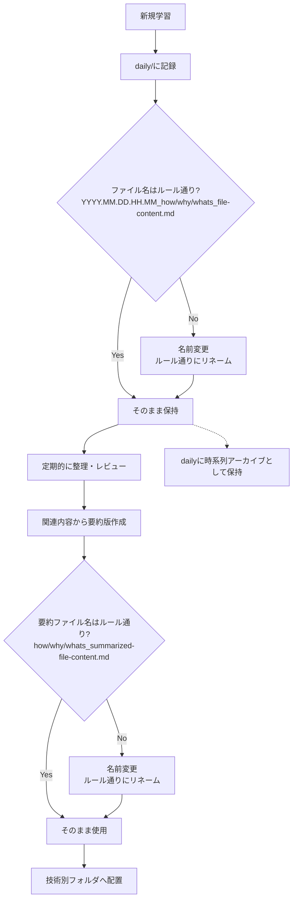

# TIL (Today I Learned)

日々の学習内容を記録するリポジトリです。技術的な発見、理解、実装方法などを体系的に整理しています。

## 📝 テンプレート

3種類のテンプレートを使用して、学習内容を構造化しています：

### 1. [What テンプレート](template/til_template_what.md)
「〜とは何か」を説明するテンプレート
- 技術や概念の定義
- 主要機能の説明
- 関連技術との関係

### 2. [How テンプレート](template/til_template_how.md)
「どのように〜するか」を説明するテンプレート
- 実装手順
- コード例
- ベストプラクティス

### 3. [Why テンプレート](template/til_template_why.md)
「なぜ〜なのか」を説明するテンプレート
- 技術選定の理由
- メリット・デメリット
- 比較分析

## 🔄 TILストックフロー

### 学習内容の管理フロー



### ストック方針

1. **初期記録（[daily/](daily/)）**
   - すべての新規TILは最初に`daily/`に作成
   - タイムスタンプ付きファイル名で時系列管理
   - 学習直後の生の知識を記録

2. **整理・要約の作成**
   - 定期的に関連する内容をレビュー
   - 技術別に要約ファイルを作成
   - dailyファイルは原典として保持

3. **要約ファイルの配置**
   - 技術別フォルダに体系的に整理
   - テンプレートに従って構造化
   - 関連するdailyファイルへのリンクを含める

### ファイル命名規則

**Daily TILファイル**：
```
{timestamp}_{type}_{content}.md
例: 2025.08.01.14.31_how_aws_acm_certificate_terraform_configuration_guide.md
```
- timestamp: `YYYY.MM.DD.HH.MM`形式
- type: `what` / `how` / `why`
- content: 内容を表すスネークケース

**要約ファイル（技術別フォルダ）**：
```
{type}_{content}.md
例: how_acm_configuration.md
```
- タイムスタンプなし（最新の統合版）
- type: `what` / `how` / `why`
- content: 簡潔な内容説明

📌 **関連リンク**：
- [テンプレート設定ファイル](template/params.yml)

## 📂 フォルダアーキテクチャルール

### ディレクトリ構成の原則

1. **技術カテゴリ別の整理**
   - 各技術・サービスごとに専用ディレクトリを作成
   - 関連する複数のファイルがある場合のみサブディレクトリを作成
   - 空のディレクトリは作成しない

2. **ファイル配置のルール**
   - 新規学習 → `daily/`に作成
   - 要約・統合版 → 技術別フォルダに配置
   - dailyファイルは時系列のアーカイブとして保持

3. **命名規則**
   - ディレクトリ名：小文字、ハイフン区切り（例：`step-functions`）
   - dailyファイル：`{timestamp}_{type}_{content}.md`
   - 要約ファイル：`{type}_{content}.md`（タイムスタンプなし）

### フォルダ作成・整理の基準

**新規フォルダを作成する場合**：
- 明確な技術カテゴリとして独立可能
- 今後も継続的な学習が見込まれる
- 体系的な整理が有益な場合

**要約ファイルを作成する場合**：
- 関連する内容を統合して理解を深めたい
- 技術別に体系的な知識として整理したい
- dailyファイルから要点を抽出して構造化

**dailyファイルの扱い**：
- すべてのdailyファイルは削除せず保持
- 学習の経緯と詳細を追跡可能に
- 要約ファイルからの参照リンクとして活用

## 📅 Daily TIL

日次の学習記録は以下の命名規則に従います：

```bash
YYYY.MM.DD.HH.MM_[what|how|why]_topic_name.md
```

例：
- `2025.08.01.14.31_how_aws_acm_certificate_terraform_configuration_guide.md`
- `2025.07.28.17.36_what_is-aws-lambda.md`

## 📎 便利なリンク

### テンプレート
- [What テンプレート](template/til_template_what.md) - 「〜とは何か」を説明
- [How テンプレート](template/til_template_how.md) - 「どのように〜するか」を説明
- [Why テンプレート](template/til_template_why.md) - 「なぜ〜なのか」を説明
- [テンプレート設定](template/params.yml) - 各テンプレートのパラメータ定義

### 主要ディレクトリ
- [Daily](daily/) - 日次学習記録（62ファイル）
- [AWS](aws/) - AWSサービス別の要約（18ファイル）
- [Terraform](terraform/) - IaC関連（2ファイル）
- [Infrastructure](infrastructure/) - アーキテクチャ設計（3ファイル）
- [Languages](languages/) - プログラミング言語（2ファイル）
