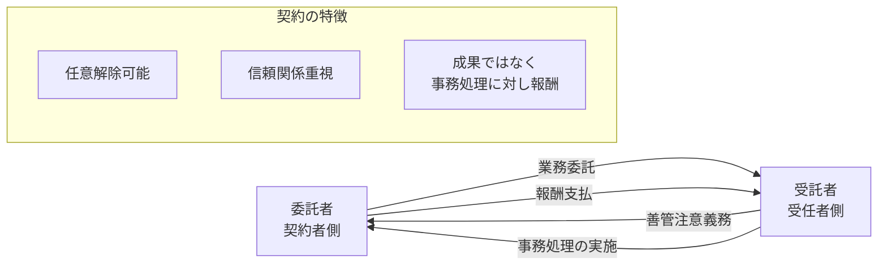

# 準委任契約（Quasi-mandate Contract）について

## 概要
準委任契約は、日本の民法に規定される契約類型の一つで、法律行為以外の事務処理を委託する契約形態です。主にサービス提供や専門的な業務の委託に使用されます。

## 契約関係図

## 特徴
1. **委任との違い**
   - 委任契約：法律行為の委託（例：不動産売買の代理）
   - 準委任契約：事実行為の委託（例：システム開発、コンサルティング）

2. **主な適用分野**
   - ITシステム開発
   - コンサルティングサービス
   - 医療サービス
   - 専門家による助言・指導

3. **契約の性質**
   - 当事者間の信頼関係が重要
   - 受託者は善管注意義務を負う
   - 原則として委託者はいつでも解除可能

## 重要な要素
1. **善管注意義務**
   - 受託者は、善良な管理者としての注意をもって業務を遂行する義務がある
   - 専門家としての一般的な水準の注意義務が求められる

2. **報酬**
   - 特約がなければ報酬請求権あり
   - 成果の完成ではなく、事務処理自体に対して報酬が発生

3. **契約の終了**
   - 委託者による任意解除が可能
   - 解除に正当な理由は不要
   - ただし、不利な時期の解除の場合は損害賠償義務が発生する可能性あり

## 実務上の留意点
1. **契約書作成時の注意点**
   - 業務範囲の明確化
   - 報酬の算定方法と支払時期の明確化
   - 契約解除条件の明確化

2. **リスク管理**
   - 成果物の品質基準の設定
   - 責任範囲の明確化
   - 知的財産権の帰属の明確化

## 関連法規
- 民法第656条（準委任）
- 民法第643条（委任の解除）
- 民法第644条（受任者の善管注意義務）

## まとめ
準委任契約は、現代のビジネス社会において特に重要な契約形態の一つです。特にIT業界やコンサルティング業界では広く使用されており、適切な契約管理と信頼関係の構築が重要となります。 