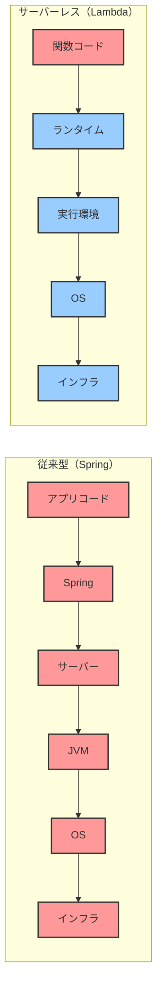
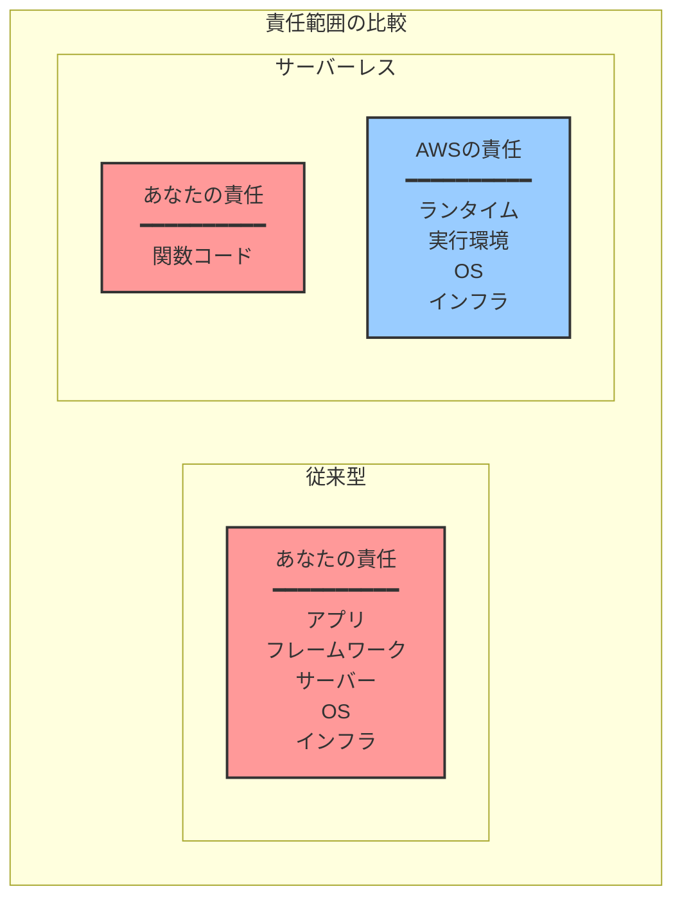
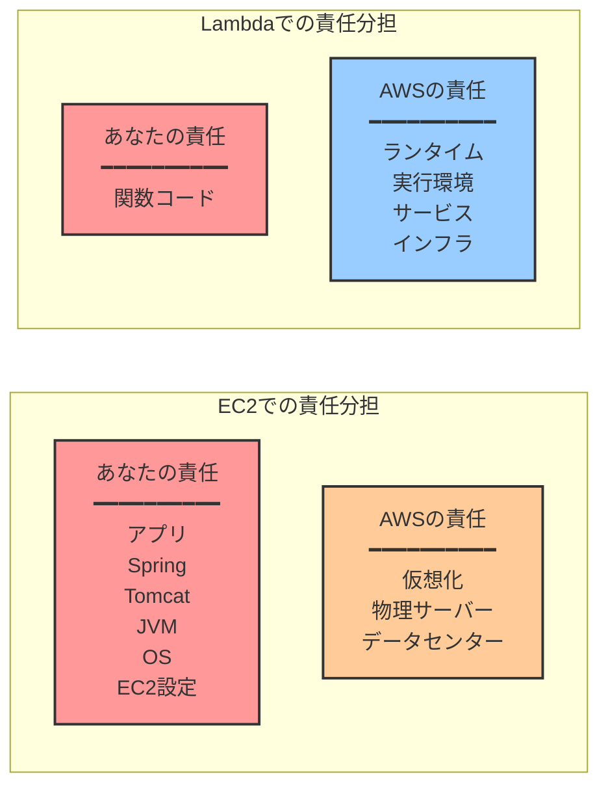
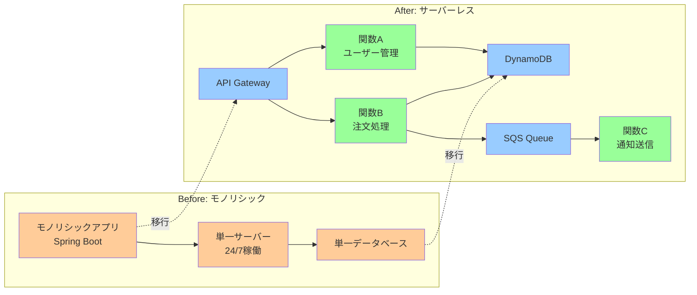
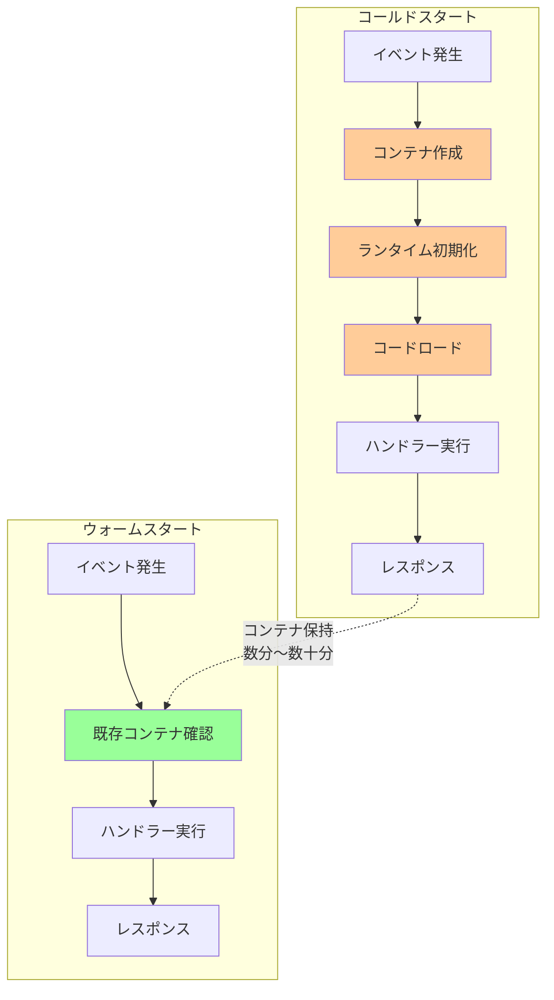
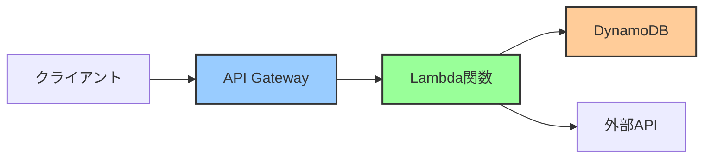
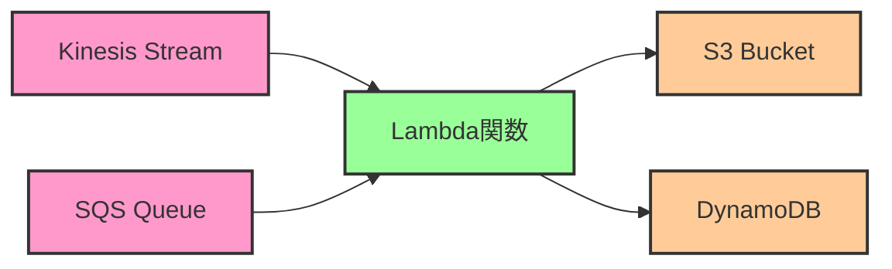
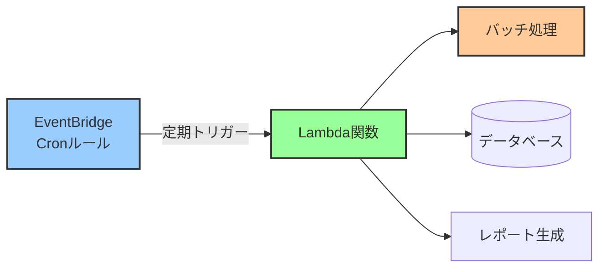
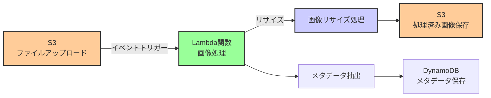
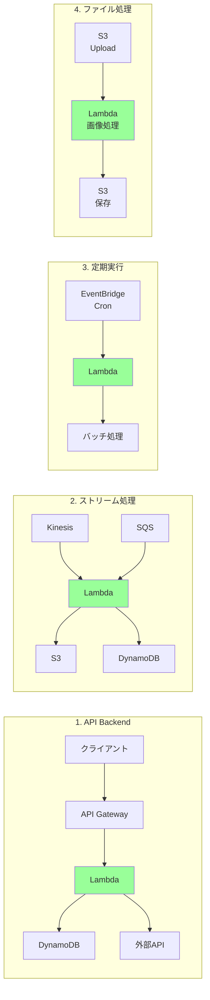

# なぜAWS Lambdaにおいてサーバーレスという概念が重要なのか

## What's this file?
> [!NOTE]
> **Why**
> 
> **なぜ**AWS Lambdaにおいてサーバーレスという概念が重要なのか

## Conclusion (忙しいとき向け)
> [!IMPORTANT]
> **Why** : **なぜ**AWS Lambdaにおいてサーバーレスという概念が重要なのか
> 
> **Answer** : サーバーレスは、インフラ管理の責任をクラウドプロバイダーに移し、開発者がビジネスロジックに集中できるようにするため。イベント駆動実行、自動スケーリング、従量課金モデルにより、運用の簡素化、コスト効率、開発速度の向上を実現するから。

## 目次
<details>
<summary>目次を開く</summary>

- [サーバーレスとは何か](#サーバーレスとは何か)
- [AWS Lambdaの動作原理](#aws-lambdaの動作原理)
- [サーバーレスアーキテクチャパターン](#サーバーレスアーキテクチャパターン)
- [従来型との比較](#従来型との比較)
- [サーバーレスの利点](#サーバーレスの利点)
- [サーバーレスの制約](#サーバーレスの制約)
- [ベストプラクティス](#ベストプラクティス)
- [関連](#関連)

</details>

## サーバーレスとは何か

### 基本概念
サーバーレスは、開発者がサーバーのプロビジョニング、スケーリング、管理を行うことなく、アプリケーションを構築・実行できるクラウドコンピューティングモデルです。

**重要**: 「サーバーレス」といっても、実際にはサーバーは存在します。ただし、その管理責任がクラウドプロバイダー（AWS）に移るという意味です。

### 従来のアプローチとの違い



#### 責任範囲の比較



#### 責任分担モデル（Mermaidダイアグラム）



#### アプローチの変化（Mermaidダイアグラム）



## AWS Lambdaの動作原理

### 1. イベント駆動実行モデル

#### 従来のWebアプリケーション（Spring）
```java
@RestController
public class UserController {
    // サーバーは常時起動
    // リクエストを待ち受ける
    
    @GetMapping("/users/{id}")
    public User getUser(@PathVariable Long id) {
        return userService.findById(id);
    }
}
```

#### Lambda関数
```python
def lambda_handler(event, context):
    # イベントが発生した時のみ実行
    # 実行後は環境が破棄される可能性
    
    user_id = event['pathParameters']['id']
    return {
        'statusCode': 200,
        'body': json.dumps(get_user(user_id))
    }
```

### 2. コンテナライフサイクル

#### Lambda実行環境の仕組み
```
初回リクエスト（コールドスタート）:
1. イベント発生
2. 新しいコンテナ作成
3. ランタイム初期化
4. 関数コードのロード
5. ハンドラー実行
6. レスポンス返却
時間: 100ms〜数秒

後続リクエスト（ウォームスタート）:
1. イベント発生
2. 既存コンテナを再利用
3. ハンドラー実行
4. レスポンス返却
時間: 数ms〜数十ms
```

#### コンテナライフサイクル（Mermaidダイアグラム）



### 3. 実行環境の特徴

#### 一時的な環境
- **ステートレス**: 実行間で状態を保持しない
- **制限時間**: 最大15分で強制終了
- **メモリ**: 128MB〜10,240MB
- **CPU**: メモリに比例して割り当て

#### 分離された実行
- **サンドボックス**: 他の実行から隔離
- **読み取り専用**: /varと/tmp以外は読み取り専用
- **一時ストレージ**: /tmpに512MB

## サーバーレスアーキテクチャパターン

### 1. API Backend



### 2. ストリーム処理



### 3. 定期実行



### 4. ファイル処理



### アーキテクチャパターン（Mermaidダイアグラム）



## 従来型との比較

### Spring Boot アプリケーション
```java
// 常時稼働するアプリケーション
@SpringBootApplication
public class Application {
    public static void main(String[] args) {
        // JVMが起動し、サーバーが立ち上がる
        // 終了するまで稼働し続ける
        SpringApplication.run(Application.class, args);
    }
}

// DIコンテナ、データベース接続プール等を管理
@Service
public class UserService {
    @Autowired
    private UserRepository repository;
    
    // 複数のリクエストで共有される
}
```

### Lambda関数
```python
# イベントごとに独立して実行
import json
import boto3

# グローバル変数は再利用される可能性
dynamodb = boto3.resource('dynamodb')

def lambda_handler(event, context):
    # この関数が実行の単位
    # 各実行は独立している
    
    table = dynamodb.Table('users')
    response = table.get_item(Key={'id': event['id']})
    
    return {
        'statusCode': 200,
        'body': json.dumps(response['Item'])
    }
```

## サーバーレスの利点

### 1. 運用の簡素化
- **自動スケーリング**: トラフィックに応じて自動調整
- **高可用性**: マルチAZで自動的に実行
- **メンテナンス不要**: パッチ適用、アップデート不要

### 2. コスト効率
```
従来型（EC2上のSpring）:
月額固定費 = インスタンス料金 × 24時間 × 30日

Lambda:
月額変動費 = (実行時間 × メモリ) + リクエスト数
アイドル時 = 0円
```

### 3. 開発速度
- **インフラ設定不要**: コードをアップロードするだけ
- **環境構築不要**: ランタイムは提供される
- **即座にスケール**: 設定なしで自動スケール

## サーバーレスの制約

### 1. 実行時間制限
- **最大15分**: 長時間処理には不向き
- **解決策**: Step Functions、ECS/Fargateとの組み合わせ

### 2. コールドスタート
- **初回実行の遅延**: 100ms〜数秒
- **解決策**: Provisioned Concurrency、定期的なウォームアップ

### 3. ローカル開発
- **実環境との差異**: ローカルでの完全な再現が困難
- **解決策**: SAM、LocalStack、コンテナイメージ

### 4. ベンダーロックイン
- **AWS固有の機能**: 他クラウドへの移行が困難
- **解決策**: 抽象化レイヤー、標準的なランタイム使用

## ベストプラクティス

### 1. 関数の設計
```python
# 良い例：単一責任、小さな関数
def process_order(event, context):
    order = parse_order(event)
    validate_order(order)
    save_order(order)
    return success_response(order.id)

# 避けるべき例：大きすぎる関数
def do_everything(event, context):
    # 認証、検証、DB操作、外部API呼び出し...
    # 1000行のコード
```

### 2. 依存関係の管理
- **最小限の依存**: デプロイサイズを小さく
- **レイヤーの活用**: 共通ライブラリの共有
- **ネイティブ依存**: Lambda環境に合わせたビルド

### 3. エラーハンドリング
```python
def lambda_handler(event, context):
    try:
        result = process_data(event)
        return {
            'statusCode': 200,
            'body': json.dumps(result)
        }
    except ValidationError as e:
        # DLQに送信される
        raise
    except Exception as e:
        # CloudWatchにログ記録
        logger.error(f"Unexpected error: {e}")
        return {
            'statusCode': 500,
            'body': json.dumps({'error': 'Internal server error'})
        }
```

## 関連
- [サーバー管理の複雑さとAWS Lambdaによる解決](/Users/shota-hashimoto/til/daily/2025.07.28.16.40_why_server_complexity_vs_aws_lambda.md)
- [AWS Lambdaとは](/Users/shota-hashimoto/til/daily/2025.07.28.17.36_what_is-aws-lambda.md)
- [AWS Fargateとは](/Users/shota-hashimoto/til/daily/2025.07.28.16.50_what_is-aws-fargate.md)
- [AWS Lambdaベストプラクティス](https://docs.aws.amazon.com/lambda/latest/dg/best-practices.html)
- [Serverless Architectures](https://martinfowler.com/articles/serverless.html) - Martin Fowler