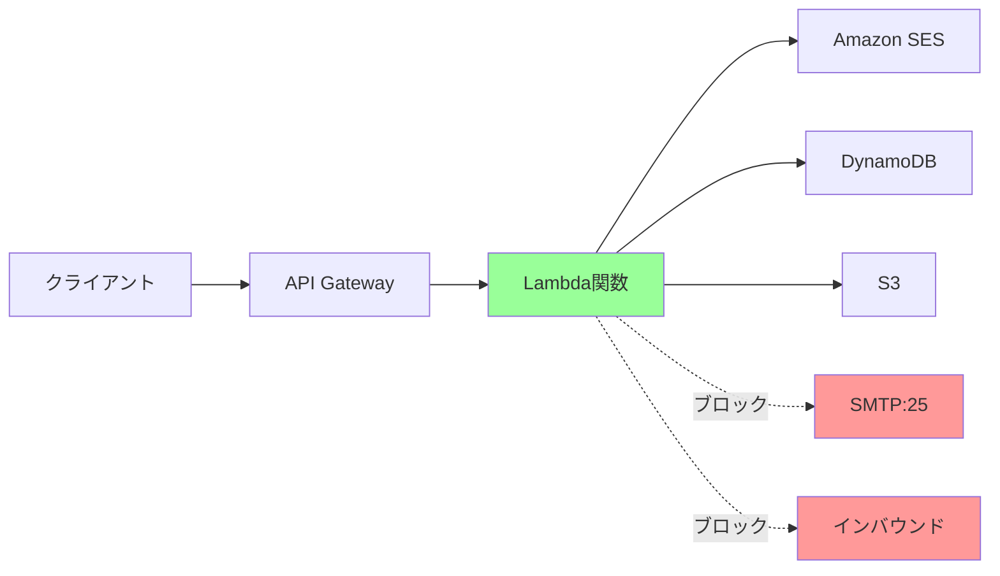

# AWS Lambda関数のセキュリティ制限：ネットワーク、ptrace、SMTP

## 概要

AWS Lambdaは、セキュアなサーバーレス実行環境を提供するため、いくつかの重要なセキュリティ制限を実装しています。これらの制限は、マルチテナント環境での安全性を確保し、悪意のある活動を防止するために設計されています。

## 主要な制限事項

### 1. ネットワーク制限（インバウンド/アウトバウンド）

#### インバウンド制限
Lambda関数は**インバウンド接続を受け付けることができません**。

**理由**：
- **サーバーレスの本質**: Lambda関数はイベント駆動で実行されるため、リスナーとして動作する必要がない
- **セキュリティ**: 外部からの直接攻撃を防止
- **リソース管理**: 予測不可能なトラフィックによるリソース枯渇を防止

**影響**：
```python
# ❌ これはLambdaでは動作しません
import socket

def lambda_handler(event, context):
    # TCPサーバーを起動しようとしても失敗
    server = socket.socket(socket.AF_INET, socket.SOCK_STREAM)
    server.bind(('0.0.0.0', 8080))  # エラー
    server.listen(5)
```

**代替手段**：
- API Gateway経由でHTTPリクエストを受信
- SQS、SNS、Kinesisなどのメッセージングサービスを使用
- EventBridgeによるイベント駆動

#### アウトバウンド制限
Lambda関数からのアウトバウンド接続は基本的に許可されていますが、いくつかの制限があります。

**VPCなしの場合**：
- インターネットへの直接アクセス可能
- AWSサービスへのアクセス可能
- パブリックAPIへのアクセス可能

**VPC内の場合**：
- VPCの設定に依存
- NATゲートウェイ/インスタンスが必要
- セキュリティグループとNACLの設定が適用

### 2. ptrace システムコールの制限

#### ptraceとは
`ptrace`は、プロセスの実行を監視・制御するためのシステムコールです。デバッガーやプロファイラーで使用されます。

#### Lambda環境での制限
**Lambdaでは`ptrace`システムコールが無効化されています**。

**理由**：
- **セキュリティ隔離**: 他のLambda実行環境への干渉を防止
- **コンテナ脱出防止**: コンテナのセキュリティ境界を保護
- **権限昇格防止**: 特権的な操作を制限

**影響を受ける操作**：
```python
# ❌ これらの操作はLambdaでは動作しません

# 1. デバッガーの使用
import pdb
pdb.set_trace()  # 制限により動作しない

# 2. プロセストレース
import subprocess
# straceコマンドは使用不可
subprocess.run(['strace', 'ls'])  # エラー

# 3. プロファイリングツール
# 一部のプロファイラーが動作しない可能性
```

**代替手段**：
- CloudWatch Logsでのログベースデバッグ
- X-Rayによる分散トレーシング
- CloudWatch Insightsでのパフォーマンス分析

### 3. TCP 25番ポート（SMTP）の制限

#### SMTP制限の詳細
**Lambda関数からTCP 25番ポート（SMTP）への接続はブロックされています**。

**理由**：
- **スパム防止**: 大量のスパムメール送信を防止
- **AWSの評判保護**: IPレピュテーションの維持
- **悪用防止**: マルウェアによるメール送信を阻止

**制限の実装**：
```python
# ❌ これはLambdaでは動作しません
import smtplib

def lambda_handler(event, context):
    # ポート25への接続は失敗
    server = smtplib.SMTP('mail.example.com', 25)  # タイムアウト
    
    # ❌ 直接のSMTP送信も不可
    import socket
    s = socket.socket(socket.AF_INET, socket.SOCK_STREAM)
    s.connect(('smtp.gmail.com', 25))  # 接続拒否
```

**推奨される代替手段**：

1. **Amazon SES（Simple Email Service）**
```python
import boto3

def lambda_handler(event, context):
    ses = boto3.client('ses', region_name='us-east-1')
    
    response = ses.send_email(
        Source='sender@example.com',
        Destination={'ToAddresses': ['recipient@example.com']},
        Message={
            'Subject': {'Data': 'Test email'},
            'Body': {'Text': {'Data': 'Hello from Lambda!'}}
        }
    )
```

2. **認証付きSMTP（ポート587/465）**
```python
import smtplib
from email.mime.text import MIMEText

def lambda_handler(event, context):
    # ✅ ポート587（STARTTLS）は使用可能
    server = smtplib.SMTP('smtp.gmail.com', 587)
    server.starttls()
    server.login('user@gmail.com', 'password')
    
    # または ポート465（SSL）
    server = smtplib.SMTP_SSL('smtp.gmail.com', 465)
```

3. **サードパーティAPIサービス**
- SendGrid API
- Mailgun API
- Postmark API

## セキュリティ制限の全体像

### Lambda実行環境の制限一覧

| 制限項目 | 詳細 | 理由 |
|---------|------|------|
| インバウンド接続 | すべてブロック | イベント駆動モデルの維持 |
| ptrace | 無効化 | プロセス隔離の確保 |
| SMTP (25番) | ブロック | スパム防止 |
| /dev/shm | 64MB制限 | 共有メモリの制限 |
| /tmp | 512MB制限 | 一時ストレージの制限 |
| ファイルディスクリプタ | 1024個 | リソース制限 |
| プロセス/スレッド | 1024個 | リソース制限 |

### 追加のセキュリティ機能

#### 1. 読み取り専用ファイルシステム
```python
# ❌ これは失敗します
with open('/usr/bin/test.txt', 'w') as f:
    f.write('test')  # 読み取り専用エラー

# ✅ /tmpのみ書き込み可能
with open('/tmp/test.txt', 'w') as f:
    f.write('test')  # 成功
```

#### 2. ルート権限なし
- Lambda関数は非特権ユーザーとして実行
- システムレベルの変更不可

#### 3. カーネルモジュール
- カーネルモジュールのロード不可
- システムコールの一部が制限

## ベストプラクティス

### 1. ネットワーク設計


### 2. デバッグ戦略
- 構造化ログの活用
- 環境変数でのデバッグレベル制御
- X-Rayセグメントの活用

### 3. メール送信
- SESの事前設定と検証
- バウンス・苦情処理の実装
- レート制限の考慮

## トラブルシューティング

### よくある問題と解決策

1. **「Connection timed out」エラー**
   - 原因: ポート25への接続試行
   - 解決: SESまたは他のポートを使用

2. **「Operation not permitted」エラー**
   - 原因: ptrace使用の試み
   - 解決: ログベースのデバッグに切り替え

3. **「Address already in use」エラー**
   - 原因: ソケットバインドの試行
   - 解決: API Gatewayなどの前段サービスを使用

## まとめ

AWS Lambdaのセキュリティ制限は、安全で効率的なサーバーレス環境を提供するために不可欠です。これらの制限を理解し、適切な代替手段を使用することで、セキュアでスケーラブルなアプリケーションを構築できます。制限は制約ではなく、より良いアーキテクチャ設計へのガイドラインと考えることが重要です。