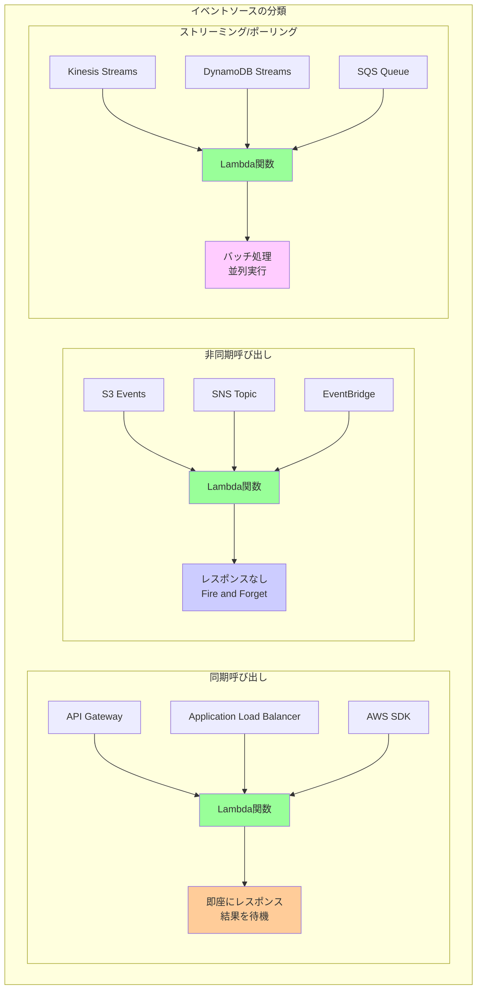
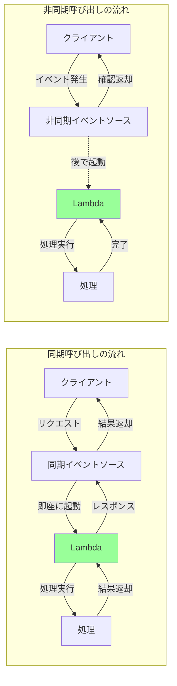
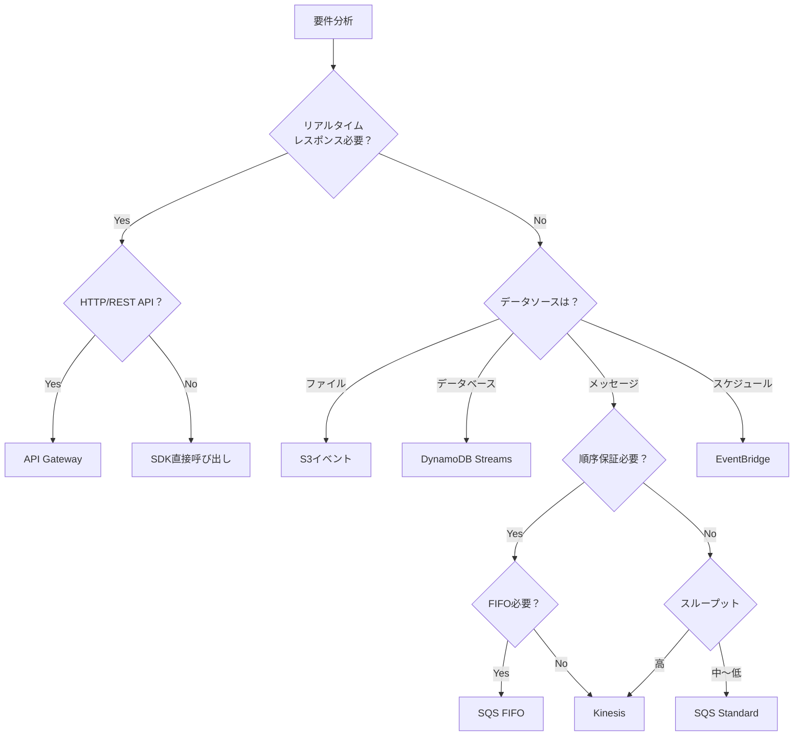

# AWS Lambdaイベントソースの使い分けガイド

## 概要

AWS Lambdaは様々なイベントソースと統合でき、それぞれのイベントソースには特有の特性があります。適切なイベントソースを選択することで、効率的でスケーラブルなサーバーレスアプリケーションを構築できます。

## イベントソースの分類

### 1. 同期呼び出し vs 非同期呼び出し



#### 呼び出しパターンの詳細比較



## 主要なイベントソースと使い分け

### 1. API Gateway

#### 特徴
- **同期実行**: リアルタイムレスポンス
- **HTTPプロトコル**: REST API、WebSocket対応
- **認証・認可**: APIキー、Cognito、カスタム認証
- **レート制限**: スロットリング機能

#### 使用場面
```yaml
適している場合:
  - Webアプリケーションのバックエンド
  - モバイルアプリのAPI
  - サードパーティ向けAPI
  - リアルタイムレスポンスが必要

適さない場合:
  - 大量のバッチ処理
  - 15分を超える長時間処理
  - ファイル転送（大容量）
```

#### 実装例
```python
# API Gateway + Lambda
def lambda_handler(event, context):
    # HTTPメソッドによる分岐
    http_method = event['httpMethod']
    path = event['path']
    
    if http_method == 'GET' and path == '/users':
        return {
            'statusCode': 200,
            'headers': {'Content-Type': 'application/json'},
            'body': json.dumps({'users': get_users()})
        }
```

### 2. S3イベント

#### 特徴
- **非同期実行**: ファイル処理に最適
- **イベントタイプ**: PUT、POST、DELETE等
- **プレフィックス/サフィックスフィルター**: 特定ファイルのみ処理
- **エラーハンドリング**: 自動リトライ

#### 使用場面
```yaml
適している場合:
  - 画像・動画の自動処理
  - ログファイルの解析
  - データのETL処理
  - バックアップの自動化

適さない場合:
  - リアルタイムレスポンスが必要
  - トランザクション処理
  - 順序保証が必要な処理
```

#### 実装例
```python
# S3イベント処理
def lambda_handler(event, context):
    for record in event['Records']:
        bucket = record['s3']['bucket']['name']
        key = record['s3']['object']['key']
        event_name = record['eventName']
        
        if event_name.startswith('ObjectCreated'):
            # ファイルアップロード時の処理
            process_uploaded_file(bucket, key)
```

### 3. SQS (Simple Queue Service)

#### 特徴
- **メッセージキュー**: 非同期処理の分離
- **バッチ処理**: 最大10メッセージ同時処理
- **可視性タイムアウト**: 処理中メッセージの保護
- **デッドレターキュー**: エラー処理

#### 使用場面
```yaml
適している場合:
  - 処理の分離とスケーリング
  - リトライが必要な処理
  - 負荷の平準化
  - 順序を問わない並列処理

適さない場合:
  - 厳密な順序保証が必要（FIFOを除く）
  - リアルタイムレスポンス
  - 大容量メッセージ（256KB超）
```

#### 実装例
```python
# SQSメッセージ処理
def lambda_handler(event, context):
    for record in event['Records']:
        message_body = json.loads(record['body'])
        receipt_handle = record['receiptHandle']
        
        try:
            # メッセージ処理
            process_message(message_body)
            # 成功時は自動的に削除される
        except Exception as e:
            # エラー時は可視性タイムアウト後に再試行
            logger.error(f"Processing failed: {e}")
            raise
```

### 4. DynamoDB Streams

#### 特徴
- **変更データキャプチャ**: リアルタイムデータ同期
- **順序保証**: パーティションキー単位
- **イベントタイプ**: INSERT、MODIFY、REMOVE
- **24時間保持**: ストリームレコード

#### 使用場面
```yaml
適している場合:
  - データの同期・レプリケーション
  - 監査ログの生成
  - リアルタイム分析
  - 派生データの更新

適さない場合:
  - 大量の初期データ移行
  - 複雑なトランザクション
  - 長時間のバッチ処理
```

#### 実装例
```python
# DynamoDB Streams処理
def lambda_handler(event, context):
    for record in event['Records']:
        event_name = record['eventName']
        
        if event_name == 'INSERT':
            new_image = record['dynamodb']['NewImage']
            # 新規データの処理
            handle_new_item(new_image)
        elif event_name == 'MODIFY':
            old_image = record['dynamodb']['OldImage']
            new_image = record['dynamodb']['NewImage']
            # 更新データの処理
            handle_modified_item(old_image, new_image)
```

### 5. EventBridge (CloudWatch Events)

#### 特徴
- **ルールベース**: 柔軟なイベントルーティング
- **スケジュール実行**: Cron式対応
- **クロスアカウント**: イベントバス経由
- **多対多**: 複数ターゲット対応

#### 使用場面
```yaml
適している場合:
  - 定期的なバッチ処理
  - AWSサービス間の統合
  - カスタムイベントの配信
  - 複雑なワークフロー

適さない場合:
  - 高頻度リアルタイム処理
  - 大容量データ転送
  - 順序保証が必要な処理
```

#### 実装例
```python
# EventBridge定期実行
def lambda_handler(event, context):
    # Cron実行の場合
    if event.get('source') == 'aws.events':
        # 定期バッチ処理
        run_scheduled_batch()
    
    # カスタムイベントの場合
    elif event.get('source') == 'custom.app':
        detail = event['detail']
        process_custom_event(detail)
```

### 6. Kinesis Data Streams

#### 特徴
- **リアルタイムストリーミング**: 低レイテンシ
- **順序保証**: シャード内で保証
- **並列処理**: 複数シャード
- **データ保持**: 24時間〜365日

#### 使用場面
```yaml
適している場合:
  - リアルタイム分析
  - ログ集約
  - IoTデータ処理
  - クリックストリーム分析

適さない場合:
  - 低頻度のイベント
  - 個別メッセージ処理
  - コスト重視の用途
```

## イベントソース選択フローチャート



## パフォーマンスと制限の比較

| イベントソース | 同時実行数 | レイテンシ | 順序保証 | コスト |
|--------------|-----------|-----------|---------|--------|
| API Gateway | 10,000/秒 | 低（ms） | なし | 中 |
| S3 | 制限なし | 中（秒） | なし | 低 |
| SQS | 制限なし | 中（秒） | 一部可 | 低 |
| DynamoDB Streams | シャード数依存 | 低（ms） | あり | 中 |
| EventBridge | 制限なし | 中（秒） | なし | 低 |
| Kinesis | シャード数依存 | 低（ms） | あり | 高 |

## ベストプラクティス

### 1. エラーハンドリング戦略

```python
# イベントソースごとのエラーハンドリング
def lambda_handler(event, context):
    source = identify_event_source(event)
    
    try:
        if source == 'api-gateway':
            # 同期: エラーレスポンスを返す
            return process_api_request(event)
        elif source == 'sqs':
            # 非同期: 例外を投げて再試行
            process_sqs_messages(event)
        elif source == 's3':
            # 非同期: DLQへ送信
            process_s3_event(event)
    except Exception as e:
        return handle_error(source, e)
```

### 2. 冪等性の実装

```python
# 重複処理を防ぐ
def process_with_idempotency(event, context):
    # イベントIDの抽出
    event_id = extract_event_id(event)
    
    # 処理済みチェック
    if is_already_processed(event_id):
        logger.info(f"Event {event_id} already processed")
        return
    
    # 処理実行
    result = perform_processing(event)
    
    # 処理済みマーク
    mark_as_processed(event_id)
    
    return result
```

### 3. バッチ処理の最適化

```python
# SQS/Kinesisのバッチ処理
def optimized_batch_handler(event, context):
    records = event['Records']
    batch_size = len(records)
    
    # 並列処理の準備
    with ThreadPoolExecutor(max_workers=10) as executor:
        futures = []
        
        for record in records:
            future = executor.submit(process_record, record)
            futures.append(future)
        
        # 結果の収集
        results = []
        failed_records = []
        
        for i, future in enumerate(futures):
            try:
                result = future.result(timeout=30)
                results.append(result)
            except Exception as e:
                failed_records.append({
                    'itemIdentifier': records[i]['messageId']
                })
        
        # 部分的な失敗の報告
        if failed_records:
            return {
                'batchItemFailures': failed_records
            }
```

## まとめ

AWS Lambdaのイベントソース選択は、アプリケーションの要件に基づいて慎重に行う必要があります。各イベントソースの特性を理解し、適切に使い分けることで、効率的でスケーラブルなサーバーレスアーキテクチャを構築できます。重要なのは、単一のイベントソースに固執せず、要件に応じて複数のイベントソースを組み合わせることです。