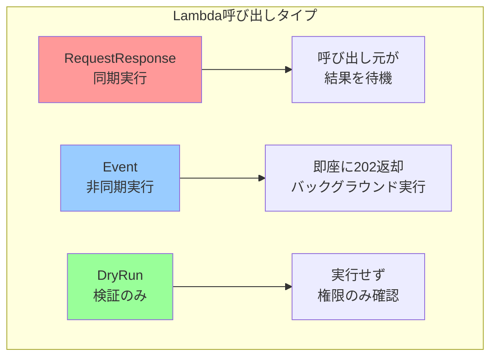
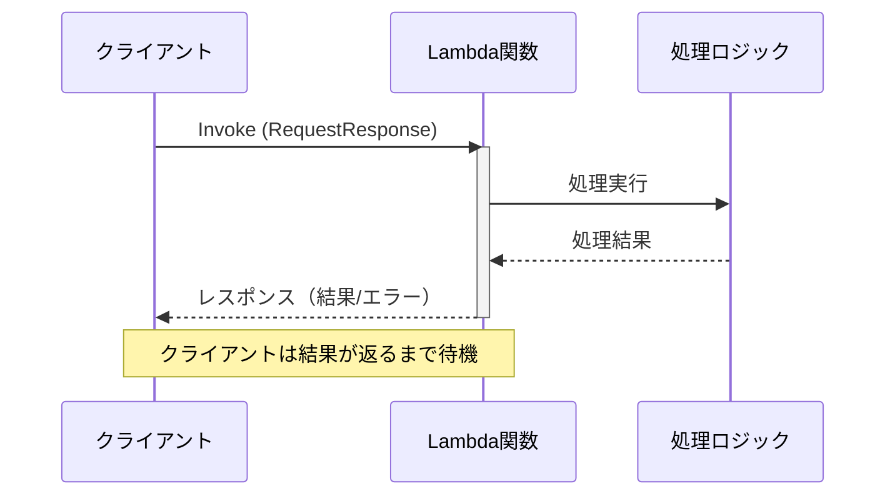
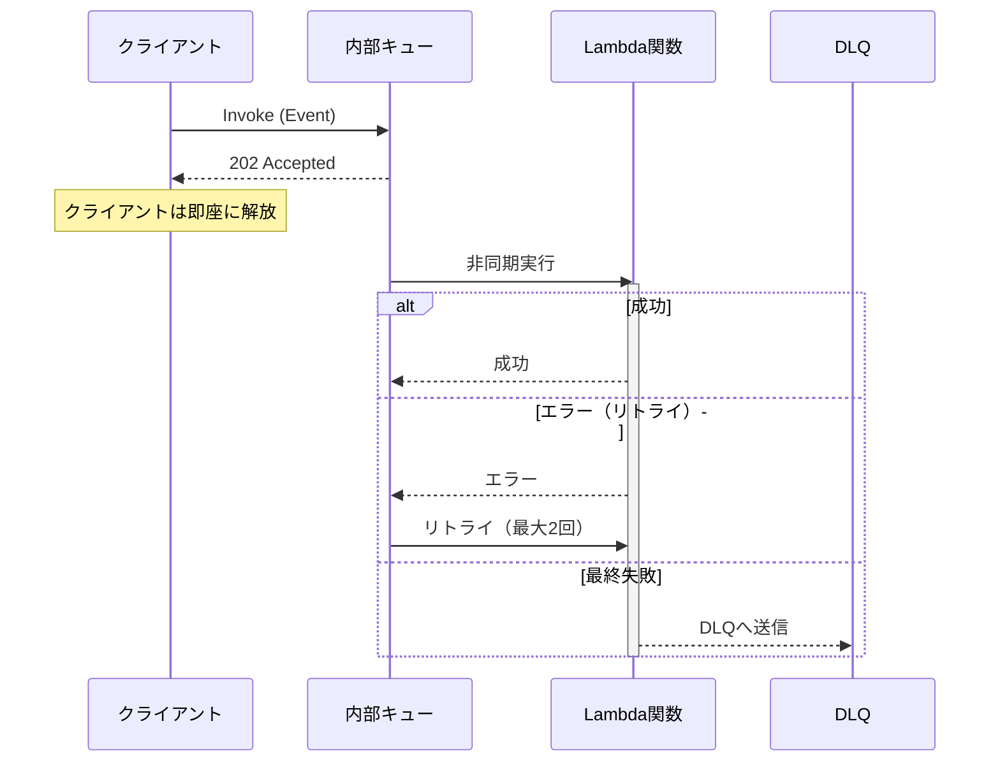
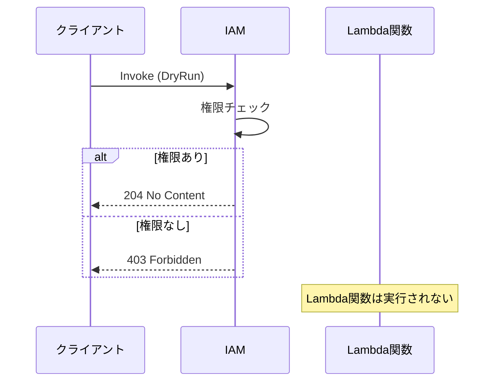
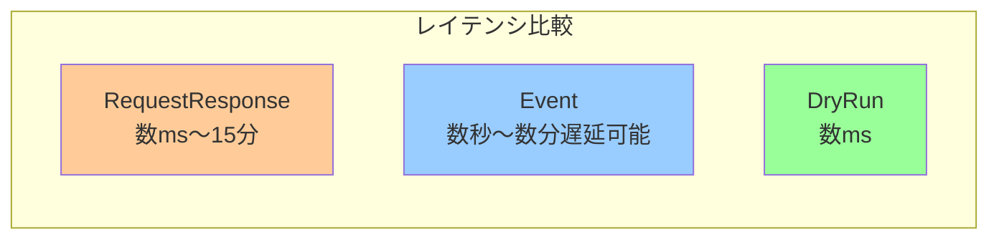

# AWS Lambda呼び出しタイプの使い分けガイド

## 概要

AWS Lambdaには3つの呼び出しタイプ（Invocation Type）があり、それぞれ異なる特性と使用場面があります。適切な呼び出しタイプを選択することで、アプリケーションの要件に最適な動作を実現できます。

## 呼び出しタイプの種類

### 呼び出しタイプ一覧



## 1. RequestResponse（同期実行）

### 特徴
- **デフォルトの呼び出しタイプ**
- **呼び出し元が実行完了を待機**
- **実行結果を直接受け取る**
- **タイムアウト**: 最大15分（900秒）

### 動作フロー



### 使用場面

```yaml
適している場合:
  - API Gateway経由のREST API
  - リアルタイムのデータ処理
  - データベースクエリの実行
  - 同期的な計算処理
  - ユーザーインターフェースからの直接呼び出し

適さない場合:
  - 長時間の処理（15分超）
  - 大量のバッチ処理
  - 結果を待つ必要がない処理
  - ネットワーク遅延が問題になる場合
```

### 実装例

```python
# SDK経由での同期呼び出し
import boto3
import json

lambda_client = boto3.client('lambda')

def invoke_sync():
    response = lambda_client.invoke(
        FunctionName='my-function',
        InvocationType='RequestResponse',  # または省略（デフォルト）
        Payload=json.dumps({
            'key': 'value'
        })
    )
    
    # レスポンスの取得
    result = json.loads(response['Payload'].read())
    status_code = response['StatusCode']
    
    if status_code == 200:
        return result
    else:
        raise Exception(f"Lambda execution failed: {result}")
```

### エラーハンドリング

```python
# Lambda関数側
def lambda_handler(event, context):
    try:
        # 処理実行
        result = process_data(event)
        return {
            'statusCode': 200,
            'body': json.dumps(result)
        }
    except ValidationError as e:
        # クライアントエラー
        return {
            'statusCode': 400,
            'body': json.dumps({'error': str(e)})
        }
    except Exception as e:
        # サーバーエラー
        return {
            'statusCode': 500,
            'body': json.dumps({'error': 'Internal server error'})
        }
```

## 2. Event（非同期実行）

### 特徴
- **Fire-and-forget方式**
- **即座に202 Acceptedを返却**
- **バックグラウンドで実行**
- **自動リトライ**: 最大2回（設定可能）
- **デッドレターキュー（DLQ）サポート**

### 動作フロー



### 使用場面

```yaml
適している場合:
  - S3イベント処理
  - ログ処理・集計
  - メール送信などの通知処理
  - 画像・動画の変換処理
  - 定期的なバッチ処理
  - 結果を待つ必要がない処理

適さない場合:
  - 即座に結果が必要な処理
  - トランザクション処理
  - ユーザーへの直接レスポンス
  - エラーの詳細を知る必要がある場合
```

### 実装例

```python
# SDK経由での非同期呼び出し
import boto3
import json

lambda_client = boto3.client('lambda')

def invoke_async():
    response = lambda_client.invoke(
        FunctionName='my-function',
        InvocationType='Event',
        Payload=json.dumps({
            'records': [
                {'id': 1, 'data': 'item1'},
                {'id': 2, 'data': 'item2'}
            ]
        })
    )
    
    # 202 Acceptedの確認のみ
    if response['StatusCode'] == 202:
        print("Lambda invoked successfully")
        return response['ResponseMetadata']['RequestId']
    else:
        raise Exception("Failed to invoke Lambda")
```

### 非同期設定

```python
# 非同期実行の設定（Terraform例）
resource "aws_lambda_function_event_invoke_config" "example" {
  function_name = aws_lambda_function.example.function_name
  
  # リトライ設定
  maximum_retry_attempts = 2
  maximum_event_age_in_seconds = 3600  # 1時間
  
  # 成功時の送信先
  destination_config {
    on_success {
      destination = aws_sqs_queue.success.arn
    }
    
    # 失敗時の送信先（DLQ）
    on_failure {
      destination = aws_sqs_queue.dlq.arn
    }
  }
}
```

## 3. DryRun（検証実行）

### 特徴
- **実行権限の検証のみ**
- **実際の処理は実行されない**
- **IAMポリシーのテスト**
- **デプロイ前の検証**

### 動作フロー



### 使用場面

```yaml
適している場合:
  - CI/CDパイプラインでの権限検証
  - デプロイ前のテスト
  - IAMポリシーの検証
  - 本番環境での安全な確認

適さない場合:
  - 実際の処理実行
  - パフォーマンステスト
  - 統合テスト
```

### 実装例

```python
# DryRun実行
import boto3
import json

lambda_client = boto3.client('lambda')

def test_permissions():
    try:
        response = lambda_client.invoke(
            FunctionName='my-function',
            InvocationType='DryRun',
            Payload=json.dumps({'test': True})
        )
        
        if response['StatusCode'] == 204:
            print("Permission check passed")
            return True
    except lambda_client.exceptions.ResourceNotFoundException:
        print("Function not found")
        return False
    except lambda_client.exceptions.InvalidParameterValueException:
        print("Invalid parameters")
        return False
    except Exception as e:
        print(f"Permission denied: {e}")
        return False
```

## 呼び出しタイプの比較

### 特性比較表

| 特性 | RequestResponse | Event | DryRun |
|------|----------------|-------|---------|
| 実行タイミング | 即座 | キューイング後 | 実行なし |
| レスポンス | 実行結果 | 202 Accepted | 204/403 |
| タイムアウト | 最大15分 | 最大15分 | N/A |
| リトライ | なし（呼び出し元で実装） | 自動（最大2回） | N/A |
| エラーハンドリング | 呼び出し元で処理 | DLQ/Destination | N/A |
| 料金 | 実行時間分 | 実行時間分 | 無料 |

### パフォーマンス特性



## ベストプラクティス

### 1. 呼び出しタイプの選択基準

```python
def choose_invocation_type(requirements):
    """要件に基づいて適切な呼び出しタイプを選択"""
    
    if requirements.get('need_immediate_response'):
        return 'RequestResponse'
    
    if requirements.get('fire_and_forget'):
        return 'Event'
    
    if requirements.get('permission_check_only'):
        return 'DryRun'
    
    # デフォルトは同期実行
    return 'RequestResponse'
```

### 2. エラーハンドリング戦略

```python
# 呼び出しタイプ別のエラーハンドリング
class LambdaInvoker:
    def __init__(self):
        self.client = boto3.client('lambda')
    
    def invoke_with_retry(self, function_name, payload, invocation_type='RequestResponse'):
        if invocation_type == 'RequestResponse':
            # 同期: 呼び出し元でリトライ
            for attempt in range(3):
                try:
                    return self._invoke_sync(function_name, payload)
                except Exception as e:
                    if attempt == 2:
                        raise
                    time.sleep(2 ** attempt)
        
        elif invocation_type == 'Event':
            # 非同期: Lambdaが自動リトライ
            return self._invoke_async(function_name, payload)
        
        elif invocation_type == 'DryRun':
            # DryRun: リトライ不要
            return self._invoke_dryrun(function_name, payload)
```

### 3. 非同期処理の監視

```python
# CloudWatch Logsでの非同期実行監視
def monitor_async_execution(function_name, request_id):
    logs_client = boto3.client('logs')
    
    # ログストリーム名の構築
    log_group = f'/aws/lambda/{function_name}'
    
    # ログの検索
    response = logs_client.filter_log_events(
        logGroupName=log_group,
        filterPattern=f'"{request_id}"',
        startTime=int((datetime.now() - timedelta(minutes=5)).timestamp() * 1000)
    )
    
    return response['events']
```

### 4. 非同期処理のデバッグ

```python
# X-Rayトレーシングの活用
from aws_xray_sdk.core import xray_recorder

@xray_recorder.capture('process_async_event')
def lambda_handler(event, context):
    # セグメントに情報を追加
    xray_recorder.put_annotation('invocation_type', 'Event')
    xray_recorder.put_metadata('event_data', event)
    
    try:
        result = process_event(event)
        xray_recorder.put_annotation('status', 'success')
        return result
    except Exception as e:
        xray_recorder.put_annotation('status', 'error')
        xray_recorder.put_metadata('error', str(e))
        raise
```

## まとめ

AWS Lambdaの呼び出しタイプは、アプリケーションの要件に応じて適切に選択する必要があります：

- **RequestResponse**: リアルタイムレスポンスが必要な場合
- **Event**: 結果を待つ必要がない、信頼性の高い非同期処理
- **DryRun**: 権限検証やテスト目的

各呼び出しタイプの特性を理解し、エラーハンドリングやモニタリングを適切に実装することで、堅牢なサーバーレスアプリケーションを構築できます。