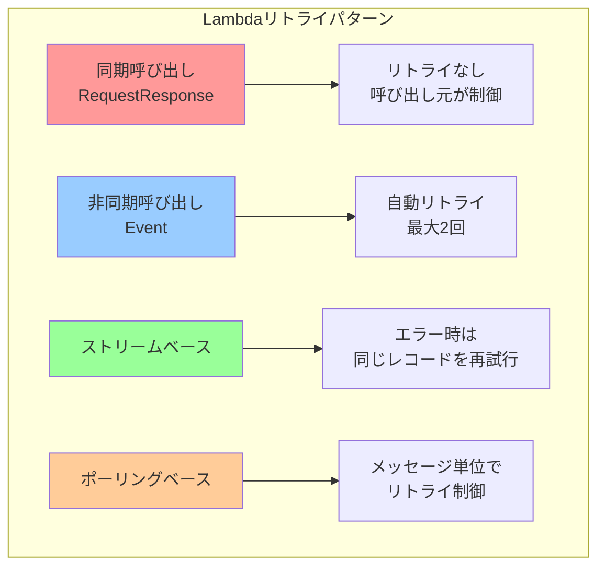
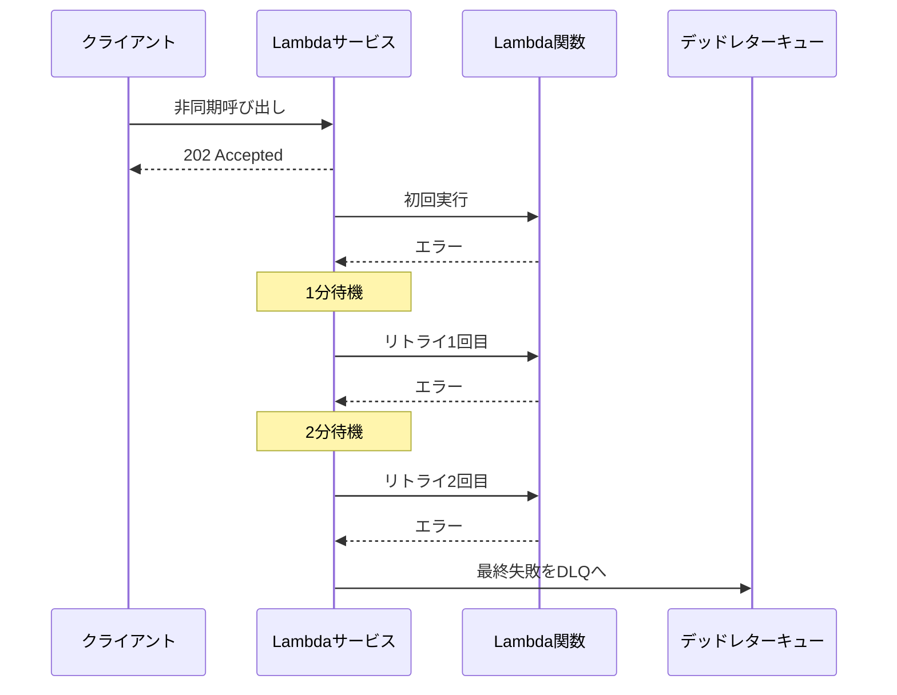
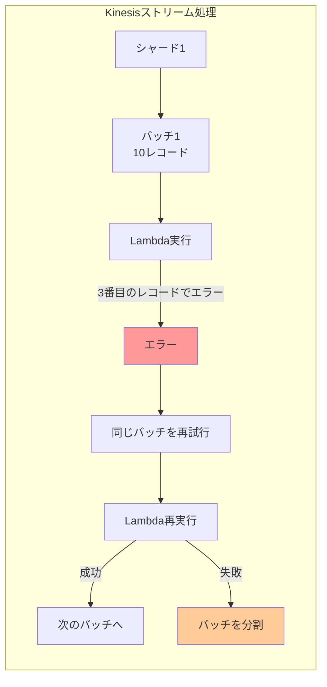

# AWS Lambda関数のリトライ仕様の違い

## 概要

AWS Lambdaのリトライ動作は、呼び出しタイプとイベントソースによって大きく異なります。これらの違いを理解することで、エラー処理戦略を適切に設計し、システムの信頼性を向上させることができます。

## リトライ仕様の分類

### リトライパターンの全体像



## 1. 同期呼び出し（RequestResponse）のリトライ

### 特徴
- **Lambdaサービスによる自動リトライなし**
- **呼び出し元がリトライロジックを実装**
- **即座にエラーレスポンスを返却**

### リトライが必要なケース
```python
# 同期呼び出しでリトライが必要なエラー
RETRYABLE_ERRORS = {
    'TooManyRequestsException': '同時実行数の制限',
    'ServiceException': 'Lambdaサービスの一時的な問題',
    'ResourceNotFoundException': 'コールドスタート時の一時的エラー',
    'RequestTimeoutException': 'タイムアウト'
}
```

### 実装例：呼び出し元でのリトライ

```python
import boto3
import time
from botocore.exceptions import ClientError

class LambdaSyncInvoker:
    def __init__(self):
        self.client = boto3.client('lambda')
        
    def invoke_with_retry(self, function_name, payload, max_retries=3):
        """指数バックオフでリトライ"""
        for attempt in range(max_retries + 1):
            try:
                response = self.client.invoke(
                    FunctionName=function_name,
                    InvocationType='RequestResponse',
                    Payload=payload
                )
                
                # Lambda関数のエラーチェック
                if response['StatusCode'] == 200:
                    payload = response['Payload'].read()
                    return json.loads(payload)
                else:
                    raise Exception(f"Lambda returned {response['StatusCode']}")
                    
            except ClientError as e:
                error_code = e.response['Error']['Code']
                
                # リトライ可能なエラーかチェック
                if error_code in RETRYABLE_ERRORS and attempt < max_retries:
                    wait_time = (2 ** attempt) + random.uniform(0, 1)
                    time.sleep(wait_time)
                    continue
                else:
                    raise
```

## 2. 非同期呼び出し（Event）のリトライ

### 特徴
- **Lambdaサービスが自動的にリトライ**
- **デフォルト: 最大2回のリトライ**
- **リトライ間隔: 1分後、2分後**
- **設定可能なパラメータ**

### リトライ設定

```python
# AWS CDKでの非同期リトライ設定
from aws_cdk import (
    aws_lambda as lambda_,
    aws_sqs as sqs,
    Duration
)

# Lambda関数の非同期設定
lambda_function.configure_async_invoke(
    # リトライ回数（0-2）
    max_retry_attempts=2,
    
    # イベントの最大保持時間
    max_event_age=Duration.hours(6),
    
    # 成功時の送信先
    on_success=success_queue,
    
    # 失敗時の送信先（DLQ）
    on_failure=dlq_queue
)
```

### リトライ動作フロー



## 3. ストリームベースのリトライ（Kinesis/DynamoDB Streams）

### 特徴
- **シャード単位でのリトライ**
- **失敗したレコードで処理が停止**
- **順序保証のためのブロッキング**
- **最大リトライ回数または期限まで再試行**

### 設定パラメータ

```yaml
リトライ設定:
  MaximumRetryAttempts: 10000  # 最大リトライ回数
  MaximumRecordAge: 604800     # 最大7日間（秒）
  BisectBatchOnFunctionError: true  # バッチ分割
  ParallelizationFactor: 10     # 並列度
```

### エラーハンドリング戦略

```python
def lambda_handler(event, context):
    """ストリームイベントの処理"""
    failed_records = []
    
    for record in event['Records']:
        try:
            # レコード単位で処理
            process_stream_record(record)
            
        except Exception as e:
            # 失敗したレコードを記録
            failed_records.append({
                'itemIdentifier': record['kinesis']['sequenceNumber']
            })
            logger.error(f"Failed to process: {e}")
    
    # 部分的な失敗を報告
    if failed_records:
        return {
            'batchItemFailures': failed_records
        }
    
    return {'statusCode': 200}
```

### ストリームリトライの可視化



## 4. ポーリングベースのリトライ（SQS）

### 特徴
- **メッセージ単位でのリトライ制御**
- **可視性タイムアウトによる自動再配信**
- **受信回数のトラッキング**
- **デッドレターキューへの自動移動**

### SQSリトライメカニズム

```python
# SQSイベントソースマッピングの設定
event_source_mapping = lambda_.EventSourceMapping(
    self, "SQSEventSource",
    target=lambda_function,
    event_source_arn=queue.queue_arn,
    
    # バッチ設定
    batch_size=10,
    max_batching_window_in_seconds=20,
    
    # エラー時の部分的な失敗を報告
    report_batch_item_failures=True,
    
    # 最大同時実行数
    max_concurrency=5
)
```

### メッセージ処理とリトライ

```python
def lambda_handler(event, context):
    """SQSメッセージの処理"""
    batch_item_failures = []
    
    for record in event['Records']:
        message_id = record['messageId']
        receipt_handle = record['receiptHandle']
        
        # 受信回数をチェック
        receive_count = int(record['attributes'].get('ApproximateReceiveCount', 1))
        
        try:
            # メッセージ処理
            process_message(record['body'])
            
            # 成功時は自動的にSQSから削除される
            
        except RetryableError as e:
            # リトライ可能なエラー
            if receive_count < 3:
                # 可視性タイムアウト後に再配信
                batch_item_failures.append({
                    'itemIdentifier': message_id
                })
            else:
                # 最大リトライ回数に達した
                logger.error(f"Max retries reached for {message_id}")
                # DLQへ自動的に移動
                
        except NonRetryableError as e:
            # リトライ不可能なエラー
            logger.error(f"Non-retryable error: {e}")
            # メッセージは削除される（DLQがある場合はそちらへ）
    
    # 失敗したメッセージを報告
    return {
        'batchItemFailures': batch_item_failures
    }
```

## リトライ仕様の比較表

| 項目 | 同期呼び出し | 非同期呼び出し | ストリーム | SQS |
|------|------------|--------------|-----------|-----|
| 自動リトライ | なし | あり（最大2回） | あり | あり |
| リトライ制御 | 呼び出し元 | Lambda設定 | ESM設定 | Queue設定 |
| リトライ間隔 | カスタム | 1分, 2分 | 即座 | 可視性タイムアウト |
| 最大リトライ | 無制限 | 2回 | 10,000回 | Queue設定 |
| 順序保証 | N/A | なし | あり | FIFOのみ |
| 部分的失敗 | N/A | N/A | 対応 | 対応 |
| DLQ | なし | あり | あり | あり |

## ベストプラクティス

### 1. エラータイプ別の処理

```python
class ErrorHandler:
    """エラータイプに応じた処理"""
    
    @staticmethod
    def should_retry(error):
        """リトライ可能なエラーか判定"""
        retryable_errors = [
            'ThrottlingException',
            'ServiceUnavailable',
            'RequestTimeout',
            'TooManyRequestsException'
        ]
        
        error_type = type(error).__name__
        return error_type in retryable_errors
    
    @staticmethod
    def get_retry_delay(attempt, error):
        """リトライ遅延時間を計算"""
        if isinstance(error, ThrottlingException):
            # スロットリングの場合は長めに待機
            return min(60, (2 ** attempt) * 2)
        else:
            # 通常のエラーは指数バックオフ
            return min(30, (2 ** attempt))
```

### 2. 冪等性の実装

```python
import hashlib
from datetime import datetime, timedelta

class IdempotencyManager:
    """冪等性を保証するマネージャー"""
    
    def __init__(self, table_name):
        self.dynamodb = boto3.resource('dynamodb')
        self.table = self.dynamodb.Table(table_name)
    
    def is_duplicate(self, event_id, ttl_hours=24):
        """重複チェック"""
        try:
            response = self.table.get_item(
                Key={'event_id': event_id}
            )
            return 'Item' in response
        except:
            return False
    
    def mark_processed(self, event_id, result):
        """処理済みマーク"""
        ttl = int((datetime.now() + timedelta(hours=24)).timestamp())
        
        self.table.put_item(
            Item={
                'event_id': event_id,
                'result': result,
                'processed_at': datetime.now().isoformat(),
                'ttl': ttl
            }
        )
```

### 3. メトリクスとアラート

```python
# CloudWatchメトリクスの送信
import boto3

cloudwatch = boto3.client('cloudwatch')

def send_retry_metrics(function_name, retry_count, error_type):
    """リトライメトリクスを送信"""
    cloudwatch.put_metric_data(
        Namespace='Lambda/Retry',
        MetricData=[
            {
                'MetricName': 'RetryCount',
                'Dimensions': [
                    {'Name': 'FunctionName', 'Value': function_name},
                    {'Name': 'ErrorType', 'Value': error_type}
                ],
                'Value': retry_count,
                'Unit': 'Count'
            }
        ]
    )
```

### 4. サーキットブレーカーパターン

```python
class CircuitBreaker:
    """連続的な失敗を防ぐサーキットブレーカー"""
    
    def __init__(self, failure_threshold=5, timeout=60):
        self.failure_threshold = failure_threshold
        self.timeout = timeout
        self.failure_count = 0
        self.last_failure_time = None
        self.state = 'CLOSED'  # CLOSED, OPEN, HALF_OPEN
    
    def call(self, func, *args, **kwargs):
        if self.state == 'OPEN':
            if self._should_attempt_reset():
                self.state = 'HALF_OPEN'
            else:
                raise CircuitBreakerOpenError()
        
        try:
            result = func(*args, **kwargs)
            self._on_success()
            return result
        except Exception as e:
            self._on_failure()
            raise
    
    def _should_attempt_reset(self):
        return (
            self.last_failure_time and
            time.time() - self.last_failure_time >= self.timeout
        )
```

## まとめ

AWS Lambdaのリトライ仕様は、呼び出しパターンとイベントソースによって大きく異なります。適切なリトライ戦略を選択するためには：

1. **同期呼び出し**: 呼び出し元で明示的なリトライロジックを実装
2. **非同期呼び出し**: Lambdaの自動リトライを活用し、DLQを設定
3. **ストリーム処理**: 順序保証を考慮し、部分的失敗に対応
4. **SQS**: メッセージレベルでのリトライと可視性タイムアウトを活用

各パターンの特性を理解し、エラーの種類に応じた適切なリトライ戦略を実装することで、信頼性の高いサーバーレスアプリケーションを構築できます。