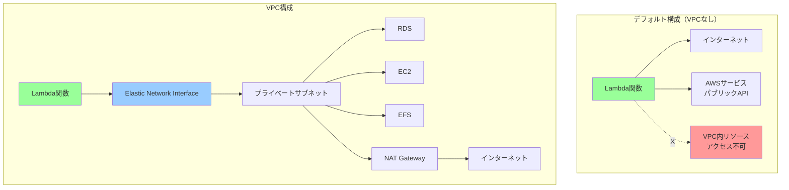
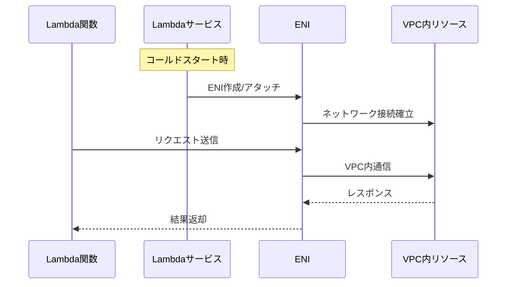
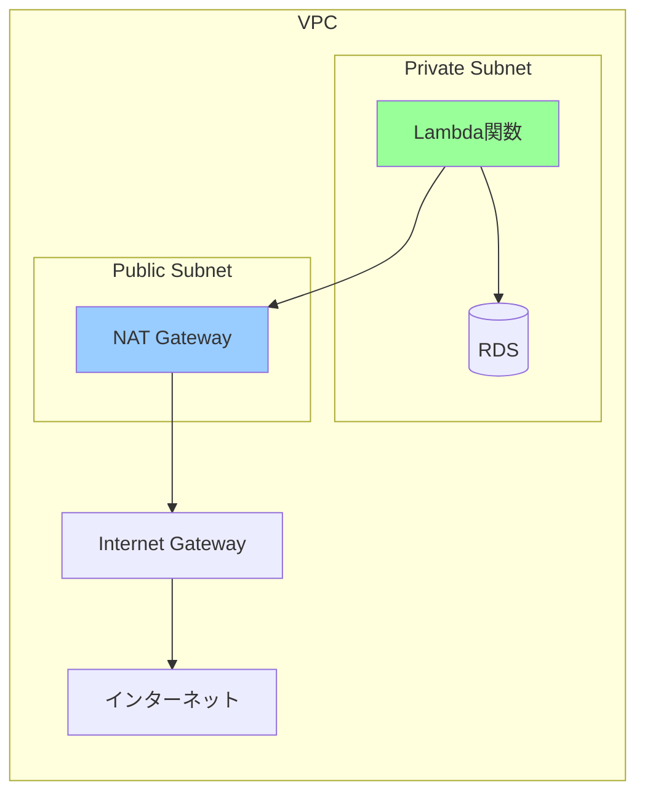
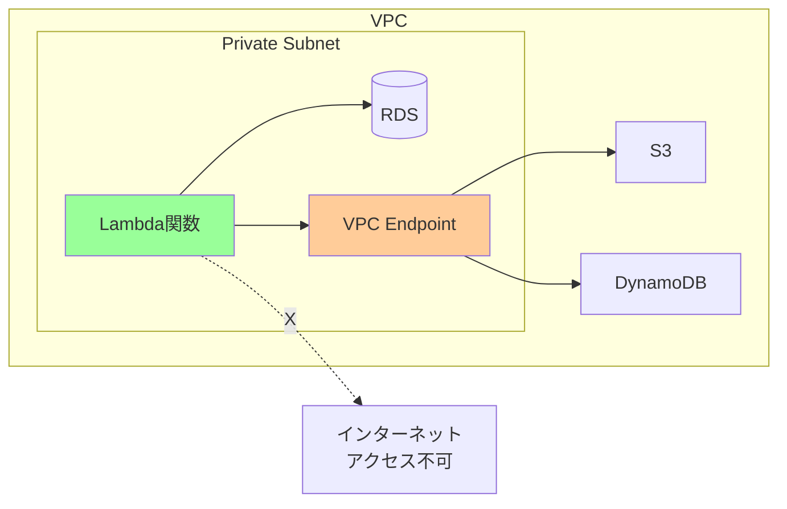
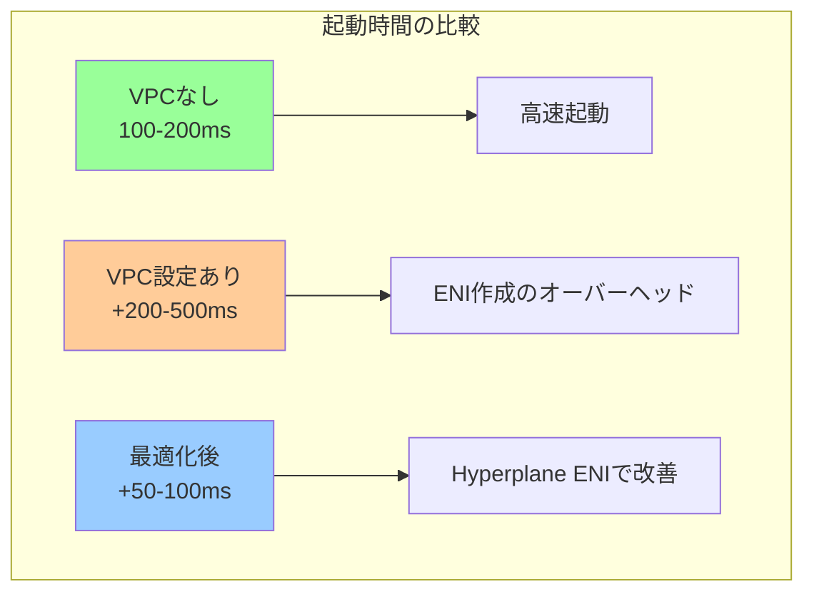

# AWS Lambda関数のVPCアクセス設定ガイド

## 概要

AWS Lambda関数は、デフォルトではAWS管理のネットワーク内で実行されますが、VPC内のリソースにアクセスする必要がある場合は、VPC設定を行う必要があります。この文書では、Lambda関数のVPCアクセスの仕組みと設定方法について説明します。

## VPCアクセスのアーキテクチャ

### デフォルト構成 vs VPC構成



## VPCアクセスの仕組み

### 1. Elastic Network Interface (ENI)

Lambda関数がVPCにアクセスする際の重要な要素：



### 2. Hyperplane ENI

2019年以降、AWS LambdaはHyperplane ENI技術を採用：

**メリット**：
- **高速な起動時間**: ENI作成が数秒に短縮（以前は10-30秒）
- **ENIの共有**: 複数の実行環境で同じENIを共有
- **スケーラビリティ**: ENI数の制限を大幅に緩和

## VPC設定の実装

### 1. 基本的なVPC設定

```python
# Terraform例
resource "aws_lambda_function" "vpc_lambda" {
  function_name = "my-vpc-lambda"
  role         = aws_iam_role.lambda_role.arn
  handler      = "index.handler"
  runtime      = "python3.9"
  
  # VPC設定
  vpc_config {
    subnet_ids = [
      aws_subnet.private_subnet_1.id,
      aws_subnet.private_subnet_2.id
    ]
    
    security_group_ids = [
      aws_security_group.lambda_sg.id
    ]
  }
}

# セキュリティグループ
resource "aws_security_group" "lambda_sg" {
  name_prefix = "lambda-sg"
  vpc_id      = aws_vpc.main.id
  
  # アウトバウンドルール（必要に応じて制限）
  egress {
    from_port   = 0
    to_port     = 0
    protocol    = "-1"
    cidr_blocks = ["0.0.0.0/0"]
  }
  
  # RDSへのアクセス許可
  egress {
    from_port       = 3306
    to_port         = 3306
    protocol        = "tcp"
    security_groups = [aws_security_group.rds_sg.id]
  }
}
```

### 2. IAMロールの設定

```json
{
  "Version": "2012-10-17",
  "Statement": [
    {
      "Effect": "Allow",
      "Action": [
        "ec2:CreateNetworkInterface",
        "ec2:DescribeNetworkInterfaces",
        "ec2:DeleteNetworkInterface",
        "ec2:AssignPrivateIpAddresses",
        "ec2:UnassignPrivateIpAddresses"
      ],
      "Resource": "*"
    }
  ]
}
```

### 3. AWS CDKでの実装

```python
from aws_cdk import (
    aws_lambda as lambda_,
    aws_ec2 as ec2,
    aws_iam as iam,
    Stack
)

class VpcLambdaStack(Stack):
    def __init__(self, scope, id, **kwargs):
        super().__init__(scope, id, **kwargs)
        
        # VPCの取得または作成
        vpc = ec2.Vpc(self, "VPC",
            max_azs=2,
            nat_gateways=1,
            subnet_configuration=[
                ec2.SubnetConfiguration(
                    name="Private",
                    subnet_type=ec2.SubnetType.PRIVATE_WITH_NAT,
                    cidr_mask=24
                )
            ]
        )
        
        # Lambda関数用セキュリティグループ
        lambda_sg = ec2.SecurityGroup(
            self, "LambdaSG",
            vpc=vpc,
            description="Security group for Lambda function"
        )
        
        # Lambda関数
        lambda_function = lambda_.Function(
            self, "VpcFunction",
            runtime=lambda_.Runtime.PYTHON_3_9,
            handler="index.handler",
            code=lambda_.Code.from_asset("lambda"),
            vpc=vpc,
            vpc_subnets=ec2.SubnetSelection(
                subnet_type=ec2.SubnetType.PRIVATE_WITH_NAT
            ),
            security_groups=[lambda_sg],
            allow_all_outbound=True
        )
```

## ネットワーク設計パターン

### 1. プライベートサブネット + NAT Gateway



**使用場面**：
- インターネットアクセスが必要
- AWSパブリックAPIの利用
- 外部APIの呼び出し

### 2. プライベートサブネットのみ（NAT不要）



**使用場面**：
- インターネットアクセス不要
- コスト削減（NAT料金なし）
- セキュリティ重視

### 3. VPCエンドポイントの活用

```python
# VPCエンドポイントの作成（Terraform）
resource "aws_vpc_endpoint" "s3" {
  vpc_id       = aws_vpc.main.id
  service_name = "com.amazonaws.${var.region}.s3"
  
  # ゲートウェイ型エンドポイント
  route_table_ids = [aws_route_table.private.id]
}

resource "aws_vpc_endpoint" "dynamodb" {
  vpc_id       = aws_vpc.main.id
  service_name = "com.amazonaws.${var.region}.dynamodb"
  
  route_table_ids = [aws_route_table.private.id]
}

# インターフェース型エンドポイント
resource "aws_vpc_endpoint" "lambda" {
  vpc_id              = aws_vpc.main.id
  service_name        = "com.amazonaws.${var.region}.lambda"
  vpc_endpoint_type   = "Interface"
  
  subnet_ids          = aws_subnet.private[*].id
  security_group_ids  = [aws_security_group.vpc_endpoint_sg.id]
  
  private_dns_enabled = true
}
```

## パフォーマンスへの影響

### コールドスタート時間の比較



### パフォーマンス最適化のヒント

```python
# 1. 接続プーリングの実装
import pymysql
from contextlib import contextmanager

# グローバルスコープで接続を保持
connection_pool = None

@contextmanager
def get_db_connection():
    global connection_pool
    
    if connection_pool is None:
        connection_pool = pymysql.connect(
            host=os.environ['DB_HOST'],
            user=os.environ['DB_USER'],
            password=os.environ['DB_PASSWORD'],
            database=os.environ['DB_NAME'],
            connect_timeout=5,
            read_timeout=5
        )
    
    try:
        yield connection_pool
    except Exception:
        connection_pool = None  # 次回再接続
        raise

# 2. DNS解決の最適化
import socket

# DNSキャッシュの有効化
socket.setdefaulttimeout(5.0)

# 3. Keep-Aliveの設定
import requests

session = requests.Session()
session.mount('https://', requests.adapters.HTTPAdapter(
    pool_connections=10,
    pool_maxsize=10,
    max_retries=3
))
```

## セキュリティベストプラクティス

### 1. 最小権限の原則

```python
# セキュリティグループの最小権限設定
resource "aws_security_group_rule" "lambda_to_rds" {
  type                     = "egress"
  from_port                = 3306
  to_port                  = 3306
  protocol                 = "tcp"
  source_security_group_id = aws_security_group.rds_sg.id
  security_group_id        = aws_security_group.lambda_sg.id
  
  description = "Allow Lambda to RDS MySQL"
}
```

### 2. プライベートサブネットの使用

```yaml
推奨構成:
  Lambda: プライベートサブネット
  RDS: プライベートサブネット（別サブネット）
  ElastiCache: プライベートサブネット
  NAT Gateway: パブリックサブネット（必要な場合）
```

### 3. VPCフローログの有効化

```python
resource "aws_flow_log" "lambda_vpc_flow_log" {
  iam_role_arn    = aws_iam_role.flow_log_role.arn
  log_destination = aws_cloudwatch_log_group.flow_log.arn
  traffic_type    = "ALL"
  vpc_id          = aws_vpc.main.id
  
  tags = {
    Name = "lambda-vpc-flow-log"
  }
}
```

## トラブルシューティング

### 一般的な問題と解決策

```python
# 1. タイムアウトの診断
def diagnose_network_issue():
    """ネットワーク接続の診断"""
    import socket
    
    tests = {
        'DNS解決': lambda: socket.gethostbyname('example.com'),
        'RDS接続': lambda: test_rds_connection(),
        'S3アクセス': lambda: test_s3_access(),
        'インターネット': lambda: test_internet_access()
    }
    
    results = {}
    for test_name, test_func in tests.items():
        try:
            test_func()
            results[test_name] = 'OK'
        except Exception as e:
            results[test_name] = f'Failed: {str(e)}'
    
    return results

# 2. ENI枯渇の対策
def calculate_eni_capacity(subnet_size, lambda_concurrency):
    """必要なENI数を計算"""
    # サブネットサイズからIPアドレス数を計算
    available_ips = (2 ** (32 - subnet_size)) - 5  # AWS予約分を除く
    
    # Hyperplane ENIでは複数のLambda実行で共有
    eni_per_execution = 1 / 50  # 概算値
    required_enis = lambda_concurrency * eni_per_execution
    
    return {
        'available_ips': available_ips,
        'required_enis': int(required_enis),
        'sufficient': available_ips > required_enis
    }
```

### デバッグ用ツール

```python
def lambda_handler(event, context):
    """VPCデバッグ情報を出力"""
    import subprocess
    import socket
    
    debug_info = {
        'function_name': context.function_name,
        'function_version': context.function_version,
        'aws_request_id': context.aws_request_id,
        
        # ネットワーク情報
        'hostname': socket.gethostname(),
        'ip_address': socket.gethostbyname(socket.gethostname()),
        
        # ルーティングテーブル
        'route_table': subprocess.check_output(['ip', 'route']).decode(),
        
        # DNS設定
        'resolv_conf': open('/etc/resolv.conf').read(),
        
        # 環境変数
        'vpc_related_env': {k: v for k, v in os.environ.items() 
                           if 'VPC' in k or 'SUBNET' in k}
    }
    
    logger.info(json.dumps(debug_info, indent=2))
    
    # 実際の処理
    return process_request(event)
```

## まとめ

AWS Lambda関数のVPCアクセスは、以下の点を考慮して設計する必要があります：

1. **必要性の検討**: VPC内リソースへのアクセスが本当に必要か
2. **ネットワーク設計**: 適切なサブネット配置とルーティング
3. **セキュリティ**: 最小権限の原則に基づくセキュリティグループ設定
4. **パフォーマンス**: コールドスタートへの影響を考慮
5. **コスト**: NAT Gatewayの料金とVPCエンドポイントの活用

適切に設計されたVPC構成により、セキュアで高性能なサーバーレスアプリケーションを構築できます。