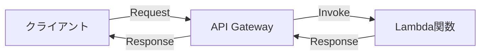
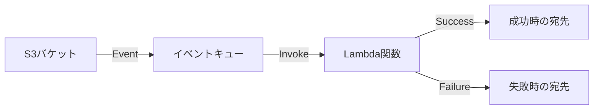
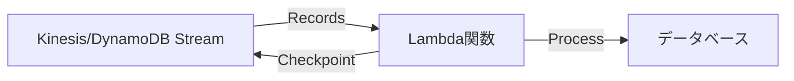
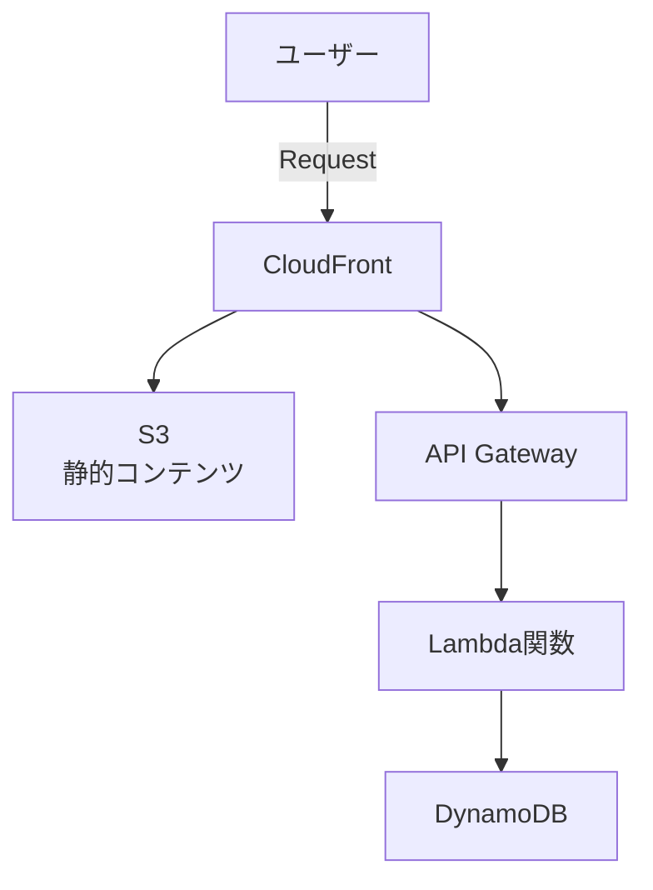
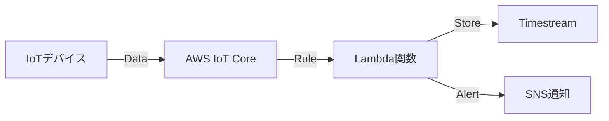

# AWS Lambdaとは

## 概要

AWS Lambdaは、サーバーのプロビジョニングや管理なしでコードを実行できるサーバーレスコンピューティングサービスです。イベントドリブンアーキテクチャの中核として、必要な時にのみコードを実行し、使用した分だけ課金される革新的なサービスです。

## 主な特徴

### 1. サーバーレスアーキテクチャ

- **インフラ管理不要**
  - サーバーのプロビジョニング、スケーリング、パッチ適用が不要
  - AWS が全てのインフラストラクチャを管理
  - 開発者はコードの記述に集中可能

### 2. イベントドリブン実行

- **多様なトリガー**
  - HTTPリクエスト（API Gateway経由）
  - ファイルアップロード（S3）
  - データベース変更（DynamoDB Streams）
  - メッセージキュー（SQS、SNS）
  - スケジュール実行（EventBridge）

### 3. 自動スケーリング

- **無制限のスケーラビリティ**
  - 同時実行数に基づいて自動的にスケール
  - ミリ秒単位での高速起動
  - トラフィックに応じた柔軟な対応

## Lambda関数の構成要素

### 1. ランタイム環境

```yaml
対応言語とバージョン（2024年現在）:
  - Node.js: 18.x, 20.x
  - Python: 3.8, 3.9, 3.10, 3.11, 3.12
  - Java: 8, 11, 17, 21
  - .NET: 6, 7, 8
  - Go: 1.x
  - Ruby: 3.2
  - カスタムランタイム: Rust, PHP等
```

### 2. 関数の基本構造

#### Python例
```python
import json

def lambda_handler(event, context):
    """
    event: イベントデータ（トリガーからの入力）
    context: 実行環境の情報（リクエストID、残り時間等）
    """
    # ビジネスロジック
    result = process_data(event)
    
    # レスポンス
    return {
        'statusCode': 200,
        'body': json.dumps(result)
    }
```

#### Node.js例
```javascript
exports.handler = async (event, context) => {
    // ビジネスロジック
    const result = await processData(event);
    
    // レスポンス
    return {
        statusCode: 200,
        body: JSON.stringify(result)
    };
};
```

### 3. 設定パラメータ

| パラメータ | 説明 | デフォルト値 | 最大値 |
|-----------|------|-------------|--------|
| メモリ | 割り当てメモリ | 128 MB | 10,240 MB |
| タイムアウト | 実行時間制限 | 3秒 | 15分 |
| 同時実行数 | 並列実行数 | 1,000 | アカウント制限 |
| エフェメラルストレージ | 一時ストレージ | 512 MB | 10,240 MB |

## イベントソースとトリガー

### 1. 同期呼び出し



**特徴:**
- クライアントは応答を待つ
- エラーハンドリングはクライアント側
- API Gateway、ALB、Cognitoなど

### 2. 非同期呼び出し



**特徴:**
- イベントはキューに格納
- 自動リトライ（2回）
- デッドレターキュー対応
- S3、SNS、EventBridgeなど

### 3. ストリーム処理



**特徴:**
- バッチ処理
- 順序保証
- チェックポイント管理

## 料金体系

### 1. リクエスト料金

```
月間100万リクエストまで: 無料
それ以降: $0.20 / 100万リクエスト
```

### 2. 実行時間料金

```
計算式: GB秒 = メモリ(GB) × 実行時間(秒)

料金（x86）:
- 月間40万GB秒まで: 無料
- それ以降: $0.0000166667 / GB秒

料金（ARM/Graviton2）:
- 20%安い: $0.0000133334 / GB秒
```

### 3. 料金計算例

```yaml
例: 画像処理関数
  メモリ: 1,024 MB (1 GB)
  実行時間: 2秒
  月間実行回数: 100万回

計算:
  リクエスト料金: 無料（無料枠内）
  実行時間: 1 GB × 2秒 × 100万回 = 200万GB秒
  実行時間料金: (200万 - 40万) × $0.0000166667 = $26.67
  
  月額合計: $26.67
```

## ベストプラクティス

### 1. パフォーマンス最適化

#### コールドスタート対策

```python
# グローバルスコープで初期化
import boto3
dynamodb = boto3.resource('dynamodb')
table = dynamodb.Table('MyTable')

def lambda_handler(event, context):
    # 関数実行時のみの処理
    response = table.get_item(Key={'id': event['id']})
    return response['Item']
```

#### プロビジョンドコンカレンシー

```yaml
設定:
  関数: my-function
  プロビジョンド同時実行数: 10
  
効果:
  - 常に10個のウォームインスタンス
  - コールドスタートを回避
  - 予測可能なパフォーマンス
```

### 2. セキュリティ

#### 最小権限の原則

```json
{
  "Version": "2012-10-17",
  "Statement": [
    {
      "Effect": "Allow",
      "Action": [
        "s3:GetObject"
      ],
      "Resource": "arn:aws:s3:::my-bucket/*"
    }
  ]
}
```

#### 環境変数の暗号化

```python
import os
import boto3
from base64 import b64decode

# 暗号化された環境変数
ENCRYPTED = os.environ['DB_PASSWORD']
# 復号化
DECRYPTED = boto3.client('kms').decrypt(
    CiphertextBlob=b64decode(ENCRYPTED)
)['Plaintext'].decode('utf-8')
```

### 3. エラーハンドリング

#### リトライとデッドレターキュー

```python
import json
import logging

logger = logging.getLogger()
logger.setLevel(logging.INFO)

def lambda_handler(event, context):
    try:
        # メイン処理
        result = process_event(event)
        return {
            'statusCode': 200,
            'body': json.dumps(result)
        }
    except Exception as e:
        logger.error(f"Error processing: {str(e)}")
        # DLQへ送信される
        raise
```

### 4. 監視とロギング

#### CloudWatch Logs統合

```python
import logging
import json

logger = logging.getLogger()
logger.setLevel(logging.INFO)

def lambda_handler(event, context):
    # 構造化ログ
    logger.info(json.dumps({
        'request_id': context.request_id,
        'event': event,
        'remaining_time': context.get_remaining_time_in_millis()
    }))
    
    # メトリクス送信
    cloudwatch = boto3.client('cloudwatch')
    cloudwatch.put_metric_data(
        Namespace='MyApp',
        MetricData=[{
            'MetricName': 'ProcessingTime',
            'Value': processing_time,
            'Unit': 'Milliseconds'
        }]
    )
```

## ユースケース

### 1. Webアプリケーションバックエンド



**利点:**
- 完全サーバーレスアーキテクチャ
- 自動スケーリング
- 低コスト運用

### 2. リアルタイムファイル処理

```python
def lambda_handler(event, context):
    # S3イベントから情報取得
    bucket = event['Records'][0]['s3']['bucket']['name']
    key = event['Records'][0]['s3']['object']['key']
    
    # 画像処理
    image = download_from_s3(bucket, key)
    thumbnail = create_thumbnail(image)
    
    # 結果を保存
    upload_to_s3(thumbnail, f"thumbnails/{key}")
```

### 3. 定期バッチ処理

```yaml
EventBridge Rule:
  ScheduleExpression: "rate(1 hour)"
  Target: Lambda関数
  
Lambda処理:
  - データベースクリーンアップ
  - レポート生成
  - 通知送信
```

### 4. IoTデータ処理



## 制限事項と考慮点

### 1. 実行時間制限

| シナリオ | 最大実行時間 | 推奨用途 |
|---------|------------|----------|
| 同期実行 | 15分 | API、Web処理 |
| 非同期実行 | 15分 | ファイル処理、バッチ |
| ストリーミング | 24時間 | Kinesis処理 |

### 2. メモリとCPU

```
メモリ割り当てとCPU性能の関係:
- 128 MB: 0.08 vCPU
- 1,024 MB: 0.67 vCPU
- 1,769 MB: 1.00 vCPU
- 3,008 MB: 2.00 vCPU
- 10,240 MB: 6.00 vCPU
```

### 3. ネットワーク制限

- **パブリックインターネット**: デフォルトで利用可能
- **VPC接続**: ENI作成により遅延発生の可能性
- **アウトバウンド**: 制限なし
- **インバウンド**: トリガー経由のみ

## Lambda vs 他のコンピューティングサービス

### Lambda vs EC2

| 項目 | Lambda | EC2 |
|------|--------|-----|
| 管理負荷 | なし | 高い |
| 起動時間 | ミリ秒 | 分単位 |
| 課金 | 使用時のみ | 常時 |
| 実行時間 | 最大15分 | 無制限 |
| カスタマイズ | 制限あり | 完全制御 |

### Lambda vs Fargate

| 項目 | Lambda | Fargate |
|------|--------|---------|
| コンテナ対応 | Lambda用イメージ | 標準Docker |
| 起動時間 | ミリ秒 | 秒〜分 |
| 実行時間 | 15分まで | 無制限 |
| 料金 | より安価 | やや高価 |
| ユースケース | イベント処理 | 長時間実行 |

## トラブルシューティング

### 1. コールドスタート問題

**症状**: 初回実行が遅い

**対策**:
- プロビジョンドコンカレンシー使用
- 軽量な依存関係
- レイヤーの活用

### 2. タイムアウトエラー

**症状**: Task timed out エラー

**対策**:
```python
# タイムアウト監視
import signal

def timeout_handler(signum, frame):
    # クリーンアップ処理
    raise TimeoutError("Function timeout")

signal.signal(signal.SIGALRM, timeout_handler)
signal.alarm(context.get_remaining_time_in_millis() // 1000 - 1)
```

### 3. メモリ不足

**症状**: Runtime exited with error

**対策**:
- CloudWatchメトリクスで使用量確認
- メモリ割り当て増加
- 処理の最適化

## まとめ

AWS Lambdaは、サーバーレスアーキテクチャの中核となるサービスで、以下の場合に最適です：

✅ **向いている用途**
- イベントドリブンな処理
- 不定期または予測困難なワークロード
- マイクロサービスアーキテクチャ
- 短時間の処理（15分以内）

❌ **向いていない用途**
- 長時間実行処理
- WebSocketなど常時接続
- 大量のメモリ使用（10GB超）
- レガシーアプリケーション

適切に使用することで、運用コストの削減、開発効率の向上、自動スケーリングによる可用性向上を実現できます。

## 参考リンク

- [AWS Lambda公式ドキュメント](https://docs.aws.amazon.com/lambda/)
- [Lambda料金](https://aws.amazon.com/jp/lambda/pricing/)
- [Lambda制限](https://docs.aws.amazon.com/lambda/latest/dg/gettingstarted-limits.html)
- [Lambdaベストプラクティス](https://docs.aws.amazon.com/lambda/latest/dg/best-practices.html)