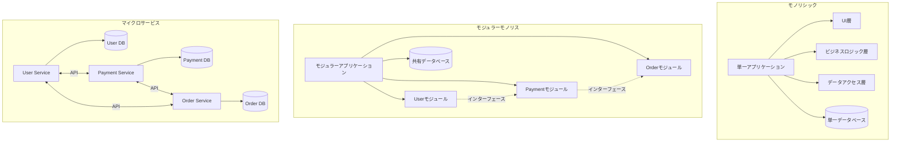
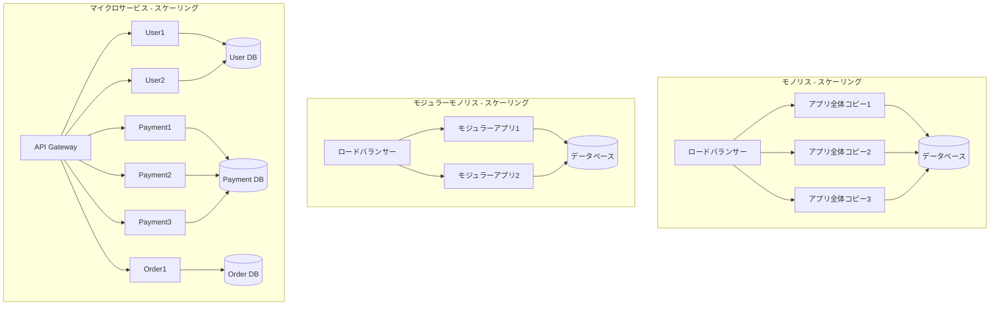
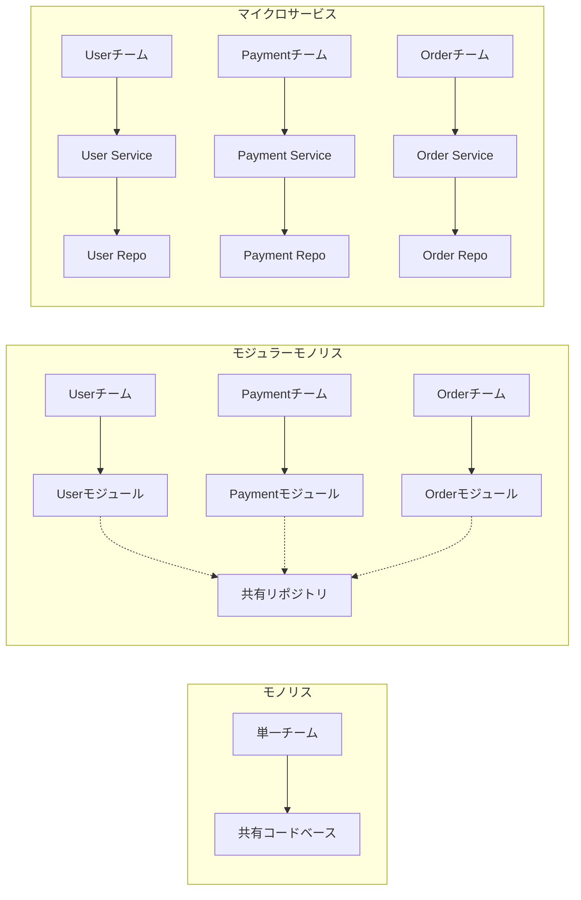
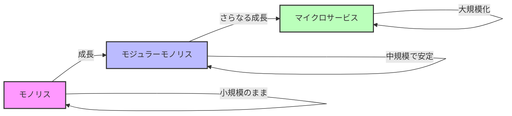
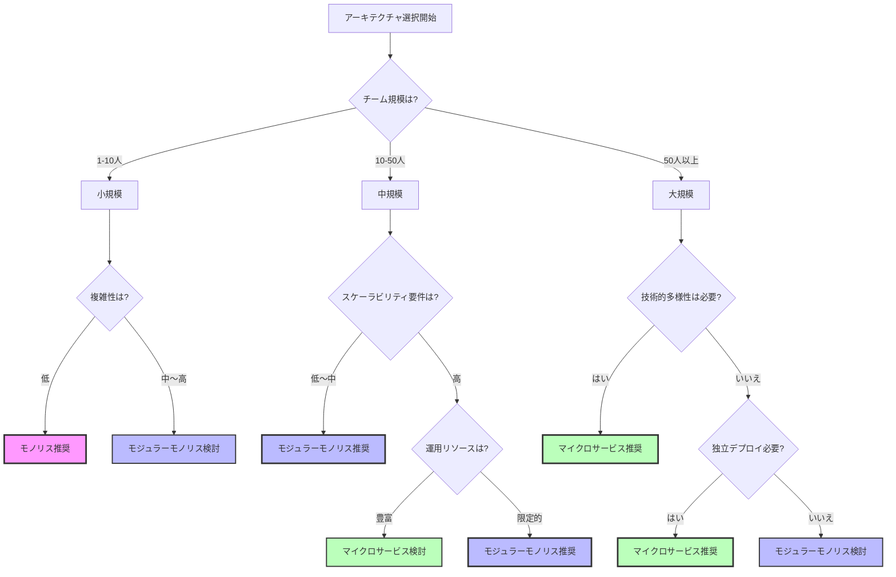
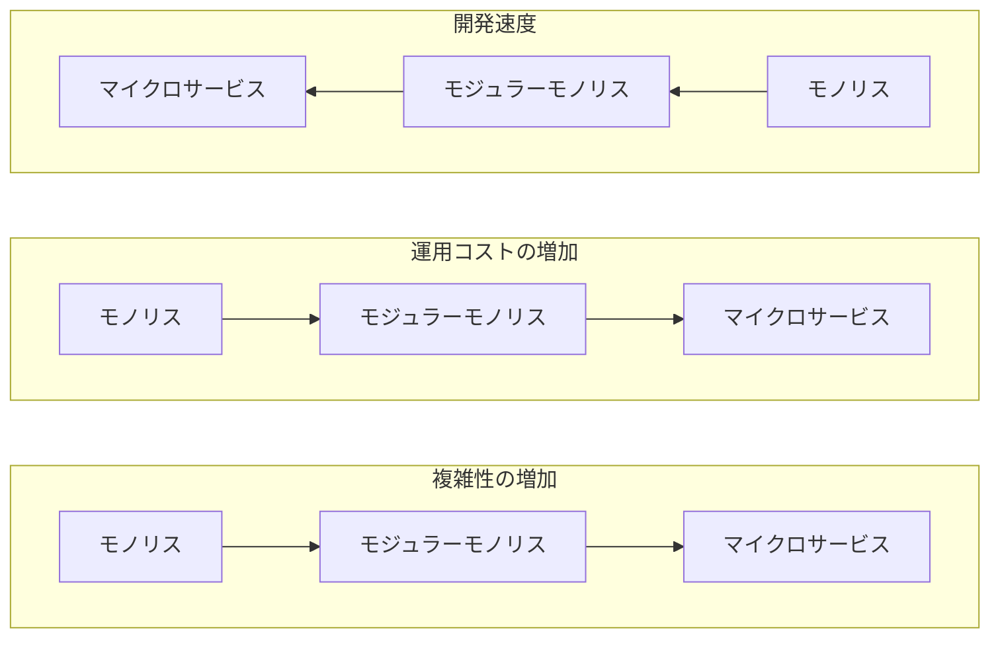
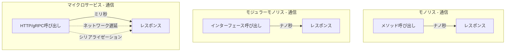
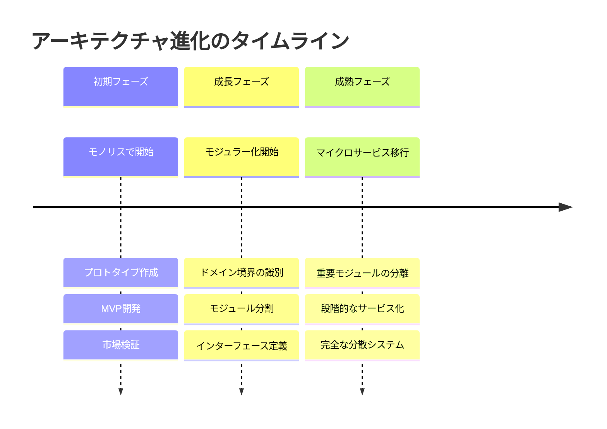

# マイクロサービス・モジュラーモノリス・モノリス比較説明書

## 概要

本文書では、ソフトウェアアーキテクチャの3つの主要なアプローチである「モノリシック」「モジュラーモノリス」「マイクロサービス」について、それぞれの特徴、利点、欠点、および適用場面を詳しく説明します。

## アーキテクチャの視覚的比較

### 3つのアーキテクチャの構造



### デプロイメントとスケーリングの比較



### 開発チーム構造の比較



### アーキテクチャ進化の道筋



## 1. モノリシックアーキテクチャ

### 定義
モノリシックアーキテクチャは、すべてのコンポーネントが単一のコードベースに統合された従来型のソフトウェア設計モデルです。

### 主な特徴
- **単一デプロイメント単位**: アプリケーション全体が1つの実行可能ファイルまたはディレクトリとして展開
- **密結合**: データアクセス層、ビジネスロジック、ユーザーインターフェースが緊密に統合
- **統一技術スタック**: 通常、単一のプログラミング言語とデータベースを使用
- **共有リソース**: すべてのコンポーネントが同じメモリ空間とリソースを共有

### 利点
- **シンプルな開発**: 統一されたコードベースで理解しやすい
- **容易なデプロイ**: 単一のデプロイメントで完了
- **デバッグの簡単さ**: すべてのコードが一か所にあるため追跡が容易
- **初期開発の高速化**: 事前の設計が最小限で済む
- **パフォーマンス**: プロセス内通信のため高速

### 欠点
- **スケーラビリティの制限**: 水平スケーリングが非効率（全体を複製する必要）
- **技術的制約**: 単一の技術スタックに縛られる
- **変更の影響範囲**: 小さな変更でも全体の再デプロイが必要
- **開発の並行性**: 大規模チームでの開発が困難
- **障害の伝播**: 一部の障害が全体に影響

### 適用場面
- 小規模〜中規模のアプリケーション
- スタートアップの初期段階
- チームが小さく、要件が明確な場合
- 高速なプロトタイピングが必要な場合

## 2. モジュラーモノリスアーキテクチャ

### 定義
モジュラーモノリスは、単一のデプロイメント単位を維持しながら、内部をモジュールに分割し、明確な境界を持たせたアーキテクチャです。

### 主な特徴
- **モジュール分割**: ビジネス機能ごとに独立したモジュールを作成
- **明確な境界**: 各モジュール間の依存関係を定義されたインターフェースで管理
- **単一デプロイメント**: モジュール化されていても、システム全体は1つのパッケージとして展開
- **責任の分離**: 各モジュール（例：Users、Payments、Orders）が独自のロジックとデータをカプセル化

### 実装例
```
アプリケーション/
├── modules/
│   ├── users/
│   │   ├── models/
│   │   ├── services/
│   │   └── interfaces/
│   ├── payments/
│   │   ├── models/
│   │   ├── services/
│   │   └── interfaces/
│   └── orders/
│       ├── models/
│       ├── services/
│       └── interfaces/
└── shared/
    └── interfaces/
```

### 利点
- **より良い組織化**: 従来のモノリスより依存関係が整理される
- **段階的な移行**: 将来的にマイクロサービスへの移行が容易
- **開発の独立性**: 各モジュールを個別に開発・テスト可能
- **保守性の向上**: モジュール単位での変更が可能
- **複雑性の管理**: マイクロサービスより単純

### 欠点
- **完全な独立性の欠如**: モジュール間の依存は残る
- **境界管理の規律**: 明確な責任分離を維持する開発規律が必要
- **障害分離の限界**: 一つのモジュールのバグが全体に影響する可能性
- **スケーラビリティの制約**: モノリスと同様の制限が残る

### 適用場面
- 中規模〜大規模プロジェクトの多く
- マイクロサービスへの段階的移行を検討している場合
- チームがモジュール化の利点を求めるが、マイクロサービスの複雑性を避けたい場合
- 明確なドメイン境界が識別できる場合

## 3. マイクロサービスアーキテクチャ

### 定義
マイクロサービスは、アプリケーションを独立してデプロイ可能な小さなサービスの集合として構築するアーキテクチャスタイルです。

### 主な特徴
- **独立したサービス**: 各機能が独自のライフサイクルを持つサービスとして分離
- **技術的多様性**: 各サービスで異なる言語、フレームワーク、データベースを使用可能
- **API通信**: サービス間の通信はAPIを介して行う
- **独立したデータストア**: 各サービスが独自のデータベースを持つ
- **分散システム**: ネットワーク越しに協調動作

### アーキテクチャ例
```
┌─────────────┐     ┌─────────────┐     ┌─────────────┐
│   User      │     │   Payment   │     │   Order     │
│  Service    │     │  Service    │     │  Service    │
├─────────────┤     ├─────────────┤     ├─────────────┤
│   API       │◄────┤   API       │────►│   API       │
├─────────────┤     ├─────────────┤     ├─────────────┤
│   Logic     │     │   Logic     │     │   Logic     │
├─────────────┤     ├─────────────┤     ├─────────────┤
│   User DB   │     │  Payment DB │     │  Order DB   │
└─────────────┘     └─────────────┘     └─────────────┘
```

### 利点
- **独立したスケーラビリティ**: 各サービスを個別にスケール可能
- **技術的柔軟性**: サービスごとに最適な技術を選択
- **障害の分離**: 一つのサービスの障害が他に伝播しにくい
- **独立したデプロイメント**: 各サービスを個別に更新・展開
- **チームの自律性**: 各チームが独立して開発可能

### 欠点
- **複雑性の増大**: 分散システムの管理が複雑
- **運用コスト**: 多数のサービスの監視・管理が必要
- **ネットワーク遅延**: サービス間通信のオーバーヘッド
- **デバッグの困難**: 複数サービスにまたがる問題の追跡が困難
- **データ整合性**: 分散トランザクションの管理が複雑

### 適用場面
- 大規模で動的なシステム
- 高いスケーラビリティと耐障害性が必要
- 大規模な開発チームで独立した開発が必要
- Netflix、Amazon、Uberなどの大規模プラットフォーム

## アーキテクチャ選択のガイドライン

### 意思決定フローチャート



### 比較表

| 特性 | モノリス | モジュラーモノリス | マイクロサービス |
|------|----------|-------------------|------------------|
| 複雑性 | 低 | 中 | 高 |
| 初期開発速度 | 高速 | 中速 | 低速 |
| スケーラビリティ | 低 | 中 | 高 |
| デプロイメント | 簡単 | 簡単 | 複雑 |
| 技術的柔軟性 | 低 | 低 | 高 |
| チームの独立性 | 低 | 中 | 高 |
| 運用コスト | 低 | 低〜中 | 高 |
| 障害分離 | 低 | 中 | 高 |

### 選択基準

#### モノリスを選ぶべき場合
- プロジェクトが小規模（〜10人のチーム）
- アプリケーションの要件が明確で変更が少ない
- 市場投入までの時間が重要
- リソースが限られている

#### モジュラーモノリスを選ぶべき場合
- 中規模プロジェクト（10〜50人のチーム）
- 将来的な成長を見据えている
- ドメイン境界が明確
- マイクロサービスへの移行を検討している

#### マイクロサービスを選ぶべき場合
- 大規模プロジェクト（50人以上のチーム）
- 高いスケーラビリティが必要
- 技術的多様性が重要
- 独立したチーム開発が必要
- 十分な運用リソースがある

## 複雑性とコストの比較



### パフォーマンスとレイテンシの比較



## まとめ

アーキテクチャの選択は、プロジェクトの規模、チームの能力、ビジネス要件によって決まります。多くの場合、モノリスから始めて、成長に応じてモジュラーモノリスへ、そして必要に応じてマイクロサービスへと進化させることが推奨されます。重要なのは、現在のニーズと将来の成長を考慮し、適切なタイミングで適切なアーキテクチャを選択することです。

### アーキテクチャ移行のベストプラクティス

