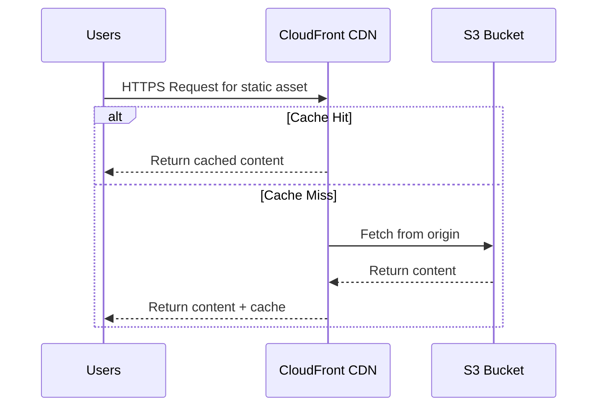
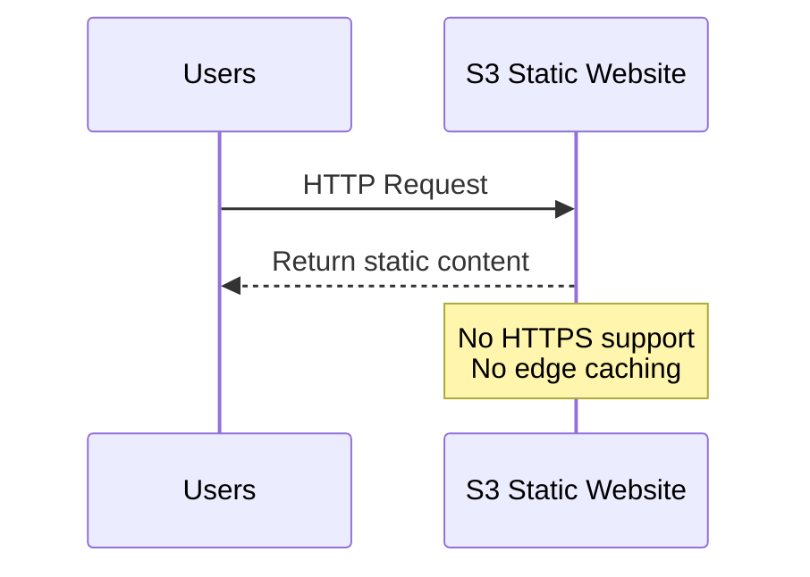
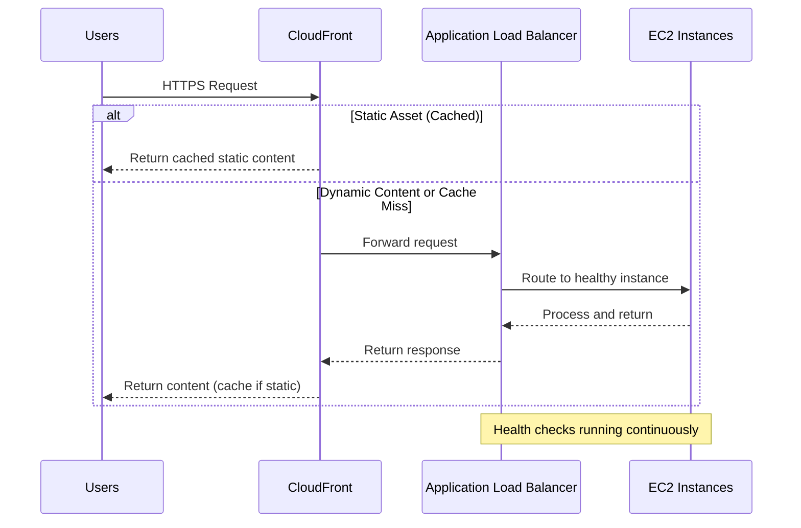
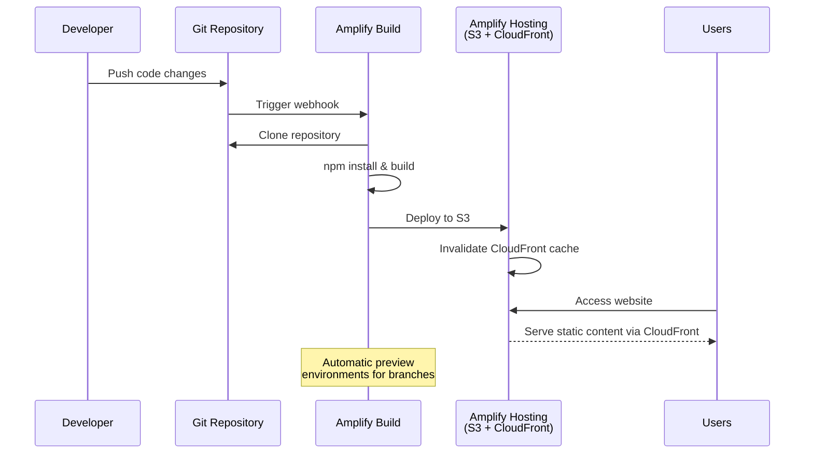

# AWS静的アセット配信パターン

## What's this file?
> [!NOTE]
> **What**
> 
> AWS静的アセット配信パターンとは何かについて記載しています。

## Conclusion (忙しいとき向け)
> [!IMPORTANT]
> **What** : AWS静的アセット配信パターンとは何か
> 
> **Answer** : AWSで静的コンテンツ（HTML、CSS、JS、画像など）を効率的に配信するための複数のアーキテクチャパターン。主にS3+CloudFront、S3単体、EC2/ALB+CloudFront、Amplifyの4つのパターンがあり、S3+CloudFrontが最も推奨される。

## 目次

<details>
<summary>目次を開く</summary>

- [S3 + CloudFront パターン (推奨)](#1-s3--cloudfront-パターン-推奨)
  - [なぜS3 + CloudFrontパターンが推奨されるのか](#なぜs3--cloudfrontパターンが推奨されるのか)
  - [アーキテクチャ](#アーキテクチャ)
  - [特徴](#特徴)
  - [CloudFormationテンプレート](#cloudformationテンプレート)
  - [Terraformテンプレート](#terraformテンプレート)
- [S3静的ウェブサイトホスティング](#2-s3静的ウェブサイトホスティング)
- [EC2/ALB + CloudFront パターン](#3-ec2alb--cloudfront-パターン)
- [AWS Amplify Hosting](#4-aws-amplify-hosting)
- [パターン選択ガイド](#パターン選択ガイド)
- [ベストプラクティス](#ベストプラクティス)

</details>

## 1. S3 + CloudFront パターン (推奨)

### なぜS3 + CloudFrontパターンが推奨されるのか

#### 1. **エンタープライズグレードの信頼性**
- **99.99%の可用性SLA**: CloudFrontとS3の組み合わせで高い可用性を実現
- **自動フェイルオーバー**: エッジロケーション間での自動的な障害回復
- **グローバル冗長性**: 世界中に分散されたインフラストラクチャ

#### 2. **優れたパフォーマンス**
- **低レイテンシー配信**: 450+のエッジロケーションから最寄りの場所で配信
- **インテリジェントルーティング**: 最適なエッジロケーションへの自動ルーティング
- **HTTP/3対応**: 最新のプロトコルによる高速通信

#### 3. **コスト効率性**
- **従量課金制**: 使用した分だけの支払い、初期投資不要
- **段階的価格設定**: 大量配信時の単価削減
- **無料利用枠**: 月間1TBまでのデータ転送が1年間無料

#### 4. **運用の簡素化**
- **サーバーレス**: インフラ管理不要
- **自動スケーリング**: トラフィック増加時の自動対応
- **統合監視**: CloudWatchによる一元的な監視

#### 5. **セキュリティの強化**
- **DDoS防御**: AWS Shield Standardによる自動保護
- **暗号化**: 転送時・保存時の自動暗号化
- **アクセス制御**: OACによる厳密なオリジン保護

#### 6. **開発者体験の向上**
- **簡単なデプロイ**: AWS CLI/SDKによる自動化
- **即座の無効化**: キャッシュの即時クリア機能
- **リアルタイムログ**: 詳細なアクセスログとメトリクス

### アーキテクチャ



### 特徴
- **高パフォーマンス**: エッジロケーションからの配信
- **コスト効率**: S3の低ストレージコスト + CloudFrontの転送料金
- **セキュリティ**: OAC (Origin Access Control) でS3を保護
- **HTTPS対応**: CloudFrontで証明書管理

### CloudFormationテンプレート
```yaml
AWSTemplateFormatVersion: '2010-09-09'
Description: 'S3 + CloudFront Static Assets Distribution'

Parameters:
  DomainName:
    Type: String
    Description: Custom domain name for CloudFront
    Default: ''

Resources:
  # S3バケット
  AssetsBucket:
    Type: AWS::S3::Bucket
    Properties:
      BucketName: !Sub '${AWS::StackName}-assets'
      PublicAccessBlockConfiguration:
        BlockPublicAcls: true
        BlockPublicPolicy: true
        IgnorePublicAcls: true
        RestrictPublicBuckets: true
      BucketEncryption:
        ServerSideEncryptionConfiguration:
          - ServerSideEncryptionByDefault:
              SSEAlgorithm: AES256

  # Origin Access Control
  OriginAccessControl:
    Type: AWS::CloudFront::OriginAccessControl
    Properties:
      OriginAccessControlConfig:
        Name: !Sub '${AWS::StackName}-oac'
        OriginAccessControlOriginType: s3
        SigningBehavior: always
        SigningProtocol: sigv4

  # CloudFront Distribution
  CloudFrontDistribution:
    Type: AWS::CloudFront::Distribution
    Properties:
      DistributionConfig:
        Origins:
          - Id: S3Origin
            DomainName: !GetAtt AssetsBucket.RegionalDomainName
            S3OriginConfig:
              OriginAccessIdentity: ''
            OriginAccessControlId: !GetAtt OriginAccessControl.Id
        Enabled: true
        DefaultRootObject: index.html
        DefaultCacheBehavior:
          TargetOriginId: S3Origin
          ViewerProtocolPolicy: redirect-to-https
          AllowedMethods:
            - GET
            - HEAD
            - OPTIONS
          CachedMethods:
            - GET
            - HEAD
          Compress: true
          CachePolicyId: 658327ea-f89d-4fab-a63d-7e88639e58f6  # Managed-CachingOptimized
        PriceClass: PriceClass_100
        ViewerCertificate:
          CloudFrontDefaultCertificate: true

  # S3バケットポリシー
  BucketPolicy:
    Type: AWS::S3::BucketPolicy
    Properties:
      Bucket: !Ref AssetsBucket
      PolicyDocument:
        Statement:
          - Sid: AllowCloudFrontServicePrincipal
            Effect: Allow
            Principal:
              Service: cloudfront.amazonaws.com
            Action: s3:GetObject
            Resource: !Sub '${AssetsBucket.Arn}/*'
            Condition:
              StringEquals:
                AWS:SourceArn: !Sub 'arn:aws:cloudfront::${AWS::AccountId}:distribution/${CloudFrontDistribution}'

Outputs:
  CloudFrontURL:
    Description: CloudFront Distribution URL
    Value: !Sub 'https://${CloudFrontDistribution.DomainName}'
  BucketName:
    Description: S3 Bucket Name
    Value: !Ref AssetsBucket
```

### Terraformテンプレート
```hcl
# S3 + CloudFront for Static Assets

variable "domain_name" {
  description = "Custom domain name"
  type        = string
  default     = ""
}

# S3バケット
resource "aws_s3_bucket" "assets" {
  bucket = "${var.project_name}-assets"
}

resource "aws_s3_bucket_public_access_block" "assets" {
  bucket = aws_s3_bucket.assets.id

  block_public_acls       = true
  block_public_policy     = true
  ignore_public_acls      = true
  restrict_public_buckets = true
}

resource "aws_s3_bucket_server_side_encryption_configuration" "assets" {
  bucket = aws_s3_bucket.assets.id

  rule {
    apply_server_side_encryption_by_default {
      sse_algorithm = "AES256"
    }
  }
}

# CloudFront OAC
resource "aws_cloudfront_origin_access_control" "assets" {
  name                              = "${var.project_name}-oac"
  description                       = "OAC for ${var.project_name}"
  origin_access_control_origin_type = "s3"
  signing_behavior                  = "always"
  signing_protocol                  = "sigv4"
}

# CloudFront Distribution
resource "aws_cloudfront_distribution" "assets" {
  origin {
    domain_name              = aws_s3_bucket.assets.bucket_regional_domain_name
    origin_access_control_id = aws_cloudfront_origin_access_control.assets.id
    origin_id                = "S3-${aws_s3_bucket.assets.id}"
  }

  enabled             = true
  is_ipv6_enabled     = true
  default_root_object = "index.html"

  default_cache_behavior {
    allowed_methods  = ["GET", "HEAD", "OPTIONS"]
    cached_methods   = ["GET", "HEAD"]
    target_origin_id = "S3-${aws_s3_bucket.assets.id}"

    forwarded_values {
      query_string = false
      cookies {
        forward = "none"
      }
    }

    viewer_protocol_policy = "redirect-to-https"
    min_ttl                = 0
    default_ttl            = 3600
    max_ttl                = 86400
    compress               = true
  }

  price_class = "PriceClass_100"

  restrictions {
    geo_restriction {
      restriction_type = "none"
    }
  }

  viewer_certificate {
    cloudfront_default_certificate = true
  }
}

# S3バケットポリシー
data "aws_iam_policy_document" "assets" {
  statement {
    actions   = ["s3:GetObject"]
    resources = ["${aws_s3_bucket.assets.arn}/*"]

    principals {
      type        = "Service"
      identifiers = ["cloudfront.amazonaws.com"]
    }

    condition {
      test     = "StringEquals"
      variable = "AWS:SourceArn"
      values   = [aws_cloudfront_distribution.assets.arn]
    }
  }
}

resource "aws_s3_bucket_policy" "assets" {
  bucket = aws_s3_bucket.assets.id
  policy = data.aws_iam_policy_document.assets.json
}

output "cloudfront_url" {
  value = "https://${aws_cloudfront_distribution.assets.domain_name}"
}

output "bucket_name" {
  value = aws_s3_bucket.assets.id
}
```

## 2. S3静的ウェブサイトホスティング

### アーキテクチャ



### CloudFormationテンプレート
```yaml
AWSTemplateFormatVersion: '2010-09-09'
Description: 'S3 Static Website Hosting'

Resources:
  WebsiteBucket:
    Type: AWS::S3::Bucket
    Properties:
      BucketName: !Sub '${AWS::StackName}-website'
      WebsiteConfiguration:
        IndexDocument: index.html
        ErrorDocument: error.html
      PublicAccessBlockConfiguration:
        BlockPublicAcls: false
        BlockPublicPolicy: false
        IgnorePublicAcls: false
        RestrictPublicBuckets: false

  BucketPolicy:
    Type: AWS::S3::BucketPolicy
    Properties:
      Bucket: !Ref WebsiteBucket
      PolicyDocument:
        Statement:
          - Sid: PublicReadGetObject
            Effect: Allow
            Principal: '*'
            Action: s3:GetObject
            Resource: !Sub '${WebsiteBucket.Arn}/*'

Outputs:
  WebsiteURL:
    Description: S3 Website URL
    Value: !GetAtt WebsiteBucket.WebsiteURL
```

## 3. EC2/ALB + CloudFront パターン

### アーキテクチャ



### 特徴
- 動的コンテンツと静的コンテンツの混在
- より複雑なルーティング要件に対応
- コンテナ（ECS/EKS）でも利用可能

### Terraformテンプレート（抜粋）
```hcl
# ALB
resource "aws_lb" "main" {
  name               = "${var.project_name}-alb"
  internal           = false
  load_balancer_type = "application"
  security_groups    = [aws_security_group.alb.id]
  subnets            = var.public_subnet_ids
}

# CloudFront with ALB Origin
resource "aws_cloudfront_distribution" "main" {
  origin {
    domain_name = aws_lb.main.dns_name
    origin_id   = "ALB-${aws_lb.main.id}"

    custom_origin_config {
      http_port              = 80
      https_port             = 443
      origin_protocol_policy = "https-only"
      origin_ssl_protocols   = ["TLSv1.2"]
    }
  }

  enabled = true

  default_cache_behavior {
    allowed_methods  = ["DELETE", "GET", "HEAD", "OPTIONS", "PATCH", "POST", "PUT"]
    cached_methods   = ["GET", "HEAD"]
    target_origin_id = "ALB-${aws_lb.main.id}"

    forwarded_values {
      query_string = true
      headers      = ["*"]
      cookies {
        forward = "all"
      }
    }

    viewer_protocol_policy = "redirect-to-https"
  }

  # 静的アセット用のキャッシュ動作
  ordered_cache_behavior {
    path_pattern     = "/static/*"
    allowed_methods  = ["GET", "HEAD"]
    cached_methods   = ["GET", "HEAD"]
    target_origin_id = "ALB-${aws_lb.main.id}"

    forwarded_values {
      query_string = false
      cookies {
        forward = "none"
      }
    }

    min_ttl                = 0
    default_ttl            = 86400
    max_ttl                = 31536000
    compress               = true
    viewer_protocol_policy = "redirect-to-https"
  }

  restrictions {
    geo_restriction {
      restriction_type = "none"
    }
  }

  viewer_certificate {
    cloudfront_default_certificate = true
  }
}
```

## 4. AWS Amplify Hosting

### アーキテクチャ



### 特徴
- CI/CD統合
- プレビュー環境の自動作成
- フロントエンドフレームワーク最適化

### CloudFormationテンプレート
```yaml
AWSTemplateFormatVersion: '2010-09-09'
Description: 'Amplify Hosting for Static Assets'

Parameters:
  GitHubRepository:
    Type: String
    Description: GitHub repository URL
  GitHubOAuthToken:
    Type: String
    NoEcho: true
    Description: GitHub OAuth token

Resources:
  AmplifyApp:
    Type: AWS::Amplify::App
    Properties:
      Name: !Sub '${AWS::StackName}-app'
      Repository: !Ref GitHubRepository
      OauthToken: !Ref GitHubOAuthToken
      BuildSpec: |
        version: 1
        frontend:
          phases:
            preBuild:
              commands:
                - npm ci
            build:
              commands:
                - npm run build
          artifacts:
            baseDirectory: dist
            files:
              - '**/*'
          cache:
            paths:
              - node_modules/**/*

  AmplifyBranch:
    Type: AWS::Amplify::Branch
    Properties:
      AppId: !GetAtt AmplifyApp.AppId
      BranchName: main
      EnableAutoBuild: true

Outputs:
  DefaultDomain:
    Description: Amplify App URL
    Value: !Sub 'https://main.${AmplifyApp.DefaultDomain}'
```

## パターン選択ガイド

| パターン | 適用シーン | メリット | デメリット |
|---------|-----------|----------|-----------|
| S3 + CloudFront | 純粋な静的サイト、SPA | 高性能、低コスト、シンプル | 動的処理不可 |
| S3静的ホスティング | 小規模、開発環境 | 最もシンプル | HTTPS非対応、性能限定 |
| EC2/ALB + CloudFront | 動的＋静的混在 | 柔軟性高い | 複雑、コスト高 |
| Amplify | フロントエンド開発 | CI/CD統合、開発効率 | AWS限定機能 |

## ベストプラクティス

1. **キャッシュ戦略**
   - 静的アセットには長いTTL設定
   - バージョニングやハッシュ値でキャッシュ制御

2. **セキュリティ**
   - S3バケットは非公開設定
   - CloudFront OACでアクセス制御
   - WAF統合で攻撃対策

3. **パフォーマンス**
   - 画像最適化（WebP、AVIF）
   - Gzip/Brotli圧縮
   - HTTP/2対応

4. **コスト最適化**
   - 適切なCloudFront価格クラス選択
   - S3ライフサイクルポリシー
   - 不要なログの削除

## 関連

- [AWS動的アセット配信パターン](./2025.08.02.11.30_what_dynamic-assets-patterns_by_aws.md)
- [S3単体での静的アセット配信について](./2025.08.02.11.50_what_s3_only_static_assets_broadcasting.md)
- [なぜEC2単体ではなくCloudFrontが必要なのか](./2025.08.02.11.40_why_ec2_standalone_delivery_but_cloudfront_needed_reason.md)
- [AWS CloudFront公式ドキュメント](https://docs.aws.amazon.com/cloudfront/)
- [AWS S3静的ウェブサイトホスティング](https://docs.aws.amazon.com/AmazonS3/latest/userguide/WebsiteHosting.html)