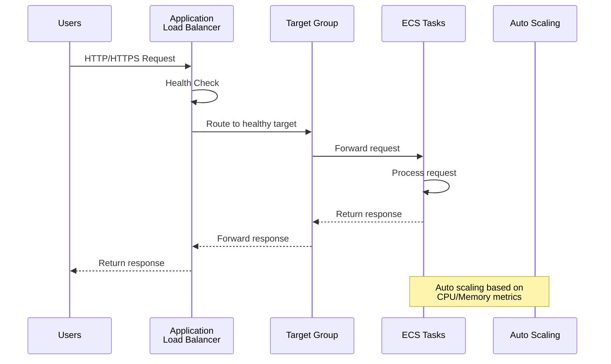
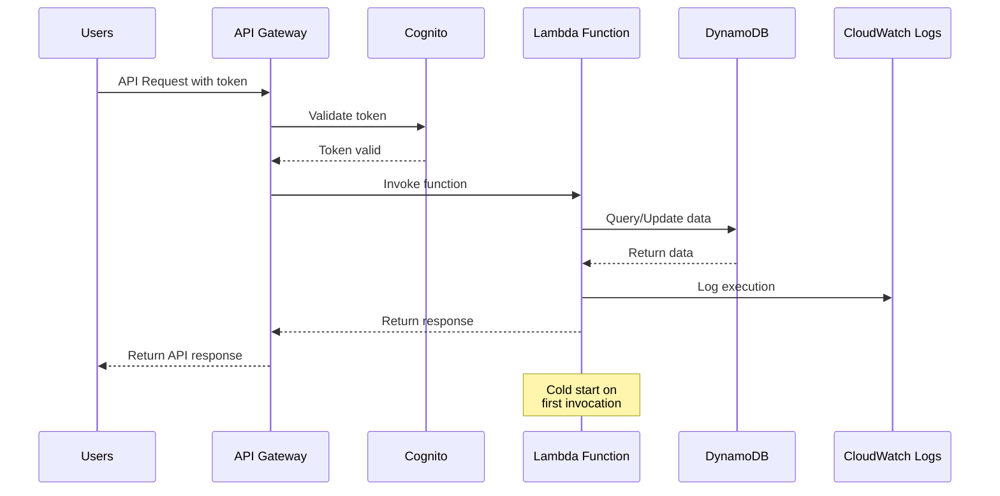
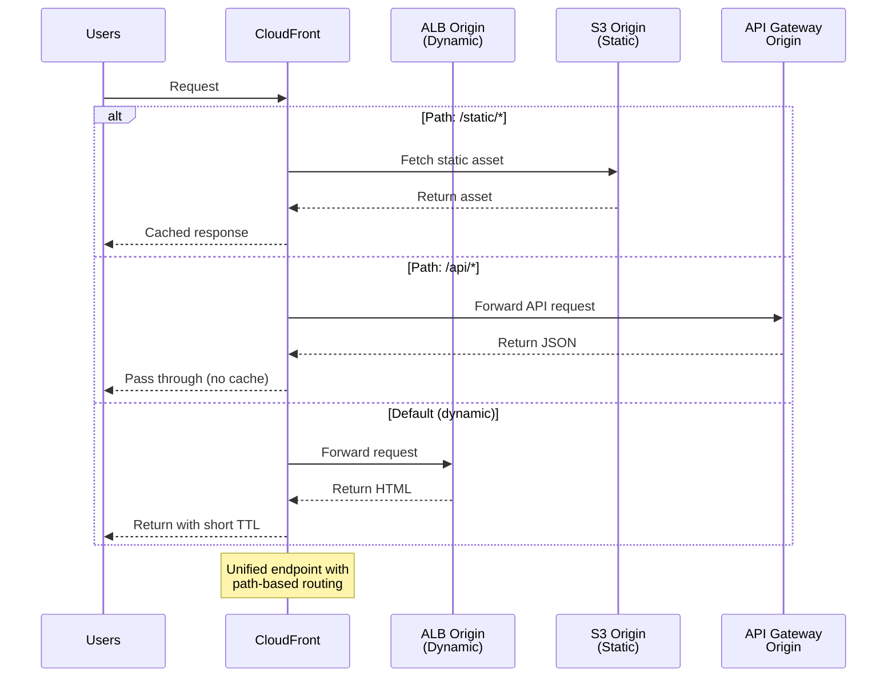
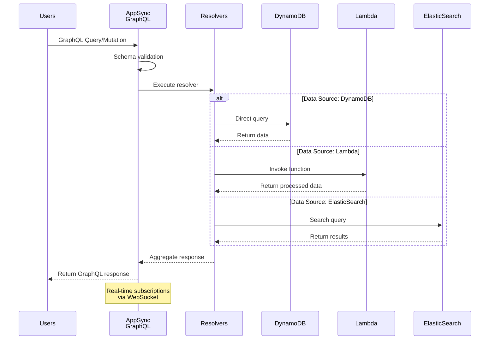
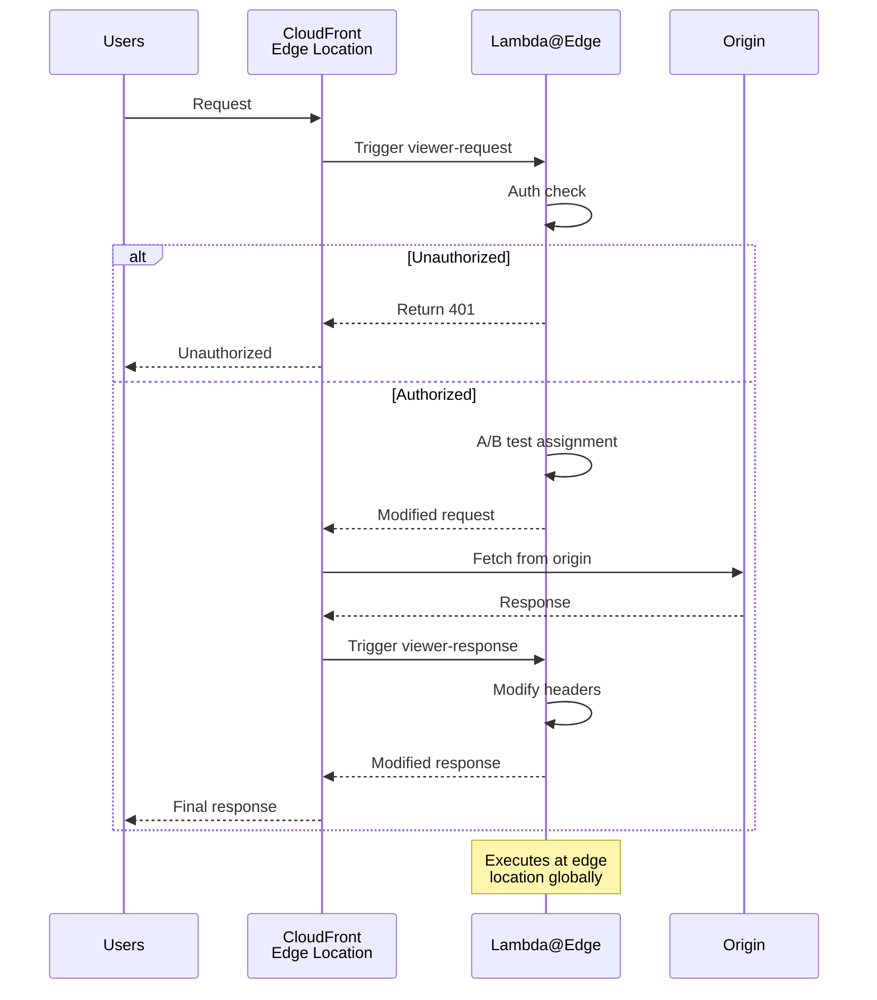

# AWS動的アセット配信パターン

## What's this file?
> [!NOTE]
> **What**
> 
> AWS動的アセット配信パターンとは何かについて記載しています。

## Conclusion (忙しいとき向け)
> [!IMPORTANT]
> **What** : AWS動的アセット配信パターンとは何か
> 
> **Answer** : リクエストごとに生成されるコンテンツ（APIレスポンス、ユーザー固有コンテンツ、SSRページなど）を効率的に配信するためのAWSアーキテクチャパターン。ALB+EC2/ECS、API Gateway+Lambda、CloudFront+複数Origin、AppSync+DynamoDB、Lambda@Edgeの5つの主要パターンがあり、要件に応じて選択する。

## 目次

<details>
<summary>目次を開く</summary>

- [動的アセットとは](#動的アセットとは)
- [ALB + EC2/ECS パターン (最も一般的)](#1-alb--ec2ecs-パターン-最も一般的)
- [API Gateway + Lambda パターン (サーバーレス)](#2-api-gateway--lambda-パターン-サーバーレス)
- [CloudFront + ALB/API Gateway パターン (ハイブリッド)](#3-cloudfront--albapi-gateway-パターン-ハイブリッド)
- [AppSync + DynamoDB パターン (GraphQL)](#4-appsync--dynamodb-パターン-graphql)
- [CloudFront + Lambda@Edge パターン](#5-cloudfront--lambdaedge-パターン)
- [パターン選択ガイド](#パターン選択ガイド)
- [ベストプラクティス](#ベストプラクティス)

</details>

## 動的アセットとは
動的アセットは、リクエストごとに生成される以下のようなコンテンツです：
- APIレスポンス（JSON/XML）
- ユーザー固有のコンテンツ
- リアルタイムデータ
- 認証が必要なコンテンツ
- サーバーサイドレンダリング（SSR）ページ

## 1. ALB + EC2/ECS パターン (最も一般的)

### アーキテクチャ



### 特徴
- **高可用性**: マルチAZ配置によるフォルトトレランス
- **自動スケーリング**: CPU/メモリ使用率に基づく自動拡張
- **ヘルスチェック**: 不健全なインスタンスの自動除外
- **柔軟なルーティング**: パスベース、ホストベースルーティング

### CloudFormationテンプレート
```yaml
AWSTemplateFormatVersion: '2010-09-09'
Description: 'ALB + ECS for Dynamic Content'

Parameters:
  VpcId:
    Type: AWS::EC2::VPC::Id
  SubnetIds:
    Type: List<AWS::EC2::Subnet::Id>
  ContainerImage:
    Type: String
    Default: nginx:latest

Resources:
  # ALB
  ApplicationLoadBalancer:
    Type: AWS::ElasticLoadBalancingV2::LoadBalancer
    Properties:
      Type: application
      Scheme: internet-facing
      Subnets: !Ref SubnetIds
      SecurityGroups:
        - !Ref ALBSecurityGroup

  # ALB Security Group
  ALBSecurityGroup:
    Type: AWS::EC2::SecurityGroup
    Properties:
      GroupDescription: ALB Security Group
      VpcId: !Ref VpcId
      SecurityGroupIngress:
        - IpProtocol: tcp
          FromPort: 80
          ToPort: 80
          CidrIp: 0.0.0.0/0
        - IpProtocol: tcp
          FromPort: 443
          ToPort: 443
          CidrIp: 0.0.0.0/0

  # Target Group
  TargetGroup:
    Type: AWS::ElasticLoadBalancingV2::TargetGroup
    Properties:
      Port: 80
      Protocol: HTTP
      VpcId: !Ref VpcId
      TargetType: ip
      HealthCheckPath: /health
      HealthCheckIntervalSeconds: 30
      HealthCheckTimeoutSeconds: 5
      HealthyThresholdCount: 2
      UnhealthyThresholdCount: 3

  # ALB Listener
  Listener:
    Type: AWS::ElasticLoadBalancingV2::Listener
    Properties:
      LoadBalancerArn: !Ref ApplicationLoadBalancer
      Port: 80
      Protocol: HTTP
      DefaultActions:
        - Type: forward
          TargetGroupArn: !Ref TargetGroup

  # ECS Cluster
  ECSCluster:
    Type: AWS::ECS::Cluster
    Properties:
      ClusterName: !Sub '${AWS::StackName}-cluster'
      CapacityProviders:
        - FARGATE
        - FARGATE_SPOT

  # Task Definition
  TaskDefinition:
    Type: AWS::ECS::TaskDefinition
    Properties:
      Family: !Sub '${AWS::StackName}-task'
      NetworkMode: awsvpc
      RequiresCompatibilities:
        - FARGATE
      Cpu: '256'
      Memory: '512'
      ContainerDefinitions:
        - Name: app
          Image: !Ref ContainerImage
          PortMappings:
            - ContainerPort: 80
          LogConfiguration:
            LogDriver: awslogs
            Options:
              awslogs-group: !Ref LogGroup
              awslogs-region: !Ref AWS::Region
              awslogs-stream-prefix: ecs

  # CloudWatch Log Group
  LogGroup:
    Type: AWS::Logs::LogGroup
    Properties:
      RetentionInDays: 7

  # ECS Service
  ECSService:
    Type: AWS::ECS::Service
    DependsOn: Listener
    Properties:
      Cluster: !Ref ECSCluster
      ServiceName: !Sub '${AWS::StackName}-service'
      TaskDefinition: !Ref TaskDefinition
      DesiredCount: 2
      LaunchType: FARGATE
      NetworkConfiguration:
        AwsvpcConfiguration:
          Subnets: !Ref SubnetIds
          SecurityGroups:
            - !Ref ContainerSecurityGroup
      LoadBalancers:
        - ContainerName: app
          ContainerPort: 80
          TargetGroupArn: !Ref TargetGroup

  # Container Security Group
  ContainerSecurityGroup:
    Type: AWS::EC2::SecurityGroup
    Properties:
      GroupDescription: Container Security Group
      VpcId: !Ref VpcId
      SecurityGroupIngress:
        - IpProtocol: tcp
          FromPort: 80
          ToPort: 80
          SourceSecurityGroupId: !Ref ALBSecurityGroup

  # Auto Scaling
  ServiceScalingTarget:
    Type: AWS::ApplicationAutoScaling::ScalableTarget
    Properties:
      MaxCapacity: 10
      MinCapacity: 2
      ResourceId: !Sub 'service/${ECSCluster}/${ECSService.Name}'
      RoleARN: !Sub 'arn:aws:iam::${AWS::AccountId}:role/aws-service-role/ecs.application-autoscaling.amazonaws.com/AWSServiceRoleForApplicationAutoScaling_ECSService'
      ScalableDimension: ecs:service:DesiredCount
      ServiceNamespace: ecs

  ServiceScalingPolicy:
    Type: AWS::ApplicationAutoScaling::ScalingPolicy
    Properties:
      PolicyName: ECSServiceScalingPolicy
      PolicyType: TargetTrackingScaling
      ScalingTargetId: !Ref ServiceScalingTarget
      TargetTrackingScalingPolicyConfiguration:
        PredefinedMetricSpecification:
          PredefinedMetricType: ECSServiceAverageCPUUtilization
        TargetValue: 70

Outputs:
  ALBEndpoint:
    Description: ALB DNS Name
    Value: !GetAtt ApplicationLoadBalancer.DNSName
```

### Terraformテンプレート
```hcl
# ALB + ECS for Dynamic Content

variable "vpc_id" {
  type = string
}

variable "subnet_ids" {
  type = list(string)
}

variable "container_image" {
  type    = string
  default = "nginx:latest"
}

# ALB
resource "aws_lb" "main" {
  name               = "${var.project_name}-alb"
  internal           = false
  load_balancer_type = "application"
  security_groups    = [aws_security_group.alb.id]
  subnets            = var.subnet_ids

  enable_deletion_protection = false
  enable_http2              = true
  enable_cross_zone_load_balancing = true
}

# ALB Security Group
resource "aws_security_group" "alb" {
  name_prefix = "${var.project_name}-alb-"
  vpc_id      = var.vpc_id

  ingress {
    from_port   = 80
    to_port     = 80
    protocol    = "tcp"
    cidr_blocks = ["0.0.0.0/0"]
  }

  ingress {
    from_port   = 443
    to_port     = 443
    protocol    = "tcp"
    cidr_blocks = ["0.0.0.0/0"]
  }

  egress {
    from_port   = 0
    to_port     = 0
    protocol    = "-1"
    cidr_blocks = ["0.0.0.0/0"]
  }
}

# Target Group
resource "aws_lb_target_group" "main" {
  name                 = "${var.project_name}-tg"
  port                 = 80
  protocol             = "HTTP"
  vpc_id               = var.vpc_id
  target_type          = "ip"
  deregistration_delay = 30

  health_check {
    enabled             = true
    healthy_threshold   = 2
    unhealthy_threshold = 3
    timeout             = 5
    interval            = 30
    path                = "/health"
    matcher             = "200"
  }
}

# ALB Listener
resource "aws_lb_listener" "main" {
  load_balancer_arn = aws_lb.main.arn
  port              = "80"
  protocol          = "HTTP"

  default_action {
    type             = "forward"
    target_group_arn = aws_lb_target_group.main.arn
  }
}

# ECS Cluster
resource "aws_ecs_cluster" "main" {
  name = "${var.project_name}-cluster"

  setting {
    name  = "containerInsights"
    value = "enabled"
  }
}

resource "aws_ecs_cluster_capacity_providers" "main" {
  cluster_name = aws_ecs_cluster.main.name

  capacity_providers = ["FARGATE", "FARGATE_SPOT"]

  default_capacity_provider_strategy {
    base              = 1
    weight            = 100
    capacity_provider = "FARGATE"
  }
}

# Task Definition
resource "aws_ecs_task_definition" "main" {
  family                   = "${var.project_name}-task"
  network_mode             = "awsvpc"
  requires_compatibilities = ["FARGATE"]
  cpu                      = "256"
  memory                   = "512"
  execution_role_arn       = aws_iam_role.ecs_execution.arn
  task_role_arn           = aws_iam_role.ecs_task.arn

  container_definitions = jsonencode([
    {
      name  = "app"
      image = var.container_image
      portMappings = [
        {
          containerPort = 80
        }
      ]
      logConfiguration = {
        logDriver = "awslogs"
        options = {
          awslogs-group         = aws_cloudwatch_log_group.ecs.name
          awslogs-region        = data.aws_region.current.name
          awslogs-stream-prefix = "ecs"
        }
      }
    }
  ])
}

# ECS Service
resource "aws_ecs_service" "main" {
  name            = "${var.project_name}-service"
  cluster         = aws_ecs_cluster.main.id
  task_definition = aws_ecs_task_definition.main.arn
  desired_count   = 2
  launch_type     = "FARGATE"

  network_configuration {
    subnets          = var.subnet_ids
    security_groups  = [aws_security_group.ecs_tasks.id]
    assign_public_ip = true
  }

  load_balancer {
    target_group_arn = aws_lb_target_group.main.arn
    container_name   = "app"
    container_port   = 80
  }

  depends_on = [aws_lb_listener.main]
}

# Auto Scaling
resource "aws_appautoscaling_target" "ecs_service" {
  max_capacity       = 10
  min_capacity       = 2
  resource_id        = "service/${aws_ecs_cluster.main.name}/${aws_ecs_service.main.name}"
  scalable_dimension = "ecs:service:DesiredCount"
  service_namespace  = "ecs"
}

resource "aws_appautoscaling_policy" "ecs_cpu" {
  name               = "${var.project_name}-cpu-scaling"
  policy_type        = "TargetTrackingScaling"
  resource_id        = aws_appautoscaling_target.ecs_service.resource_id
  scalable_dimension = aws_appautoscaling_target.ecs_service.scalable_dimension
  service_namespace  = aws_appautoscaling_target.ecs_service.service_namespace

  target_tracking_scaling_policy_configuration {
    predefined_metric_specification {
      predefined_metric_type = "ECSServiceAverageCPUUtilization"
    }
    target_value = 70
  }
}

# CloudWatch Log Group
resource "aws_cloudwatch_log_group" "ecs" {
  name              = "/ecs/${var.project_name}"
  retention_in_days = 7
}

# IAM Roles
resource "aws_iam_role" "ecs_execution" {
  name = "${var.project_name}-ecs-execution"

  assume_role_policy = jsonencode({
    Version = "2012-10-17"
    Statement = [
      {
        Action = "sts:AssumeRole"
        Effect = "Allow"
        Principal = {
          Service = "ecs-tasks.amazonaws.com"
        }
      }
    ]
  })
}

resource "aws_iam_role_policy_attachment" "ecs_execution" {
  role       = aws_iam_role.ecs_execution.name
  policy_arn = "arn:aws:iam::aws:policy/service-role/AmazonECSTaskExecutionRolePolicy"
}

resource "aws_iam_role" "ecs_task" {
  name = "${var.project_name}-ecs-task"

  assume_role_policy = jsonencode({
    Version = "2012-10-17"
    Statement = [
      {
        Action = "sts:AssumeRole"
        Effect = "Allow"
        Principal = {
          Service = "ecs-tasks.amazonaws.com"
        }
      }
    ]
  })
}

# Security Group for ECS Tasks
resource "aws_security_group" "ecs_tasks" {
  name_prefix = "${var.project_name}-ecs-tasks-"
  vpc_id      = var.vpc_id

  ingress {
    from_port       = 80
    to_port         = 80
    protocol        = "tcp"
    security_groups = [aws_security_group.alb.id]
  }

  egress {
    from_port   = 0
    to_port     = 0
    protocol    = "-1"
    cidr_blocks = ["0.0.0.0/0"]
  }
}

data "aws_region" "current" {}

output "alb_dns_name" {
  value = aws_lb.main.dns_name
}
```

## 2. API Gateway + Lambda パターン (サーバーレス)

### アーキテクチャ



### 特徴
- **完全サーバーレス**: インフラ管理不要
- **自動スケーリング**: リクエスト数に応じた自動拡張
- **コスト効率**: 使用分のみの課金
- **低レイテンシ**: コールドスタート最適化

### CloudFormationテンプレート
```yaml
AWSTemplateFormatVersion: '2010-09-09'
Transform: AWS::Serverless-2016-10-31
Description: 'API Gateway + Lambda Serverless Pattern'

Globals:
  Function:
    Timeout: 30
    Runtime: nodejs18.x
    Environment:
      Variables:
        TABLE_NAME: !Ref DynamoDBTable

Resources:
  # API Gateway
  ApiGateway:
    Type: AWS::Serverless::Api
    Properties:
      StageName: prod
      Cors:
        AllowMethods: "'*'"
        AllowHeaders: "'*'"
        AllowOrigin: "'*'"
      Auth:
        DefaultAuthorizer: CognitoAuthorizer
        Authorizers:
          CognitoAuthorizer:
            UserPoolArn: !GetAtt UserPool.Arn

  # Lambda Functions
  GetItemFunction:
    Type: AWS::Serverless::Function
    Properties:
      CodeUri: ./src
      Handler: handlers/getItem.handler
      Events:
        GetItem:
          Type: Api
          Properties:
            RestApiId: !Ref ApiGateway
            Path: /items/{id}
            Method: GET
      Policies:
        - DynamoDBReadPolicy:
            TableName: !Ref DynamoDBTable

  CreateItemFunction:
    Type: AWS::Serverless::Function
    Properties:
      CodeUri: ./src
      Handler: handlers/createItem.handler
      Events:
        CreateItem:
          Type: Api
          Properties:
            RestApiId: !Ref ApiGateway
            Path: /items
            Method: POST
      Policies:
        - DynamoDBWritePolicy:
            TableName: !Ref DynamoDBTable

  UpdateItemFunction:
    Type: AWS::Serverless::Function
    Properties:
      CodeUri: ./src
      Handler: handlers/updateItem.handler
      Events:
        UpdateItem:
          Type: Api
          Properties:
            RestApiId: !Ref ApiGateway
            Path: /items/{id}
            Method: PUT
      Policies:
        - DynamoDBCrudPolicy:
            TableName: !Ref DynamoDBTable

  DeleteItemFunction:
    Type: AWS::Serverless::Function
    Properties:
      CodeUri: ./src
      Handler: handlers/deleteItem.handler
      Events:
        DeleteItem:
          Type: Api
          Properties:
            RestApiId: !Ref ApiGateway
            Path: /items/{id}
            Method: DELETE
      Policies:
        - DynamoDBCrudPolicy:
            TableName: !Ref DynamoDBTable

  # DynamoDB Table
  DynamoDBTable:
    Type: AWS::DynamoDB::Table
    Properties:
      BillingMode: PAY_PER_REQUEST
      AttributeDefinitions:
        - AttributeName: id
          AttributeType: S
        - AttributeName: userId
          AttributeType: S
      KeySchema:
        - AttributeName: id
          KeyType: HASH
      GlobalSecondaryIndexes:
        - IndexName: UserIdIndex
          KeySchema:
            - AttributeName: userId
              KeyType: HASH
          Projection:
            ProjectionType: ALL

  # Cognito User Pool
  UserPool:
    Type: AWS::Cognito::UserPool
    Properties:
      UserPoolName: !Sub '${AWS::StackName}-users'
      Schema:
        - Name: email
          AttributeDataType: String
          Required: true
          Mutable: false

  UserPoolClient:
    Type: AWS::Cognito::UserPoolClient
    Properties:
      UserPoolId: !Ref UserPool
      GenerateSecret: false
      ExplicitAuthFlows:
        - ALLOW_USER_PASSWORD_AUTH
        - ALLOW_REFRESH_TOKEN_AUTH

Outputs:
  ApiUrl:
    Description: API Gateway endpoint URL
    Value: !Sub 'https://${ApiGateway}.execute-api.${AWS::Region}.amazonaws.com/prod'
  UserPoolId:
    Description: Cognito User Pool ID
    Value: !Ref UserPool
  UserPoolClientId:
    Description: Cognito User Pool Client ID
    Value: !Ref UserPoolClient
```

### Terraformテンプレート
```hcl
# API Gateway + Lambda Serverless Pattern

# API Gateway
resource "aws_api_gateway_rest_api" "main" {
  name        = "${var.project_name}-api"
  description = "Serverless API"

  endpoint_configuration {
    types = ["REGIONAL"]
  }
}

resource "aws_api_gateway_resource" "items" {
  rest_api_id = aws_api_gateway_rest_api.main.id
  parent_id   = aws_api_gateway_rest_api.main.root_resource_id
  path_part   = "items"
}

resource "aws_api_gateway_resource" "item" {
  rest_api_id = aws_api_gateway_rest_api.main.id
  parent_id   = aws_api_gateway_resource.items.id
  path_part   = "{id}"
}

# Lambda Functions
resource "aws_lambda_function" "get_item" {
  filename         = "lambda_deployment.zip"
  function_name    = "${var.project_name}-get-item"
  role            = aws_iam_role.lambda_exec.arn
  handler         = "handlers/getItem.handler"
  source_code_hash = filebase64sha256("lambda_deployment.zip")
  runtime         = "nodejs18.x"
  timeout         = 30

  environment {
    variables = {
      TABLE_NAME = aws_dynamodb_table.main.name
    }
  }
}

resource "aws_lambda_function" "create_item" {
  filename         = "lambda_deployment.zip"
  function_name    = "${var.project_name}-create-item"
  role            = aws_iam_role.lambda_exec.arn
  handler         = "handlers/createItem.handler"
  source_code_hash = filebase64sha256("lambda_deployment.zip")
  runtime         = "nodejs18.x"
  timeout         = 30

  environment {
    variables = {
      TABLE_NAME = aws_dynamodb_table.main.name
    }
  }
}

# API Gateway Methods
resource "aws_api_gateway_method" "get_item" {
  rest_api_id   = aws_api_gateway_rest_api.main.id
  resource_id   = aws_api_gateway_resource.item.id
  http_method   = "GET"
  authorization = "COGNITO_USER_POOLS"
  authorizer_id = aws_api_gateway_authorizer.main.id
}

resource "aws_api_gateway_method" "create_item" {
  rest_api_id   = aws_api_gateway_rest_api.main.id
  resource_id   = aws_api_gateway_resource.items.id
  http_method   = "POST"
  authorization = "COGNITO_USER_POOLS"
  authorizer_id = aws_api_gateway_authorizer.main.id
}

# Lambda Integrations
resource "aws_api_gateway_integration" "get_item" {
  rest_api_id = aws_api_gateway_rest_api.main.id
  resource_id = aws_api_gateway_resource.item.id
  http_method = aws_api_gateway_method.get_item.http_method

  integration_http_method = "POST"
  type                    = "AWS_PROXY"
  uri                     = aws_lambda_function.get_item.invoke_arn
}

resource "aws_api_gateway_integration" "create_item" {
  rest_api_id = aws_api_gateway_rest_api.main.id
  resource_id = aws_api_gateway_resource.items.id
  http_method = aws_api_gateway_method.create_item.http_method

  integration_http_method = "POST"
  type                    = "AWS_PROXY"
  uri                     = aws_lambda_function.create_item.invoke_arn
}

# Lambda Permissions
resource "aws_lambda_permission" "api_gateway_get" {
  statement_id  = "AllowAPIGatewayInvoke"
  action        = "lambda:InvokeFunction"
  function_name = aws_lambda_function.get_item.function_name
  principal     = "apigateway.amazonaws.com"
  source_arn    = "${aws_api_gateway_rest_api.main.execution_arn}/*/*"
}

resource "aws_lambda_permission" "api_gateway_create" {
  statement_id  = "AllowAPIGatewayInvoke"
  action        = "lambda:InvokeFunction"
  function_name = aws_lambda_function.create_item.function_name
  principal     = "apigateway.amazonaws.com"
  source_arn    = "${aws_api_gateway_rest_api.main.execution_arn}/*/*"
}

# API Gateway Deployment
resource "aws_api_gateway_deployment" "main" {
  depends_on = [
    aws_api_gateway_integration.get_item,
    aws_api_gateway_integration.create_item
  ]

  rest_api_id = aws_api_gateway_rest_api.main.id
  stage_name  = "prod"
}

# DynamoDB Table
resource "aws_dynamodb_table" "main" {
  name         = "${var.project_name}-items"
  billing_mode = "PAY_PER_REQUEST"
  hash_key     = "id"

  attribute {
    name = "id"
    type = "S"
  }

  attribute {
    name = "userId"
    type = "S"
  }

  global_secondary_index {
    name            = "UserIdIndex"
    hash_key        = "userId"
    projection_type = "ALL"
  }
}

# Cognito User Pool
resource "aws_cognito_user_pool" "main" {
  name = "${var.project_name}-users"

  schema {
    name                = "email"
    attribute_data_type = "String"
    required            = true
    mutable             = false
  }
}

resource "aws_cognito_user_pool_client" "main" {
  name         = "${var.project_name}-client"
  user_pool_id = aws_cognito_user_pool.main.id

  explicit_auth_flows = [
    "ALLOW_USER_PASSWORD_AUTH",
    "ALLOW_REFRESH_TOKEN_AUTH"
  ]
}

# API Gateway Authorizer
resource "aws_api_gateway_authorizer" "main" {
  name            = "${var.project_name}-authorizer"
  rest_api_id     = aws_api_gateway_rest_api.main.id
  type            = "COGNITO_USER_POOLS"
  provider_arns   = [aws_cognito_user_pool.main.arn]
  identity_source = "method.request.header.Authorization"
}

# IAM Role for Lambda
resource "aws_iam_role" "lambda_exec" {
  name = "${var.project_name}-lambda-exec"

  assume_role_policy = jsonencode({
    Version = "2012-10-17"
    Statement = [
      {
        Action = "sts:AssumeRole"
        Effect = "Allow"
        Principal = {
          Service = "lambda.amazonaws.com"
        }
      }
    ]
  })
}

resource "aws_iam_role_policy_attachment" "lambda_logs" {
  role       = aws_iam_role.lambda_exec.name
  policy_arn = "arn:aws:iam::aws:policy/service-role/AWSLambdaBasicExecutionRole"
}

resource "aws_iam_policy" "lambda_dynamodb" {
  name = "${var.project_name}-lambda-dynamodb"

  policy = jsonencode({
    Version = "2012-10-17"
    Statement = [
      {
        Effect = "Allow"
        Action = [
          "dynamodb:GetItem",
          "dynamodb:PutItem",
          "dynamodb:UpdateItem",
          "dynamodb:DeleteItem",
          "dynamodb:Query",
          "dynamodb:Scan"
        ]
        Resource = [
          aws_dynamodb_table.main.arn,
          "${aws_dynamodb_table.main.arn}/index/*"
        ]
      }
    ]
  })
}

resource "aws_iam_role_policy_attachment" "lambda_dynamodb" {
  role       = aws_iam_role.lambda_exec.name
  policy_arn = aws_iam_policy.lambda_dynamodb.arn
}

output "api_url" {
  value = "${aws_api_gateway_deployment.main.invoke_url}"
}

output "user_pool_id" {
  value = aws_cognito_user_pool.main.id
}

output "user_pool_client_id" {
  value = aws_cognito_user_pool_client.main.id
}
```

## 3. CloudFront + ALB/API Gateway パターン (ハイブリッド)

### アーキテクチャ



### 特徴
- **統一エンドポイント**: 単一のドメインで全コンテンツ配信
- **柔軟なキャッシュ制御**: パスごとの細かい制御
- **グローバル配信**: エッジロケーションからの配信
- **セキュリティ強化**: WAF統合、DDoS保護

### CloudFormationテンプレート（抜粋）
```yaml
AWSTemplateFormatVersion: '2010-09-09'
Description: 'CloudFront + Multiple Origins Pattern'

Resources:
  CloudFrontDistribution:
    Type: AWS::CloudFront::Distribution
    Properties:
      DistributionConfig:
        Origins:
          # 動的コンテンツ用 ALB Origin
          - Id: ALBOrigin
            DomainName: !GetAtt ApplicationLoadBalancer.DNSName
            CustomOriginConfig:
              HTTPPort: 80
              HTTPSPort: 443
              OriginProtocolPolicy: https-only
              OriginSSLProtocols:
                - TLSv1.2
          
          # 静的コンテンツ用 S3 Origin
          - Id: S3Origin
            DomainName: !GetAtt AssetsBucket.RegionalDomainName
            S3OriginConfig:
              OriginAccessIdentity: ''
            OriginAccessControlId: !GetAtt OriginAccessControl.Id
          
          # API用 API Gateway Origin
          - Id: APIOrigin
            DomainName: !Sub '${ApiGateway}.execute-api.${AWS::Region}.amazonaws.com'
            OriginPath: '/prod'
            CustomOriginConfig:
              HTTPSPort: 443
              OriginProtocolPolicy: https-only

        Enabled: true
        
        # デフォルト動作（動的コンテンツ）
        DefaultCacheBehavior:
          TargetOriginId: ALBOrigin
          ViewerProtocolPolicy: redirect-to-https
          AllowedMethods:
            - GET
            - HEAD
            - OPTIONS
            - PUT
            - POST
            - PATCH
            - DELETE
          CachedMethods:
            - GET
            - HEAD
          Compress: true
          ForwardedValues:
            QueryString: true
            Headers:
              - Authorization
              - Host
              - CloudFront-Forwarded-Proto
            Cookies:
              Forward: all
          MinTTL: 0
          DefaultTTL: 0
          MaxTTL: 0

        # 静的アセット用の動作
        CacheBehaviors:
          - PathPattern: /static/*
            TargetOriginId: S3Origin
            ViewerProtocolPolicy: redirect-to-https
            AllowedMethods:
              - GET
              - HEAD
            Compress: true
            CachePolicyId: 658327ea-f89d-4fab-a63d-7e88639e58f6
          
          # API用の動作
          - PathPattern: /api/*
            TargetOriginId: APIOrigin
            ViewerProtocolPolicy: https-only
            AllowedMethods:
              - GET
              - HEAD
              - OPTIONS
              - PUT
              - POST
              - PATCH
              - DELETE
            ForwardedValues:
              QueryString: true
              Headers:
                - Authorization
                - Content-Type
                - X-Api-Key
              Cookies:
                Forward: none
            MinTTL: 0
            DefaultTTL: 0
            MaxTTL: 0

        PriceClass: PriceClass_100
        
        ViewerCertificate:
          CloudFrontDefaultCertificate: true

        WebACLId: !GetAtt WAFWebACL.Arn
```

## 4. AppSync + DynamoDB パターン (GraphQL)

### アーキテクチャ



### 特徴
- **GraphQL API**: 柔軟なクエリ言語
- **リアルタイム更新**: WebSocketサブスクリプション
- **オフライン対応**: Amplify DataStoreとの統合
- **認証統合**: Cognito、API Key、IAM対応

### CloudFormationテンプレート
```yaml
AWSTemplateFormatVersion: '2010-09-09'
Description: 'AppSync GraphQL API Pattern'

Resources:
  GraphQLApi:
    Type: AWS::AppSync::GraphQLApi
    Properties:
      Name: !Sub '${AWS::StackName}-api'
      AuthenticationType: AMAZON_COGNITO_USER_POOLS
      UserPoolConfig:
        UserPoolId: !Ref UserPool
        AwsRegion: !Ref AWS::Region
        DefaultAction: ALLOW
      AdditionalAuthenticationProviders:
        - AuthenticationType: API_KEY
      LogConfig:
        CloudWatchLogsRoleArn: !GetAtt AppSyncLogsRole.Arn
        FieldLogLevel: ERROR

  GraphQLSchema:
    Type: AWS::AppSync::GraphQLSchema
    Properties:
      ApiId: !GetAtt GraphQLApi.ApiId
      Definition: |
        type Item {
          id: ID!
          title: String!
          description: String
          status: ItemStatus!
          createdAt: AWSDateTime!
          updatedAt: AWSDateTime!
        }
        
        enum ItemStatus {
          ACTIVE
          INACTIVE
          DELETED
        }
        
        type Query {
          getItem(id: ID!): Item
          listItems(limit: Int, nextToken: String): ItemConnection!
        }
        
        type Mutation {
          createItem(input: CreateItemInput!): Item!
          updateItem(input: UpdateItemInput!): Item!
          deleteItem(id: ID!): Item!
        }
        
        type Subscription {
          onCreateItem: Item
            @aws_subscribe(mutations: ["createItem"])
          onUpdateItem(id: ID): Item
            @aws_subscribe(mutations: ["updateItem"])
        }
        
        input CreateItemInput {
          title: String!
          description: String
        }
        
        input UpdateItemInput {
          id: ID!
          title: String
          description: String
          status: ItemStatus
        }
        
        type ItemConnection {
          items: [Item!]!
          nextToken: String
        }

  # DynamoDB DataSource
  DynamoDBDataSource:
    Type: AWS::AppSync::DataSource
    Properties:
      ApiId: !GetAtt GraphQLApi.ApiId
      Name: DynamoDBDataSource
      Type: AMAZON_DYNAMODB
      ServiceRoleArn: !GetAtt AppSyncDynamoDBRole.Arn
      DynamoDBConfig:
        TableName: !Ref ItemsTable
        AwsRegion: !Ref AWS::Region

  # Resolvers
  GetItemResolver:
    Type: AWS::AppSync::Resolver
    Properties:
      ApiId: !GetAtt GraphQLApi.ApiId
      DataSourceName: !GetAtt DynamoDBDataSource.Name
      TypeName: Query
      FieldName: getItem
      RequestMappingTemplate: |
        {
          "version": "2017-02-28",
          "operation": "GetItem",
          "key": {
            "id": $util.dynamodb.toDynamoDBJson($ctx.args.id)
          }
        }
      ResponseMappingTemplate: |
        $util.toJson($ctx.result)

  ListItemsResolver:
    Type: AWS::AppSync::Resolver
    Properties:
      ApiId: !GetAtt GraphQLApi.ApiId
      DataSourceName: !GetAtt DynamoDBDataSource.Name
      TypeName: Query
      FieldName: listItems
      RequestMappingTemplate: |
        {
          "version": "2017-02-28",
          "operation": "Scan",
          "limit": $util.defaultIfNull($ctx.args.limit, 20),
          "nextToken": $util.toJson($ctx.args.nextToken)
        }
      ResponseMappingTemplate: |
        {
          "items": $util.toJson($ctx.result.items),
          "nextToken": $util.toJson($ctx.result.nextToken)
        }

  CreateItemResolver:
    Type: AWS::AppSync::Resolver
    Properties:
      ApiId: !GetAtt GraphQLApi.ApiId
      DataSourceName: !GetAtt DynamoDBDataSource.Name
      TypeName: Mutation
      FieldName: createItem
      RequestMappingTemplate: |
        {
          "version": "2017-02-28",
          "operation": "PutItem",
          "key": {
            "id": $util.dynamodb.toDynamoDBJson($util.autoId())
          },
          "attributeValues": {
            "title": $util.dynamodb.toDynamoDBJson($ctx.args.input.title),
            "description": $util.dynamodb.toDynamoDBJson($ctx.args.input.description),
            "status": $util.dynamodb.toDynamoDBJson("ACTIVE"),
            "createdAt": $util.dynamodb.toDynamoDBJson($util.time.nowISO8601()),
            "updatedAt": $util.dynamodb.toDynamoDBJson($util.time.nowISO8601())
          }
        }
      ResponseMappingTemplate: |
        $util.toJson($ctx.result)

  # DynamoDB Table
  ItemsTable:
    Type: AWS::DynamoDB::Table
    Properties:
      BillingMode: PAY_PER_REQUEST
      AttributeDefinitions:
        - AttributeName: id
          AttributeType: S
      KeySchema:
        - AttributeName: id
          KeyType: HASH
      StreamSpecification:
        StreamViewType: NEW_AND_OLD_IMAGES

  # IAM Roles
  AppSyncDynamoDBRole:
    Type: AWS::IAM::Role
    Properties:
      AssumeRolePolicyDocument:
        Version: '2012-10-17'
        Statement:
          - Effect: Allow
            Principal:
              Service: appsync.amazonaws.com
            Action: sts:AssumeRole
      Policies:
        - PolicyName: DynamoDBAccess
          PolicyDocument:
            Version: '2012-10-17'
            Statement:
              - Effect: Allow
                Action:
                  - dynamodb:GetItem
                  - dynamodb:PutItem
                  - dynamodb:UpdateItem
                  - dynamodb:DeleteItem
                  - dynamodb:Query
                  - dynamodb:Scan
                Resource:
                  - !GetAtt ItemsTable.Arn
                  - !Sub '${ItemsTable.Arn}/index/*'

  AppSyncLogsRole:
    Type: AWS::IAM::Role
    Properties:
      AssumeRolePolicyDocument:
        Version: '2012-10-17'
        Statement:
          - Effect: Allow
            Principal:
              Service: appsync.amazonaws.com
            Action: sts:AssumeRole
      ManagedPolicyArns:
        - arn:aws:iam::aws:policy/service-role/AWSAppSyncPushToCloudWatchLogs

Outputs:
  GraphQLApiUrl:
    Description: GraphQL API URL
    Value: !GetAtt GraphQLApi.GraphQLUrl
  GraphQLApiId:
    Description: GraphQL API ID
    Value: !GetAtt GraphQLApi.ApiId
```

## 5. CloudFront + Lambda@Edge パターン

### アーキテクチャ



### 特徴
- **エッジコンピューティング**: レイテンシー最小化
- **動的コンテンツ変換**: リアルタイムの画像リサイズなど
- **A/Bテスト**: エッジでのトラフィック振り分け
- **セキュリティ**: エッジでの認証・認可

### CloudFormationテンプレート（抜粋）
```yaml
# Lambda@Edge Function
EdgeFunction:
  Type: AWS::Lambda::Function
  Properties:
    FunctionName: !Sub '${AWS::StackName}-edge-function'
    Runtime: nodejs18.x
    Handler: index.handler
    Role: !GetAtt EdgeFunctionRole.Arn
    Code:
      ZipFile: |
        exports.handler = async (event) => {
          const request = event.Records[0].cf.request;
          const headers = request.headers;
          
          // 認証チェック
          if (!headers.authorization) {
            return {
              status: '401',
              statusDescription: 'Unauthorized',
              headers: {
                'www-authenticate': [{
                  key: 'WWW-Authenticate',
                  value: 'Basic'
                }]
              }
            };
          }
          
          // A/Bテスト
          const testGroup = Math.random() < 0.5 ? 'A' : 'B';
          request.headers['x-test-group'] = [{ key: 'X-Test-Group', value: testGroup }];
          
          return request;
        };

CloudFrontDistribution:
  Type: AWS::CloudFront::Distribution
  Properties:
    DistributionConfig:
      DefaultCacheBehavior:
        LambdaFunctionAssociations:
          - EventType: viewer-request
            LambdaFunctionARN: !Ref EdgeFunctionVersion
```

## パターン選択ガイド

| パターン | 適用シーン | メリット | デメリット |
|---------|-----------|----------|-----------|
| ALB + EC2/ECS | 従来型Webアプリ、マイクロサービス | 柔軟性高い、既存アプリ移行容易 | インフラ管理必要 |
| API Gateway + Lambda | REST/GraphQL API、イベント駆動 | サーバーレス、自動スケーリング | コールドスタート、実行時間制限 |
| CloudFront + 複数Origin | グローバル配信、混在コンテンツ | 統一エンドポイント、キャッシュ制御 | 設定複雑 |
| AppSync | モバイル/Webアプリ、リアルタイム | GraphQL、オフライン対応 | GraphQL学習曲線 |
| Lambda@Edge | エッジ処理、低レイテンシ要求 | グローバル実行、高速レスポンス | 制限多い、デバッグ困難 |

## ベストプラクティス

### 1. **パフォーマンス最適化**
- Connection poolingの実装
- キャッシュ戦略の最適化
- 非同期処理の活用
- データベース接続の最適化

### 2. **セキュリティ**
- WAFルールの実装
- API認証・認可の実装
- 暗号化（転送時・保存時）
- セキュリティグループの最小権限

### 3. **モニタリング**
- CloudWatch Metricsの設定
- X-Rayによるトレーシング
- カスタムメトリクスの実装
- アラートの設定

### 4. **コスト最適化**
- 適切なインスタンスサイズ選択
- オートスケーリングの調整
- Reserved Instances/Savings Plans
- 不要リソースの削除

### 5. **可用性**
- マルチAZ配置
- ヘルスチェックの実装
- Circuit Breakerパターン
- グレースフルシャットダウン

## 関連

- [AWS静的アセット配信パターン](./2025.08.02.11.20_what_static-assets-patterns_by_aws.md)
- [AWS API Gatewayとは](./2025.08.04.17.20_what_aws_api_gateway.md)
- [API Gatewayの必要性の判断方法](./2025.08.04.17.28_how_judge_necessity_of_api_gateway.md)
- [AWS ECSサービス設定](./2025.08.07.11.27_how_aws_ecs_service_settings_in_this_project.md)
- [AWS Application Load Balancer公式ドキュメント](https://docs.aws.amazon.com/elasticloadbalancing/latest/application/)
- [AWS Lambda公式ドキュメント](https://docs.aws.amazon.com/lambda/)