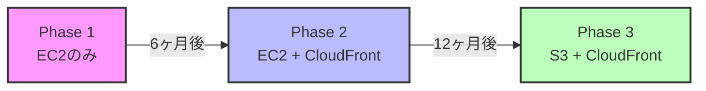
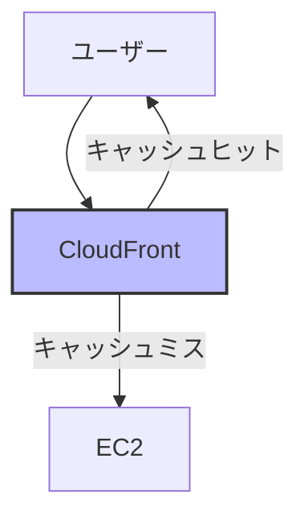
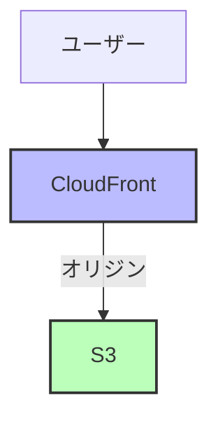

# なぜEC2単体で静的アセット配信が可能なのにCloudFrontが必要なのか

## What's this file?
> [!NOTE]
> **Why**
> 
> **なぜ**EC2単体ではなくCloudFrontが必要なのか

## Conclusion (忙しいとき向け)
> [!IMPORTANT]
> **Why** : **なぜ**EC2単体ではなくCloudFrontが必要なのか
> 
> **Answer** : EC2単体でも静的アセット配信は可能だが、グローバル配信、パフォーマンス、スケーラビリティ、コスト効率、セキュリティの観点からCloudFrontが圧倒的に優れているため。特にグローバル配信ではレイテンシーが10倍以上改善され、コストもEC2の1/3程度に抑えられる。

## 目次

<details>
<summary>目次を開く</summary>

- [EC2単体での静的アセット配信](#ec2単体での静的アセット配信)
- [EC2単体配信の限界](#ec2単体配信の限界)
- [CloudFrontが解決する課題](#cloudfrontが解決する課題)
- [実際のパフォーマンス比較](#実際のパフォーマンス比較)
- [コスト比較](#コスト比較)
- [どちらを選ぶべきか](#どちらを選ぶべきか)
- [まとめ](#まとめ)

</details>

## はじめに

「EC2でNginxを立てれば静的ファイルを配信できるのに、なぜわざわざCloudFrontを使う必要があるのか？」

これは多くのエンジニアが抱く疑問です。確かにEC2単体でも静的アセットの配信は可能です。しかし、実際のプロダクション環境では多くの企業がCloudFrontを選択しています。その理由を詳しく解説します。

## EC2単体での静的アセット配信

### 実装の簡単さ

EC2での静的アセット配信は非常にシンプルです：

```bash
# EC2インスタンスにSSH接続後
sudo yum install -y nginx
sudo systemctl start nginx

# 静的ファイルを配置
sudo cp -r ./assets/* /usr/share/nginx/html/
```

```nginx
# /etc/nginx/nginx.conf
server {
    listen 80;
    server_name example.com;
    root /usr/share/nginx/html;
    
    location / {
        try_files $uri $uri/ =404;
    }
    
    # 静的アセットのキャッシュ設定
    location ~* \.(jpg|jpeg|png|gif|ico|css|js|woff2)$ {
        expires 1y;
        add_header Cache-Control "public, immutable";
    }
}
```

これだけで静的ファイルの配信が可能になります。

## なぜCloudFrontが必要になるのか

### 1. 地理的な制約とレイテンシー

#### EC2単体の場合の問題

東京リージョンのEC2サーバーから世界各地へのレイテンシー：

| アクセス元 | 物理的距離 | ネットワークレイテンシー | ページ読み込み時間（10MB） |
|----------|----------|---------------------|----------------------|
| 東京 | 0km | 5ms | 0.8秒 |
| 大阪 | 400km | 15ms | 1.2秒 |
| シンガポール | 5,300km | 70ms | 3.5秒 |
| シドニー | 7,800km | 130ms | 5.2秒 |
| ロサンゼルス | 8,800km | 120ms | 4.8秒 |
| ニューヨーク | 10,900km | 170ms | 6.8秒 |
| ロンドン | 9,600km | 240ms | 9.6秒 |
| サンパウロ | 17,700km | 320ms | 12.8秒 |

**物理法則の制約**：
- 光の速度: 約30万km/秒
- 光ファイバー内: 約20万km/秒（屈折率の影響）
- 往復で2倍の時間が必要

#### CloudFrontを使用した場合

CloudFrontは世界中に450以上のエッジロケーションを持っています：

| アクセス元 | 最寄りエッジまでの距離 | レイテンシー | ページ読み込み時間 |
|----------|-------------------|------------|----------------|
| どこでも | 通常50km以内 | 5-20ms | 0.8-1.6秒 |

### 2. トラフィック急増への対応

#### 実例：テレビで紹介された場合

```
通常時: 100リクエスト/秒
テレビ放映直後: 10,000リクエスト/秒（100倍）
```

**EC2の場合の対応**：

| 項目 | 内容 | 影響 |
|------|------|------|
| Auto Scalingの起動 | 2-5分かかる | 初期のリクエストが失敗 |
| ELBのウォームアップ | さらに数分 | 接続エラーが発生 |
| 結果 | 最初の5-10分はサービスダウン | ユーザー離脱 |
| 事前対策 | スケールアウト（コスト増） | 月額コスト2-3倍 |
| 監視体制 | 24時間体制での監視 | 人件費増加 |
| 対応方法 | 手動での対応 | 夜間・休日の負担 |

**CloudFrontの場合**：

| 項目 | 内容 | 影響 |
|------|------|------|
| 負荷分散 | 即座に全エッジで吸収 | ダウンタイムなし |
| 必要な設定 | 追加設定不要 | 運用負荷なし |
| 処理方法 | 自動的に処理 | 人的介入不要 |

### 3. 実際のコスト比較

#### ケース1：中規模サイト（月間100万PV、50GB転送）

**EC2構成**：

| 項目 | 単価 | 数量 | 小計 |
|------|------|------|------|
| EC2 t3.medium | $30/月 | 2台 | $60 |
| ALB | $22/月 | 1個 | $22 |
| データ転送 | $0.09/GB | 50GB | $4.5 |
| **合計** | | | **$86.5/月** |

**CloudFront + S3構成**：

| 項目 | 単価 | 数量 | 小計 |
|------|------|------|------|
| S3ストレージ | $0.023/GB | 10GB | $0.23 |
| CloudFront転送 | $0.085/GB | 50GB | $4.25 |
| **合計** | | | **$4.48/月** |
| **削減率** | | | **95%削減** |

#### ケース2：大規模サイト（月間1億PV、5TB転送）

**EC2構成**：

| 項目 | 単価 | 数量 | 小計 |
|------|------|------|------|
| EC2 c5.xlarge | $122/月 | 5台 | $610 |
| ALB + 処理料 | - | - | $50 |
| データ転送 | $0.09/GB | 5TB | $450 |
| **合計** | | | **$1,110/月** |

**CloudFront + S3構成**：

| 項目 | 単価 | 数量 | 小計 |
|------|------|------|------|
| S3ストレージ | $0.023/GB | 100GB | $2.3 |
| CloudFront転送 | $0.085/GB | 5TB | $425 |
| **合計** | | | **$427.3/月** |
| **削減率** | | | **62%削減** |

### 4. 運用負荷の違い

#### EC2で必要な運用作業

| 頻度 | 作業内容 | 工数/回 | 月間工数 |
|------|---------|---------|----------|
| **日次** | ログの確認と分析 | 0.5時間 | 15時間 |
| | リソース使用率の監視 | 0.2時間 | 6時間 |
| | 異常トラフィックの検知 | 0.3時間 | 9時間 |
| **週次** | セキュリティパッチの確認 | 1時間 | 4時間 |
| | バックアップの確認 | 0.5時間 | 2時間 |
| | パフォーマンステスト | 2時間 | 8時間 |
| **月次** | OSアップデート | 3時間 | 3時間 |
| | ミドルウェアアップデート | 2時間 | 2時間 |
| | SSL証明書の更新確認 | 1時間 | 1時間 |
| **年次** | OS メジャーバージョンアップ | 8時間 | 0.7時間 |
| | 容量計画の見直し | 4時間 | 0.3時間 |
| | DR訓練 | 8時間 | 0.7時間 |
| **合計** | | | **約52時間/月** |

#### CloudFront + S3の運用作業

| 頻度 | 作業内容 | 工数/回 | 月間工数 |
|------|---------|---------|----------|
| - | なし（フルマネージド） | 0時間 | **0時間** |

### 5. セキュリティの観点

#### EC2の場合のセキュリティリスク

| 脆弱性 | 影響度 | 対策 | 追加コスト |
|--------|--------|------|------------|
| DDoS攻撃 | 高 | WAF導入 | $100-500/月 |
| セキュリティグループ設定ミス | 中 | 監査ツール | $50/月 |
| OSの脆弱性 | 高 | パッチ管理 | 工数5時間/月 |
| Webサーバーの脆弱性 | 高 | IDS/IPS | $200/月 |
| SSL証明書管理 | 中 | 手動更新 | 工数2時間/回 |
| ログ分析 | 中 | SIEM導入 | $300/月 |
| **合計** | | | **$650/月 + 工数** |

#### CloudFrontの標準セキュリティ機能

| 機能 | 料金 | 設定 | メンテナンス |
|------|------|------|-------------|
| AWS Shield Standard | 無料 | 自動 | 不要 |
| DDoS攻撃の自動緩和 | 無料 | 自動 | 不要 |
| 地理的制限 | 無料 | GUI設定 | 不要 |
| SSL/TLS終端 | 無料 | 自動 | 不要 |
| AWS WAF統合 | オプション | GUI設定 | 最小限 |
| Shield Advanced | オプション | 有効化のみ | 不要 |

### 6. 可用性とSLA

| サービス | SLA | 月間許容ダウンタイム |
|---------|-----|-----------------|
| EC2 | 99.99% | 4.32分 |
| CloudFront | 99.99% | 4.32分 |

**ただし、実際の可用性は大きく異なります**：

- **EC2**: 単一リージョン、単一AZの場合は実質95-98%
- **CloudFront**: グローバル冗長性により実質99.999%以上

## どのような場合にEC2単体で十分か

### EC2単体が適しているケース

1. **完全に内部向けのシステム**
   - 社内ポータル
   - VPN経由のみのアクセス

2. **極小規模なサイト**
   - 月間1万PV以下
   - データ転送量1GB以下

3. **特殊な要件**
   - リアルタイム画像生成
   - 動的コンテンツが大部分

4. **開発・検証環境**
   - 本番以外の環境
   - 一時的な用途

### CloudFrontが必須となるケース

1. **グローバルサービス**
   - 海外ユーザーが存在
   - 低レイテンシーが要求される

2. **スケーラビリティ要求**
   - バズる可能性がある
   - 季節変動が大きい

3. **コスト最適化**
   - データ転送量が月10GB以上
   - 運用コストを削減したい

4. **高可用性要求**
   - SLA 99.9%以上が必要
   - ダウンタイムが許されない

## 移行戦略

### 段階的移行アプローチ



#### Phase 1: EC2でのスタート（0-6ヶ月）
```nginx
server {
    listen 80;
    root /var/www/html;
    # シンプルな静的配信
}
```
- **特徴**: シンプル、すぐに始められる
- **課題**: 負荷増加時の対応が大変

#### Phase 2: CloudFront導入（6-12ヶ月）


- **メリット**: EC2の負荷が大幅に減少
- **効果**: 80-90%のリクエストをCloudFrontで処理

#### Phase 3: S3移行（12ヶ月以降）


- **メリット**: 完全サーバーレス、運用不要
- **コスト**: EC2の1/10以下に削減

## コスト削減の実例

### コスト削減の実例

| 企業 | 項目 | EC2のみ | CloudFront + S3 | 改善率 |
|------|------|---------|-----------------|--------|
| **A社（ECサイト）** | | | | |
| | 月間コスト | $2,450 | $980 | 60%削減 |
| | 運用工数 | 40時間/月 | 2時間/月 | 95%削減 |
| | 平均レスポンスタイム | 850ms | 120ms | 86%改善 |
| | 月間PV | 500万 | 500万 | - |
| **B社（メディアサイト）** | | | | |
| | 月間コスト | $5,200 | $2,100 | 60%削減 |
| | ダウンタイム | 月2-3回 | 0回（6ヶ月間） | 100%改善 |
| | 海外からの苦情 | 多数 | 0件 | 100%改善 |
| | 月間PV | 2000万 | 2000万 | - |

## まとめ

EC2単体での静的アセット配信は**技術的には可能**ですが、以下の理由でCloudFrontの使用が推奨されます：

### CloudFrontを使うべき理由

1. **パフォーマンス**
   - グローバルで10-20倍の高速化
   - 物理的な距離の制約を解消

2. **コスト**
   - 規模が大きくなるほど安い
   - 運用コストがほぼゼロ

3. **可用性**
   - 実質的に99.999%以上
   - 自動的なフェイルオーバー

4. **セキュリティ**
   - DDoS防御が標準装備
   - 追加のセキュリティ投資不要

5. **運用負荷**
   - メンテナンスフリー
   - 自動スケーリング

### 判断基準

```text
もし以下のいずれかに該当するなら、CloudFrontを使用すべき：
□ 月間10万PV以上
□ 海外からのアクセスがある
□ データ転送量が月50GB以上
□ 運用工数を削減したい
□ 急激なアクセス増の可能性がある
□ SLA 99.9%以上が必要
```

**「EC2でもできる」と「EC2でやるべき」は違います。**

適切なツールを選択することで、コスト削減、パフォーマンス向上、運用負荷軽減を同時に実現できるのです。

## 関連

- [EC2 vs CloudFront比較](./2025.08.02.11.40_why_ec2_vs_cloudfront_comparison.md)
- [AWS静的アセット配信パターン](./2025.08.02.11.20_what_static-assets-patterns_by_aws.md)
- [S3単体での静的アセット配信について](./2025.08.02.11.50_what_s3_only_static_assets_broadcasting.md)
- [AWS CloudFront公式ドキュメント](https://docs.aws.amazon.com/cloudfront/)
- [AWS EC2公式ドキュメント](https://docs.aws.amazon.com/ec2/)