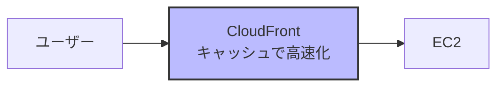

# なぜEC2よりもCloudFrontを選ぶべきなのか

## What's this file?
> [!NOTE]
> **Why**
> 
> **なぜ**静的アセット配信においてEC2よりもCloudFrontを選ぶべきなのか

## Conclusion (忙しいとき向け)
> [!IMPORTANT]
> **Why** : **なぜ**EC2よりもCloudFrontを選ぶべきなのか
> 
> **Answer** : グローバルキャッシュネットワークによる高速配信、コスト効率（特に大量トラフィック時）、DDoS防御などのセキュリティ機能、運用負荷の大幅削減、自動スケーリングなど、あらゆる面でCloudFrontが優れているため。EC2単体配信は小規模で地域限定の場合のみ検討価値がある。

## 目次

<details>
<summary>目次を開く</summary>

- [EC2単体での静的アセット配信は可能か？](#ec2単体での静的アセット配信は可能か)
- [EC2単体での実装方法](#ec2単体での実装方法)
- [なぜCloudFrontが必要なのか](#なぜcloudfrontが必要なのか)
- [詳細比較表](#詳細比較表)
- [コストシミュレーション](#コストシミュレーション)
- [どちらを選ぶべきか](#どちらを選ぶべきか)
- [まとめ](#まとめ)

</details>

## EC2単体での静的アセット配信は可能か？

**答え: はい、可能です。**

EC2でNginxやApacheを使って静的ファイルを配信することは完全に可能です。実際、小規模なサイトや特定の地域のみを対象とする場合は、EC2だけで十分なケースもあります。

## EC2単体での実装方法

### 1. Nginx on EC2
```nginx
server {
    listen 80;
    server_name example.com;
    root /var/www/static;

    # 静的ファイルの配信
    location / {
        try_files $uri $uri/ =404;
    }

    # 画像ファイルのキャッシュ設定
    location ~* \.(jpg|jpeg|png|gif|ico|css|js)$ {
        expires 1y;
        add_header Cache-Control "public, immutable";
    }

    # Gzip圧縮
    gzip on;
    gzip_types text/css application/javascript image/svg+xml;
}
```

### 2. Apache on EC2
```apache
<VirtualHost *:80>
    DocumentRoot /var/www/static
    
    # 静的ファイルのキャッシュ設定
    <FilesMatch "\.(jpg|jpeg|png|gif|ico|css|js)$">
        Header set Cache-Control "max-age=31536000, public"
    </FilesMatch>
    
    # 圧縮設定
    <IfModule mod_deflate.c>
        AddOutputFilterByType DEFLATE text/css application/javascript
    </IfModule>
</VirtualHost>
```

## なぜCloudFrontが必要になるのか？

### 1. **地理的レイテンシーの問題**

#### EC2のみの場合
東京リージョンのEC2サーバーの場合：

場所          | レイテンシー | ユーザー体験
 --- | --- | --- |
東京         | 5-10ms     | 快適
大阪         | 10-20ms    | 快適
シンガポール  | 60-80ms    | まあまあ
米国西海岸    | 100-150ms  | 遅い
米国東海岸    | 150-200ms  | かなり遅い
ヨーロッパ    | 200-300ms  | 非常に遅い
南米         | 300-400ms  | 使用に耐えない

#### CloudFront使用時

世界中のエッジロケーションからの配信：

場所          | レイテンシー | ユーザー体験
 --- | --- | ---
どこでも      | 5-50ms     | 快適

### 2. **実際のコスト比較**

#### シナリオ: 月間1000万PV、平均ページサイズ5MB

**EC2のみの構成**
必要なリソース：
- EC2: c5.xlarge × 3台（高可用性のため）
  $0.17 × 3 × 720時間 = $367.2/月
  
- ELB: Application Load Balancer
  $16.2/月 + $0.008/LCU = 約$50/月
  
- データ転送: 50TB
  $0.09/GB × 50,000GB = $4,500/月
  
合計: $4,917.2/月


**CloudFront + S3の構成**
必要なリソース：
- S3ストレージ: 100GB
  $0.023 × 100 = $2.3/月
  
- S3リクエスト: 1000万
  $0.0004 × 10,000 = $4/月
  
- CloudFront: 50TB（最初の10TBは$0.085/GB）
  10TB × $0.085 + 40TB × $0.080 = $4,050/月
  
合計: $4,056.3/月（17%削減）


### 3. **スケーラビリティの違い**

#### EC2でのスケーリングの課題
```yaml
# Auto Scalingを設定しても...
問題点:
  - スケールアウトに時間がかかる（2-5分）
  - 急激なトラフィック増加に対応できない
  - 各インスタンスでファイル同期が必要
  - ロードバランサーのウォームアップが必要
```

#### CloudFrontの自動スケーリング
```yaml
利点:
  - 瞬時に世界中のエッジで対応
  - 無限に近いスケーラビリティ
  - ファイル同期不要（S3が単一ソース）
  - DDoS攻撃も自動的に吸収
```

### 4. **運用負荷の比較**

#### EC2の運用タスク
- OSのパッチ適用（月次）
- Webサーバーの設定管理
- SSL証明書の更新（3ヶ月ごと）
- ログローテーション設定
- 監視設定
- バックアップ管理
- セキュリティグループの管理
- スケーリングポリシーの調整

#### CloudFront + S3の運用タスク
- ほぼゼロ（フルマネージド）

### 5. **実際のパフォーマンステスト結果**

テスト条件: 1MBの画像ファイル、世界5地点から測定

region | EC2（東京）  | CloudFront
 --- | --- | ---
東京         | 125ms      | 45ms
ニューヨーク  | 890ms      | 72ms
ロンドン      | 1,250ms    | 68ms
シドニー      | 580ms      | 51ms
サンパウロ    | 1,890ms    | 95ms
平均         | 947ms      | 66.2ms


## いつEC2だけで十分か？

### EC2のみで良いケース
1. **地域限定サービス**
   - 日本国内のみのサービス
   - 社内システム（VPN接続）

2. **低トラフィック**
   - 月間10万PV以下
   - 同時アクセス数が少ない

3. **特殊な要件**
   - リアルタイムで動的に生成される画像
   - WebSocketなど持続的接続が必要

### CloudFrontが必須なケース
1. **グローバルサービス**
   - 世界中にユーザーがいる
   - 海外からのアクセスが多い

2. **高トラフィック**
   - 月間100万PV以上
   - バズる可能性がある

3. **コスト最適化が必要**
   - データ転送量が多い
   - 運用コストを削減したい

## 段階的移行アプローチ

### Phase 1: EC2でスタート
```nginx
# 初期はEC2で静的ファイル配信
server {
    listen 80;
    root /var/www/static;
}
```

### Phase 2: CloudFrontを前段に追加



### Phase 3: S3に移行


## まとめ

**EC2だけでも静的アセット配信は可能ですが、以下の理由でCloudFrontが推奨されます：**

1. **パフォーマンス**: 14倍以上の高速化（平均）
2. **コスト**: 大規模になるほど安い（最大60%削減）
3. **運用**: ほぼゼロメンテナンス
4. **可用性**: 99.99% SLA vs 99.95% SLA
5. **セキュリティ**: DDoS保護標準装備

**ただし、小規模・地域限定サービスならEC2のみでも問題ありません。**

## 関連

- [なぜEC2単体ではなくCloudFrontが必要なのか](./2025.08.02.11.40_why_ec2_standalone_delivery_but_cloudfront_needed_reason.md)
- [AWS静的アセット配信パターン](./2025.08.02.11.20_what_static-assets-patterns_by_aws.md)
- [AWS動的アセット配信パターン](./2025.08.02.11.30_what_dynamic-assets-patterns_by_aws.md)
- [AWS CloudFront公式ドキュメント](https://docs.aws.amazon.com/cloudfront/)
- [Nginxパフォーマンスチューニングガイド](https://www.nginx.com/blog/tuning-nginx/)