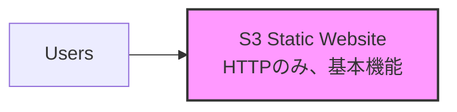
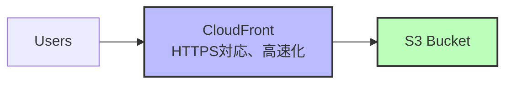

# S3単体での静的アセット配信について

## S3静的ウェブサイトホスティングとは

S3単体でも静的ウェブサイトをホスティングできる機能があります。これは最もシンプルかつ低コストな静的アセット配信方法です。

## S3単体での実装方法

### 基本設定

```bash
# バケット作成
aws s3 mb s3://my-static-website-bucket

# 静的ウェブサイトホスティングを有効化
aws s3 website s3://my-static-website-bucket \
  --index-document index.html \
  --error-document error.html
```

### バケットポリシー設定

```json
{
  "Version": "2012-10-17",
  "Statement": [
    {
      "Sid": "PublicReadGetObject",
      "Effect": "Allow",
      "Principal": "*",
      "Action": "s3:GetObject",
      "Resource": "arn:aws:s3:::my-static-website-bucket/*"
    }
  ]
}
```

### アクセスURL

```
http://my-static-website-bucket.s3-website-ap-northeast-1.amazonaws.com
```

## S3単体のメリット

### 1. **極めてシンプル**
- 設定が数分で完了
- 管理する要素が最小限
- 初心者でも簡単に実装可能

### 2. **超低コスト**

| 項目 | 料金 | 1GBあたり |
|------|------|-----------|
| ストレージ | $0.023/GB/月 | $0.023 |
| リクエスト（GET） | $0.0004/1,000件 | - |
| データ転送（インターネット向け） | $0.09/GB | $0.09 |

**月間コスト例（小規模サイト）**：
- ストレージ10GB: $0.23
- 10万リクエスト: $0.04
- データ転送10GB: $0.90
- **合計: $1.17/月**

### 3. **高い可用性**
- 99.99%の可用性SLA
- 11 9's（99.999999999%）の耐久性
- 自動レプリケーション

## S3単体の制限事項

### 1. **HTTPS非対応**

| 問題 | 影響 | 対策 |
|------|------|------|
| HTTP通信のみ | セキュリティ警告が表示 | CloudFront必須 |
| 独自ドメインでHTTPS不可 | SEOに悪影響 | CloudFront必須 |
| ブラウザの警告 | ユーザー離脱 | CloudFront必須 |

### 2. **パフォーマンスの制限**

#### 地理的レイテンシー（東京リージョンの場合）

| アクセス元 | レイテンシー | 体感速度 |
|----------|------------|---------|
| 東京 | 10-20ms | 快適 |
| 大阪 | 20-30ms | 快適 |
| 韓国 | 30-50ms | まあまあ |
| シンガポール | 80-100ms | 遅い |
| 米国西海岸 | 120-150ms | かなり遅い |
| 欧州 | 250-300ms | 非常に遅い |

### 3. **機能の制限**

| 制限事項 | 詳細 | 影響 |
|---------|------|------|
| リダイレクト | 条件付きリダイレクト不可 | 柔軟性がない |
| カスタムヘッダー | 設定不可 | セキュリティヘッダー追加不可 |
| アクセス制御 | IP制限不可 | 細かい制御ができない |
| ログ | 基本的なアクセスログのみ | 詳細な分析困難 |

### 4. **独自ドメインの制限**

```
❌ できないこと：
- https://example.com での配信
- サブドメインでのHTTPS配信
- CNAMEでのSSL/TLS対応

✅ できること：
- http://example.com での配信（HTTPのみ）
- S3のURLでの配信
```

## S3単体 vs S3+CloudFront 比較

| 項目 | S3単体 | S3 + CloudFront |
|------|--------|-----------------|
| **初期設定** | 5分 | 15分 |
| **HTTPS対応** | ❌ 不可 | ✅ 可能 |
| **独自ドメイン+HTTPS** | ❌ 不可 | ✅ 可能 |
| **グローバル配信** | ❌ 単一リージョン | ✅ 450+エッジ |
| **キャッシュ制御** | △ 基本的 | ✅ 詳細設定可 |
| **圧縮** | ❌ 不可 | ✅ 自動圧縮 |
| **最小コスト** | $1/月〜 | $5/月〜 |

## いつS3単体で十分か

### S3単体が適しているケース

#### 1. **社内向けツール**
```yaml
条件:
  - HTTPでも問題ない
  - アクセス数が少ない（月1万以下）
  - 地理的に近い場所からのアクセスのみ
```

#### 2. **開発・テスト環境**
```yaml
条件:
  - 一時的な利用
  - パフォーマンスが重要でない
  - コストを最小限にしたい
```

#### 3. **静的ドキュメント配信**
```yaml
条件:
  - 社内wiki
  - 技術ドキュメント
  - HTTPSが不要な内部資料
```

### S3単体では不十分なケース

#### 1. **公開Webサイト**
```yaml
理由:
  - HTTPS必須（SEO、信頼性）
  - グローバルアクセス
  - パフォーマンス要求
```

#### 2. **商用サービス**
```yaml
理由:
  - プロフェッショナルな印象が必要
  - 独自ドメインでのHTTPS必須
  - 高速なレスポンスが必要
```

#### 3. **メディアコンテンツ**
```yaml
理由:
  - 大容量ファイルの配信
  - 世界中からのアクセス
  - 帯域幅の最適化が必要
```

## 実装例：S3静的ウェブサイト

### Terraformでの実装

```hcl
resource "aws_s3_bucket" "static_website" {
  bucket = "my-static-website-bucket"
}

resource "aws_s3_bucket_website_configuration" "static_website" {
  bucket = aws_s3_bucket.static_website.id

  index_document {
    suffix = "index.html"
  }

  error_document {
    key = "error.html"
  }
}

resource "aws_s3_bucket_public_access_block" "static_website" {
  bucket = aws_s3_bucket.static_website.id

  block_public_acls       = false
  block_public_policy     = false
  ignore_public_acls      = false
  restrict_public_buckets = false
}

resource "aws_s3_bucket_policy" "static_website" {
  bucket = aws_s3_bucket.static_website.id

  policy = jsonencode({
    Version = "2012-10-17"
    Statement = [
      {
        Sid       = "PublicReadGetObject"
        Effect    = "Allow"
        Principal = "*"
        Action    = "s3:GetObject"
        Resource  = "${aws_s3_bucket.static_website.arn}/*"
      }
    ]
  })
}

output "website_url" {
  value = aws_s3_bucket_website_configuration.static_website.website_endpoint
}
```

## S3からCloudFrontへの移行パス

### Phase 1: S3単体でスタート



### Phase 2: CloudFront追加（必要に応じて）



## コスト比較シミュレーション

### 小規模サイト（月間1万PV、1GB転送）

| 構成 | 月額コスト | 備考 |
|------|-----------|------|
| S3単体 | $0.11 | 最小コスト |
| S3+CloudFront | $0.20 | HTTPS対応 |
| EC2 | $30+ | オーバースペック |

### 中規模サイト（月間100万PV、100GB転送）

| 構成 | 月額コスト | 備考 |
|------|-----------|------|
| S3単体 | $9.23 | HTTP制限あり |
| S3+CloudFront | $8.75 | 転送料金が安い |
| EC2 | $150+ | 管理コスト高 |

## まとめ

### S3単体の静的ウェブサイトホスティングは：

**メリット**：
- ✅ 最もシンプル（5分で設定完了）
- ✅ 最も安い（月$1以下も可能）
- ✅ 管理不要（フルマネージド）
- ✅ 高可用性（99.99% SLA）

**デメリット**：
- ❌ HTTPS非対応
- ❌ 独自ドメインでのHTTPS不可
- ❌ グローバル配信に不向き
- ❌ 高度な機能がない

### 使い分けの指針

```
S3単体を選ぶ場合：
□ HTTPで問題ない
□ 内部向けまたは開発環境
□ コストを極限まで抑えたい
□ アクセスが地域限定

CloudFrontを追加すべき場合：
□ HTTPS必須
□ 公開Webサイト
□ グローバルアクセス
□ パフォーマンス重視
```

**結論：S3単体は「プロトタイプ」や「内部ツール」には最適だが、本番の公開Webサイトには制限が多すぎる。**

## 関連

- [AWS静的アセット配信パターン](./2025.08.02.11.20_what_static-assets-patterns_by_aws.md)
- [なぜEC2単体ではなくCloudFrontが必要なのか](./2025.08.02.11.40_why_ec2_standalone_delivery_but_cloudfront_needed_reason.md)
- [EC2 vs CloudFront比較](./2025.08.02.11.40_why_ec2_vs_cloudfront_comparison.md)
- [AWS S3静的ウェブサイトホスティング公式ドキュメント](https://docs.aws.amazon.com/AmazonS3/latest/userguide/WebsiteHosting.html)
- [AWS CloudFront公式ドキュメント](https://docs.aws.amazon.com/cloudfront/)