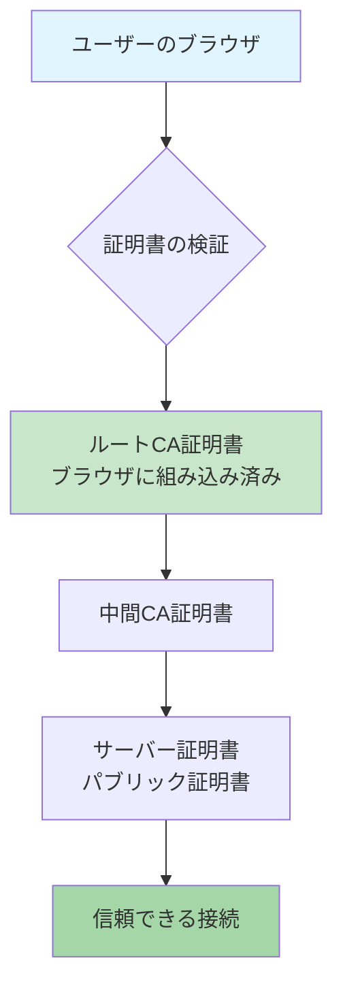
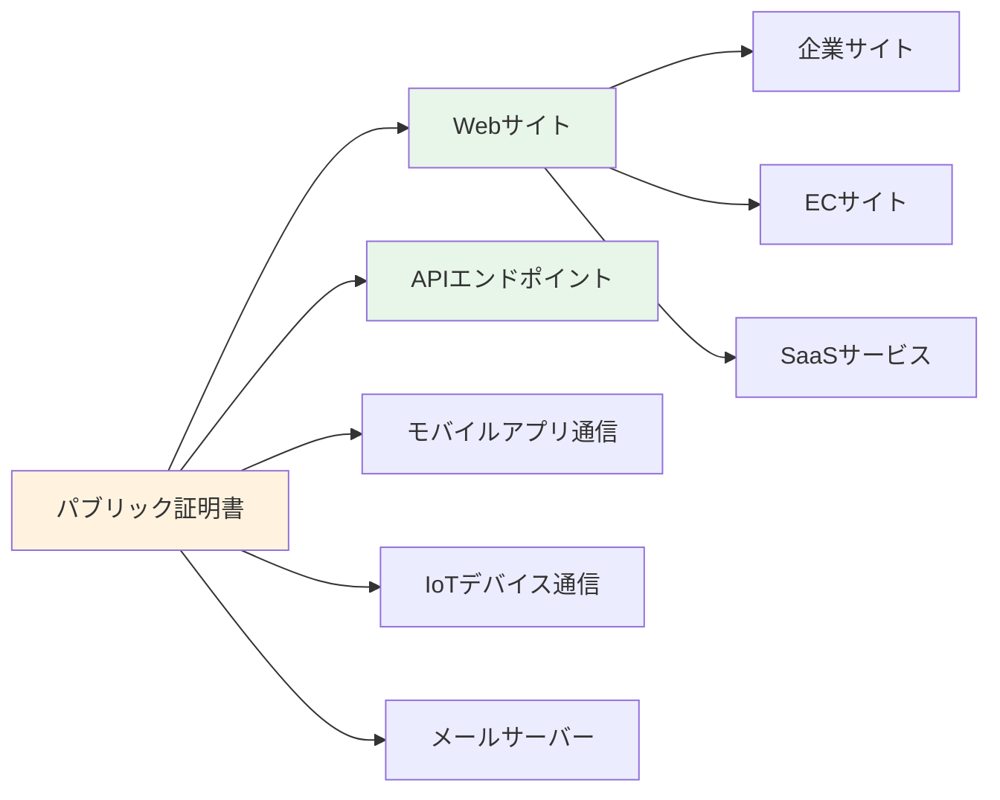
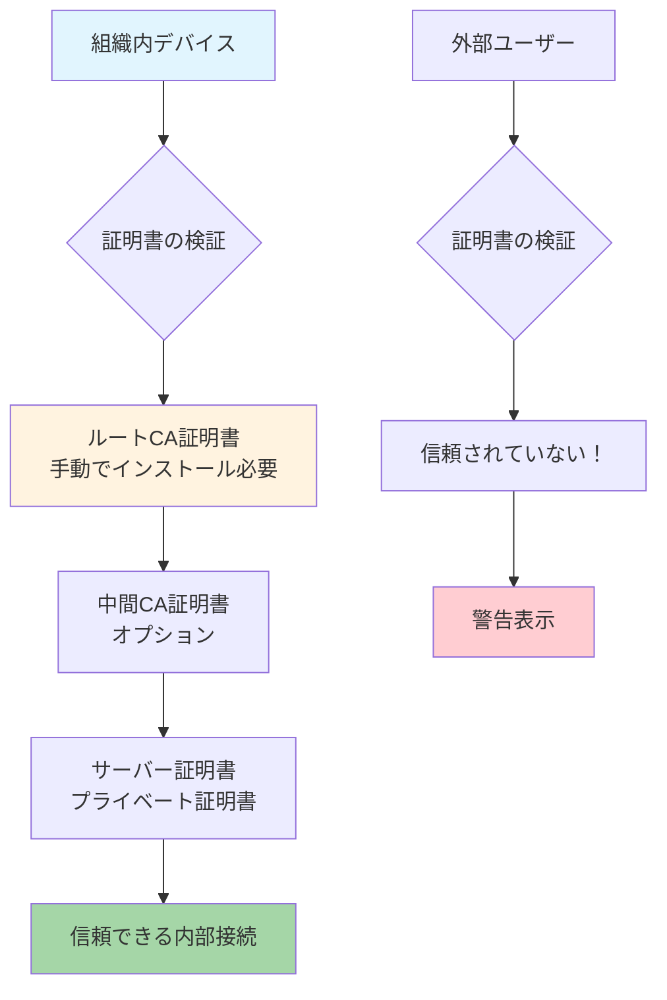
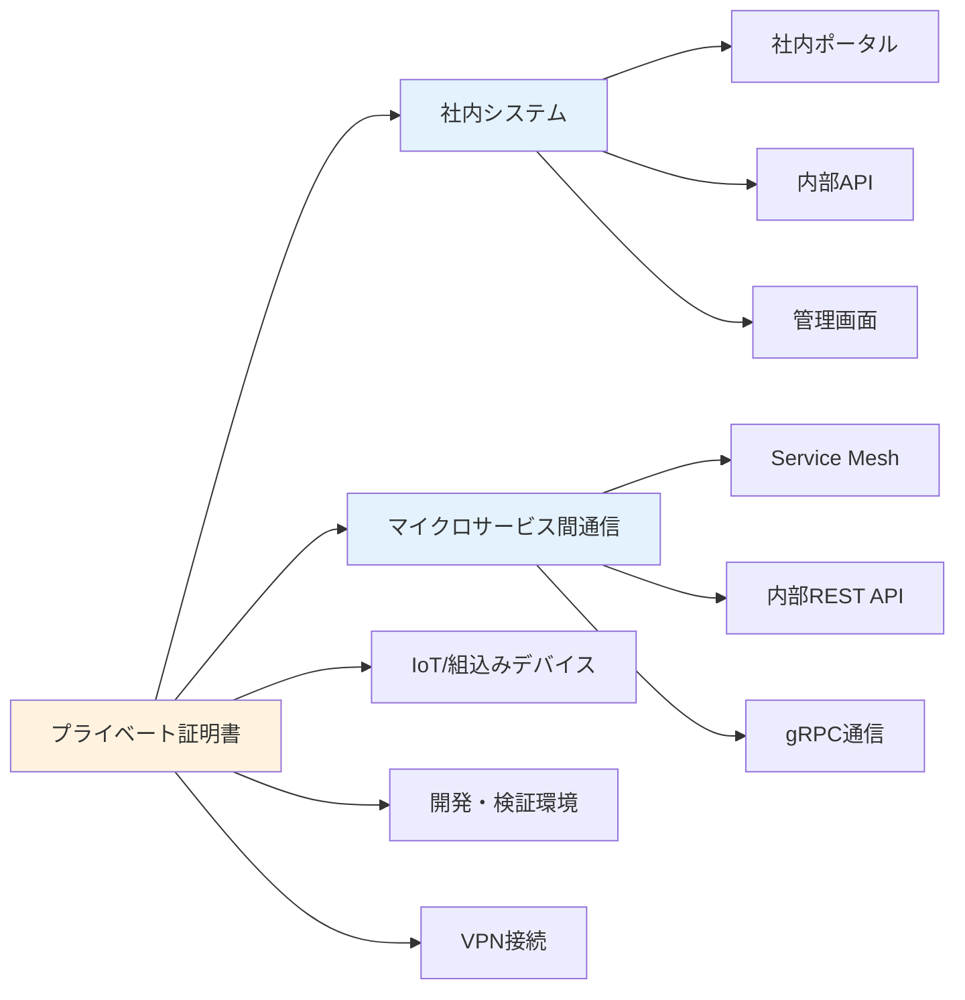
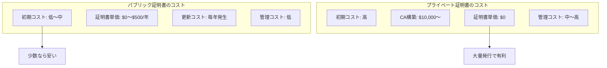
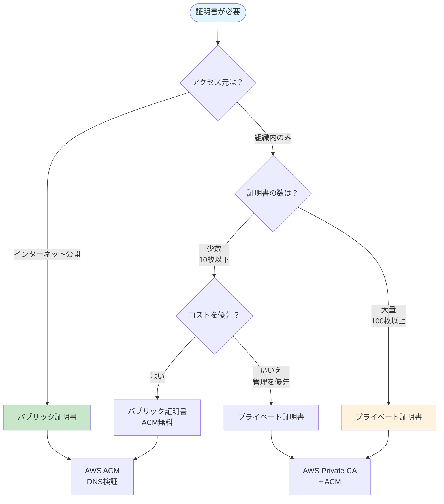

# パブリック証明書とプライベート証明書の違いと使い分け

## What's this file?
> [!NOTE]
> **What**
> 
> パブリック証明書とプライベート証明書とは何かについて記載しています。

## Conclusion (忙しいとき向け)
> [!IMPORTANT]
> **What** : パブリック証明書とプライベート証明書とは何か
> 
> **Answer** : SSL/TLS証明書の2つの主要タイプ。パブリック証明書は公的CAが発行し、ブラウザが標準で信頼するためインターネット公開サービスに使用。プライベート証明書は組織内部のCAが発行し、社内システムや内部通信に使用。AWS ACMでは両方を管理可能で、パブリック証明書は無料で発行・自動更新される。

## 目次

<details>
<summary>目次を開く</summary>

- [証明書タイプの基本比較](#証明書タイプの基本比較)
- [パブリック証明書](#パブリック証明書)
- [プライベート証明書](#プライベート証明書)
- [AWS ACMでの実装](#aws-acmでの実装)
- [証明書選択のフローチャート](#証明書選択のフローチャート)
- [ベストプラクティス](#ベストプラクティス)
- [まとめ](#まとめ)

</details>

## 概要

SSL/TLS証明書には大きく分けて「パブリック証明書」と「プライベート証明書」の2種類があります。本文書では、それぞれの特徴、用途、取得方法、コスト、AWS ACMでの実装方法について詳しく解説します。

## 証明書タイプの基本比較

| 項目 | パブリック証明書 | プライベート証明書 |
|------|-----------------|------------------|
| **発行元** | 公的な認証局（CA） | 組織内部のプライベートCA |
| **信頼性** | ブラウザが標準で信頼 | 明示的な信頼設定が必要 |
| **用途** | インターネット公開サービス | 社内システム・内部通信 |
| **コスト** | 有料（ACMは無料） | CA構築・運用コスト |
| **有効期限** | 最大13ヶ月（業界標準） | 自由に設定可能 |
| **ドメイン検証** | 必須 | 任意 |

## パブリック証明書

### 定義と特徴

パブリック証明書は、公的に信頼された認証局（Certificate Authority: CA）によって発行される証明書です。



### 主な特徴

1. **グローバルな信頼性**
   - 主要なブラウザ・OSに標準で信頼される
   - 追加設定なしでHTTPS接続が可能
   - エンドユーザーに警告が表示されない

2. **厳格な発行プロセス**
   - ドメイン所有権の検証が必須
   - 組織検証（OV）や拡張検証（EV）も選択可能
   - 業界標準に準拠した運用

3. **有効期限の制限**
   - 最大398日（約13ヶ月）
   - 定期的な更新が必要
   - セキュリティ向上のため短期化傾向

### AWS ACMでのパブリック証明書

#### 無料で利用可能

```hcl
resource "aws_acm_certificate" "public" {
  domain_name       = "example.com"
  validation_method = "DNS"
  
  subject_alternative_names = [
    "*.example.com",
    "api.example.com"
  ]
  
  lifecycle {
    create_before_destroy = true
  }
}
```

#### 自動更新機能

| 更新タイミング | 動作 |
|-------------|------|
| 有効期限60日前 | ACMが自動更新開始 |
| DNS検証済み | 自動的に新証明書発行 |
| Email検証 | 手動での再検証必要 |

### パブリック証明書の用途



## プライベート証明書

### 定義と特徴

プライベート証明書は、組織が独自に構築したプライベート認証局（Private CA）によって発行される証明書です。



### 主な特徴

1. **組織内での完全な制御**
   - 証明書ポリシーを自由に設定
   - 有効期限を自由に設定（10年以上も可能）
   - 即座に発行・失効が可能

2. **コスト構造**
   - 初期構築コストが必要
   - 証明書発行数に制限なし
   - 大量発行時はコスト効率が良い

3. **信頼の設定が必要**
   - クライアントにルートCA証明書のインストールが必要
   - 組織外では信頼されない
   - 内部システム専用

### AWS Private CAでの実装

#### Private CAの作成

```hcl
resource "aws_acmpca_certificate_authority" "private_ca" {
  type = "ROOT"
  
  certificate_authority_configuration {
    key_algorithm     = "RSA_4096"
    signing_algorithm = "SHA512WITHRSA"
    
    subject {
      common_name         = "Internal Root CA"
      organization        = "Example Corp"
      organizational_unit = "IT Security"
      country             = "JP"
      state               = "Tokyo"
    }
  }
  
  permanent_deletion_time_in_days = 30
  
  tags = {
    Name = "internal-root-ca"
  }
}
```

#### プライベート証明書の発行

```hcl
resource "aws_acm_certificate" "private" {
  domain_name               = "internal.example.local"
  certificate_authority_arn = aws_acmpca_certificate_authority.private_ca.arn
  
  # プライベート証明書特有の設定
  options {
    certificate_transparency_logging_preference = "DISABLED"
  }
  
  # 5年間有効な証明書も発行可能
  lifecycle {
    create_before_destroy = true
  }
}
```

### プライベート証明書の用途



## パブリック vs プライベート：詳細比較

### セキュリティ面の比較

| セキュリティ要素 | パブリック証明書 | プライベート証明書 |
|----------------|----------------|------------------|
| **証明書の信頼性** | グローバルに信頼 | 組織内のみ信頼 |
| **発行プロセス** | 厳格な検証必要 | 組織ポリシーに依存 |
| **失効リスト（CRL）** | CA管理 | 自組織で管理必要 |
| **コンプライアンス** | 業界標準準拠 | 独自基準可能 |
| **監査証跡** | CA提供 | 自組織で構築必要 |

### コスト比較



### 運用面の比較

| 運用項目 | パブリック証明書 | プライベート証明書 |
|---------|----------------|------------------|
| **発行速度** | 数分〜数時間 | 即時 |
| **更新頻度** | 年1回必須 | 任意（長期可能） |
| **自動化** | ACMで完全自動化 | 構築次第 |
| **失効処理** | CAに依頼 | 即座に可能 |
| **監視** | 有効期限のみ | CA全体の監視必要 |

## 使い分けの決定フロー



## 実装パターン別ガイド

### パターン1: インターネット公開サービス

```hcl
# CloudFront + ACMパブリック証明書
resource "aws_acm_certificate" "cloudfront" {
  provider          = aws.us_east_1  # CloudFrontは必須
  domain_name       = "cdn.example.com"
  validation_method = "DNS"
  
  lifecycle {
    create_before_destroy = true
  }
}

resource "aws_cloudfront_distribution" "cdn" {
  viewer_certificate {
    acm_certificate_arn = aws_acm_certificate.cloudfront.arn
    ssl_support_method  = "sni-only"
  }
}
```

### パターン2: 内部マイクロサービス

```hcl
# Private CA + 内部証明書
resource "aws_acm_certificate" "internal_service" {
  domain_name               = "payment-service.internal"
  certificate_authority_arn = aws_acmpca_certificate_authority.internal.arn
  
  # 内部サービス用の長期証明書
  tags = {
    Service    = "payment"
    Expiration = "5years"
  }
}
```

### パターン3: ハイブリッド環境

```hcl
# 外部向けはパブリック、内部はプライベート
module "public_cert" {
  source      = "./modules/public-cert"
  domain_name = "api.example.com"
}

module "private_cert" {
  source      = "./modules/private-cert"
  domain_name = "internal-api.example.local"
  ca_arn      = aws_acmpca_certificate_authority.internal.arn
}
```

## コスト最適化のヒント

### パブリック証明書のコスト削減

1. **AWS ACMを最大活用**
   - AWSサービスとの統合時は無料
   - 自動更新でメンテナンスコスト削減

2. **ワイルドカード証明書の活用**
   ```
   *.example.com で以下をカバー：
   - www.example.com
   - api.example.com
   - admin.example.com
   ```

3. **SAN（Subject Alternative Names）の活用**
   - 1枚の証明書で最大100ドメイン
   - 管理の簡素化

### プライベート証明書のコスト削減

1. **階層的CA構造**
   ```
   Root CA (10年)
   └── Intermediate CA (5年)
       ├── Service A証明書 (2年)
       ├── Service B証明書 (2年)
       └── Service C証明書 (2年)
   ```

2. **証明書の集約**
   - マイクロサービスごとではなくnamespaceごと
   - ワイルドカード証明書の活用

## セキュリティベストプラクティス

### パブリック証明書

- [ ] DNS検証を使用（自動更新可能）
- [ ] CAA（Certificate Authority Authorization）レコード設定
- [ ] CT（Certificate Transparency）ログ有効化
- [ ] HSTS（HTTP Strict Transport Security）設定

### プライベート証明書

- [ ] ルートCAはオフライン管理
- [ ] 中間CAによる階層構造
- [ ] 定期的な監査ログレビュー
- [ ] 証明書失効リスト（CRL）の適切な配布
- [ ] HSM（Hardware Security Module）の使用検討

## まとめ

### 選択基準

**パブリック証明書を選ぶべき場合：**
- インターネット公開サービス
- 外部ユーザーがアクセスする
- 証明書数が少ない（10枚以下）
- 運用負荷を最小化したい

**プライベート証明書を選ぶべき場合：**
- 組織内部のシステム
- 大量の証明書が必要（100枚以上）
- 長期有効な証明書が欲しい
- 完全な制御が必要

両方を組み合わせて使用することで、セキュリティとコストのバランスを最適化できます。

## 関連

- [AWS ACM証明書設定項目詳細リファレンス](./2025.08.02.14.35_what_aws_acm_certificate_configuration_items_detailed_reference.md)
- [Terraform ACM証明書タイプ決定方法](./2025.08.02.13.21_how_terraform_acm_certificate_type_determination_method.md)
- [AWS ACM証明書Terraform設定ガイド](./2025.08.01.14.31_how_aws_acm_certificate_terraform_configuration_guide.md)
- [AWS Certificate Manager公式ドキュメント](https://docs.aws.amazon.com/acm/)
- [AWS Private CA公式ドキュメント](https://docs.aws.amazon.com/privateca/)