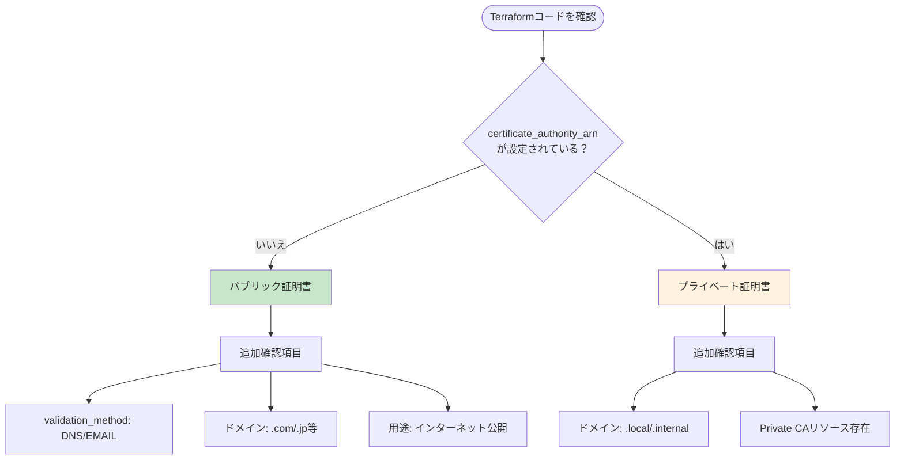

# TerraformでのACM証明書タイプ判定方法

## What's this file?
> [!NOTE]
> **How**
> 
> どのようにTerraformでACM証明書のタイプを判定するかについて記載しています。

## Conclusion (忙しいとき向け)
> [!IMPORTANT]
> **How** : どのようにTerraformでACM証明書のタイプを判定するか
> 
> **Answer** : 最も重要な判定基準は`certificate_authority_arn`の有無。これが設定されていない場合はパブリック証明書、設定されている場合はプライベート証明書。その他にもドメイン名パターン、validation_method、使用サービスなどからも判定可能。

## 目次

<details>
<summary>目次を開く</summary>

- [パブリック証明書とプライベート証明書の見分け方](#パブリック証明書とプライベート証明書の見分け方)
- [実際のプロジェクトでの判定例](#実際のプロジェクトでの判定例)
- [証明書タイプ判定フローチャート](#証明書タイプ判定フローチャート)
- [コマンドでの確認方法](#コマンドでの確認方法)
- [ベストプラクティス](#ベストプラクティス)
- [まとめ](#まとめ)

</details>

## 概要

AWS ACMで作成される証明書がパブリック証明書かプライベート証明書かを、Terraformコードから判定する方法について解説します。

## パブリック証明書とプライベート証明書の見分け方

### 1. 最も重要な判定基準：`certificate_authority_arn`の有無

```hcl
# パブリック証明書の場合
resource "aws_acm_certificate" "public_cert" {
  domain_name       = "example.com"
  validation_method = "DNS"
  # certificate_authority_arn は指定しない
}

# プライベート証明書の場合
resource "aws_acm_certificate" "private_cert" {
  domain_name               = "internal.example.local"
  certificate_authority_arn = aws_acmpca_certificate_authority.ca.arn  # 必須
}
```

**判定ルール**: `certificate_authority_arn`が設定されていない場合は**パブリック証明書**

### 2. ドメイン名パターンによる判定

| 証明書タイプ | 典型的なドメインパターン | 例 |
|------------|----------------------|-----|
| パブリック証明書 | `.com`, `.jp`, `.org`などの公開TLD | `example.com` |
| プライベート証明書 | `.local`, `.internal`, `.private` | `app.internal.local` |

### 3. 検証方法による判定

```hcl
# パブリック証明書でよく使われる
validation_method = "DNS"    # 推奨
validation_method = "EMAIL"  # 非推奨だが可能

# プライベート証明書
# validation_methodは不要（CAが直接発行）
```

### 4. Provider設定による用途判定

```hcl
# CloudFront用（必ずパブリック証明書）
resource "aws_acm_certificate" "cloudfront" {
  provider = aws.virginia  # us-east-1必須
  # ...
}
```

CloudFront用の証明書は必ず**パブリック証明書**である必要があります。

## 実際のプロジェクトでの判定例

### Terraformコードの分析例

```hcl
resource "aws_acm_certificate" "main_virginia" {
  domain_name       = "example.com"          # ✓ 公開ドメイン
  validation_method = "DNS"                   # ✓ DNS検証
  provider          = aws.virginia            # ✓ CloudFront用
  # certificate_authority_arn なし           # ✓ パブリック証明書
}

resource "aws_acm_certificate" "main_tokyo" {
  domain_name       = "example.com"          # ✓ 公開ドメイン
  validation_method = "DNS"                   # ✓ DNS検証
  # certificate_authority_arn なし           # ✓ パブリック証明書
}
```

**判定結果**: 両方とも**パブリック証明書**

## パブリック証明書判定チェックリスト

以下のチェックリストを使用して、証明書タイプを判定できます：

```markdown
□ certificate_authority_arn が設定されていない
□ validation_method が設定されている（DNS または EMAIL）
□ ドメイン名が公開TLD（.com, .jp, .org など）
□ CloudFront用の場合、provider = aws.virginia が設定されている
□ インターネット向けサービスで使用される想定
```

すべてにチェックが入れば、**パブリック証明書**です。

## プライベート証明書の見分け方

以下のいずれかに該当する場合は**プライベート証明書**：

```markdown
□ certificate_authority_arn が設定されている（最重要）
□ ドメイン名が内部用（.local, .internal など）
□ validation_method が設定されていない
□ Private CA リソースが同じTerraformコードに存在する
```

## コードで判定する方法

### Terraformでの条件分岐例

```hcl
locals {
  # 証明書タイプの判定
  is_public_certificate = (
    var.certificate_authority_arn == null &&
    var.validation_method != null
  )
  
  certificate_type = local.is_public_certificate ? "public" : "private"
}

# 出力で確認
output "certificate_info" {
  value = {
    domain      = aws_acm_certificate.cert.domain_name
    type        = local.certificate_type
    is_public   = local.is_public_certificate
  }
}
```

### プログラムでの判定例（TypeScript）

```typescript
interface ACMCertificateConfig {
  domainName: string;
  validationMethod?: string;
  certificateAuthorityArn?: string;
}

function isPublicCertificate(config: ACMCertificateConfig): boolean {
  // certificate_authority_arnがない場合はパブリック証明書
  return !config.certificateAuthorityArn;
}

// 使用例
const exampleCert: ACMCertificateConfig = {
  domainName: "example.com",
  validationMethod: "DNS"
  // certificateAuthorityArn は未定義
};

console.log(isPublicCertificate(exampleCert)); // true
```

## よくある誤解と注意点

### 1. ドメイン名だけでは判定できない

```hcl
# これだけでは判定不可
domain_name = "api.example.com"

# certificate_authority_arnの有無が決定的
```

### 2. 社内システムでもパブリック証明書を使うケース

- VPN経由でアクセスする社内システム
- 社員のみがアクセスする管理画面
- これらも外部からHTTPSアクセスする場合はパブリック証明書

### 3. validation_methodは補助的な判定材料

- パブリック証明書でも`validation_method`を省略するとデフォルト値が使われる
- 最も確実なのは`certificate_authority_arn`の有無

## まとめ

### パブリック証明書の判定フロー



上記の例では、`certificate_authority_arn`が設定されていないため、**パブリック証明書**を使用していることが確実に判定できます。

## 関連

- [パブリック証明書とプライベート証明書の違いと使い分け](./2025.08.02.12.57_what_public_certificate_vs_private_certificate_differences_and_usage.md)
- [AWS ACM証明書設定項目詳細リファレンス](./2025.08.02.14.35_what_aws_acm_certificate_configuration_items_detailed_reference.md)
- [AWS ACM証明書Terraform設定ガイド](./2025.08.01.14.31_how_aws_acm_certificate_terraform_configuration_guide.md)
- [Terraform AWS Provider ACMドキュメント](https://registry.terraform.io/providers/hashicorp/aws/latest/docs/resources/acm_certificate)
- [AWS Certificate Manager公式ドキュメント](https://docs.aws.amazon.com/acm/)