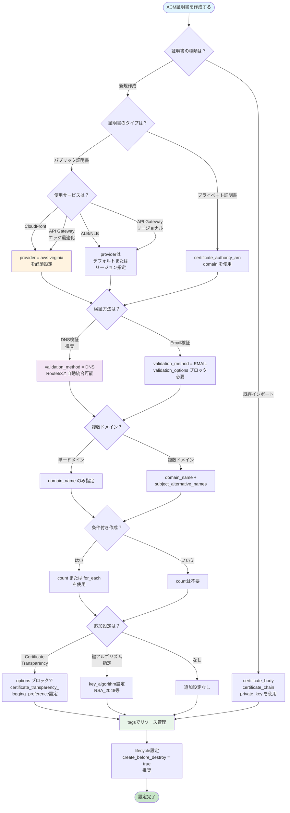
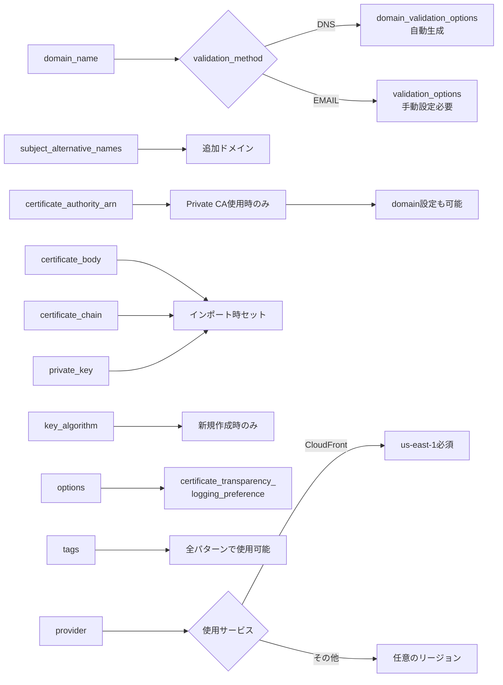

# AWS ACM証明書設定項目詳細リファレンス

## What's this file?
> [!NOTE]
> **What**
> 
> AWS ACM証明書のTerraform設定項目とは何かについて記載しています。

## Conclusion (忙しいとき向け)
> [!IMPORTANT]
> **What** : AWS ACM証明書のTerraform設定項目とは何か
> 
> **Answer** : TerraformでAWS Certificate Manager (ACM)証明書を管理する際の全設定項目の詳細リファレンス。主要項目はdomain_name（必須）、validation_method（DNS/EMAIL）、subject_alternative_names（SAN）、provider（CloudFront用はus-east-1必須）など。証明書の種類（パブリック/プライベート/インポート）や使用サービスによって必要な設定が異なる。

## 目次

<details>
<summary>目次を開く</summary>

- [リソース: aws_acm_certificate](#リソース-aws_acm_certificate)
- [設定項目の使い分けフローチャート](#設定項目の使い分けフローチャート)
- [必須設定項目](#必須設定項目)
- [オプション設定項目](#オプション設定項目)
- [読み取り専用属性](#読み取り専用属性)
- [使用例](#使用例)
- [ベストプラクティス](#ベストプラクティス)

</details>

## リソース: aws_acm_certificate

AWS Certificate Manager (ACM) 証明書リソースの全設定項目を表形式で詳細に解説します。

## 設定項目の使い分けフローチャート



## 設定項目の使い分けガイド

### 1. 証明書作成方法による使い分け

| 作成方法 | 必須項目 | オプション項目 | 使用しない項目 |
|----------|----------|----------------|----------------|
| **新規パブリック証明書** | domain_name<br/>validation_method | subject_alternative_names<br/>tags<br/>key_algorithm | certificate_body<br/>certificate_chain<br/>private_key<br/>certificate_authority_arn |
| **既存証明書インポート** | certificate_body<br/>certificate_chain<br/>private_key | tags | validation_method<br/>certificate_authority_arn |
| **Private CA証明書** | domain_name<br/>certificate_authority_arn | domain<br/>tags | certificate_body<br/>certificate_chain<br/>private_key |

### 2. 使用サービスによる使い分け

| サービス | provider設定 | 理由 | 例 |
|----------|-------------|------|-----|
| **CloudFront** | `provider = aws.virginia` | グローバルサービスのため<br/>us-east-1必須 | `provider = aws.us_east_1` |
| **ALB/NLB** | デフォルトまたは<br/>リージョン別 | リージョナルサービス | `provider = aws.tokyo` |
| **API Gateway（エッジ）** | `provider = aws.virginia` | CloudFront統合のため | `provider = aws.us_east_1` |
| **API Gateway（リージョナル）** | デフォルトまたは<br/>リージョン別 | リージョナルサービス | デフォルト使用可 |

### 3. 検証方法による使い分け

| 検証方法 | 必要な設定 | メリット | デメリット |
|----------|-----------|----------|-----------|
| **DNS検証** | なし（Route53なら自動） | ・完全自動化<br/>・自動更新可能<br/>・CI/CD対応 | ・DNS管理権限必要 |
| **Email検証** | validation_options | ・DNS変更不要<br/>・簡単 | ・手動承認必要<br/>・自動化不可<br/>・更新も手動 |

### 4. 条件付き作成パターン

```hcl
# パターン1: 環境による分岐
resource "aws_acm_certificate" "main" {
  count = terraform.workspace == "production" ? 1 : 0
  # ...
}

# パターン2: 変数による制御
resource "aws_acm_certificate" "optional" {
  count = var.enable_https ? 1 : 0
  # ...
}

# パターン3: ドメイン存在チェック
resource "aws_acm_certificate" "conditional" {
  count = var.domain_name != "" ? 1 : 0
  # ...
}

# パターン4: 複数証明書の作成
resource "aws_acm_certificate" "multi" {
  for_each = toset(var.domain_list)
  domain_name = each.value
  # ...
}
```

### 5. 設定項目の依存関係



### 6. よくある設定ミスと対策

| ミス | 症状 | 対策 |
|------|------|------|
| CloudFrontでprovider未指定 | ResourceNotFoundExceptionエラー | `provider = aws.virginia`を追加 |
| Email検証でvalidation_options未設定 | 検証メールが届かない | validation_optionsブロックを追加 |
| count使用時の参照エラー | Index out of rangeエラー | `try()`関数や`length()`チェックを使用 |
| 同一ドメインで複数リクエスト | RequestInProgressException | 既存証明書の確認と削除 |
| Private CAでdomain未設定 | 証明書作成失敗 | domainパラメータを追加 |

### 7. ベストプラクティス決定フロー

1. **サービス確認** → CloudFrontなら`provider = aws.virginia`
2. **検証方法選択** → 自動化するならDNS検証
3. **ドメイン数確認** → 複数ならsubject_alternative_names
4. **条件付き作成** → 必要ならcount/for_each
5. **ライフサイクル** → `create_before_destroy = true`
6. **タグ付け** → 環境、プロジェクト、管理者を明記

## 引数リファレンス

### メタ引数

| 項目名 | 必須 | 型 | デフォルト値 | 説明 |
|--------|------|-----|-------------|------|
| `count` | × | number | 1 | 作成するリソースインスタンスの数。0を指定するとリソースは作成されない。条件付き作成に使用 |
| `for_each` | × | set(string)/map(string) | - | キーベースでリソースを作成。countと同時使用不可 |
| `provider` | × | string | デフォルトプロバイダー | 使用するAWSプロバイダーのエイリアス。CloudFront用はus-east-1のプロバイダーを指定する必要がある |
| `depends_on` | × | list | - | 明示的な依存関係の指定 |

### 基本設定項目

| 項目名 | 必須 | 型 | デフォルト値 | 説明 |
|--------|------|-----|-------------|------|
| `domain_name` | ✓ | string | - | 証明書を要求するドメイン名。完全修飾ドメイン名（FQDN）またはワイルドカードドメイン（*.example.com）を指定可能 |
| `validation_method` | × | string | `EMAIL` | ドメイン所有権の検証方法。`DNS`または`EMAIL`を指定。`DNS`が推奨 |
| `subject_alternative_names` | × | list(string) | `[]` | 証明書に含める追加のドメイン名リスト（SANs）。最大100個まで指定可能 |
| `tags` | × | map(string) | `{}` | リソースに付与するタグのマップ。AWSリソース管理用 |
| `certificate_authority_arn` | × | string | - | ACM Private CAから証明書を要求する場合のPrivate CA ARN |
| `certificate_body` | × | string | - | インポートする証明書の本文（PEM形式）。新規作成時は使用しない |
| `certificate_chain` | × | string | - | インポートする証明書チェーン（PEM形式）。新規作成時は使用しない |
| `private_key` | × | string | - | インポートする証明書の秘密鍵（PEM形式）。新規作成時は使用しない |
| `key_algorithm` | × | string | - | 証明書の鍵アルゴリズム。`RSA_2048`、`EC_prime256v1`、`EC_secp384r1` |

### validation_options ブロック（Email検証時のみ）

| 項目名 | 必須 | 型 | デフォルト値 | 説明 |
|--------|------|-----|-------------|------|
| `domain_name` | ✓ | string | - | 検証するドメイン名 |
| `validation_domain` | ✓ | string | - | 検証メールを送信するドメイン。通常はルートドメインを指定 |

### domainブロック（ACM Private CA使用時）

| 項目名 | 必須 | 型 | デフォルト値 | 説明 |
|--------|------|-----|-------------|------|
| `domain` | × | string | - | ACM Private CAから証明書を要求する際のドメイン名。通常は`domain_name`と同じ値を指定。Private CA固有の設定で、パブリック証明書では使用しない |

### options ブロック

| 項目名 | 必須 | 型 | デフォルト値 | 説明 |
|--------|------|-----|-------------|------|
| `certificate_transparency_logging_preference` | × | string | `ENABLED` | Certificate Transparencyログ記録の設定。`ENABLED`または`DISABLED` |

## 属性リファレンス

### エクスポートされる属性

| 属性名 | 型 | 説明 |
|--------|-----|------|
| `id` | string | 証明書のARN（Amazon Resource Name） |
| `arn` | string | 証明書のARN（idと同じ） |
| `domain_name` | string | 証明書のプライマリドメイン名 |
| `domain_validation_options` | set(object) | DNS検証に必要な情報のセット |
| `subject_alternative_names` | list(string) | 証明書に含まれるすべてのドメイン名のリスト |
| `status` | string | 証明書のステータス（`PENDING_VALIDATION`、`ISSUED`、`INACTIVE`、`EXPIRED`、`VALIDATION_TIMED_OUT`、`REVOKED`、`FAILED`） |
| `type` | string | 証明書のタイプ（`AMAZON_ISSUED`、`IMPORTED`） |
| `validation_emails` | list(string) | Email検証時に送信される検証メールのアドレスリスト |
| `not_before` | string | 証明書の有効期間開始日時（RFC3339形式） |
| `not_after` | string | 証明書の有効期間終了日時（RFC3339形式） |
| `pending_renewal` | bool | 証明書が更新保留中かどうか |
| `renewal_eligibility` | string | 証明書の更新資格（`ELIGIBLE`、`INELIGIBLE`） |
| `renewal_summary` | list(object) | 証明書更新の概要情報 |

### domain_validation_options の構造

| 属性名 | 型 | 説明 |
|--------|-----|------|
| `domain_name` | string | 検証対象のドメイン名 |
| `resource_record_name` | string | DNS検証用のレコード名（CNAMEレコード） |
| `resource_record_type` | string | DNS検証用のレコードタイプ（通常は`CNAME`） |
| `resource_record_value` | string | DNS検証用のレコード値 |

## ライフサイクル設定

| 設定項目 | 推奨値 | 説明 |
|----------|--------|------|
| `create_before_destroy` | `true` | 既存の証明書を削除する前に新しい証明書を作成。ダウンタイムを防ぐ |
| `ignore_changes` | 状況による | 特定の属性の変更を無視する場合に使用 |
| `prevent_destroy` | 本番環境では`true` | 誤って証明書を削除することを防ぐ |

## 使用上の注意事項

### リージョン別の制約

| サービス | 必要なリージョン | 理由 |
|----------|-----------------|------|
| CloudFront | us-east-1 | CloudFrontはグローバルサービスのため、us-east-1の証明書のみ使用可能 |
| ALB/NLB | 各リージョン | ロードバランサーと同じリージョンの証明書が必要 |
| API Gateway | 各リージョン | APIゲートウェイと同じリージョンの証明書が必要 |

### 検証方法の比較

| 検証方法 | DNS | EMAIL |
|----------|-----|-------|
| 自動化 | ✓ 完全自動化可能 | × 手動承認必要 |
| 更新 | ✓ 自動更新可能 | × 手動更新必要 |
| 検証時間 | 数分〜30分 | メール確認次第 |
| Route53統合 | ✓ ネイティブ対応 | × 不要 |
| 推奨度 | ★★★★★ | ★★☆☆☆ |

### タイムアウト設定

| 項目 | 時間 | 説明 |
|------|------|------|
| DNS検証タイムアウト | 72時間 | DNS検証が完了しない場合、証明書リクエストは失敗 |
| Email検証タイムアウト | 72時間 | Email検証が完了しない場合、証明書リクエストは失敗 |
| Terraform作成タイムアウト | 45分（デフォルト） | `timeouts`ブロックで変更可能 |

## Provider設定の詳細

### Provider設定が必要なケース

| 使用サービス | 必要なプロバイダー設定 | 理由 |
|------------|---------------------|------|
| CloudFront | `provider = aws.virginia` | CloudFrontはグローバルサービスで、us-east-1の証明書のみ使用可能 |
| ALB/NLB | デフォルトまたはリージョン別 | ロードバランサーと同じリージョンの証明書が必要 |
| API Gateway（エッジ最適化） | `provider = aws.virginia` | エッジ最適化APIはCloudFrontを使用するため |
| API Gateway（リージョナル） | デフォルトまたはリージョン別 | APIゲートウェイと同じリージョンの証明書が必要 |

### Provider設定例

```hcl
# プロバイダー定義
provider "aws" {
  region = "ap-northeast-1"  # デフォルト（東京）
}

provider "aws" {
  alias  = "virginia"
  region = "us-east-1"  # CloudFront用
}

# CloudFront用証明書（providerを明示的に指定）
resource "aws_acm_certificate" "cloudfront" {
  provider          = aws.virginia  # 重要：us-east-1を指定
  domain_name       = "cdn.example.com"
  validation_method = "DNS"
}

# ALB用証明書（デフォルトプロバイダーを使用）
resource "aws_acm_certificate" "alb" {
  # providerを指定しない場合、デフォルト（東京）が使用される
  domain_name       = "api.example.com"
  validation_method = "DNS"
}
```

## Count設定の詳細

### Count使用パターン

| パターン | 使用例 | 説明 |
|----------|--------|------|
| 条件付き作成 | `count = var.create_cert ? 1 : 0` | 特定の条件でのみ証明書を作成 |
| 環境別作成 | `count = terraform.workspace == "production" ? 1 : 0` | 本番環境でのみ作成 |
| 複数作成 | `count = length(var.domains)` | ドメインリストの数だけ証明書を作成 |
| 存在チェック | `count = var.domain != "" ? 1 : 0` | ドメインが指定されている場合のみ作成 |

### Count使用時の参照方法

```hcl
# 条件付き作成の例
resource "aws_acm_certificate" "optional" {
  count = var.enable_ssl ? 1 : 0
  
  domain_name       = var.domain_name
  validation_method = "DNS"
}

# 参照時の注意点
resource "aws_cloudfront_distribution" "cdn" {
  viewer_certificate {
    # countが0の場合を考慮した参照
    acm_certificate_arn = length(aws_acm_certificate.optional) > 0 ? 
      aws_acm_certificate.optional[0].arn : 
      null
  }
}

# より安全な参照方法（try関数使用）
locals {
  certificate_arn = try(aws_acm_certificate.optional[0].arn, null)
}
```

### 複数証明書の作成例

```hcl
variable "domain_configs" {
  type = list(object({
    domain_name = string
    sans        = list(string)
  }))
}

resource "aws_acm_certificate" "multi" {
  count = length(var.domain_configs)
  
  domain_name               = var.domain_configs[count.index].domain_name
  subject_alternative_names = var.domain_configs[count.index].sans
  validation_method         = "DNS"
  
  tags = {
    Name  = "${var.domain_configs[count.index].domain_name}-cert"
    Index = count.index
  }
}
```

## 設定例：全オプション使用

```hcl
resource "aws_acm_certificate" "example" {
  # メタ引数
  count    = var.create_certificate ? 1 : 0
  provider = aws.virginia
  
  # 基本設定
  domain_name = "example.com"
  
  # 追加ドメイン（SAN）
  subject_alternative_names = [
    "*.example.com",
    "api.example.com",
    "admin.example.com"
  ]
  
  # 検証方法
  validation_method = "DNS"
  
  # 鍵アルゴリズム（オプション）
  key_algorithm = "RSA_2048"
  
  # Certificate Transparency
  options {
    certificate_transparency_logging_preference = "ENABLED"
  }
  
  # タグ
  tags = {
    Name         = "example-certificate"
    Environment  = terraform.workspace
    Project      = "example-project"
    ManagedBy    = "terraform"
    CreatedDate  = timestamp()
  }
  
  # ライフサイクル
  lifecycle {
    create_before_destroy = true
    
    # タグの更新を無視（必要に応じて）
    ignore_changes = [tags["CreatedDate"]]
  }
  
  # タイムアウト設定
  timeouts {
    create = "45m"
  }
}
```

## トラブルシューティングマトリックス

| エラー/問題 | 原因 | 解決方法 |
|------------|------|----------|
| `ResourceNotFoundException` | 証明書がus-east-1にない（CloudFront使用時） | providerでus-east-1を指定 |
| `ValidationException` | ドメイン名の形式が不正 | FQDNまたは有効なワイルドカード形式を使用 |
| `LimitExceededException` | 証明書数の上限到達 | 不要な証明書を削除またはクォータ増加申請 |
| `RequestInProgressException` | 同じドメインで処理中のリクエストあり | 既存のリクエストの完了を待つ |
| 検証タイムアウト | DNSレコードが正しく設定されていない | Route53レコードを確認 |

## ベストプラクティスチェックリスト

- [ ] DNS検証を使用している
- [ ] `create_before_destroy`を有効にしている
- [ ] 適切なタグを設定している
- [ ] CloudFront用はus-east-1で作成している
- [ ] ワイルドカード証明書を適切に使用している
- [ ] 証明書の有効期限監視を設定している
- [ ] 本番環境では`prevent_destroy`を検討している
- [ ] 不要なSANsを含めていない（コスト最適化）

## 関連

- [パブリック証明書とプライベート証明書の違いと使い分け](./2025.08.02.12.57_what_public_certificate_vs_private_certificate_differences_and_usage.md)
- [Terraform ACM証明書タイプ決定方法](./2025.08.02.13.21_how_terraform_acm_certificate_type_determination_method.md)
- [AWS ACM証明書Terraform設定ガイド](./2025.08.01.14.31_how_aws_acm_certificate_terraform_configuration_guide.md)
- [AWS Certificate Manager公式ドキュメント](https://docs.aws.amazon.com/acm/)
- [Terraform AWS Provider ACMドキュメント](https://registry.terraform.io/providers/hashicorp/aws/latest/docs/resources/acm_certificate)