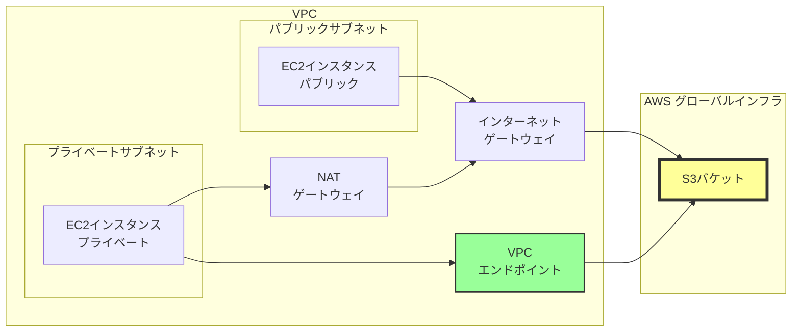
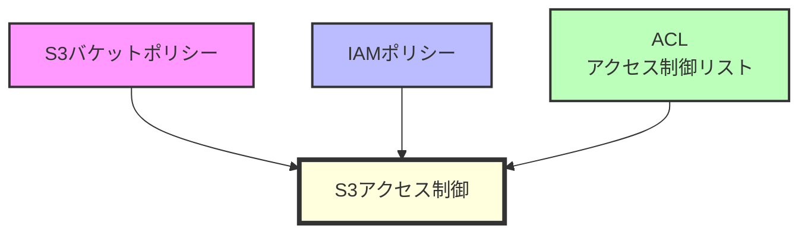

# なぜS3はサブネット外に配置されるのか

## What's this file?
> [!NOTE]
> **Why**
> 
> **なぜ**S3はVPCのサブネット外に配置されるのか

## Conclusion (忙しいとき向け)
> [!IMPORTANT]
> **Why** : **なぜ**S3はVPCのサブネット外に配置されるのか
> 
> **Answer** : S3はマネージドサービスとしてAWSのグローバルインフラストラクチャ上で動作し、特定のVPCに属さないリージョナルサービスとして設計されているため

## 目次

目次を開く

- [S3のアーキテクチャ特性](#s3のアーキテクチャ特性)
- [VPCとS3の関係性](#vpcとs3の関係性)
- [アクセス制御の仕組み](#アクセス制御の仕組み)
- [実装上の考慮事項](#実装上の考慮事項)

## S3のアーキテクチャ特性

### グローバルサービスとしての設計
S3は以下の特性を持つグローバルサービスとして設計されています：
- **リージョナルサービス**：特定のリージョンに属するが、VPCには属さない
- **マルチテナント型**：複数の顧客が同じインフラストラクチャを共有
- **高可用性**：複数のアベイラビリティゾーンにまたがって自動的にレプリケーション

### マネージドサービスの利点
- **インフラ管理不要**：サーバーやネットワークの管理が不要
- **自動スケーリング**：容量やパフォーマンスの自動調整
- **グローバルアクセス**：インターネット経由でどこからでもアクセス可能

## VPCとS3の関係性

### サブネット配置が不要な理由
1. **抽象化レイヤー**：S3はインフラストラクチャレベルで抽象化されている
2. **共有リソース**：複数のVPCから同時にアクセス可能
3. **スケーラビリティ**：VPCの制約に縛られない無制限のスケール

### VPCからのアクセス方法

- **インターネットゲートウェイ経由**：パブリックサブネットから直接アクセス
- **NATゲートウェイ経由**：プライベートサブネットからのアクセス
- **VPCエンドポイント経由**：AWS内部ネットワークを使用したプライベートアクセス

## アクセス制御の仕組み

### S3独自のセキュリティモデル

### VPCエンドポイントポリシー
VPCエンドポイントを使用する場合の追加制御：
- エンドポイントポリシーによるアクセス制限
- 特定のバケットへのアクセス制御
- VPC内のリソースからのみアクセス許可

## 実装上の考慮事項

### ベストプラクティス
1. **VPCエンドポイントの活用**
   - データ転送料金の削減
   - プライベート接続によるセキュリティ向上
   - レイテンシーの改善

2. **アクセス制御の設計**
   - 最小権限の原則に基づくIAMポリシー
   - バケットポリシーでの明示的な許可/拒否
   - CloudTrailによる監査ログの有効化

3. **ネットワーク設計**
   - プライベートサブネットからのアクセス経路の確保
   - VPCエンドポイントのルーティング設定
   - セキュリティグループとNACLの適切な設定

## 関連
- [AWS S3公式ドキュメント](https://docs.aws.amazon.com/s3/)
- [VPCエンドポイントの設定ガイド](https://docs.aws.amazon.com/vpc/latest/privatelink/vpc-endpoints-s3.html)
- [S3のセキュリティベストプラクティス](https://docs.aws.amazon.com/AmazonS3/latest/userguide/security-best-practices.html)