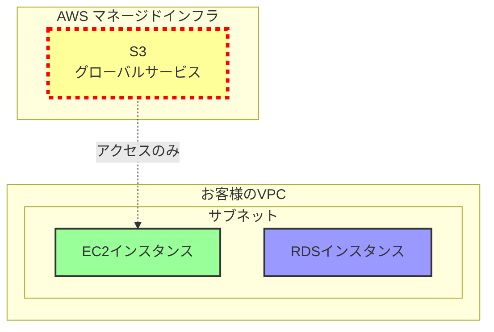
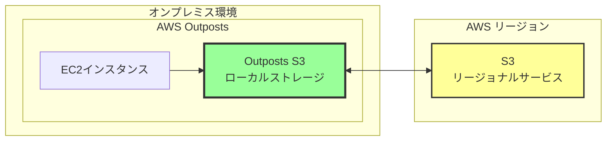
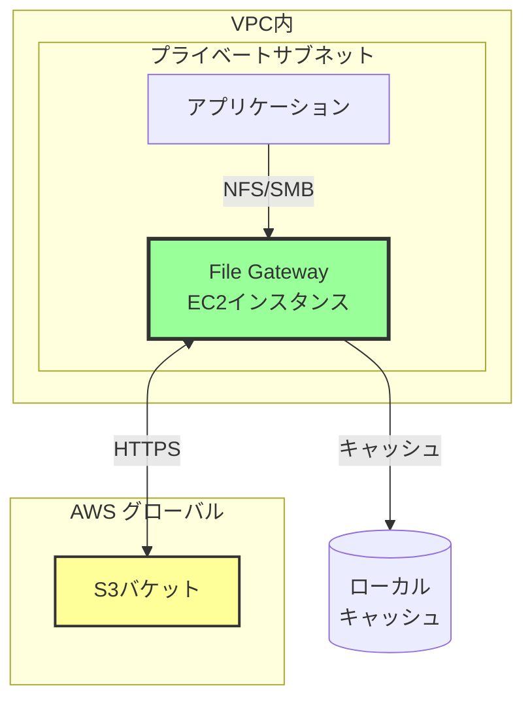
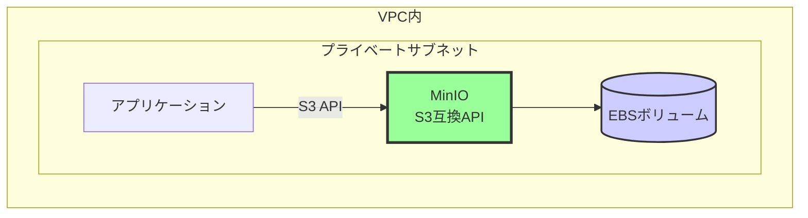
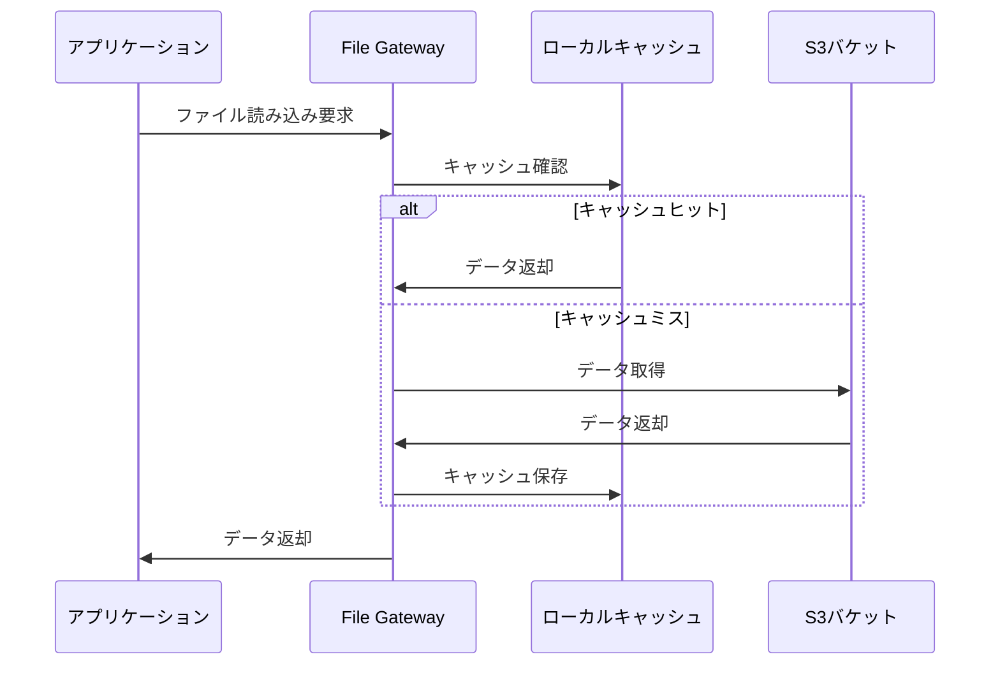
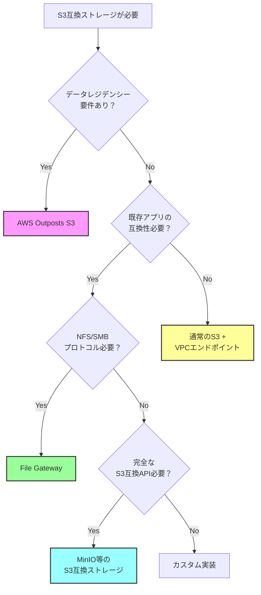

# S3がサブネット内に配置されるパターン

## What's this file?
> [!NOTE]
> **What**
> 
> S3がサブネット内に配置されるパターンとは何かについて記載しています。

## Conclusion (忙しいとき向け)
> [!IMPORTANT]
> **What** : S3がサブネット内に配置されるパターンとは何か
> 
> **Answer** : S3自体はサブネット内に配置されることはないが、S3と同等の機能を提供するサービスがVPC内に配置されるパターンが存在する

## 目次

目次を開く

- [S3の基本的な配置制約](#s3の基本的な配置制約)
- [VPC内でS3互換サービスを実現するパターン](#vpc内でs3互換サービスを実現するパターン)
- [AWS Outposts S3](#aws-outposts-s3)
- [S3 File Gatewayパターン](#s3-file-gatewayパターン)
- [使用シナリオと選択基準](#使用シナリオと選択基準)

## S3の基本的な配置制約

### S3がサブネット内に配置できない理由

- **グローバルサービス**: S3はリージョナルサービスとして設計
- **マルチテナント**: 複数の顧客で共有されるインフラ
- **抽象化レベル**: VPCの概念より上位で動作

## VPC内でS3互換サービスを実現するパターン

### パターン1: AWS Outposts S3

### パターン2: Storage Gateway - File Gateway

### パターン3: MinIO等のS3互換ストレージ

## AWS Outposts S3

### 特徴と制約
- **物理的な配置**: オンプレミス環境にAWSインフラを設置
- **ローカルデータ処理**: データがオンプレミスに保持される
- **容量制限**: Outpostsのハードウェア容量に依存
- **管理**: AWSによるフルマネージド

### ユースケース
1. **データレジデンシー要件**: データを特定の場所に保持する必要がある
2. **低レイテンシー要求**: ローカルでの高速アクセスが必要
3. **オフライン動作**: インターネット接続が不安定な環境

## S3 File Gatewayパターン

### アーキテクチャ詳細

### 主な特徴
- **プロトコル変換**: NFS/SMBをS3 APIに変換
- **キャッシュ機能**: 頻繁にアクセスされるデータをローカル保存
- **透過的アクセス**: アプリケーションからは通常のファイルシステムとして見える

## 使用シナリオと選択基準

### 選択フローチャート

### 比較表

| パターン | 配置場所 | S3互換性 | 管理負荷 | コスト |
|---------|---------|----------|---------|--------|
| AWS Outposts S3 | オンプレミス | 完全互換 | 低（AWSマネージド） | 高 |
| File Gateway | VPC内 | プロトコル変換 | 中 | 中 |
| MinIO | VPC内 | API互換 | 高（自己管理） | 低 |
| 通常のS3 | AWS管理 | ネイティブ | なし | 使用量課金 |

## 関連
- [AWS Outposts公式ドキュメント](https://docs.aws.amazon.com/outposts/)
- [AWS Storage Gateway ドキュメント](https://docs.aws.amazon.com/storagegateway/)
- [MinIO公式サイト](https://min.io/)
- [S3 VPCエンドポイント設定ガイド](https://docs.aws.amazon.com/vpc/latest/privatelink/vpc-endpoints-s3.html)