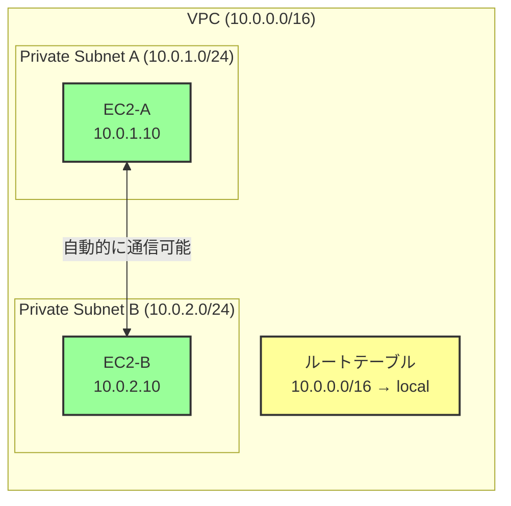
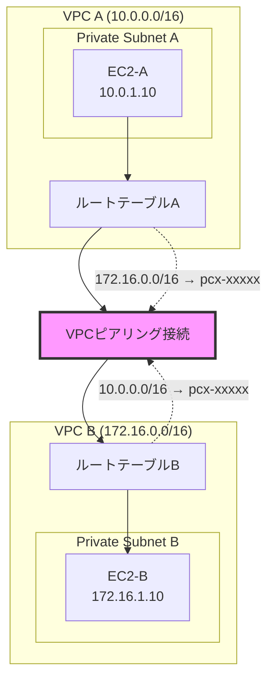
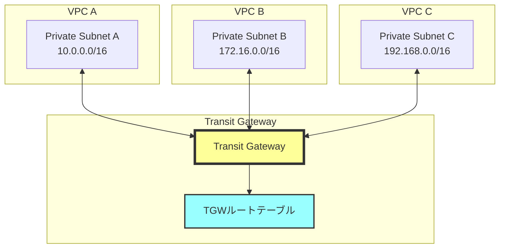
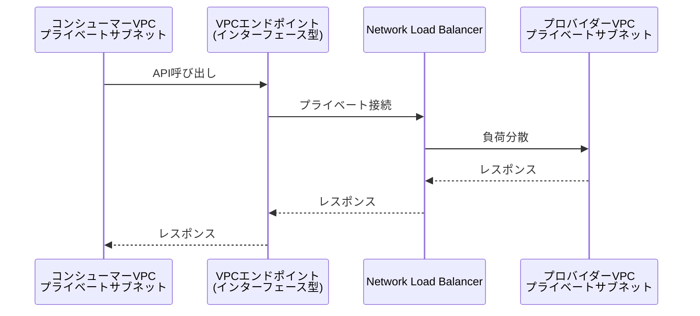
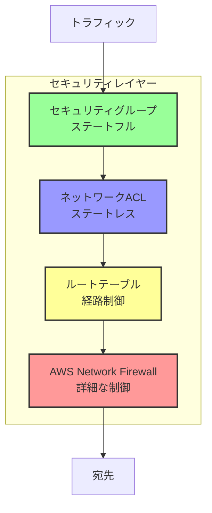
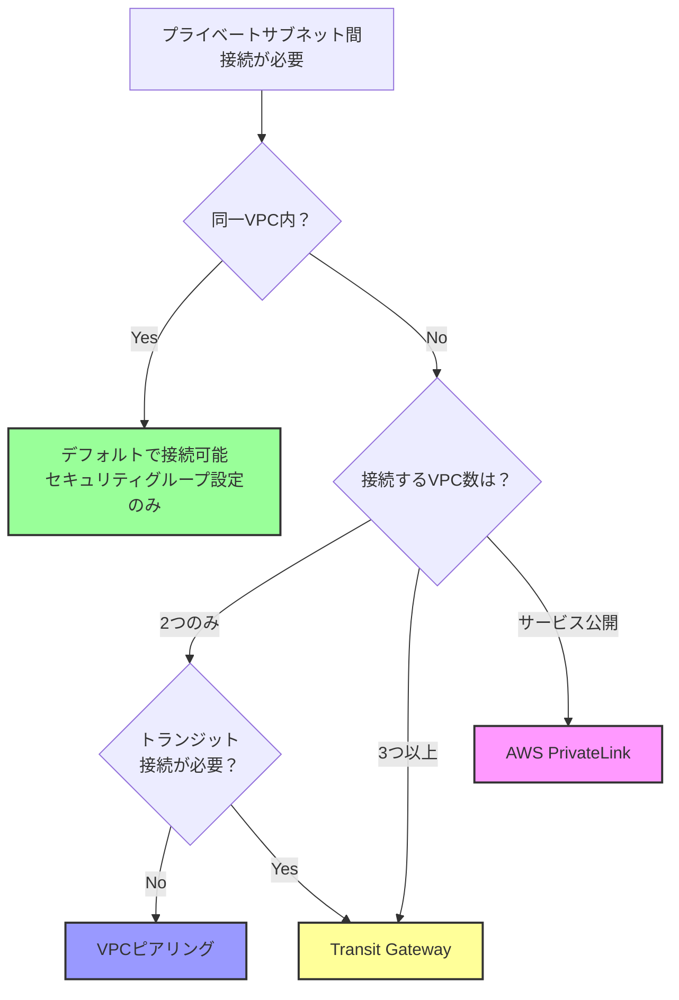

# プライベートサブネット間の接続方法

## What's this file?
> [!NOTE]
> **How**
> 
> どのようにプライベートサブネット間を接続するかについて記載しています。

## Conclusion (忙しいとき向け)
> [!IMPORTANT]
> **How** : どのようにプライベートサブネット間を接続するか
> 
> **Answer** : 同一VPC内のプライベートサブネット間はデフォルトで接続可能。異なるVPC間の場合はVPCピアリング、Transit Gateway、PrivateLinkなどの設定が必要

## 目次

<details>
<summary>目次を開く</summary>

- [同一VPC内のプライベートサブネット間接続](#同一vpc内のプライベートサブネット間接続)
- [異なるVPC間のプライベートサブネット接続](#異なるvpc間のプライベートサブネット接続)
- [セキュリティ設定の考慮事項](#セキュリティ設定の考慮事項)
- [接続パターンの比較と選択](#接続パターンの比較と選択)

</details>

## 同一VPC内のプライベートサブネット間接続

### デフォルトの接続性



### 必要な設定
1. **ルートテーブル**: VPC CIDRブロックへのローカルルートが自動設定
2. **セキュリティグループ**: 適切なインバウンドルールの設定が必要
3. **NACLs**: デフォルトは全許可、必要に応じて制限

### セキュリティグループの設定例

```bash
# セキュリティグループの作成と設定
aws ec2 create-security-group \
    --group-name private-subnet-sg \
    --description "Security group for private subnet communication" \
    --vpc-id vpc-xxxxx

# プライベートサブネット間の通信を許可
aws ec2 authorize-security-group-ingress \
    --group-id sg-xxxxx \
    --protocol tcp \
    --port 443 \
    --source-group sg-xxxxx
```

## 異なるVPC間のプライベートサブネット接続

### パターン1: VPCピアリング



### パターン2: AWS Transit Gateway



### パターン3: AWS PrivateLink



## セキュリティ設定の考慮事項

### 多層防御の実装



### ベストプラクティス
1. **最小権限の原則**: 必要最小限のポートとプロトコルのみ許可
2. **送信元の制限**: 特定のIPアドレスまたはセキュリティグループからのみ許可
3. **暗号化**: VPN接続やTLS通信の利用
4. **監査ログ**: VPC Flow LogsとCloudTrailの有効化

## 接続パターンの比較と選択

### 接続方式の選択フローチャート



### 比較表

| 接続方式 | 最大接続数 | 料金体系 | 帯域幅 | 複雑性 | ユースケース |
|---------|-----------|----------|--------|---------|--------------|
| 同一VPC内 | N/A | 無料 | 無制限 | 低 | 基本的な内部通信 |
| VPCピアリング | 1対1 | データ転送料のみ | 無制限 | 低 | シンプルなVPC間接続 |
| Transit Gateway | 多対多 | 接続料+データ転送料 | 50Gbps | 中 | 複雑なネットワーク構成 |
| PrivateLink | 多対1 | エンドポイント料+データ転送料 | 10Gbps | 高 | サービス公開 |

### 実装例: VPCピアリング設定

```bash
# VPCピアリング接続の作成
aws ec2 create-vpc-peering-connection \
    --vpc-id vpc-aaaaa \
    --peer-vpc-id vpc-bbbbb \
    --peer-region us-east-1

# ピアリング接続の承諾
aws ec2 accept-vpc-peering-connection \
    --vpc-peering-connection-id pcx-xxxxx

# ルートテーブルの更新（VPC A側）
aws ec2 create-route \
    --route-table-id rtb-aaaaa \
    --destination-cidr-block 172.16.0.0/16 \
    --vpc-peering-connection-id pcx-xxxxx

# ルートテーブルの更新（VPC B側）
aws ec2 create-route \
    --route-table-id rtb-bbbbb \
    --destination-cidr-block 10.0.0.0/16 \
    --vpc-peering-connection-id pcx-xxxxx
```

## 関連
- [AWS VPCピアリング公式ドキュメント](https://docs.aws.amazon.com/vpc/latest/peering/)
- [AWS Transit Gateway ドキュメント](https://docs.aws.amazon.com/vpc/latest/tgw/)
- [AWS PrivateLink ドキュメント](https://docs.aws.amazon.com/vpc/latest/privatelink/)
- [VPCのセキュリティベストプラクティス](https://docs.aws.amazon.com/vpc/latest/userguide/vpc-security-best-practices.html)