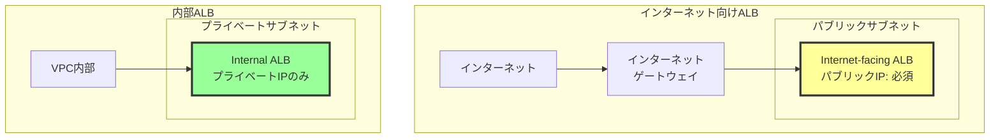
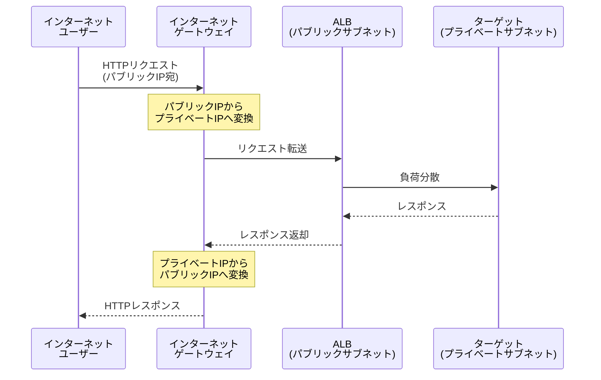
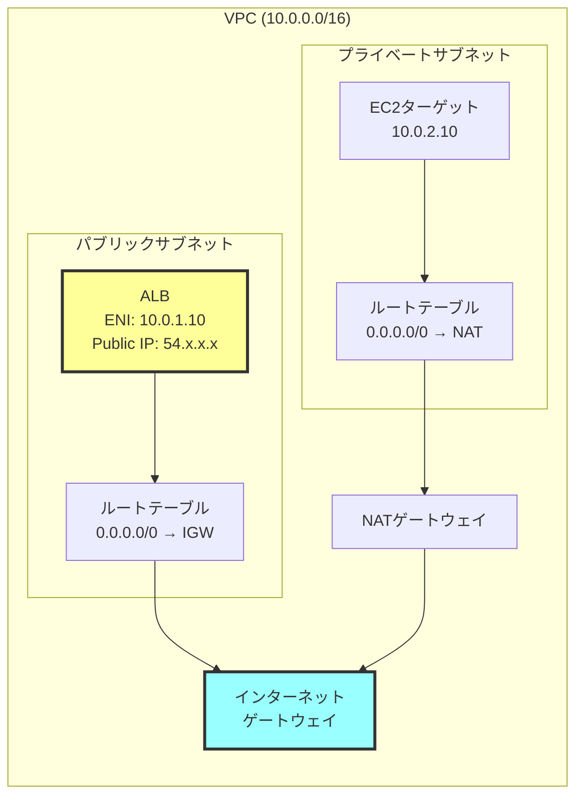
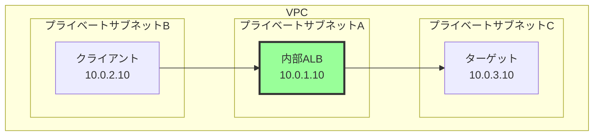
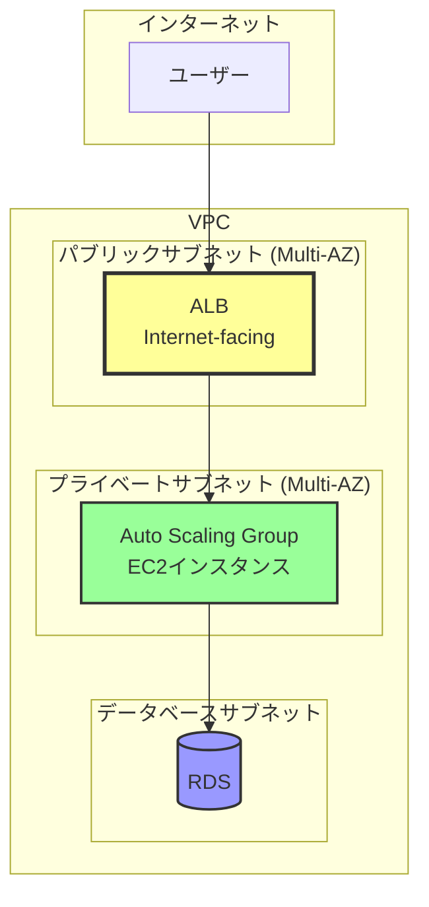
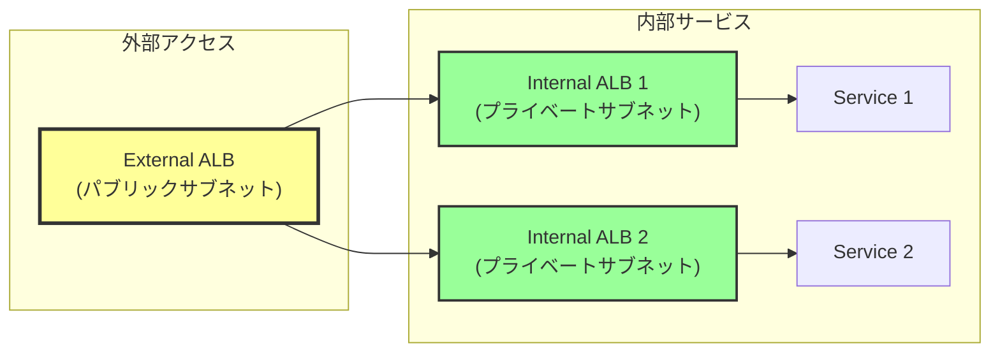

# なぜALBはパブリックサブネットに配置する必要があるのか

## What's this file?
> [!NOTE]
> **Why**
> 
> **なぜ**インターネット向けALBはパブリックサブネットに配置する必要があるのか

## Conclusion (忙しいとき向け)
> [!IMPORTANT]
> **Why** : **なぜ**インターネット向けALBはパブリックサブネットに配置する必要があるのか
> 
> **Answer** : ALBがインターネットからのトラフィックを受信するためには、パブリックIPアドレスとインターネットゲートウェイへの経路が必要だから。内部ALBの場合はプライベートサブネットでも可能

## 目次
<details>
<summary>目次を開く</summary>

- [ALBの種類と配置要件](#albの種類と配置要件)
- [インターネット向けALBの技術的要件](#インターネット向けalbの技術的要件)
- [内部ALBとの違い](#内部albとの違い)
- [設定パターンと実装例](#設定パターンと実装例)

</details>

## ALBの種類と配置要件

### ALBの2つのスキーム



### 配置要件の比較

| ALBタイプ | サブネット要件 | IPアドレス | アクセス元 | 用途 |
|-----------|---------------|------------|-----------|------|
| Internet-facing | パブリックサブネット必須 | パブリックIP | インターネット | 外部公開サービス |
| Internal | プライベートサブネット可 | プライベートIPのみ | VPC内部 | 内部サービス |

## インターネット向けALBの技術的要件

### パブリックサブネット配置が必須な理由



### 必要な要件
1. **パブリックIPアドレス**
   - インターネットからアクセス可能なIPアドレス
   - ALBのENI（Elastic Network Interface）に自動割り当て

2. **インターネットゲートウェイへの経路**
   - ルートテーブルに0.0.0.0/0 → IGWの設定が必要
   - 双方向通信のための経路確保

3. **DNSレコード**
   - ALBのDNS名がパブリックIPに解決される必要
   - Route 53などでのドメイン設定

### ネットワーク要件の詳細



## 内部ALBとの違い

### 内部ALBの配置パターン



### 内部ALBの特徴
- **プライベートIPのみ**: パブリックIPアドレスは不要
- **VPC内部通信**: インターネットゲートウェイ不要
- **柔軟な配置**: プライベートサブネットに配置可能
- **セキュリティ**: インターネットから直接アクセス不可

## 設定パターンと実装例

### パターン1: 典型的なWebアプリケーション構成



### パターン2: マイクロサービス構成



### Terraformによる実装例

```hcl
# インターネット向けALB
resource "aws_lb" "internet_facing" {
  name               = "external-alb"
  internal           = false  # インターネット向け
  load_balancer_type = "application"
  security_groups    = [aws_security_group.alb.id]
  
  # パブリックサブネットを指定（必須）
  subnets = [
    aws_subnet.public_1a.id,
    aws_subnet.public_1c.id
  ]
  
  enable_deletion_protection = false
  enable_http2              = true
}

# 内部ALB
resource "aws_lb" "internal" {
  name               = "internal-alb"
  internal           = true  # 内部向け
  load_balancer_type = "application"
  security_groups    = [aws_security_group.internal_alb.id]
  
  # プライベートサブネットでOK
  subnets = [
    aws_subnet.private_1a.id,
    aws_subnet.private_1c.id
  ]
}

# パブリックサブネットの定義
resource "aws_subnet" "public_1a" {
  vpc_id                  = aws_vpc.main.id
  cidr_block              = "10.0.1.0/24"
  availability_zone       = "ap-northeast-1a"
  map_public_ip_on_launch = true  # パブリックIP自動割り当て
}

# ルートテーブル（パブリック）
resource "aws_route" "public_internet" {
  route_table_id         = aws_route_table.public.id
  destination_cidr_block = "0.0.0.0/0"
  gateway_id             = aws_internet_gateway.main.id  # IGWへのルート
}
```

### トラブルシューティングチェックリスト

1. **ALBがアクセスできない場合**
   - [ ] ALBはパブリックサブネットに配置されているか
   - [ ] サブネットのルートテーブルにIGWへの経路があるか
   - [ ] セキュリティグループで適切なポートが開いているか
   - [ ] NACLで通信がブロックされていないか

2. **ヘルスチェック失敗の場合**
   - [ ] ターゲットのセキュリティグループがALBからの通信を許可しているか
   - [ ] ヘルスチェックのパスとポートが正しいか
   - [ ] ターゲットインスタンスが正常に起動しているか

## 関連
- [AWS ALB公式ドキュメント](https://docs.aws.amazon.com/elasticloadbalancing/latest/application/)
- [VPCのサブネット設計ベストプラクティス](https://docs.aws.amazon.com/vpc/latest/userguide/configure-subnets.html)
- [ALBのセキュリティベストプラクティス](https://docs.aws.amazon.com/elasticloadbalancing/latest/application/security_groups.html)