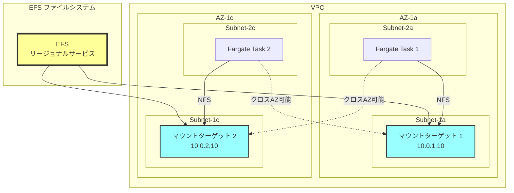
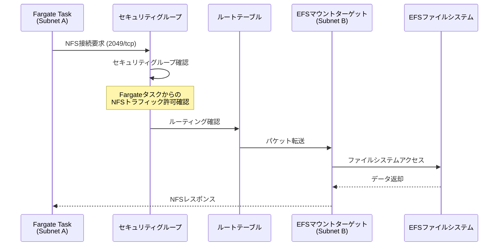
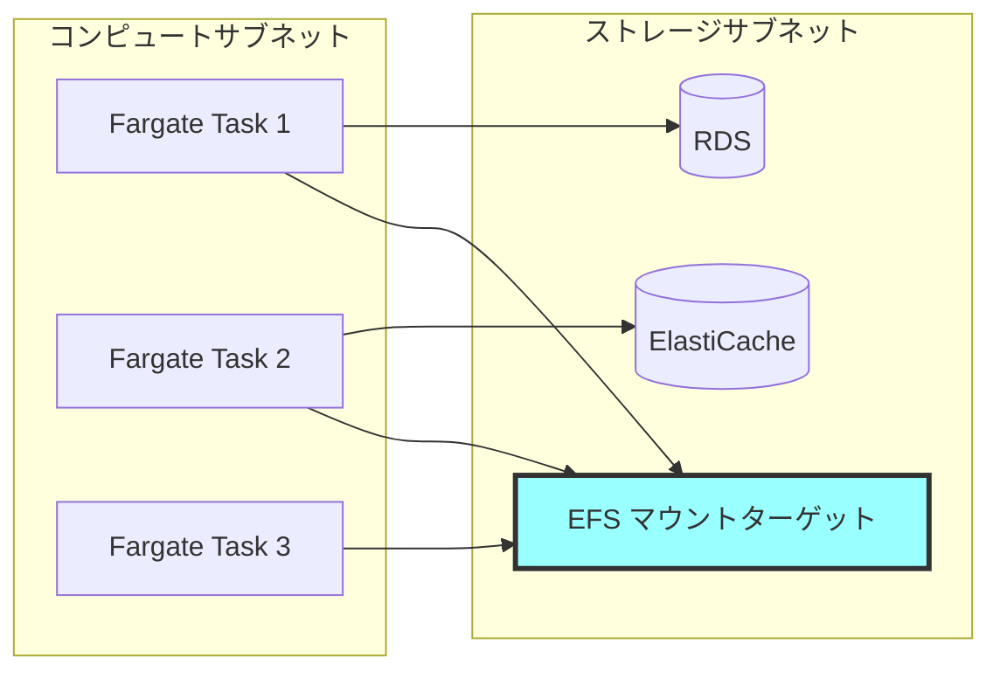
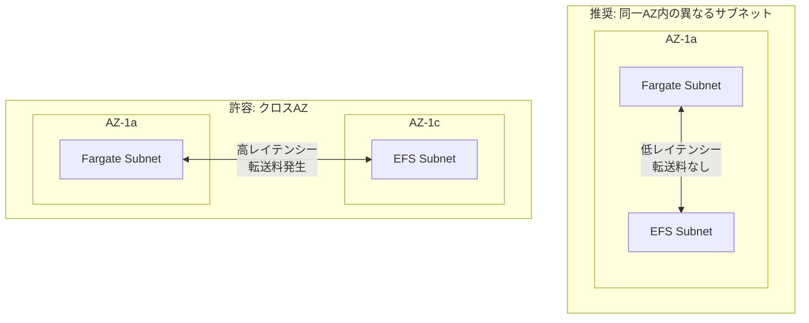
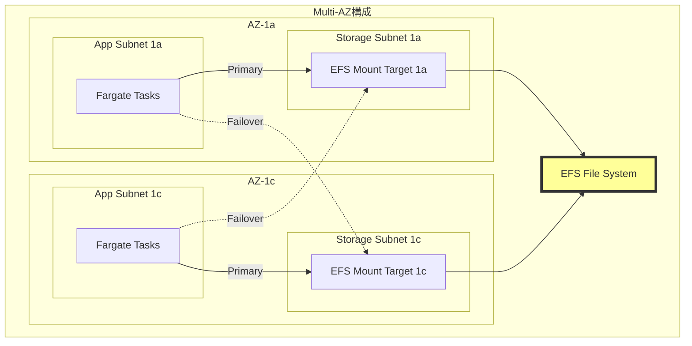
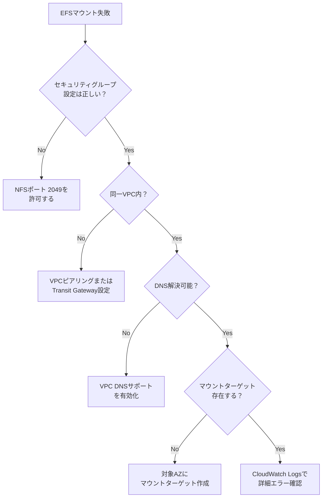

# なぜEFSはFargateと同じサブネットに配置する必要がないのか

## What's this file?
> [!NOTE]
> **Why**
> 
> **なぜ**EFSはAWS Fargateと同じサブネットに配置する必要がないのか

## Conclusion (忙しいとき向け)
> [!IMPORTANT]
> **Why** : **なぜ**EFSはAWS Fargateと同じサブネットに配置する必要がないのか
> 
> **Answer** : EFSはマウントターゲットを通じてアクセスされ、同一VPC内であれば異なるサブネットからでもNFSプロトコルで接続可能だから

## 目次
<details>
<summary>目次を開く</summary>

- [EFSのアーキテクチャ理解](#efsのアーキテクチャ理解)
- [FargateからEFSへの接続メカニズム](#fargateからefsへの接続メカニズム)
- [サブネット配置の考慮事項](#サブネット配置の考慮事項)
- [実装パターンとベストプラクティス](#実装パターンとベストプラクティス)

</details>

## EFSのアーキテクチャ理解

### EFSマウントターゲットの仕組み



### 重要な特性
1. **マウントターゲット経由のアクセス**: EFS自体はリージョナルサービスで、マウントターゲットを介してアクセス
2. **NFSプロトコル**: 標準的なNFSv4.1プロトコルを使用
3. **VPC内通信**: 同一VPC内であればサブネットをまたいでアクセス可能
4. **ENI（Elastic Network Interface）**: マウントターゲットはENIとして実装

## FargateからEFSへの接続メカニズム

### 接続フロー詳細



### 必要な設定要素
1. **セキュリティグループ設定**
   - FargateタスクのSG: アウトバウンドでNFS (2049/tcp)を許可
   - EFSマウントターゲットのSG: インバウンドでNFS (2049/tcp)を許可

2. **ネットワーク到達性**
   - 同一VPC内でルーティング可能
   - NACLsでNFSトラフィックがブロックされていない

3. **DNS解決**
   - EFSのDNS名が正しく解決される

## サブネット配置の考慮事項

### 異なるサブネット配置のメリット



### 配置戦略の比較

| 配置パターン | メリット | デメリット | 推奨シナリオ |
|-------------|----------|------------|--------------|
| 同一サブネット | レイテンシー最小 | リソース分離が困難 | 小規模環境 |
| 異なるサブネット（同一AZ） | 論理的分離、管理性向上 | 追加設定必要 | 一般的な本番環境 |
| 異なるAZ | 高可用性、障害分離 | クロスAZデータ転送料 | 高可用性要求環境 |

### パフォーマンス考慮事項



## 実装パターンとベストプラクティス

### 推奨構成例



### Terraformによる実装例

```hcl
# EFSファイルシステム
resource "aws_efs_file_system" "main" {
  creation_token = "my-efs"
  encrypted      = true
  
  tags = {
    Name = "fargate-efs"
  }
}

# EFS用サブネット（ストレージ層）
resource "aws_subnet" "storage_1a" {
  vpc_id            = aws_vpc.main.id
  cidr_block        = "10.0.10.0/24"
  availability_zone = "ap-northeast-1a"
  
  tags = {
    Name = "storage-subnet-1a"
    Type = "storage"
  }
}

# Fargate用サブネット（アプリケーション層）
resource "aws_subnet" "app_1a" {
  vpc_id            = aws_vpc.main.id
  cidr_block        = "10.0.20.0/24"
  availability_zone = "ap-northeast-1a"
  
  tags = {
    Name = "app-subnet-1a"
    Type = "application"
  }
}

# EFSマウントターゲット
resource "aws_efs_mount_target" "main_1a" {
  file_system_id  = aws_efs_file_system.main.id
  subnet_id       = aws_subnet.storage_1a.id  # ストレージサブネット
  security_groups = [aws_security_group.efs.id]
}

# セキュリティグループ（EFS用）
resource "aws_security_group" "efs" {
  name_prefix = "efs-mt-"
  vpc_id      = aws_vpc.main.id
  
  ingress {
    from_port       = 2049
    to_port         = 2049
    protocol        = "tcp"
    security_groups = [aws_security_group.fargate.id]  # Fargateからのみ許可
  }
}

# セキュリティグループ（Fargate用）
resource "aws_security_group" "fargate" {
  name_prefix = "fargate-task-"
  vpc_id      = aws_vpc.main.id
  
  egress {
    from_port   = 2049
    to_port     = 2049
    protocol    = "tcp"
    cidr_blocks = [aws_vpc.main.cidr_block]  # VPC内のEFSへアクセス
  }
}

# Fargateタスク定義でのEFSマウント
resource "aws_ecs_task_definition" "app" {
  family                   = "app"
  network_mode             = "awsvpc"
  requires_compatibilities = ["FARGATE"]
  
  volume {
    name = "efs-storage"
    
    efs_volume_configuration {
      file_system_id = aws_efs_file_system.main.id
      root_directory = "/"
    }
  }
}
```

### 設計上の推奨事項

1. **サブネット分離のメリット**
   - セキュリティグループの管理が明確
   - ネットワークACLによる追加制御が可能
   - 障害影響範囲の限定

2. **パフォーマンス最適化**
   - 同一AZ内のマウントターゲットを優先使用
   - 複数AZにマウントターゲットを配置して可用性確保
   - アクセスパターンに応じたプロビジョンドスループット設定

3. **コスト最適化**
   - クロスAZデータ転送を最小化
   - 不要なマウントターゲットの削除
   - EFSライフサイクル管理の活用

### トラブルシューティング



## 関連
- [AWS EFS公式ドキュメント](https://docs.aws.amazon.com/efs/)
- [Fargate with EFSベストプラクティス](https://docs.aws.amazon.com/AmazonECS/latest/developerguide/fargate-efs.html)
- [EFSパフォーマンスガイド](https://docs.aws.amazon.com/efs/latest/ug/performance.html)
- [VPCのセキュリティグループ設定](https://docs.aws.amazon.com/vpc/latest/userguide/VPC_SecurityGroups.html)