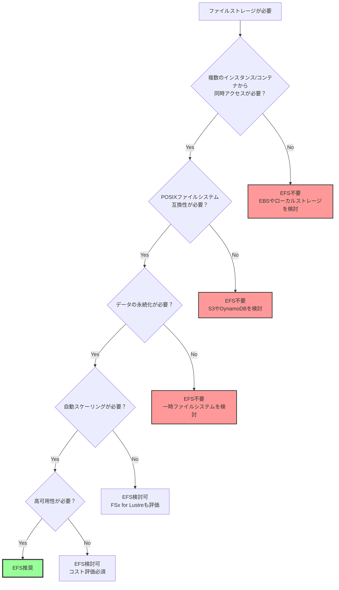
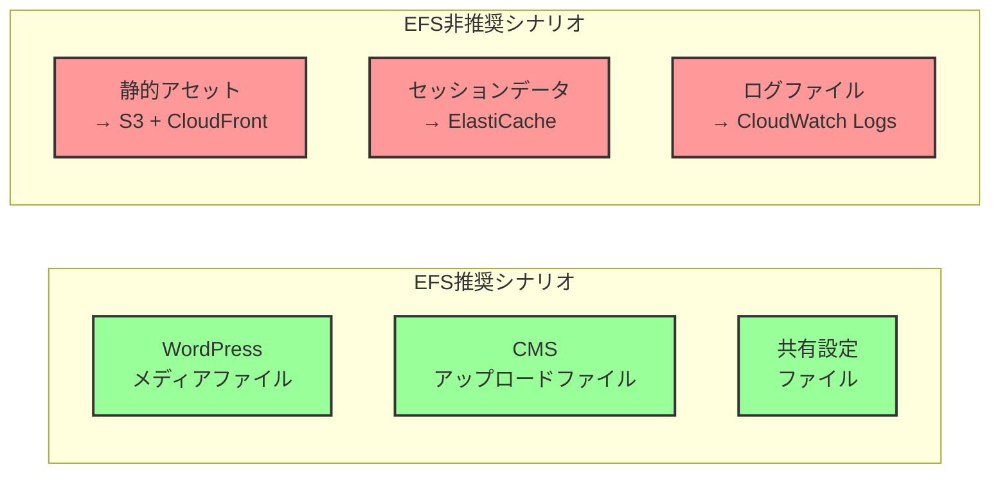
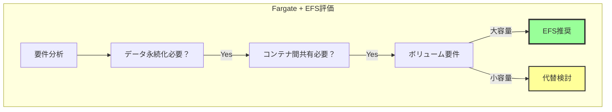
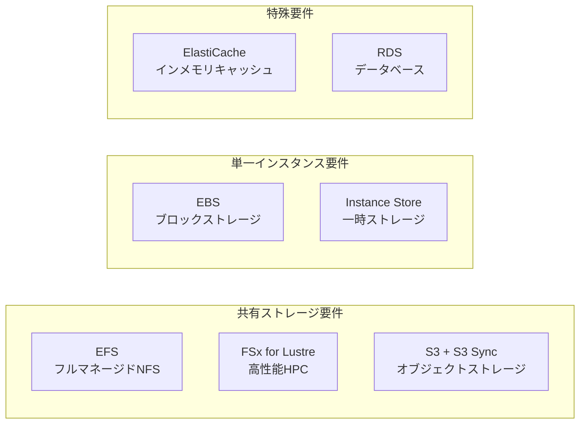
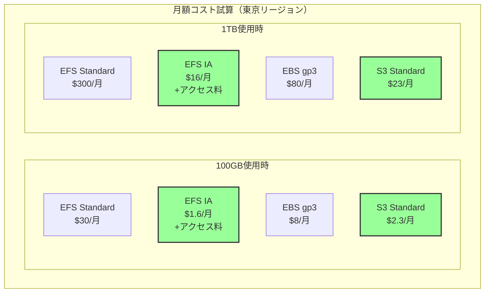
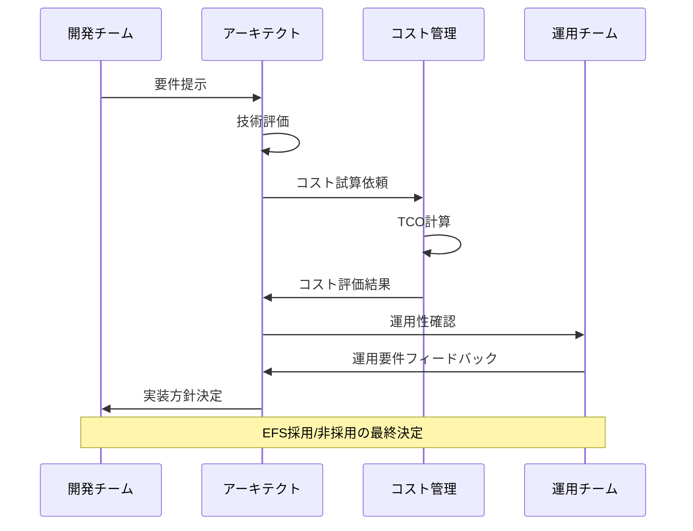

# EFSの必要性を判断する方法

## What's this file?
> [!NOTE]
> **How**
> 
> どのようにEFSの必要性を判断するかについて記載しています。

## Conclusion (忙しいとき向け)
> [!IMPORTANT]
> **How** : どのようにEFSの必要性を判断するか
> 
> **Answer** : 複数のコンテナ/インスタンス間でのファイル共有、永続的なデータ保存、並行アクセスの要件を評価し、コストとパフォーマンスを考慮して判断する

## 目次

<details>
<summary>目次を開く</summary>

- [EFS導入の判断基準](#efs導入の判断基準)
- [ユースケース別の評価方法](#ユースケース別の評価方法)
- [代替ソリューションとの比較](#代替ソリューションとの比較)
- [コストとパフォーマンスの考慮](#コストとパフォーマンスの考慮)

</details>

## EFS導入の判断基準

### 判断フローチャート



### 主要な判断要素

| 要素 | EFSが適している | EFSが不適切 |
|------|----------------|-------------|
| アクセスパターン | 複数インスタンスから同時読み書き | 単一インスタンスのみ |
| データの性質 | 共有設定ファイル、メディアファイル | 高頻度更新のデータベースファイル |
| パフォーマンス要件 | 中程度のレイテンシー許容 | 超低レイテンシー必須 |
| コスト感度 | ストレージ使用量に応じた課金OK | 固定費用を希望 |
| 管理負荷 | フルマネージドサービス希望 | 自己管理可能 |

## ユースケース別の評価方法

### ケース1: Webアプリケーションのコンテンツ管理



### ケース2: コンテナ化されたアプリケーション



### 評価チェックリスト

### EFS必要性評価チェックリスト

#### データ特性
- [ ] 複数のEC2/Fargateから同時アクセスが必要
- [ ] ファイルシステムのセマンティクスが必要
- [ ] データの永続化が必要
- [ ] 自動バックアップが必要

#### パフォーマンス要件
- [ ] 読み取り重視のワークロード
- [ ] レイテンシー要件は中程度で許容可能
- [ ] スループットの自動スケーリングが必要

#### 運用要件
- [ ] マネージドサービスが必須
- [ ] Multi-AZ対応が必要
- [ ] 容量の事前プロビジョニング不要

#### コスト要件
- [ ] 使用量ベースの課金モデルが適切
- [ ] アクセス頻度に応じた階層化が有効

## 代替ソリューションとの比較

### ストレージオプション比較マトリックス



### 詳細比較表

| 特性 | EFS | EBS | S3 | FSx |
|------|-----|-----|-----|-----|
| 共有アクセス | ✅ 複数同時 | ❌ 単一のみ | ✅ API経由 | ✅ 複数同時 |
| プロトコル | NFS v4.1 | ブロックレベル | REST/SDK | Lustre/Windows |
| レイテンシー | ミリ秒 | マイクロ秒 | 数十ミリ秒 | マイクロ秒 |
| スケーラビリティ | ペタバイト級 | 64TiB | 無制限 | ペタバイト級 |
| 料金体系 | 使用量課金 | 容量課金 | 使用量課金 | 容量課金 |
| ユースケース | 共有ファイル | OS/DB | 静的コンテンツ | HPC/ML |

## コストとパフォーマンスの考慮

### コスト計算例



### パフォーマンス最適化の判断

### EFSパフォーマンスモード選択

| モード | レイテンシー | スループット | 用途 |
|------|-----------|----------|------|
| **General Purpose**（推奨） | 最小 | 制限あり | 一般的なファイル共有 |
| **Max I/O** | やや高い | 高い | 大規模並列処理 |

#### Provisioned Throughput検討項目
- [ ] ベースラインを超える一定のスループットが必要
- [ ] バースト残高の枯渇を回避したい
- [ ] 予測可能なパフォーマンスが必要

### 実装決定フロー



### 段階的導入アプローチ

1. **PoC実施**
   ```bash
   # 小規模環境でEFSをテスト
   aws efs create-file-system \
     --creation-token poc-test \
     --performance-mode generalPurpose \
     --throughput-mode bursting
   ```

2. **パフォーマンステスト**
   ```bash
   # fioを使用したベンチマーク
   fio --name=randwrite --ioengine=libaio \
     --iodepth=32 --rw=randwrite --bs=4k \
     --direct=1 --size=1G --numjobs=8
   ```

3. **コスト監視**
   - CloudWatchでの使用量追跡
   - Cost Explorerでの分析
   - 予算アラートの設定

4. **本番展開判断**
   - PoCの結果評価
   - スケーラビリティ確認
   - 災害復旧計画の策定

## 関連
- [AWS EFS料金計算ツール](https://calculator.aws/#/createCalculator/EFS)
- [EFSパフォーマンスガイド](https://docs.aws.amazon.com/efs/latest/ug/performance.html)
- [AWSストレージオプション比較](https://docs.aws.amazon.com/whitepapers/latest/aws-storage-services-overview/introduction.html)
- [Well-Architectedフレームワーク - ストレージ選択](https://docs.aws.amazon.com/wellarchitected/latest/framework/perf_data_storage.html)