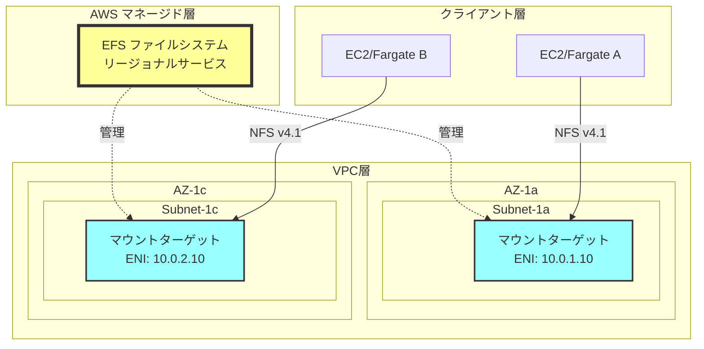
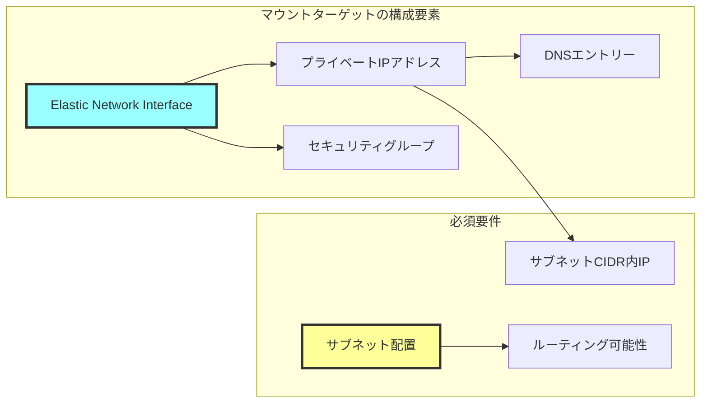
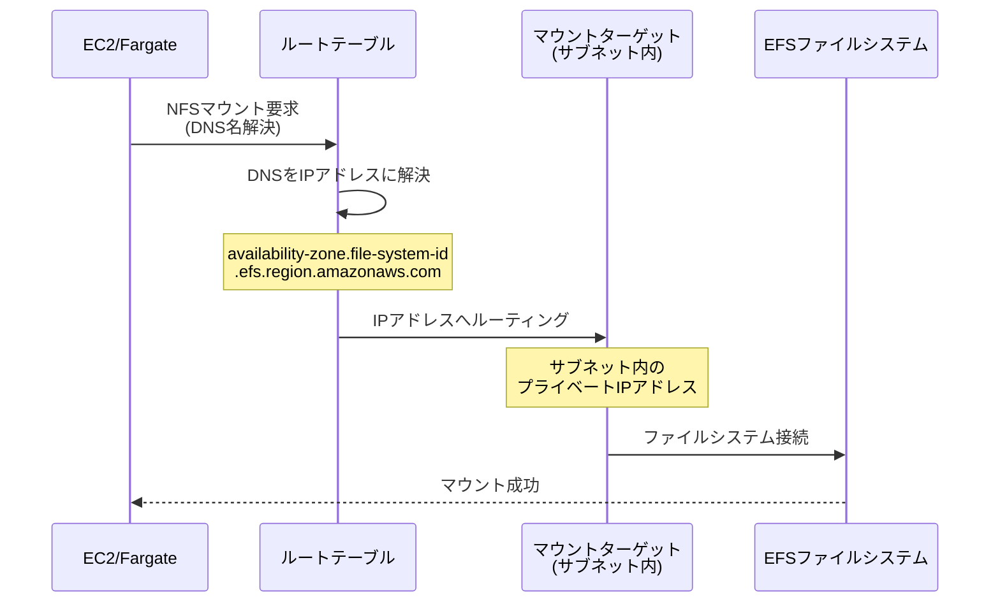
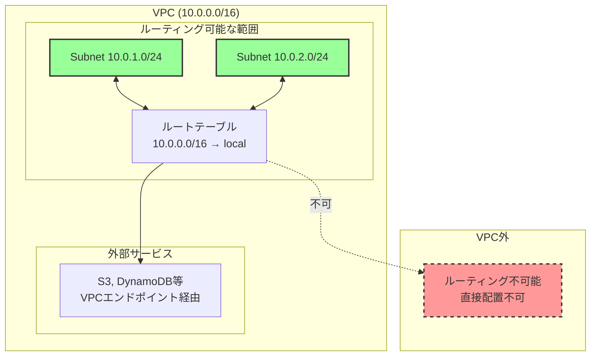
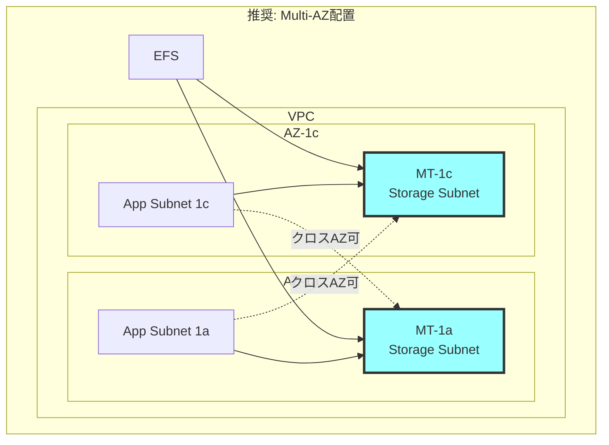
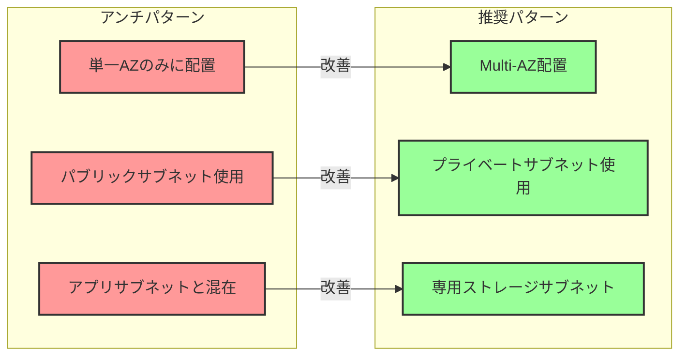

# なぜEFSマウントターゲットはサブネット内に配置する必要があるのか

## What's this file?
> [!NOTE]
> **Why**
> 
> **なぜ**EFSマウントターゲットはサブネット内に配置する必要があるのか

## Conclusion (忙しいとき向け)
> [!IMPORTANT]
> **Why** : **なぜ**EFSマウントターゲットはサブネット内に配置する必要があるのか
> 
> **Answer** : EFSマウントターゲットはENI（Elastic Network Interface）として実装され、VPC内のリソースからNFSプロトコルでアクセスするためのエンドポイントとして機能するため、必ずサブネット内に配置される必要がある

## 目次
<details>
<summary>目次を開く</summary>

- [EFSとマウントターゲットのアーキテクチャ](#efsとマウントターゲットのアーキテクチャ)
- [マウントターゲットの技術的要件](#マウントターゲットの技術的要件)
- [サブネット配置の必然性](#サブネット配置の必然性)
- [設計上の考慮事項](#設計上の考慮事項)

</details>

## EFSとマウントターゲットのアーキテクチャ

### EFSの二層構造



### アーキテクチャの特徴
1. **EFS本体**: リージョナルサービスとしてAWSインフラ上に存在
2. **マウントターゲット**: VPC内のサブネットに配置されるアクセスポイント
3. **ENIベース**: 各マウントターゲットはENIとして実装
4. **NFSエンドポイント**: NFSプロトコルでのアクセスを提供

## マウントターゲットの技術的要件

### ENIとしての実装詳細



### 技術的制約
1. **IPアドレス割り当て**
   - サブネットのCIDRブロックからIPアドレスが必要
   - VPC外部からはプライベートIPアドレスを割り当て不可

2. **ネットワークインターフェース**
   - ENIはサブネットに紐づく必要がある
   - AWSのネットワーク仮想化はサブネットレベルで実装

3. **セキュリティ制御**
   - セキュリティグループはVPC内のリソースにのみ適用可能
   - NACLsはサブネットレベルで適用

## サブネット配置の必然性

### ネットワーク到達性の確保



### VPCネットワーキングの原則



### 必須となる理由
1. **IPアドレッシング**: VPC内でルーティング可能なIPアドレスが必要
2. **ネットワーク分離**: VPCによるネットワーク分離の実現
3. **セキュリティ境界**: VPC/サブネットレベルでのアクセス制御
4. **AWSアーキテクチャ**: ENIはサブネットに属する設計

## 設計上の考慮事項

### マウントターゲット配置戦略



### サブネット選択の基準

| 考慮事項 | 推奨事項 | 理由 |
|---------|----------|------|
| AZ配置 | 各AZに1つのマウントターゲット | 高可用性とレイテンシー最適化 |
| サブネットタイプ | プライベートサブネット | インターネット露出不要 |
| 専用サブネット | ストレージ層として分離 | セキュリティとネットワーク管理 |
| IPアドレス | 各サブネットに予約IP確保 | 枯渇防止 |

### Terraformでの実装例

```hcl
# EFSファイルシステム
resource "aws_efs_file_system" "main" {
  creation_token = "my-efs"
  
  tags = {
    Name = "main-efs"
  }
}

# ストレージ用サブネット（マウントターゲット配置用）
resource "aws_subnet" "storage" {
  for_each = {
    "1a" = { az = "ap-northeast-1a", cidr = "10.0.10.0/24" }
    "1c" = { az = "ap-northeast-1c", cidr = "10.0.11.0/24" }
  }
  
  vpc_id            = aws_vpc.main.id
  cidr_block        = each.value.cidr
  availability_zone = each.value.az
  
  tags = {
    Name = "storage-subnet-${each.key}"
    Type = "storage"
  }
}

# マウントターゲット（各サブネットに配置）
resource "aws_efs_mount_target" "main" {
  for_each = aws_subnet.storage
  
  file_system_id  = aws_efs_file_system.main.id
  subnet_id       = each.value.id  # サブネット内に配置（必須）
  security_groups = [aws_security_group.efs_mt.id]
}

# セキュリティグループ（マウントターゲット用）
resource "aws_security_group" "efs_mt" {
  name_prefix = "efs-mt-"
  vpc_id      = aws_vpc.main.id  # VPC内でのみ有効
  
  ingress {
    from_port   = 2049
    to_port     = 2049
    protocol    = "tcp"
    cidr_blocks = [aws_vpc.main.cidr_block]  # VPC内からのみ許可
  }
}
```

### アンチパターンと回避策



### まとめ
EFSマウントターゲットがサブネット内に配置される必要があるのは、AWSのネットワーキングアーキテクチャの基本原則に基づいています。ENIとして実装されるマウントターゲットは、VPC内でルーティング可能なIPアドレスを持ち、セキュリティグループによる制御を受けるため、必然的にサブネット内に存在する必要があります。

## 関連
- [AWS EFS マウントターゲット作成ガイド](https://docs.aws.amazon.com/efs/latest/ug/accessing-fs.html)
- [VPCとサブネットの基礎](https://docs.aws.amazon.com/vpc/latest/userguide/configure-subnets.html)
- [ENI（Elastic Network Interface）詳細](https://docs.aws.amazon.com/AWSEC2/latest/UserGuide/using-eni.html)