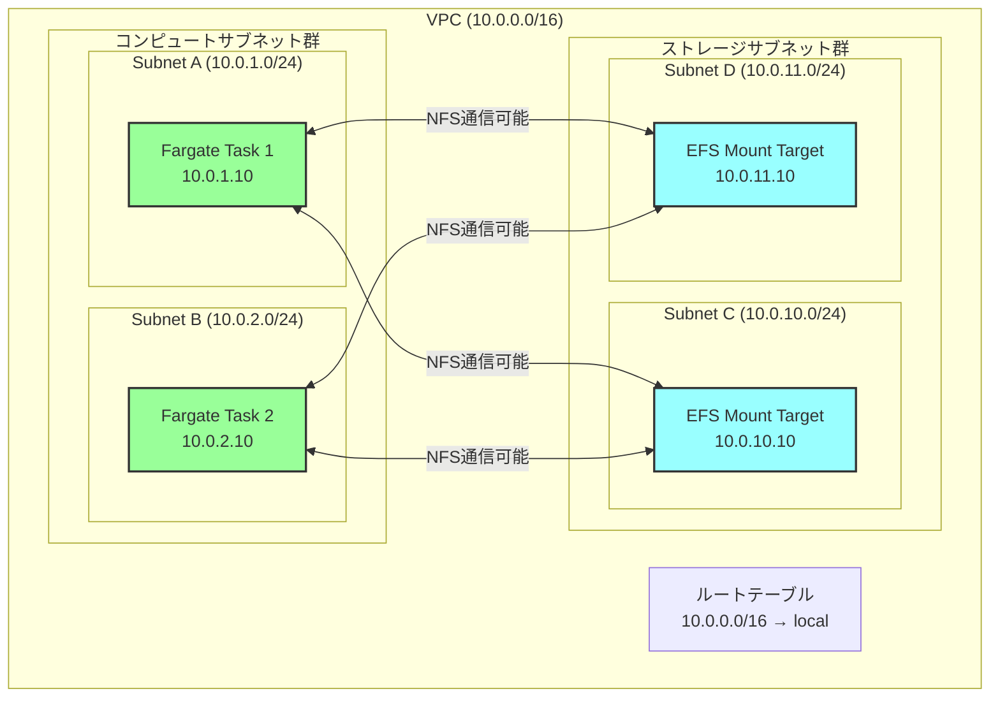
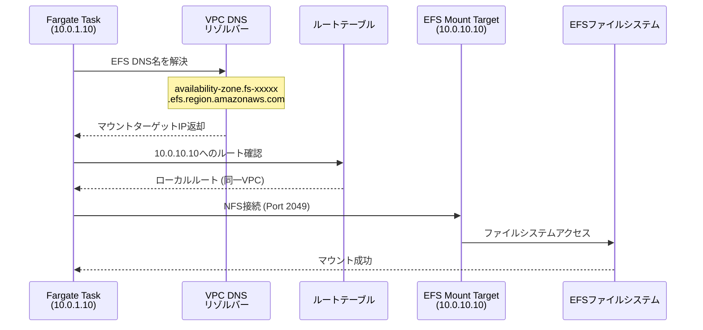
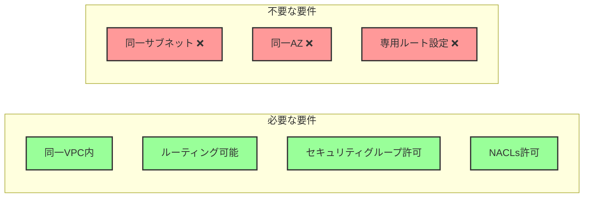
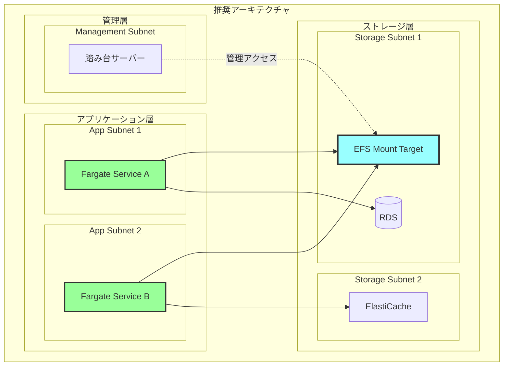
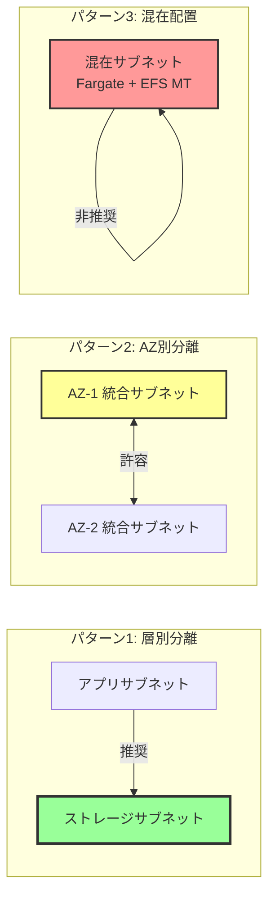

# なぜEFSマウントターゲットはFargateタスクと同じサブネットに存在する必要がないのか

## What's this file?
> [!NOTE]
> **Why**
> 
> **なぜ**EFSマウントターゲットはFargateタスクと同じサブネットに存在する必要がないのか

## Conclusion (忙しいとき向け)
> [!IMPORTANT]
> **Why** : **なぜ**EFSマウントターゲットはFargateタスクと同じサブネットに存在する必要がないのか
> 
> **Answer** : EFSマウントターゲットは同一VPC内であればNFSプロトコルを通じてサブネットをまたいでアクセス可能であり、むしろ別サブネットに配置することでネットワーク分離とセキュリティ向上が図れるため

## 目次
<details>
<summary>目次を開く</summary>

- [VPC内ネットワーキングの基本原則](#vpc内ネットワーキングの基本原則)
- [EFSとFargateの接続メカニズム](#efsとfargateの接続メカニズム)
- [別サブネット配置のメリット](#別サブネット配置のメリット)
- [実装パターンとベストプラクティス](#実装パターンとベストプラクティス)

</details>

## VPC内ネットワーキングの基本原則

### VPC内の通信ルール



### 基本原則
1. **同一VPC内通信**: デフォルトで全サブネット間で通信可能
2. **ローカルルート**: VPC CIDRへのルートは自動的に設定
3. **プロトコル非依存**: TCP/UDP含むすべてのプロトコルで通信可能
4. **セキュリティグループ制御**: 通信はSGとNACLで制御

## EFSとFargateの接続メカニズム

### NFSプロトコルによる接続



### 技術的な通信要件



## 別サブネット配置のメリット

### ネットワーク分離による利点



### メリット一覧

| カテゴリ | メリット | 詳細 |
|---------|----------|------|
| セキュリティ | 層別アクセス制御 | アプリ層とストレージ層を分離してセキュリティ強化 |
| 管理性 | 明確な責任分界 | サブネット単位でのリソース管理が容易 |
| 拡張性 | 独立したスケーリング | アプリとストレージを独立して拡張可能 |
| 監視 | トラフィック分析 | VPC Flow Logsで層間通信を可視化 |
| コスト | AZ内通信の最適化 | 同一AZ内のMTを優先的に使用してコスト削減 |

## 実装パターンとベストプラクティス

### 推奨構成パターン



### Terraformによる実装例

```hcl
# VPCとサブネット定義
locals {
  vpc_cidr = "10.0.0.0/16"
  azs      = ["ap-northeast-1a", "ap-northeast-1c"]
}

# アプリケーション用サブネット
resource "aws_subnet" "app" {
  count             = length(local.azs)
  vpc_id            = aws_vpc.main.id
  cidr_block        = "10.0.${count.index + 1}.0/24"
  availability_zone = local.azs[count.index]
  
  tags = {
    Name = "app-subnet-${local.azs[count.index]}"
    Type = "application"
  }
}

# ストレージ用サブネット（EFSマウントターゲット配置用）
resource "aws_subnet" "storage" {
  count             = length(local.azs)
  vpc_id            = aws_vpc.main.id
  cidr_block        = "10.0.${count.index + 10}.0/24"
  availability_zone = local.azs[count.index]
  
  tags = {
    Name = "storage-subnet-${local.azs[count.index]}"
    Type = "storage"
  }
}

# EFSマウントターゲット（ストレージサブネットに配置）
resource "aws_efs_mount_target" "main" {
  count           = length(local.azs)
  file_system_id  = aws_efs_file_system.main.id
  subnet_id       = aws_subnet.storage[count.index].id
  security_groups = [aws_security_group.efs_mt.id]
}

# Fargateタスク定義（アプリケーションサブネットで実行）
resource "aws_ecs_service" "app" {
  name            = "app-service"
  cluster         = aws_ecs_cluster.main.id
  task_definition = aws_ecs_task_definition.app.arn
  
  network_configuration {
    subnets         = aws_subnet.app[*].id  # アプリサブネット
    security_groups = [aws_security_group.fargate.id]
  }
}

# セキュリティグループ（Fargate → EFS通信許可）
resource "aws_security_group_rule" "fargate_to_efs" {
  type                     = "egress"
  from_port                = 2049
  to_port                  = 2049
  protocol                 = "tcp"
  source_security_group_id = aws_security_group.efs_mt.id
  security_group_id        = aws_security_group.fargate.id
  description              = "Allow NFS to EFS mount targets"
}

resource "aws_security_group_rule" "efs_from_fargate" {
  type                     = "ingress"
  from_port                = 2049
  to_port                  = 2049
  protocol                 = "tcp"
  source_security_group_id = aws_security_group.fargate.id
  security_group_id        = aws_security_group.efs_mt.id
  description              = "Allow NFS from Fargate tasks"
}
```

### パフォーマンス最適化のポイント

#### EFS接続の最適化設定

**DNS設定**
- AZごとのマウントターゲットDNS名を使用
- 例: `us-east-1a.fs-xxxxx.efs.us-east-1.amazonaws.com`

**マウントオプション**

| オプション | 値 | 説明 |
|----------|-----|------|
| nfsvers | 4.1 | NFSバージョン指定 |
| rsize | 1048576 | 読み取りバッファサイズ |
| wsize | 1048576 | 書き込みバッファサイズ |
| hard | - | ハードマウント |
| timeo | 600 | タイムアウト設定 |
| retrans | 2 | 再送信回数 |

**ネットワーク最適化**
- 同一AZ内のマウントターゲットを優先
- クロスAZ通信は障害時のフェイルオーバー用

### トラブルシューティングチェックリスト

1. **接続できない場合**
   - [ ] FargateタスクとEFSマウントターゲットが同一VPC内か
   - [ ] セキュリティグループでNFS (2049/tcp)が許可されているか
   - [ ] サブネットのルートテーブルが正しく設定されているか
   - [ ] NACLsでNFSトラフィックがブロックされていないか

2. **パフォーマンスが悪い場合**
   - [ ] 同一AZ内のマウントターゲットを使用しているか
   - [ ] 適切なマウントオプションが設定されているか
   - [ ] EFSのパフォーマンスモードが適切か

## 関連
- [AWS EFS with Fargate統合ガイド](https://docs.aws.amazon.com/AmazonECS/latest/developerguide/fargate-efs.html)
- [VPCのサブネット設計ベストプラクティス](https://docs.aws.amazon.com/vpc/latest/userguide/configure-subnets.html)
- [EFSパフォーマンス最適化](https://docs.aws.amazon.com/efs/latest/ug/performance.html)