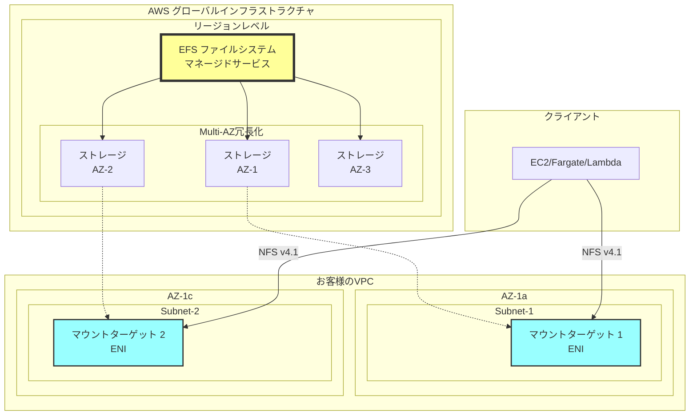
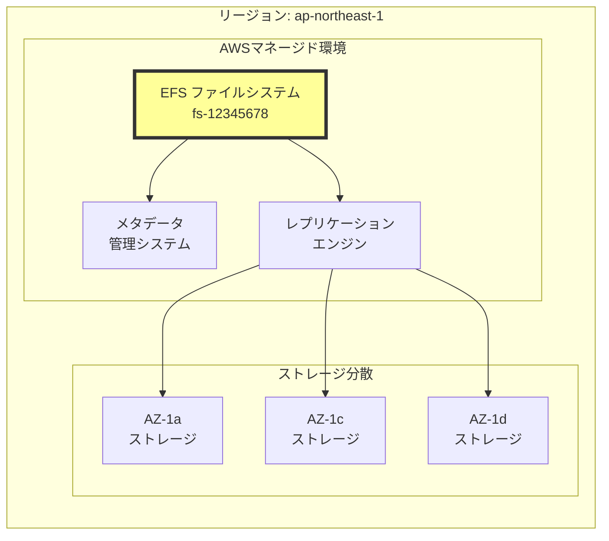
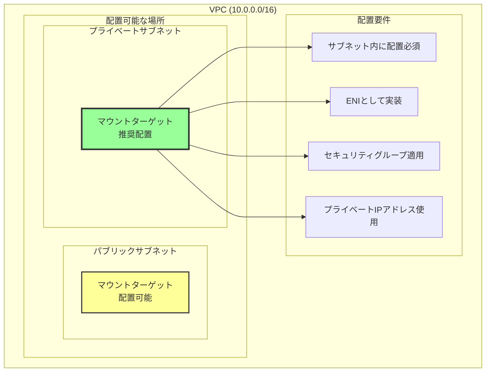
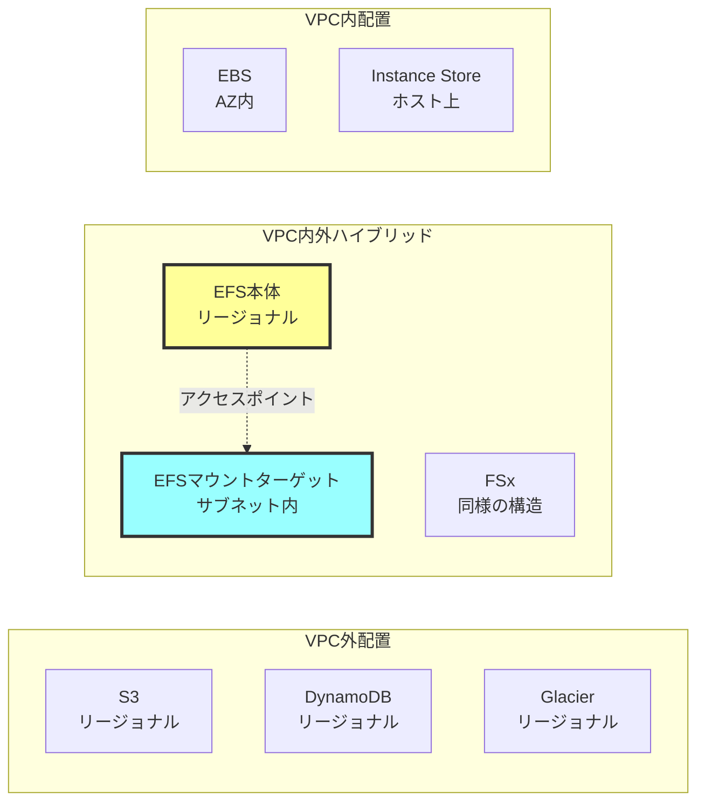
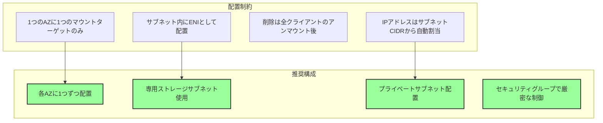
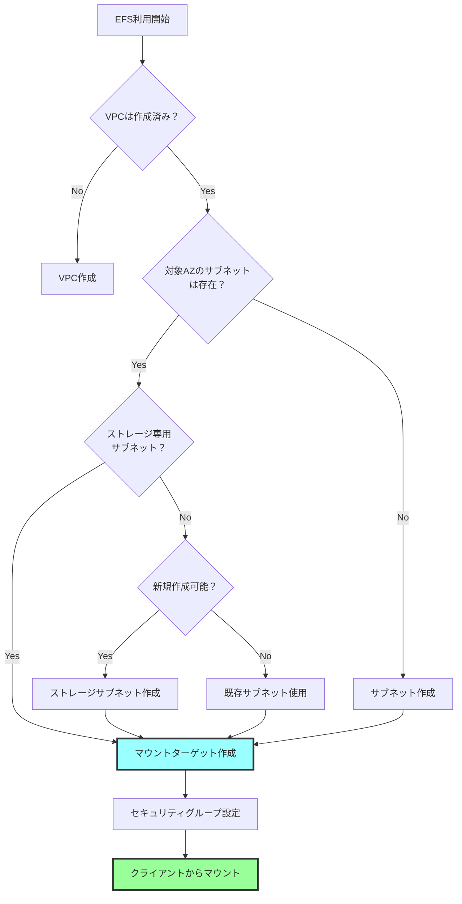
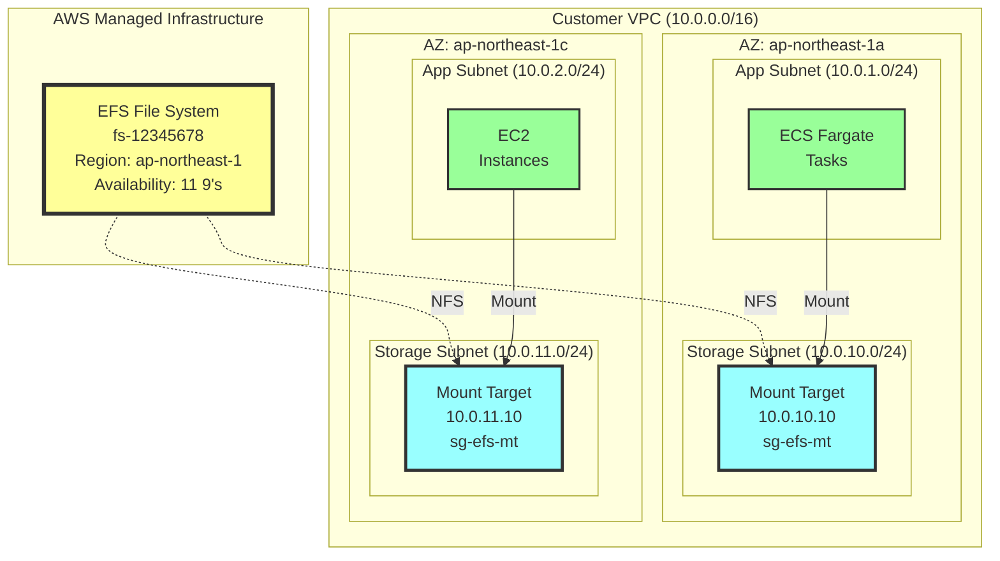

# EFSのAWSアーキテクチャにおける配置場所

## What's this file?
> [!NOTE]
> **What**
> 
> EFSがAWSアーキテクチャのどこに配置されるかについて記載しています。

## Conclusion (忙しいとき向け)
> [!IMPORTANT]
> **What** : EFSがAWSアーキテクチャのどこに配置されるか
> 
> **Answer** : EFS本体はAWSマネージドインフラに存在し、マウントターゲットがVPC内の各サブネットに配置される二層構造となっている

## 目次

<details>
<summary>目次を開く</summary>

- [EFSの階層構造](#efsの階層構造)
- [各コンポーネントの配置場所](#各コンポーネントの配置場所)
- [他のAWSサービスとの配置比較](#他のawsサービスとの配置比較)
- [配置に関する制約と要件](#配置に関する制約と要件)

</details>

## EFSの階層構造

### EFSの全体アーキテクチャ



### 配置レイヤーの詳細

| レイヤー | コンポーネント | 配置場所 | 管理主体 |
|---------|---------------|----------|----------|
| サービス層 | EFSファイルシステム | AWSリージョン | AWS完全管理 |
| データ層 | 実データストレージ | 複数AZに分散 | AWS完全管理 |
| アクセス層 | マウントターゲット | VPC内サブネット | 顧客が配置指定 |
| クライアント層 | EC2/Fargate等 | VPC内サブネット | 顧客管理 |

## 各コンポーネントの配置場所

### EFSファイルシステム本体



### マウントターゲットの配置



## 他のAWSサービスとの配置比較

### ストレージサービスの配置比較



### サービス配置の特徴比較

| サービス | 本体の配置 | アクセスポイント | VPC要件 | 特徴 |
|----------|-----------|----------------|---------|------|
| EFS | AWSインフラ | VPC内マウントターゲット | 必須 | NFSプロトコル |
| S3 | AWSインフラ | インターネット/VPCエンドポイント | 不要 | RESTful API |
| EBS | AZ内 | 直接アタッチ | 必須 | ブロックデバイス |
| RDS | VPC内サブネット | ENI | 必須 | データベースエンジン |

## 配置に関する制約と要件

### マウントターゲット配置の制約



### 配置決定フローチャート



### 実装時の配置例



### DNS名前解決と配置の関係

```bash
# EFSのDNS名構造
# ファイルシステムDNS名（リージョンレベル）
fs-12345678.efs.ap-northeast-1.amazonaws.com

# AZ固有のマウントターゲットDNS名
ap-northeast-1a.fs-12345678.efs.ap-northeast-1.amazonaws.com
→ 10.0.10.10 (マウントターゲットのプライベートIP)

ap-northeast-1c.fs-12345678.efs.ap-northeast-1.amazonaws.com
→ 10.0.11.10 (マウントターゲットのプライベートIP)
```

## 関連

- [AWS EFS アーキテクチャ概要](https://docs.aws.amazon.com/efs/latest/ug/how-it-works.html)
- [VPCとサブネットの基礎](https://docs.aws.amazon.com/vpc/latest/userguide/configure-subnets.html)
- [EFSマウントターゲット作成ガイド](https://docs.aws.amazon.com/efs/latest/ug/accessing-fs.html)
- [AWSストレージサービスの選択](https://docs.aws.amazon.com/whitepapers/latest/aws-storage-services-overview/introduction.html)
