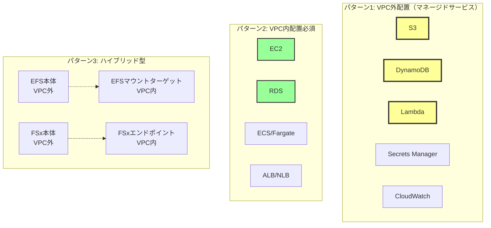
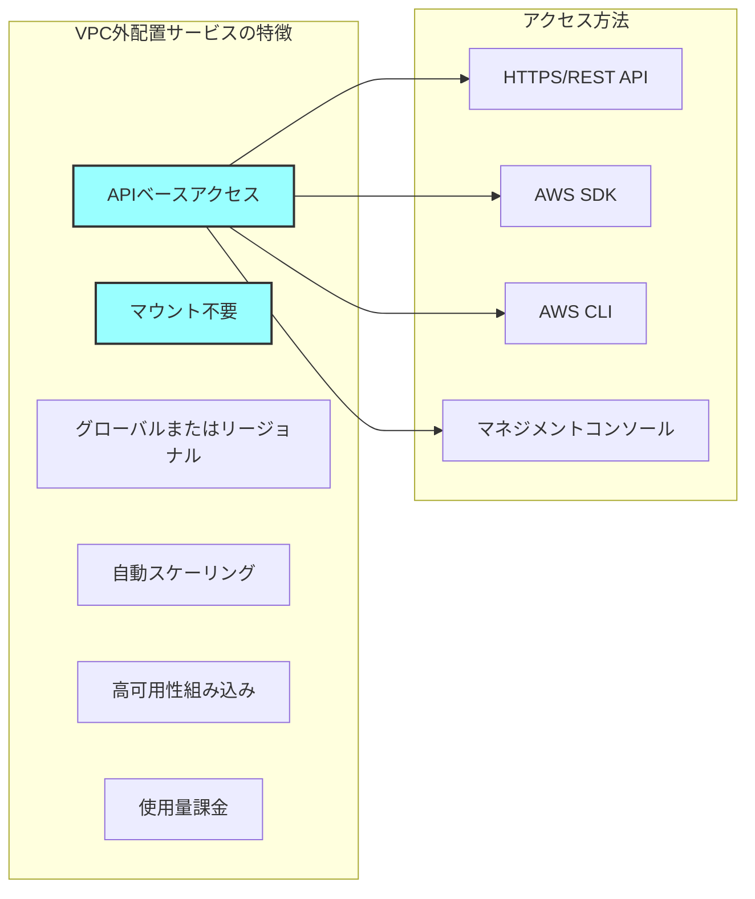
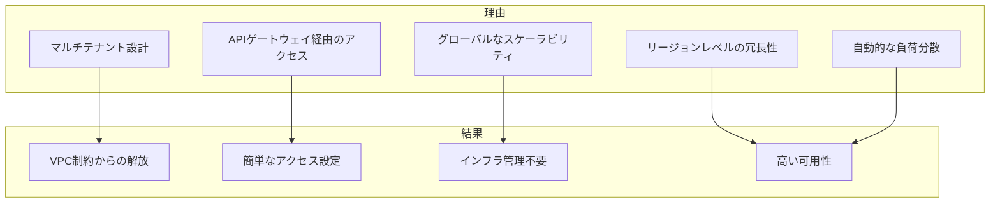
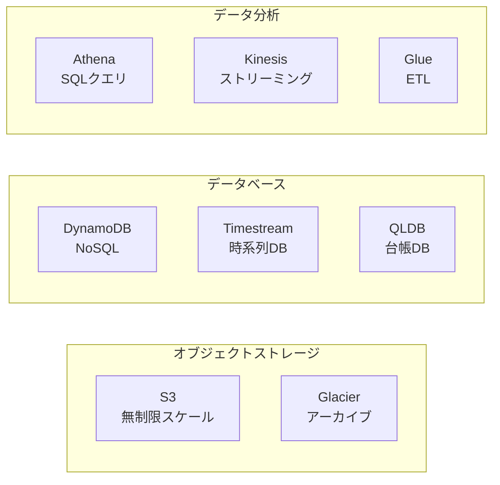
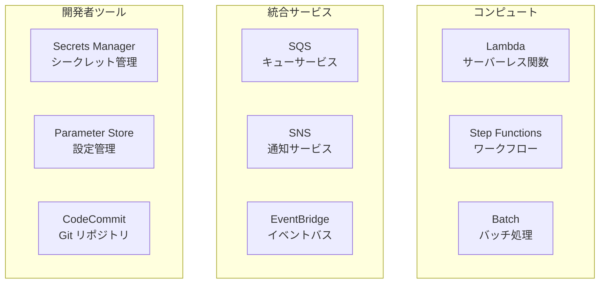
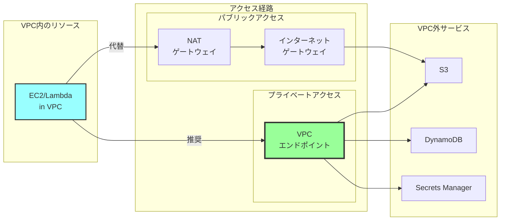
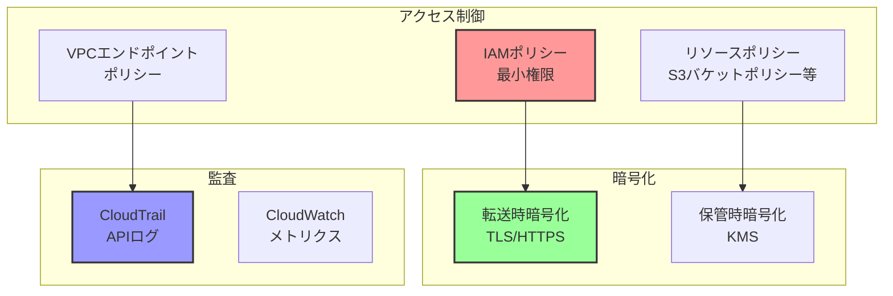
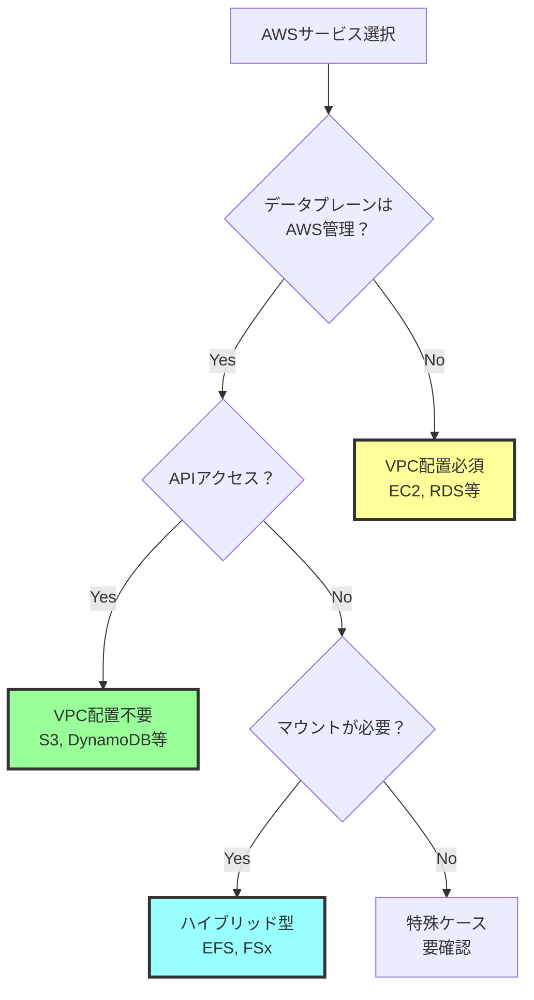

# VPCやサブネットへの配置が不要なAWSマネージドサービス

## What's this file?
> [!NOTE]
> **What**
> 
> VPCやサブネットへの配置が不要なAWSマネージドサービスとは何かについて記載しています。

## Conclusion (忙しいとき向け)
> [!IMPORTANT]
> **What** : VPCやサブネットへの配置が不要なAWSマネージドサービスとは何か
> 
> **Answer** : S3、DynamoDB、Lambda、Secrets Managerなど、AWSが完全に管理し、APIやSDK経由でアクセスするサービス群。これらはVPC外のAWSインフラ上で動作し、マウントや配置の概念がない

## 目次

<details>
<summary>目次を開く</summary>

- [AWSサービスの配置パターン分類](#awsサービスの配置パターン分類)
- [VPC外配置サービスの特徴](#vpc外配置サービスの特徴)
- [主要なVPC外配置サービス一覧](#主要なvpc外配置サービス一覧)
- [アクセス方法とセキュリティ](#アクセス方法とセキュリティ)

</details>

## AWSサービスの配置パターン分類

### サービス配置の3つのパターン



### 配置パターンの特徴比較

| パターン | 配置場所 | アクセス方法 | 管理責任 | 例 |
|---------|----------|-------------|----------|-----|
| VPC外配置 | AWSインフラ | API/SDK | AWS完全管理 | S3, DynamoDB |
| VPC内配置 | 顧客VPC | 直接接続 | 共同責任 | EC2, RDS |
| ハイブリッド | 両方 | 専用エンドポイント | 混合 | EFS, FSx |

## VPC外配置サービスの特徴

### 共通特性



### VPC配置が不要な理由



## 主要なVPC外配置サービス一覧

### ストレージサービス



### アプリケーションサービス



### 監視・管理サービス

| サービス | 用途 | アクセス方法 | 特徴 |
|---------|------|-------------|------|
| CloudWatch | ログ・メトリクス | API/SDK | 自動収集 |
| CloudTrail | 監査ログ | API/SDK | 全APIコール記録 |
| X-Ray | 分散トレース | API/SDK | アプリ性能分析 |
| Config | リソース構成管理 | API/SDK | 変更追跡 |
| Systems Manager | 運用管理 | API/SDK | 統合管理 |

## アクセス方法とセキュリティ

### アクセスパターン



### VPCエンドポイントの種類

#### ゲートウェイエンドポイント（無料）

| サービス | ルートテーブル更新 | コスト |
|---------|-----------------|------|
| S3 | 必須 | 無料 |
| DynamoDB | 必須 | 無料 |

#### インターフェースエンドポイント（有料）

| サービス | DNS解決 | コスト |
|---------|----------|------|
| Secrets Manager | プライベート | 時間単位 + データ転送 |
| Lambda | プライベート | 時間単位 + データ転送 |
| SNS | プライベート | 時間単位 + データ転送 |

### セキュリティベストプラクティス



### 実装例：VPC外サービスへのアクセス

```python
# VPC配置不要なサービスへのアクセス例
import boto3

# S3（VPC外）
s3 = boto3.client('s3')
response = s3.get_object(Bucket='my-bucket', Key='my-key')

# DynamoDB（VPC外）
dynamodb = boto3.resource('dynamodb')
table = dynamodb.Table('my-table')
response = table.get_item(Key={'id': '123'})

# Secrets Manager（VPC外）
sm = boto3.client('secretsmanager')
secret = sm.get_secret_value(SecretId='my-secret')

# Lambda（VPC外で実行）
lambda_client = boto3.client('lambda')
response = lambda_client.invoke(
    FunctionName='my-function',
    Payload=json.dumps({'key': 'value'})
)

# いずれもマウント不要、API経由でアクセス
```

### まとめ：VPC配置の必要性判断



## 関連
- [AWS サービスエンドポイント](https://docs.aws.amazon.com/general/latest/gr/aws-service-information.html)
- [VPCエンドポイント](https://docs.aws.amazon.com/vpc/latest/privatelink/vpc-endpoints.html)
- [AWSサービスのセキュリティ](https://docs.aws.amazon.com/security/)
- [Well-Architectedフレームワーク](https://docs.aws.amazon.com/wellarchitected/latest/framework/welcome.html)