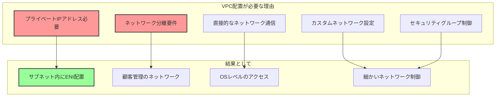
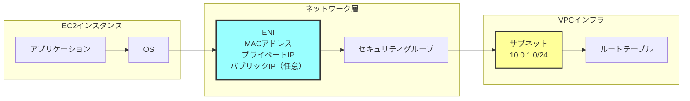
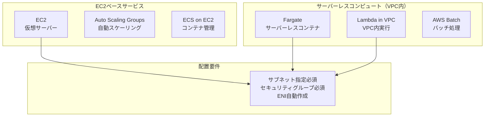
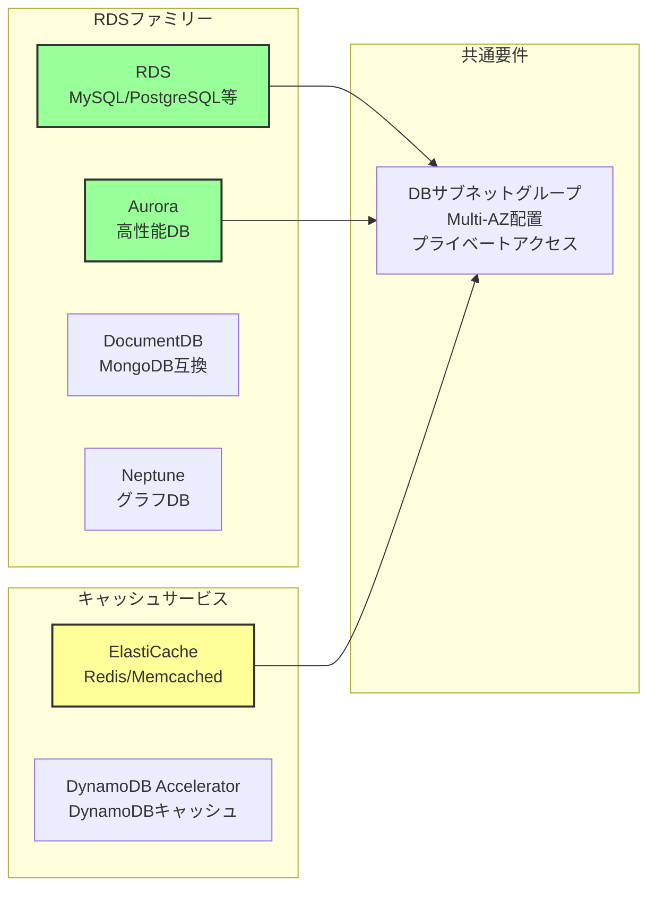
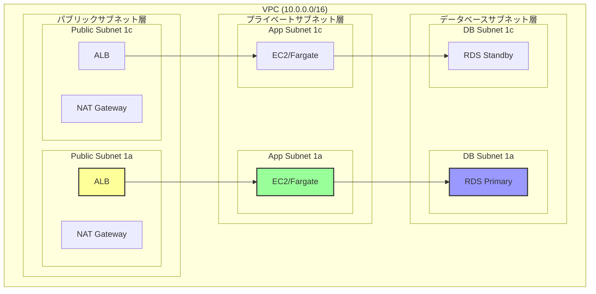
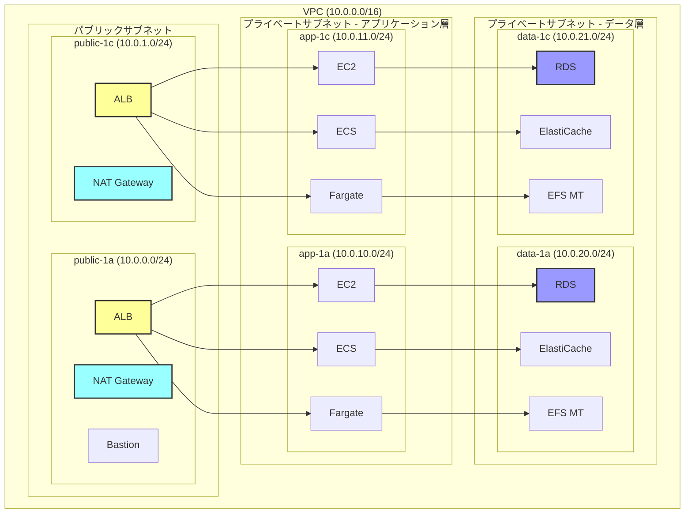
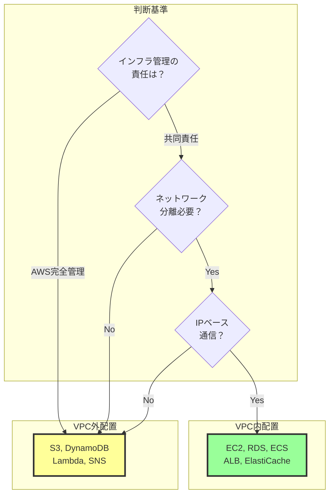
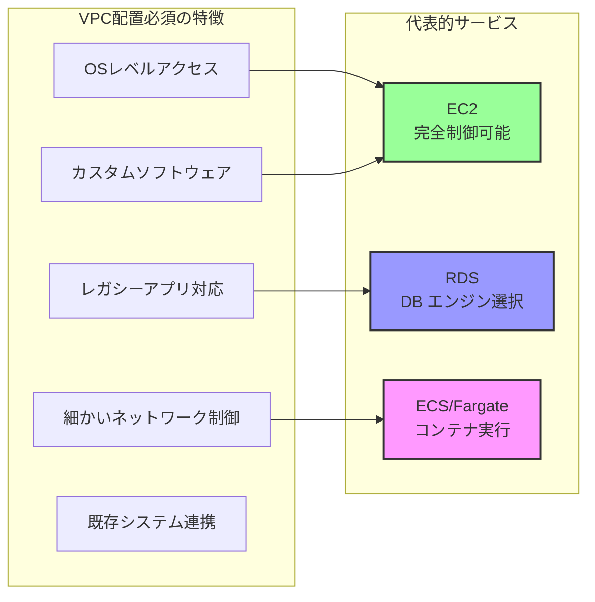

# VPCやサブネットへの配置が必要なAWSサービス

## What's this file?
> [!NOTE]
> **What**
> 
> VPCやサブネットへの配置が必要なAWSサービスとは何かについて記載しています。

## Conclusion (忙しいとき向け)
> [!IMPORTANT]
> **What** : VPCやサブネットへの配置が必要なAWSサービスとは何か
> 
> **Answer** : EC2、RDS、ECS/Fargate、ALB/NLBなど、ネットワークレベルでの分離とIPアドレスベースの通信が必要なサービス群。これらは顧客のVPC内に配置され、ENI（Elastic Network Interface）を通じて動作する

## 目次

<details>
<summary>目次を開く</summary>

- [VPC配置が必要な理由](#vpc配置が必要な理由)
- [主要なVPC内配置サービス](#主要なvpc内配置サービス)
- [配置要件とネットワーク設計](#配置要件とネットワーク設計)
- [マネージドサービスとの違い](#マネージドサービスとの違い)

</details>

## VPC配置が必要な理由

### 技術的要件



### ENI（Elastic Network Interface）の役割



## 主要なVPC内配置サービス

### コンピュートサービス



### データベースサービス



### ネットワーキングサービス

| サービス | 配置要件 | 用途 | 特徴 |
|---------|----------|------|------|
| ALB | パブリック/プライベートサブネット | L7ロードバランサー | HTTP/HTTPS振り分け |
| NLB | パブリック/プライベートサブネット | L4ロードバランサー | 高性能TCP/UDP |
| NAT Gateway | パブリックサブネット必須 | アウトバウンド通信 | プライベート→インターネット |
| VPN Gateway | VPCアタッチ | サイト間接続 | オンプレミス接続 |
| Transit Gateway | VPCアタッチメント | VPC間接続 | 複数VPC統合 |

## 配置要件とネットワーク設計

### 典型的なVPC内サービス配置



### サブネット設計のベストプラクティス



### Terraform実装例

```hcl
# VPC内配置が必要なサービスの例

# EC2インスタンス
resource "aws_instance" "app" {
  ami                    = "ami-0xxx"
  instance_type          = "t3.medium"
  subnet_id              = aws_subnet.private_app.id  # サブネット指定必須
  vpc_security_group_ids = [aws_security_group.app.id]
  
  tags = {
    Name = "app-server"
  }
}

# RDSインスタンス
resource "aws_db_instance" "main" {
  identifier     = "main-db"
  engine         = "mysql"
  instance_class = "db.t3.medium"
  
  # DBサブネットグループ（複数サブネット必須）
  db_subnet_group_name   = aws_db_subnet_group.main.name
  vpc_security_group_ids = [aws_security_group.rds.id]
}

resource "aws_db_subnet_group" "main" {
  name       = "main-db-subnet-group"
  subnet_ids = [
    aws_subnet.data_1a.id,
    aws_subnet.data_1c.id
  ]
}

# Fargateタスク
resource "aws_ecs_service" "app" {
  name            = "app-service"
  cluster         = aws_ecs_cluster.main.id
  task_definition = aws_ecs_task_definition.app.arn
  
  network_configuration {
    subnets         = aws_subnet.private_app[*].id  # サブネット指定必須
    security_groups = [aws_security_group.fargate.id]
  }
}

# ALB
resource "aws_lb" "main" {
  name               = "main-alb"
  internal           = false
  load_balancer_type = "application"
  security_groups    = [aws_security_group.alb.id]
  subnets            = aws_subnet.public[*].id  # 複数AZのサブネット必須
}
```

## マネージドサービスとの違い

### 配置パターンの比較



### 管理責任の違い

| 項目 | VPC内配置サービス | VPC外マネージドサービス |
|------|------------------|----------------------|
| ネットワーク設定 | 顧客責任 | AWS管理 |
| セキュリティグループ | 顧客設定 | 不要（IAMのみ） |
| 可用性設計 | 顧客がMulti-AZ設定 | 自動的に高可用性 |
| スケーリング | 顧客が設定 | 自動スケール |
| パッチ適用 | 一部顧客責任 | AWS完全管理 |
| バックアップ | 顧客が設定 | 多くは自動 |

### まとめ：VPC配置の必要性



## 関連

- [Amazon VPC ユーザーガイド](https://docs.aws.amazon.com/vpc/latest/userguide/)
- [EC2 ネットワーキング](https://docs.aws.amazon.com/AWSEC2/latest/UserGuide/ec2-networking.html)
- [RDS VPC配置ガイド](https://docs.aws.amazon.com/AmazonRDS/latest/UserGuide/USER_VPC.html)
- [Well-Architected - ネットワーク設計](https://docs.aws.amazon.com/wellarchitected/latest/framework/a-foundations.html)