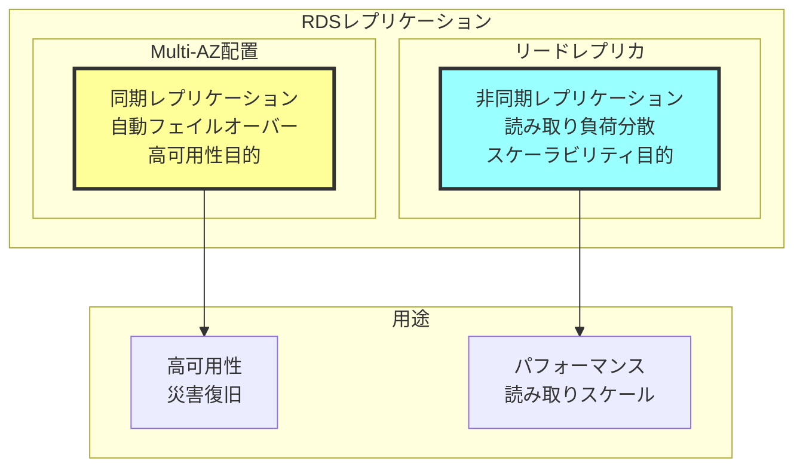
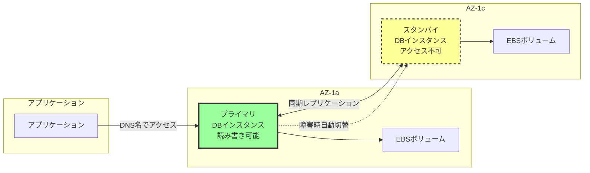
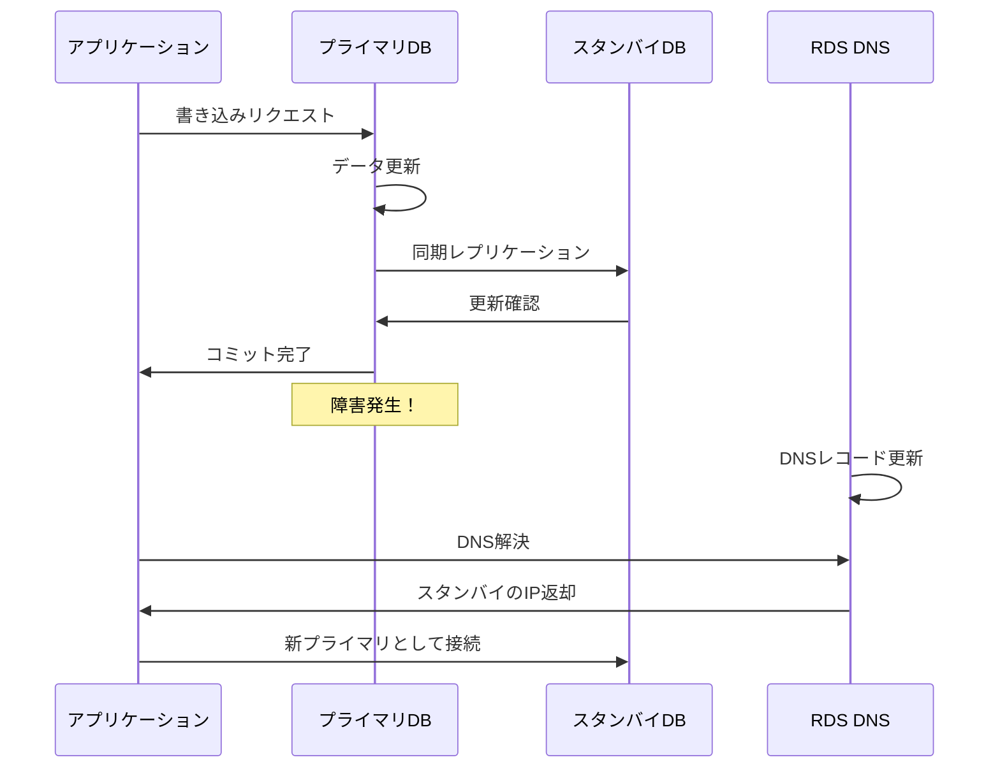
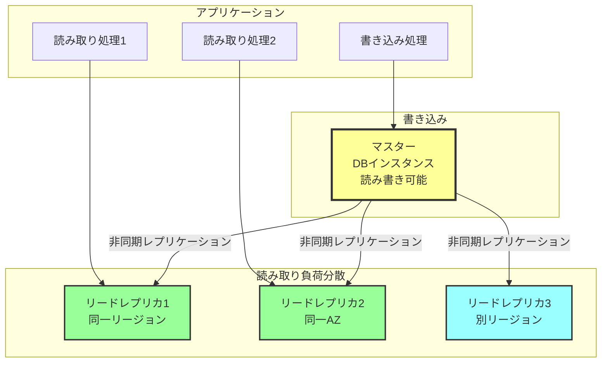
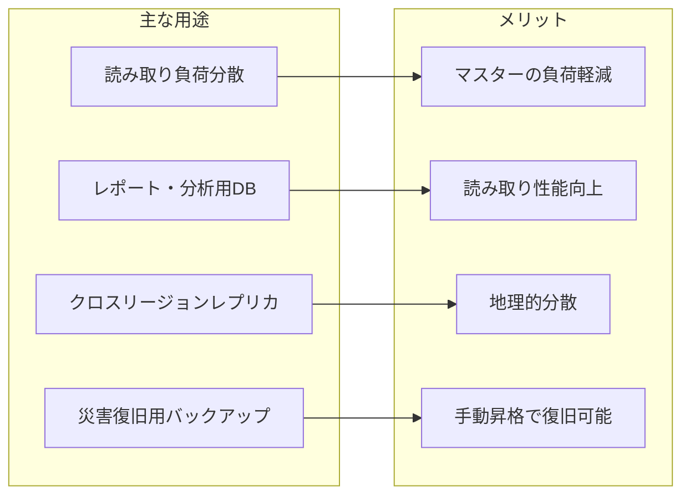
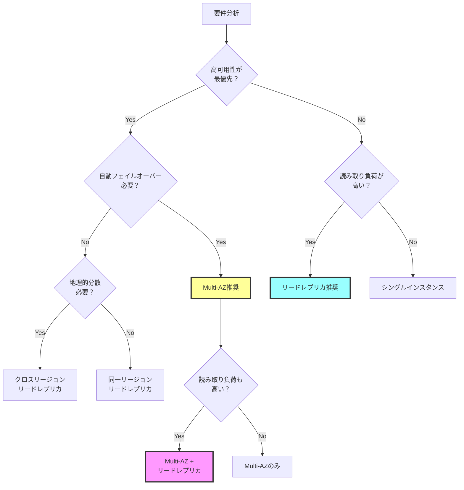
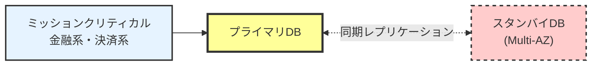
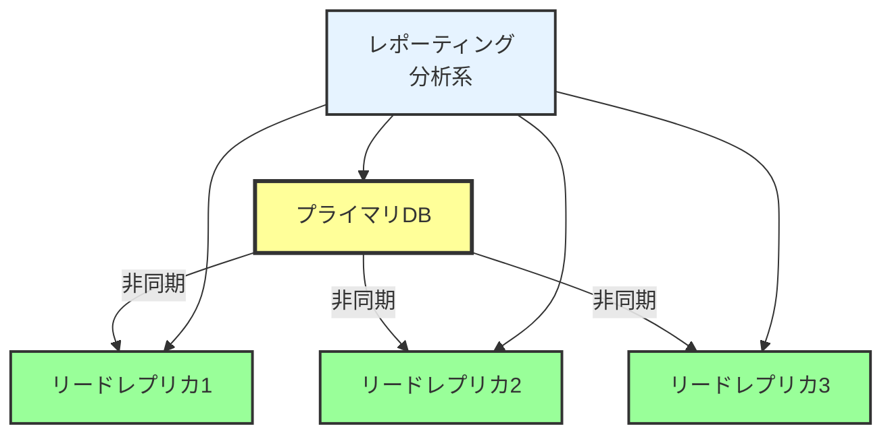
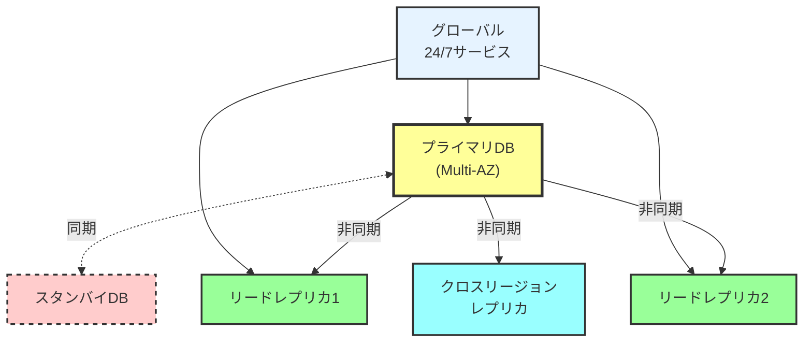
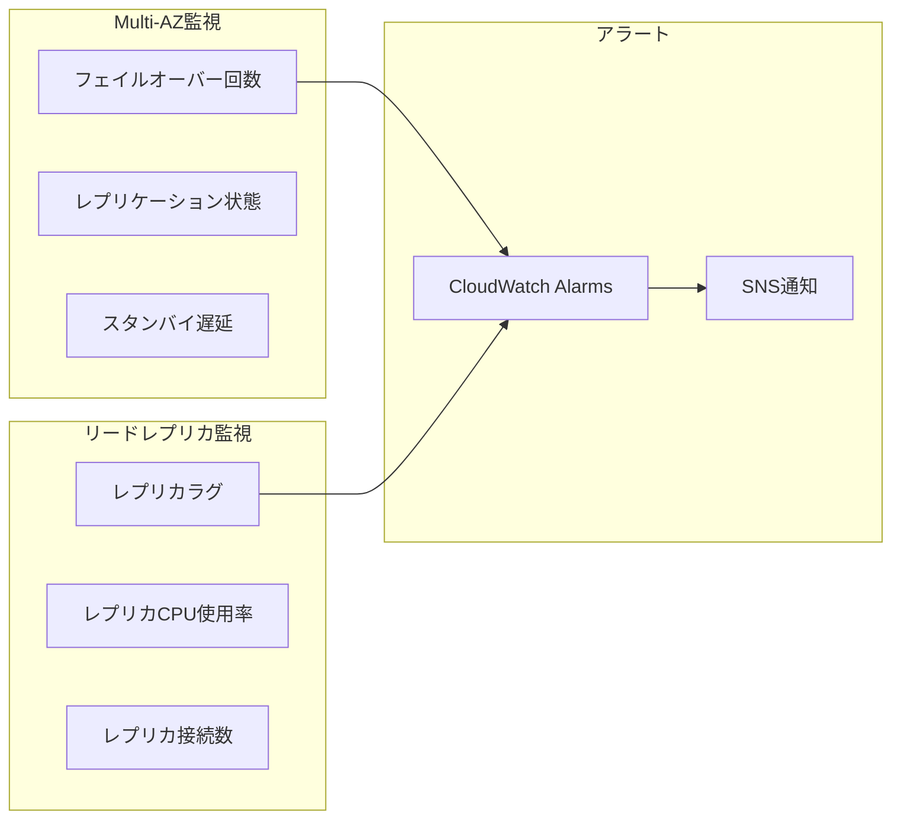

# RDSレプリケーションとは

## What's this file?
> [!NOTE]
> **What**
> 
> RDSレプリケーションとは何かについて記載しています。

## Conclusion (忙しいとき向け)
> [!IMPORTANT]
> **What** : RDSレプリケーションとは何か
> 
> **Answer** : プライマリDBインスタンスのデータを1つ以上のレプリカに複製する仕組み。Multi-AZによる高可用性とリードレプリカによる読み取り性能向上の2種類があり、それぞれ同期・非同期でデータを複製する

## 目次

<details>
<summary>目次を開く</summary>

- [RDSレプリケーションの種類](#rdsレプリケーションの種類)
- [Multi-AZレプリケーション](#multi-azレプリケーション)
- [リードレプリカ](#リードレプリカ)
- [レプリケーション方式の比較と選択](#レプリケーション方式の比較と選択)

</details>

## RDSレプリケーションの種類

### 2つの主要なレプリケーション方式



### レプリケーションの基本概念

| 特性 | Multi-AZ | リードレプリカ |
|------|----------|---------------|
| レプリケーション方式 | 同期 | 非同期 |
| 目的 | 高可用性・耐障害性 | 読み取り性能向上 |
| フェイルオーバー | 自動（1-2分） | 手動昇格可能 |
| 読み取り可能 | スタンバイは不可 | 可能 |
| 書き込み可能 | プライマリのみ | プライマリのみ |
| 追加コスト | 2倍のインスタンス料金 | レプリカ分の料金 |

## Multi-AZレプリケーション

### アーキテクチャ



### Multi-AZの動作原理



### Multi-AZの特徴

1. **自動フェイルオーバー**
   - ハードウェア障害検知
   - ネットワーク障害対応
   - AZ全体の障害に対応

2. **データ保護**
   - 同期レプリケーション
   - データロスなし
   - RPO（目標復旧時点）= 0

3. **透過的な切り替え**
   - DNSベースの切り替え
   - アプリケーション変更不要
   - 1-2分での自動復旧

## リードレプリカ

### リードレプリカのアーキテクチャ



### リードレプリカの用途



### リードレプリカの制限事項

| 項目 | 制限内容 | 備考 |
|------|----------|------|
| 最大数 | 5個まで（DB エンジンによる） | Aurora は15個まで |
| レプリカのレプリカ | MySQL/MariaDBのみ可能 | カスケード構成 |
| 遅延 | 非同期のため遅延あり | 通常は秒単位 |
| スキーマ変更 | マスターで実行 | 自動伝播 |
| バックアップ | レプリカからも可能 | マスター負荷軽減 |

## レプリケーション方式の比較と選択

### 選択フローチャート



### 実装パターン

#### パターン1: 高可用性重視



**特徴**: Multi-AZ構成により自動フェイルオーバーを実現。金融系など高可用性が求められるシステムに最適。

#### パターン2: 読み取り性能重視



**特徴**: 複数のリードレプリカで読み取り負荷を分散。レポーティングや分析系のワークロードに最適。

#### パターン3: 完全冗長構成



**特徴**: Multi-AZ + リードレプリカ + クロスリージョンレプリカの組み合わせ。グローバルサービスの完全な冗長性を実現。

### Terraformでの実装例

```hcl
# Multi-AZ配置のRDS
resource "aws_db_instance" "main" {
  identifier     = "main-database"
  engine         = "mysql"
  engine_version = "8.0"
  instance_class = "db.r5.large"
  
  # Multi-AZ有効化
  multi_az               = true
  
  # その他の設定
  allocated_storage      = 100
  storage_encrypted      = true
  db_subnet_group_name   = aws_db_subnet_group.main.name
  vpc_security_group_ids = [aws_security_group.rds.id]
}

# リードレプリカの作成
resource "aws_db_instance" "read_replica" {
  count                    = 2  # 2つのリードレプリカ
  identifier               = "read-replica-${count.index + 1}"
  replicate_source_db      = aws_db_instance.main.identifier
  
  # レプリカ固有の設定
  instance_class           = "db.r5.large"
  publicly_accessible      = false
  auto_minor_version_upgrade = false
  
  # 別AZに配置
  availability_zone        = data.aws_availability_zones.available.names[count.index]
}

# クロスリージョンレプリカ
resource "aws_db_instance" "cross_region_replica" {
  provider                 = aws.us_west_2  # 別リージョンのプロバイダー
  identifier               = "cross-region-replica"
  replicate_source_db      = aws_db_instance.main.arn
  
  instance_class           = "db.r5.large"
  storage_encrypted        = true
}
```

### 監視とメトリクス



## 関連

- [AWS RDS Multi-AZ デプロイ](https://docs.aws.amazon.com/AmazonRDS/latest/UserGuide/Concepts.MultiAZ.html)
- [RDS リードレプリカ](https://docs.aws.amazon.com/AmazonRDS/latest/UserGuide/USER_ReadRepl.html)
- [RDS 高可用性ベストプラクティス](https://docs.aws.amazon.com/AmazonRDS/latest/UserGuide/CHAP_BestPractices.html)
- [Aurora レプリケーション](https://docs.aws.amazon.com/AmazonRDS/latest/AuroraUserGuide/Aurora.Replication.html)