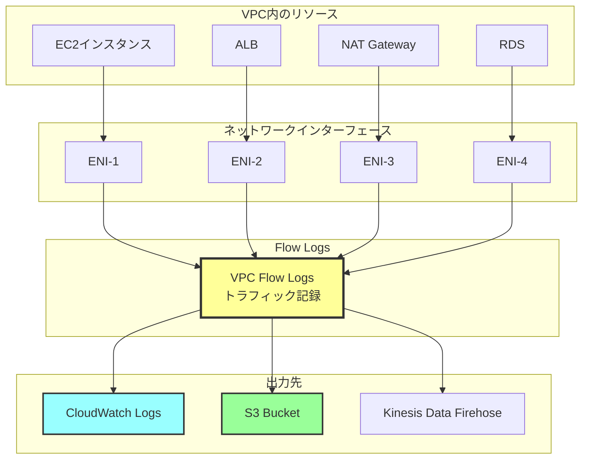
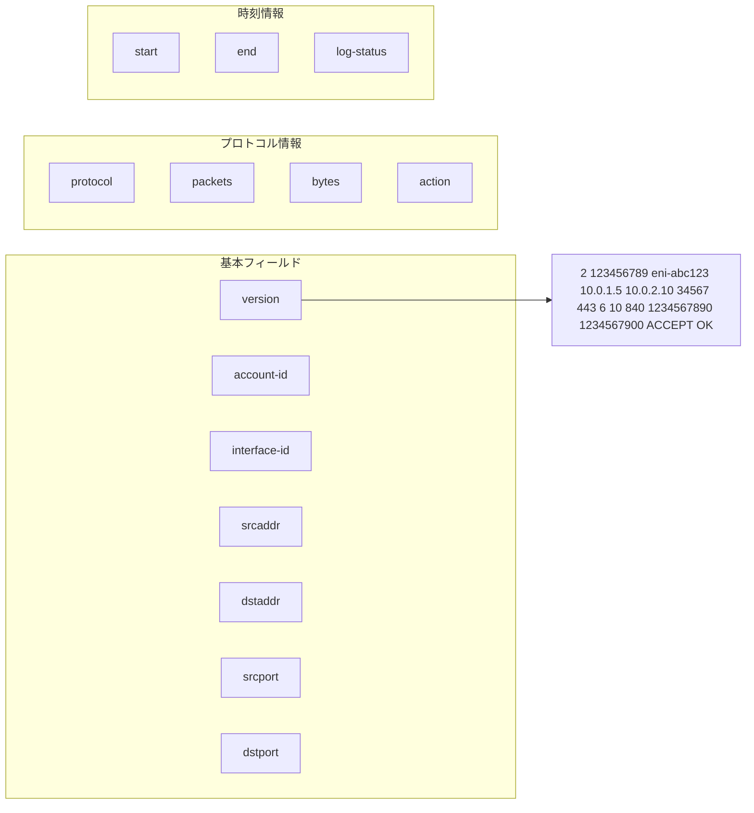
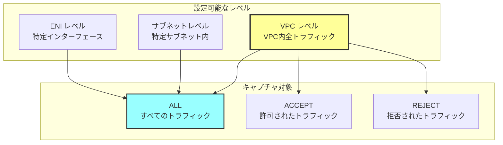
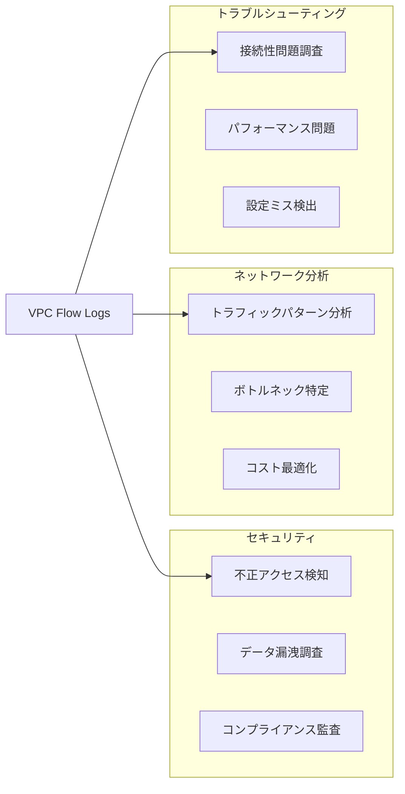
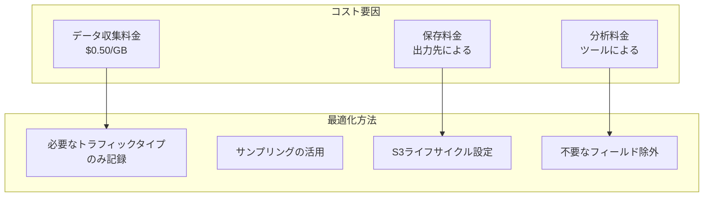

# VPC Flow Logsとは

## What's this file?
> [!NOTE]
> **What**
> 
> VPC Flow Logsとは何かについて記載しています。

## Conclusion (忙しいとき向け)
> [!IMPORTANT]
> **What** : VPC Flow Logsとは何か
> 
> **Answer** : VPC内のネットワークインターフェース（ENI）を出入りするIPトラフィックの情報をキャプチャする機能。セキュリティ分析、ネットワーク監視、トラブルシューティングに使用され、CloudWatch Logs、S3、Kinesis Data Firehoseに出力可能

## 目次

<details>
<summary>目次を開く</summary>

- [VPC Flow Logsの基本概念](#vpc-flow-logsの基本概念)
- [キャプチャ可能な情報](#キャプチャ可能な情報)
- [設定レベルと出力先](#設定レベルと出力先)
- [活用シナリオとベストプラクティス](#活用シナリオとベストプラクティス)

</details>

## VPC Flow Logsの基本概念

### VPC Flow Logsの仕組み



### Flow Logsの特徴

| 特徴 | 説明 |
|------|------|
| パケットキャプチャではない | IPヘッダー情報のみ記録（ペイロードは含まない） |
| リアルタイムではない | 数分の遅延あり |
| 追加料金 | データ収集料金＋保存先の料金 |
| 後から有効化可能 | 既存のVPC/サブネット/ENIに追加可能 |
| 無効化可能 | いつでも停止可能（過去ログは残る） |

## キャプチャ可能な情報

### 標準フォーマット



### フィールドの詳細

| フィールド | 説明 | 例 |
|-----------|------|-----|
| version | Flow Logsのバージョン | 2 |
| account-id | AWSアカウントID | 123456789012 |
| interface-id | ENIのID | eni-1234567890abcdef0 |
| srcaddr | 送信元IPアドレス | 10.0.1.5 |
| dstaddr | 宛先IPアドレス | 10.0.2.10 |
| srcport | 送信元ポート | 34567 |
| dstport | 宛先ポート | 443 |
| protocol | プロトコル番号 | 6 (TCP), 17 (UDP) |
| packets | パケット数 | 10 |
| bytes | バイト数 | 840 |
| action | ACCEPT/REJECT | ACCEPT |
| log-status | ログステータス | OK, NODATA, SKIPDATA |

### カスタムフォーマット

#### 追加可能なフィールド

| フィールド名 | 説明 |
|------------|------|
| vpc-id | VPC ID |
| subnet-id | サブネットID |
| instance-id | インスタンスID |
| tcp-flags | TCPフラグ |
| type | IPv4/IPv6 |
| pkt-srcaddr | パケットレベルの送信元IP |
| pkt-dstaddr | パケットレベルの宛先IP |
| region | リージョン |
| az-id | アベイラビリティゾーンID |
| sublocation-type | Wavelength/Outpost等 |
| flow-direction | ingress/egress |

## 設定レベルと出力先

### Flow Logs設定レベル



### 出力先の比較

| 出力先 | 用途 | メリット | デメリット |
|--------|------|--------|-----------|
| CloudWatch Logs | リアルタイム分析 | ・Insights で即座に分析<br>・アラーム設定可能 | ・保存コスト高<br>・長期保存に不向き |
| S3 | 長期保存・大量データ | ・低コスト<br>・Athenaで分析可能<br>・ライフサイクル管理 | ・リアルタイム性低<br>・直接検索不可 |
| Kinesis Data Firehose | ストリーミング処理 | ・リアルタイム処理<br>・他サービス連携<br>・自動変換 | ・設定が複雑<br>・追加コスト |

### Terraformでの実装例

```hcl
# VPCレベルのFlow Logs（S3出力）
resource "aws_flow_log" "vpc_s3" {
  log_destination_type = "s3"
  log_destination      = aws_s3_bucket.flow_logs.arn
  traffic_type         = "ALL"
  vpc_id               = aws_vpc.main.id
  
  # カスタムフォーマット
  log_format = "$${version} $${account-id} $${interface-id} $${srcaddr} $${dstaddr} $${srcport} $${dstport} $${protocol} $${packets} $${bytes} $${start} $${end} $${action} $${log-status} $${vpc-id} $${subnet-id} $${instance-id} $${tcp-flags} $${type} $${pkt-srcaddr} $${pkt-dstaddr}"
  
  tags = {
    Name = "vpc-flow-logs-s3"
  }
}

# サブネットレベルのFlow Logs（CloudWatch Logs出力）
resource "aws_flow_log" "subnet_cloudwatch" {
  iam_role_arn         = aws_iam_role.flow_log.arn
  log_destination_type = "cloud-watch-logs"
  log_group_name       = aws_cloudwatch_log_group.flow_log.name
  traffic_type         = "REJECT"  # 拒否トラフィックのみ
  subnet_id            = aws_subnet.private.id
}

# S3バケット（Flow Logs保存用）
resource "aws_s3_bucket" "flow_logs" {
  bucket = "my-vpc-flow-logs"
}

resource "aws_s3_bucket_lifecycle_configuration" "flow_logs" {
  bucket = aws_s3_bucket.flow_logs.id
  
  rule {
    id     = "archive-old-logs"
    status = "Enabled"
    
    transition {
      days          = 30
      storage_class = "STANDARD_IA"
    }
    
    transition {
      days          = 90
      storage_class = "GLACIER"
    }
    
    expiration {
      days = 365
    }
  }
}
```

## 活用シナリオとベストプラクティス

### 主な活用シナリオ



### セキュリティ分析の例

```sql
-- Athenaでの分析クエリ例

-- 1. 特定ポートへの接続試行を検出
SELECT 
    srcaddr,
    COUNT(*) as attempt_count,
    COUNT(DISTINCT dstport) as unique_ports
FROM vpc_flow_logs
WHERE action = 'REJECT'
    AND dstport IN (22, 3389, 3306, 5432)
    AND date = '2024-01-15'
GROUP BY srcaddr
HAVING COUNT(*) > 100
ORDER BY attempt_count DESC;

-- 2. 大量データ転送の検出
SELECT 
    srcaddr,
    dstaddr,
    SUM(bytes) as total_bytes,
    COUNT(*) as connection_count
FROM vpc_flow_logs
WHERE action = 'ACCEPT'
    AND date = '2024-01-15'
GROUP BY srcaddr, dstaddr
HAVING SUM(bytes) > 1073741824  -- 1GB以上
ORDER BY total_bytes DESC;

-- 3. 異常な通信パターンの検出
SELECT 
    srcaddr,
    COUNT(DISTINCT dstaddr) as unique_destinations,
    COUNT(DISTINCT dstport) as unique_ports
FROM vpc_flow_logs
WHERE action = 'ACCEPT'
    AND date = '2024-01-15'
GROUP BY srcaddr
HAVING COUNT(DISTINCT dstaddr) > 50
    OR COUNT(DISTINCT dstport) > 20;
```

### コスト最適化



### ベストプラクティス

1. **適切なレベルでの有効化**
   - セキュリティ重視: VPCレベルで全トラフィック
   - コスト重視: 必要なサブネット/ENIのみ
   - トラブルシューティング: 一時的に有効化

2. **出力先の選択**

   | 分析タイプ | 推奨出力先 | 保持期間 | 用途 |
   |----------|-----------|---------|------|
   | リアルタイム分析 | CloudWatch Logs | 7-30日 | 即時分析、アラート |
   | 長期保存 | S3 | 365日以上 | コンプライアンス、監査 |
   | ストリーミング分析 | Kinesis Data Firehose | - | ElasticSearch/Splunkへの連携 |

3. **データ分析パイプライン**
   ```mermaid
   graph LR
       FL[Flow Logs] --> S3[S3]
       S3 --> Glue[AWS Glue<br/>ETL]
       Glue --> Athena[Athena<br/>分析]
       Athena --> QS[QuickSight<br/>可視化]
       
       FL --> CW[CloudWatch]
       CW --> Insights[Insights<br/>リアルタイム分析]
       Insights --> Alarm[CloudWatch Alarms]
   ```

## 関連
- [VPC Flow Logs公式ドキュメント](https://docs.aws.amazon.com/vpc/latest/userguide/flow-logs.html)
- [Flow Logsのレコード形式](https://docs.aws.amazon.com/vpc/latest/userguide/flow-logs-records-examples.html)
- [Athenaを使用したFlow Logs分析](https://docs.aws.amazon.com/athena/latest/ug/vpc-flow-logs.html)
- [Flow Logsの料金](https://aws.amazon.com/vpc/pricing/)