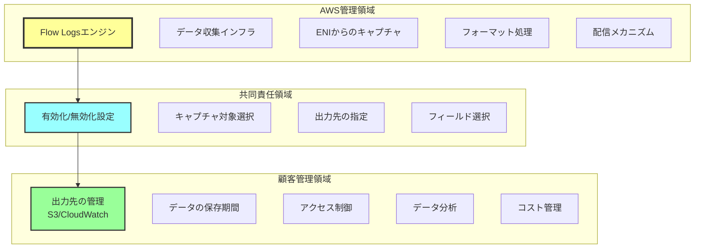
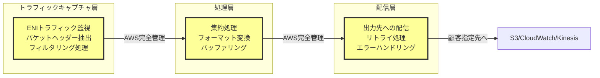
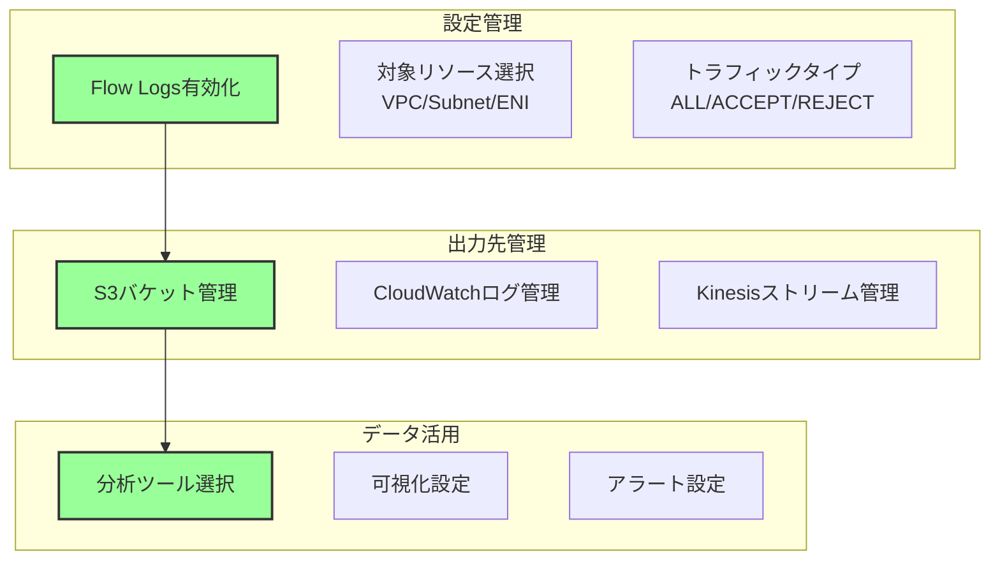
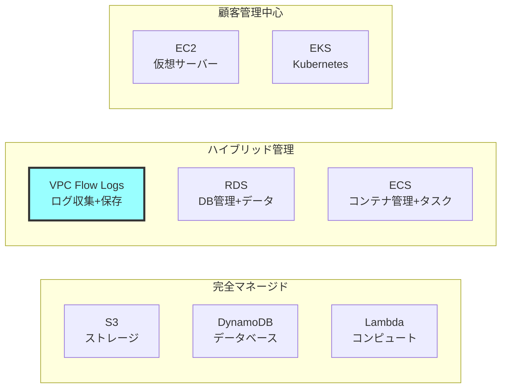
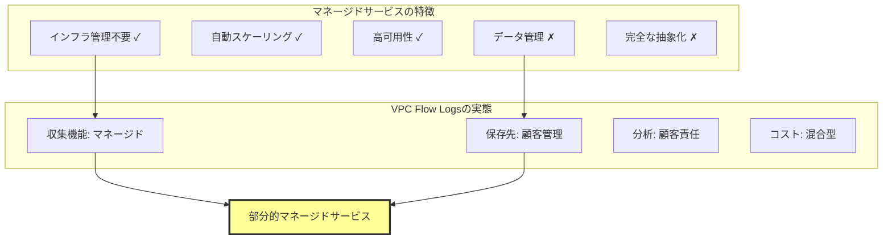
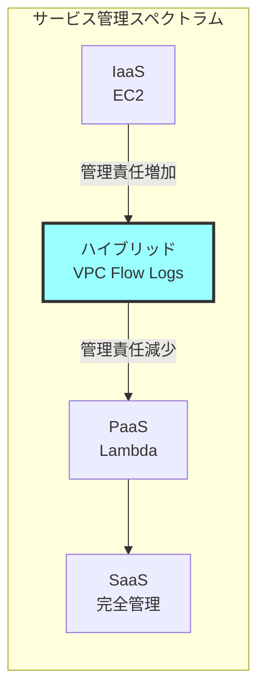

# なぜVPC Flow LogsはAWSマネージドサービスなのか

## What's this file?
> [!NOTE]
> **Why**
> 
> **なぜ**VPC Flow LogsはAWSマネージドサービスと言えるのか

## Conclusion (忙しいとき向け)
> [!IMPORTANT]
> **Why** : **なぜ**VPC Flow LogsはAWSマネージドサービスと言えるのか
> 
> **Answer** : VPC Flow Logsの収集機能自体はAWSが完全管理するが、出力先の管理とデータ分析は顧客責任となるハイブリッド型のサービスであるため、部分的なマネージドサービスと位置づけられる

## 目次
<details>
<summary>目次を開く</summary>

- [VPC Flow Logsの管理責任範囲](#vpc-flow-logsの管理責任範囲)
- [AWSマネージド部分の詳細](#awsマネージド部分の詳細)
- [顧客管理部分の詳細](#顧客管理部分の詳細)
- [他のサービスとの管理モデル比較](#他のサービスとの管理モデル比較)

</details>

## VPC Flow Logsの管理責任範囲

### 責任分界モデル



### マネージドサービスの定義との比較

| 特性 | 完全マネージド | VPC Flow Logs | 顧客管理 |
|------|---------------|---------------|----------|
| インフラ管理 | AWS | AWS | 顧客 |
| サービス可用性 | AWS保証 | AWS保証（収集のみ） | 顧客責任 |
| スケーリング | 自動 | 自動（収集のみ） | 手動 |
| パッチ適用 | AWS | AWS | 顧客 |
| データ管理 | AWS | 顧客 | 顧客 |
| 料金モデル | 使用量ベース | ハイブリッド | 固定またはハイブリッド |

## AWSマネージド部分の詳細

### 自動管理される要素



### AWSが保証する要素

1. **高可用性**
   - リージョン内での冗長性
   - 自動フェイルオーバー
   - データロスなし（ベストエフォート）

2. **自動スケーリング**
   - トラフィック量に応じた自動調整
   - バーストトラフィック対応
   - 性能劣化なし

3. **セキュリティ**
   - 転送中の暗号化
   - AWSインフラ内での隔離
   - 他顧客データとの分離

## 顧客管理部分の詳細

### 顧客が管理する要素



### 顧客責任の具体例

```hcl
# Terraform例：顧客が管理する設定

# 1. 出力先の作成と管理（顧客責任）
resource "aws_s3_bucket" "flow_logs" {
  bucket = "my-flow-logs-bucket"
  
  # 暗号化設定（顧客責任）
  server_side_encryption_configuration {
    rule {
      apply_server_side_encryption_by_default {
        sse_algorithm = "AES256"
      }
    }
  }
}

# 2. アクセス制御（顧客責任）
resource "aws_s3_bucket_policy" "flow_logs" {
  bucket = aws_s3_bucket.flow_logs.id
  policy = jsonencode({
    Version = "2012-10-17"
    Statement = [
      {
        Sid    = "AWSLogDeliveryWrite"
        Effect = "Allow"
        Principal = {
          Service = "delivery.logs.amazonaws.com"
        }
        Action   = "s3:PutObject"
        Resource = "${aws_s3_bucket.flow_logs.arn}/*"
      }
    ]
  })
}

# 3. ライフサイクル管理（顧客責任）
resource "aws_s3_bucket_lifecycle_configuration" "flow_logs" {
  bucket = aws_s3_bucket.flow_logs.id
  
  rule {
    id     = "delete-old-logs"
    status = "Enabled"
    
    expiration {
      days = 90  # 保存期間は顧客が決定
    }
  }
}

# 4. Flow Logs設定（共同責任）
resource "aws_flow_log" "main" {
  # AWS管理：収集メカニズム
  # 顧客管理：設定内容
  log_destination      = aws_s3_bucket.flow_logs.arn
  log_destination_type = "s3"
  traffic_type         = "ALL"
  vpc_id               = aws_vpc.main.id
}
```

## 他のサービスとの管理モデル比較

### サービス分類マトリックス



### 管理責任の詳細比較

| サービス | インフラ | サービス機能 | データ管理 | 設定管理 | 分類 |
|---------|----------|-------------|-----------|----------|------|
| S3 | AWS | AWS | AWS/顧客 | 顧客 | 完全マネージド |
| VPC Flow Logs | AWS | AWS | 顧客 | 顧客 | ハイブリッド |
| CloudWatch | AWS | AWS | AWS/顧客 | 顧客 | 完全マネージド |
| RDS | AWS | AWS/顧客 | 顧客 | 顧客 | ハイブリッド |
| EC2 | AWS | 顧客 | 顧客 | 顧客 | IaaS |

### VPC Flow Logsがハイブリッドである理由



### コスト構造から見る管理モデル

#### VPC Flow Logsのコスト構造

**AWS管理部分のコスト**
- データ収集料金: $0.50/GB
- 固定インフラコスト: なし（AWSが吸収）

**顧客管理部分のコスト**
- S3ストレージ: $0.023/GB
- CloudWatch Logs: $0.50/GB
- データ転送: 変動
- 分析ツール: 選択による

**コスト最適化の制御**
- 収集設定: 顧客が制御
- 保存期間: 顧客が制御
- 分析頻度: 顧客が制御

### まとめ：管理モデルの位置づけ



VPC Flow Logsは：
- **収集機能**: 完全にAWSマネージド
- **データ管理**: 完全に顧客責任
- **結論**: ハイブリッド型のマネージドサービス

## 関連
- [AWS責任共有モデル](https://aws.amazon.com/compliance/shared-responsibility-model/)
- [VPC Flow Logs料金](https://aws.amazon.com/vpc/pricing/)
- [AWSマネージドサービス一覧](https://aws.amazon.com/managed-services/)
- [Well-Architected - 運用の卓越性](https://docs.aws.amazon.com/wellarchitected/latest/operational-excellence-pillar/welcome.html)