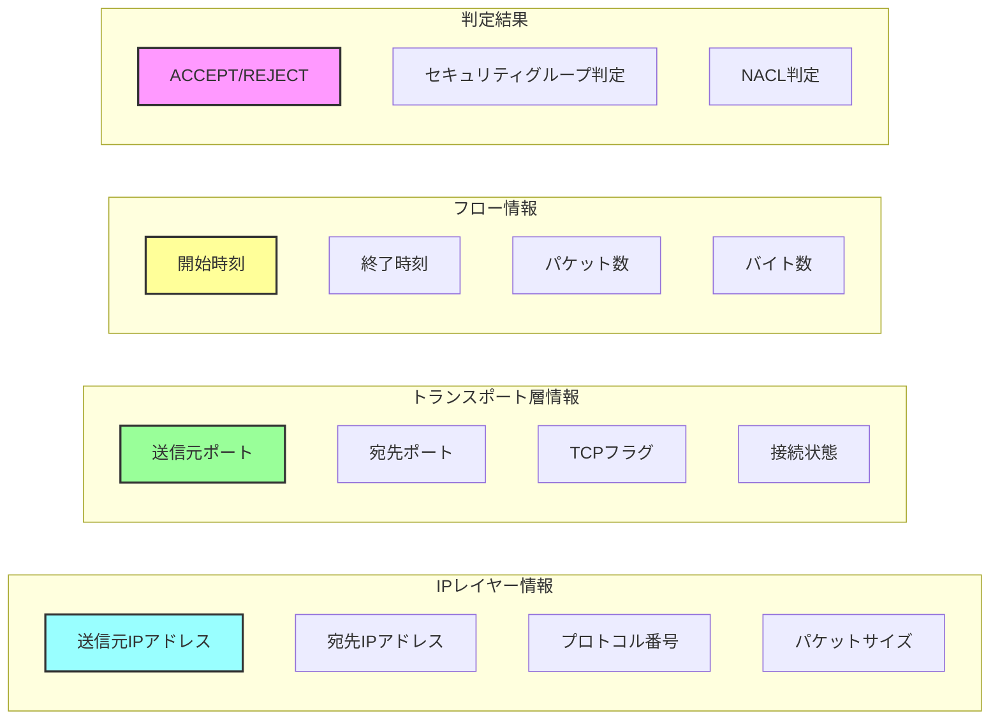
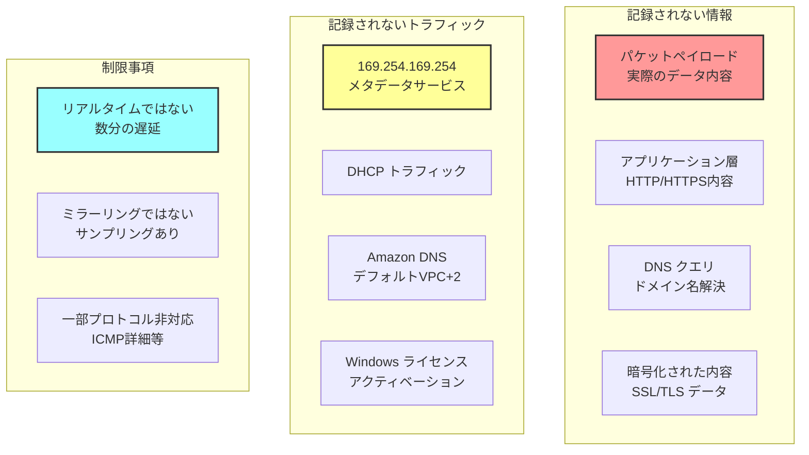
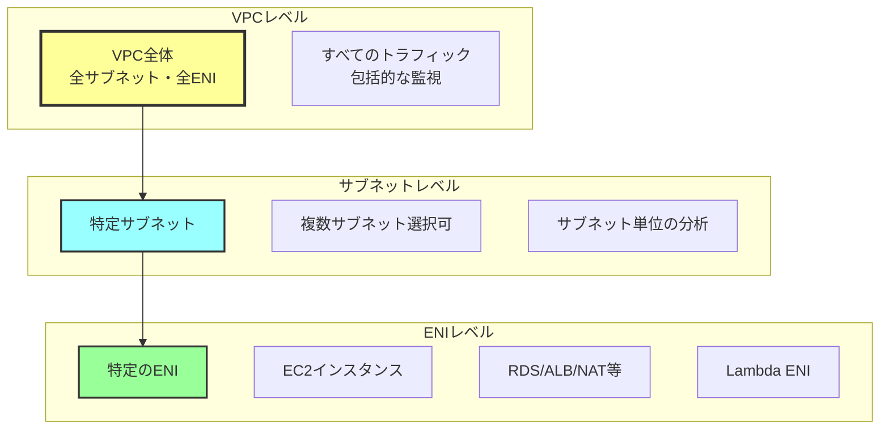
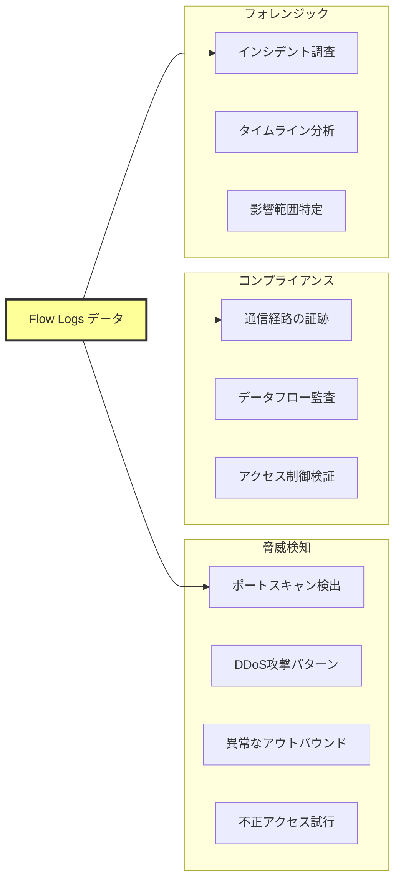
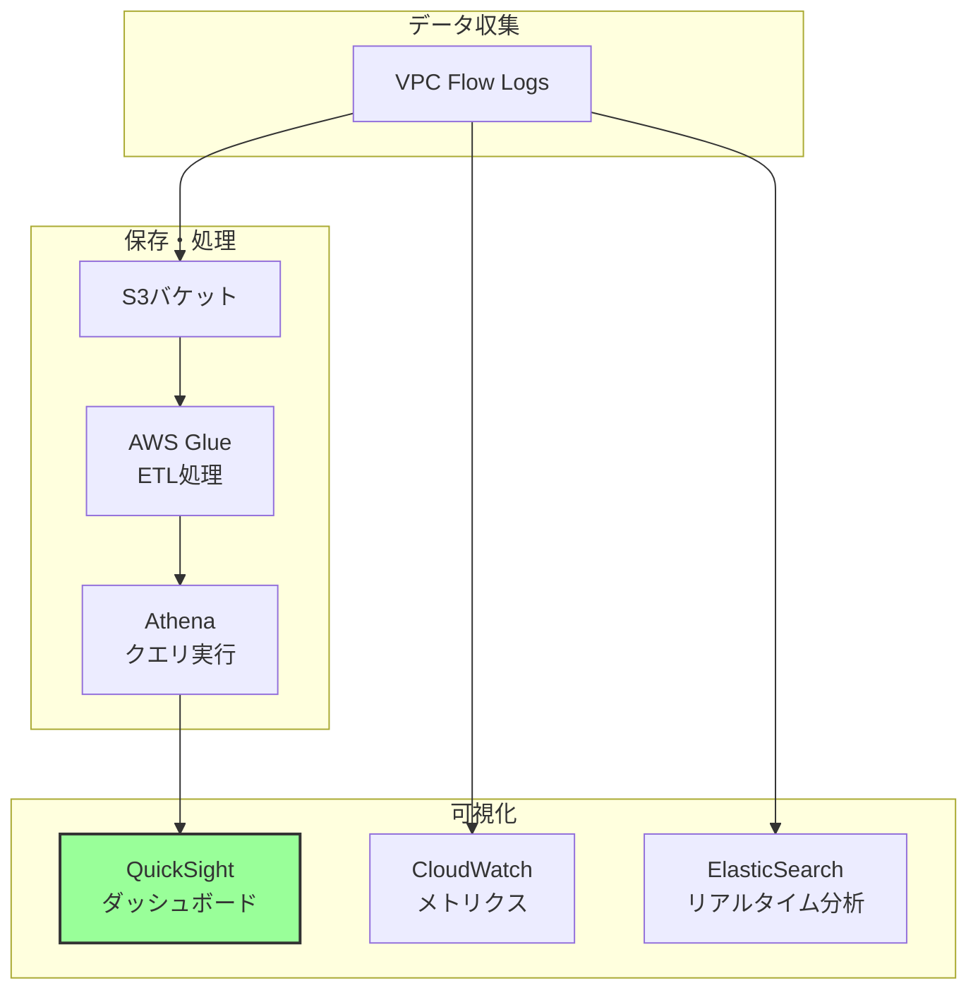

# VPC Flow Logsが管理できる内容

## What's this file?
> [!NOTE]
> **What**
> 
> VPC Flow Logsが管理できる内容とは何かについて記載しています。

## Conclusion (忙しいとき向け)
> [!IMPORTANT]
> **What** : VPC Flow Logsが管理できる内容とは何か
> 
> **Answer** : VPC内のネットワークトラフィックのメタデータ（送信元/宛先IP、ポート、プロトコル、パケット数、バイト数、許可/拒否）を記録・管理できるが、パケットの中身やアプリケーションレイヤーの情報は管理できない

## 目次

<details>
<summary>目次を開く</summary>

- [管理可能な情報](#管理可能な情報)
- [管理できない情報](#管理できない情報)
- [監視対象リソース](#監視対象リソース)
- [活用可能な分析内容](#活用可能な分析内容)

</details>

## 管理可能な情報

### ネットワークトラフィックのメタデータ



### 詳細フィールド一覧

| カテゴリ | フィールド名 | 説明 | 例 |
|---------|------------|------|-----|
| 基本情報 | version | Flow Logsバージョン | 2 |
| | account-id | AWSアカウントID | 123456789012 |
| | interface-id | ネットワークインターフェースID | eni-1234567890abcdef0 |
| ネットワーク | srcaddr | 送信元IPアドレス | 10.0.1.5 |
| | dstaddr | 宛先IPアドレス | 10.0.2.10 |
| | srcport | 送信元ポート番号 | 34567 |
| | dstport | 宛先ポート番号 | 443 |
| | protocol | IPプロトコル番号 | 6 (TCP), 17 (UDP) |
| トラフィック | packets | パケット数 | 100 |
| | bytes | 転送バイト数 | 52000 |
| | start | フロー開始時刻 | 1234567890 |
| | end | フロー終了時刻 | 1234567900 |
| セキュリティ | action | トラフィック判定 | ACCEPT, REJECT |
| | log-status | ログ記録状態 | OK, NODATA, SKIPDATA |

### 拡張フィールド（カスタムフォーマット）

#### 追加で記録可能な情報

**ロケーション情報**
- `vpc-id` - VPC識別子
- `subnet-id` - サブネット識別子
- `instance-id` - EC2インスタンスID
- `az-id` - アベイラビリティゾーンID
- `region` - リージョン

**ネットワーク詳細**
- `pkt-srcaddr` - パケットレベル送信元
- `pkt-dstaddr` - パケットレベル宛先
- `tcp-flags` - TCPフラグ（SYN, ACK等）
- `flow-direction` - ingress/egress

**サービス情報**
- `sublocation-type` - Wavelength, Outpost等
- `sublocation-id` - サブロケーションID
- `type` - IPv4/IPv6

## 管理できない情報

### Flow Logsの制限事項



### 記録されない特定のトラフィック

| トラフィックタイプ | 対象 | 理由 |
|------------------|------|------|
| インスタンスメタデータ | 169.254.169.254 | セキュリティ上の配慮 |
| Amazon DNS | VPC CIDR + 2 | 内部サービス |
| DHCP | DHCPトラフィック | 基本的なネットワーク機能 |
| Windowsライセンス | 169.254.169.250/251 | ライセンス認証 |
| AZ間のVPCルーターARP | - | 内部通信 |

## 監視対象リソース

### Flow Logs設定可能なレベル



### 監視対象リソースの詳細

#### 監視可能なENIを持つリソース

**コンピュート**
- EC2インスタンス
- Fargateタスク
- Lambda（VPC内実行）

**ネットワーキング**
- ALB/NLB
- NAT Gateway
- VPN接続
- Transit Gateway接続
- VPCエンドポイント（インターフェース型）

**データベース**
- RDSインスタンス
- ElastiCache
- Redshift
- DocumentDB

**ストレージ**
- EFSマウントターゲット
- FSxエンドポイント

## 活用可能な分析内容

### セキュリティ分析



### ネットワーク最適化

```sql
-- 分析クエリ例（Athena）

-- 1. トップトーカー分析
SELECT 
    srcaddr as source_ip,
    SUM(bytes) as total_bytes,
    COUNT(*) as connection_count
FROM flow_logs
WHERE action = 'ACCEPT'
GROUP BY srcaddr
ORDER BY total_bytes DESC
LIMIT 10;

-- 2. 未使用ポート検出
SELECT 
    dstport,
    COUNT(*) as attempt_count
FROM flow_logs
WHERE action = 'REJECT'
GROUP BY dstport
ORDER BY attempt_count DESC;

-- 3. クロスAZトラフィック分析
SELECT 
    SUBSTRING(srcaddr, 1, 7) as src_subnet,
    SUBSTRING(dstaddr, 1, 7) as dst_subnet,
    SUM(bytes) as cross_az_bytes
FROM flow_logs
WHERE srcaddr LIKE '10.0.1%' 
  AND dstaddr LIKE '10.0.2%'
GROUP BY 1, 2;
```

### パフォーマンス分析

#### Flow Logsで分析可能な項目

**トラフィックパターン**
- ピーク時間帯の特定
- トラフィック量の推移
- プロトコル別の使用率

**ボトルネック検出**
- 高頻度接続の特定
- 大量データ転送の検出
- レイテンシー要因の推定

**コスト最適化**
- NAT Gateway使用量
- クロスAZ通信量
- インターネット向けトラフィック

### ダッシュボード作成例



## 関連
- [VPC Flow Logs で記録される情報](https://docs.aws.amazon.com/vpc/latest/userguide/flow-logs-records-examples.html)
- [Flow Logs の制限事項](https://docs.aws.amazon.com/vpc/latest/userguide/flow-logs.html#flow-logs-limitations)
- [Flow Logs を使用したトラフィック分析](https://aws.amazon.com/blogs/security/analyze-vpc-flow-logs-with-amazon-athena/)
- [VPC Flow Logs のベストプラクティス](https://docs.aws.amazon.com/prescriptive-guidance/latest/logging-monitoring-for-application-owners/vpc-flow-logs.html)