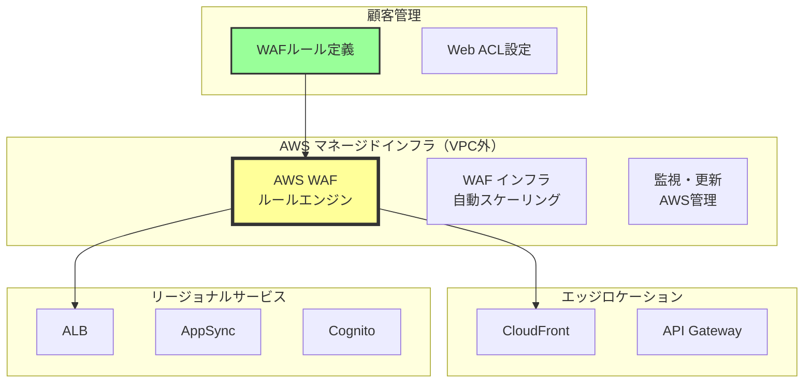
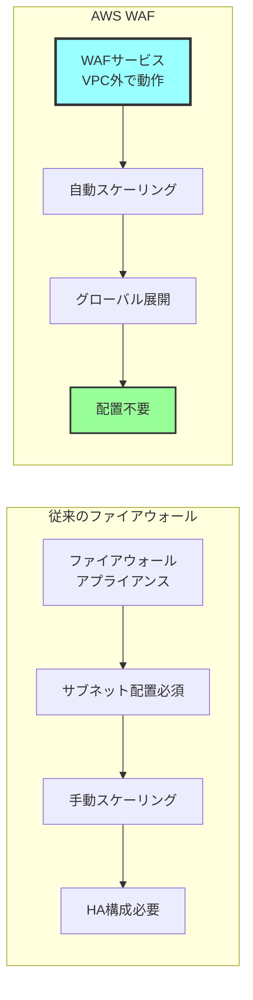
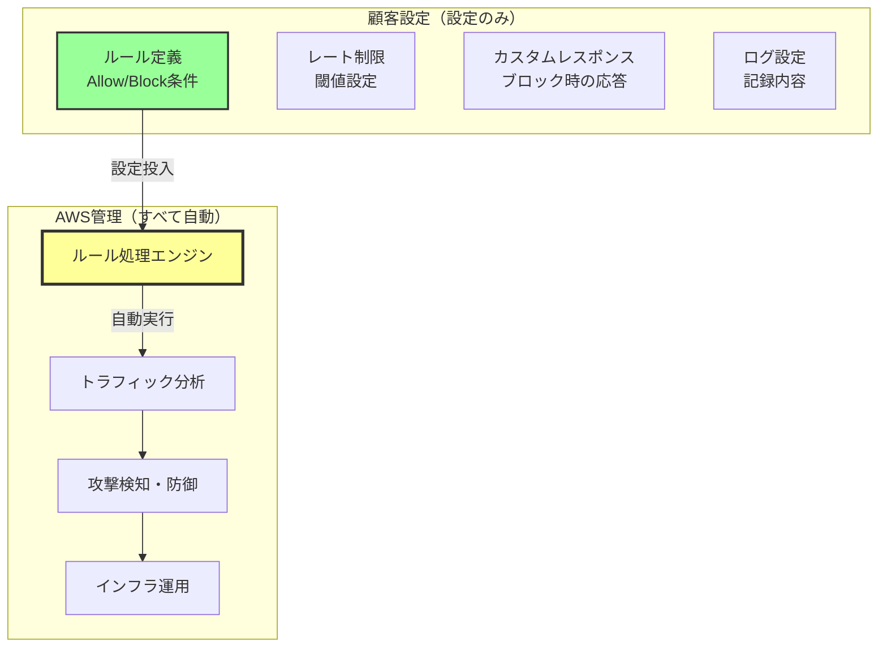
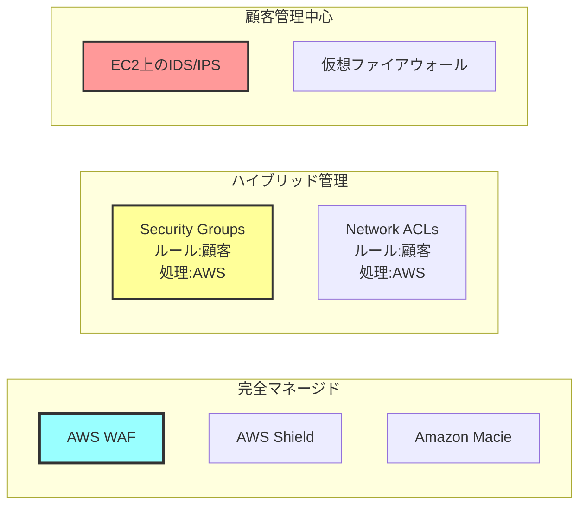
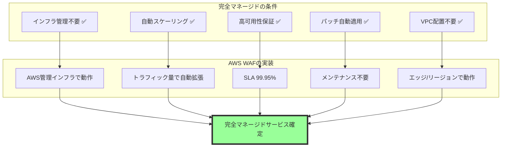
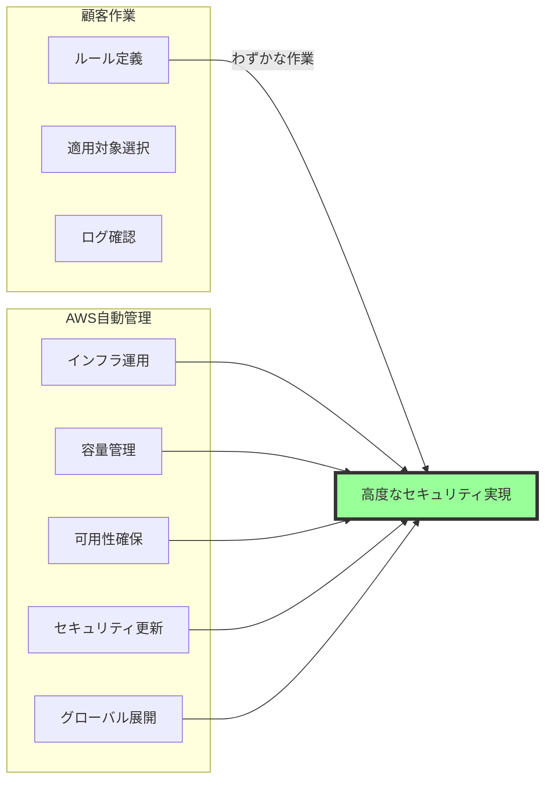

# なぜAWS WAFは完全なマネージドサービスなのか

## What's this file?
> [!NOTE]
> **Why**
> 
> **なぜ**AWS WAFは完全なマネージドサービスと言えるのか

## Conclusion (忙しいとき向け)
> [!IMPORTANT]
> **Why** : **なぜ**AWS WAFは完全なマネージドサービスと言えるのか
> 
> **Answer** : WAFのインフラ、スケーリング、可用性はAWSが完全管理し、VPCやサブネットへの配置も不要。顧客はルールの定義と適用対象の選択のみを管理すればよいため、真のマネージドサービスである

## 目次
<details>
<summary>目次を開く</summary>

- [AWS WAFの管理モデル](#aws-wafの管理モデル)
- [完全マネージドサービスとしての特徴](#完全マネージドサービスとしての特徴)
- [顧客責任範囲の限定性](#顧客責任範囲の限定性)
- [他のセキュリティサービスとの比較](#他のセキュリティサービスとの比較)

</details>

## AWS WAFの管理モデル

### WAFのアーキテクチャと配置



### 責任分界点

| 管理項目 | AWS責任 | 顧客責任 |
|---------|---------|----------|
| インフラストラクチャ | ✅ 完全管理 | ❌ なし |
| ハードウェア管理 | ✅ 完全管理 | ❌ なし |
| スケーリング | ✅ 自動 | ❌ なし |
| 可用性保証 | ✅ SLA提供 | ❌ なし |
| パッチ適用 | ✅ 自動 | ❌ なし |
| ルール定義 | ❌ なし | ✅ 設定のみ |
| 適用対象選択 | ❌ なし | ✅ 設定のみ |

## 完全マネージドサービスとしての特徴

### VPC配置が不要な理由



### マネージドサービスの証拠

1. **自動スケーリング**
   - リクエスト量に応じて自動調整
   - DDoS攻撃時も自動対応
   - 容量計画不要
   - パフォーマンス劣化なし

2. **高可用性**
   - Multi-AZ自動展開
   - リージョン内冗長性
   - SLA 99.95%保証
   - 自動フェイルオーバー

3. **グローバル展開**
   - CloudFront統合で全エッジロケーション
   - リージョナルサービスとの統合
   - レイテンシー最小化
   - 地理的分散

## 顧客責任範囲の限定性

### 顧客が管理する内容



### 設定例（Terraform）

```hcl
# WAF設定例 - 顧客が管理するのは設定のみ

resource "aws_wafv2_web_acl" "main" {
  name  = "main-web-acl"
  scope = "REGIONAL"  # またはCLOUDFRONT
  
  # デフォルトアクション（設定のみ）
  default_action {
    allow {}
  }
  
  # ルール定義（設定のみ）
  rule {
    name     = "RateLimitRule"
    priority = 1
    
    action {
      block {}
    }
    
    statement {
      rate_based_statement {
        limit              = 2000
        aggregate_key_type = "IP"
      }
    }
    
    visibility_config {
      cloudwatch_metrics_enabled = true
      metric_name                = "RateLimitRule"
      sampled_requests_enabled   = true
    }
  }
}

# ALBへの関連付け（設定のみ）
resource "aws_wafv2_web_acl_association" "alb" {
  resource_arn = aws_lb.main.arn
  web_acl_arn  = aws_wafv2_web_acl.main.arn
}

# インフラ管理、スケーリング、可用性はすべてAWS側で自動管理
```

## 他のセキュリティサービスとの比較

### セキュリティサービスの管理モデル比較



### 詳細比較表

| サービス | インフラ管理 | スケーリング | ルール管理 | 配置場所 | 管理モデル |
|---------|-------------|-------------|-----------|----------|-----------|
| AWS WAF | AWS | 自動 | 顧客 | なし（AWS管理） | 完全マネージド |
| Security Groups | AWS | 自動 | 顧客 | ENIに適用 | ハイブリッド |
| NACLs | AWS | 自動 | 顧客 | サブネットに適用 | ハイブリッド |
| EC2上のIDS | 顧客 | 手動 | 顧客 | EC2インスタンス | 顧客管理 |
| AWS Shield | AWS | 自動 | AWS | なし（AWS管理） | 完全マネージド |

### WAFが完全マネージドである根拠



### 料金モデルから見る管理形態

#### WAF料金構造

**使用量ベースの課金（マネージドサービスの特徴）**
- Web ACL: $5.00/月
- リクエスト課金: $0.60/100万リクエスト
- ルール追加: $1.00/ルール/月

**インフラコストなし（AWS吸収）**
- サーバー費用: $0（AWS負担）
- ネットワーク費用: $0（AWS負担）
- 運用人件費: $0（AWS負担）

**顧客コスト予測可能**
- 使用量に応じた従量課金
- 隠れたコストなし
- スケーリングコスト込み

### まとめ：完全マネージドサービスとしてのWAF



AWS WAFは：
- **インフラ**: 完全にAWS管理
- **運用**: 完全に自動化
- **顧客作業**: ルール設定のみ
- **結論**: 真の完全マネージドサービス

## 関連
- [AWS WAF 公式ドキュメント](https://docs.aws.amazon.com/waf/)
- [AWS責任共有モデル](https://aws.amazon.com/compliance/shared-responsibility-model/)
- [WAF料金](https://aws.amazon.com/waf/pricing/)
- [マネージドルールグループ](https://docs.aws.amazon.com/waf/latest/developerguide/aws-managed-rule-groups.html)