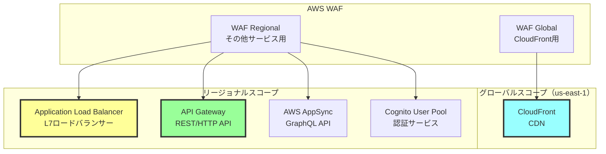
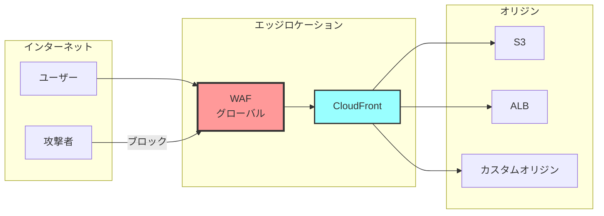
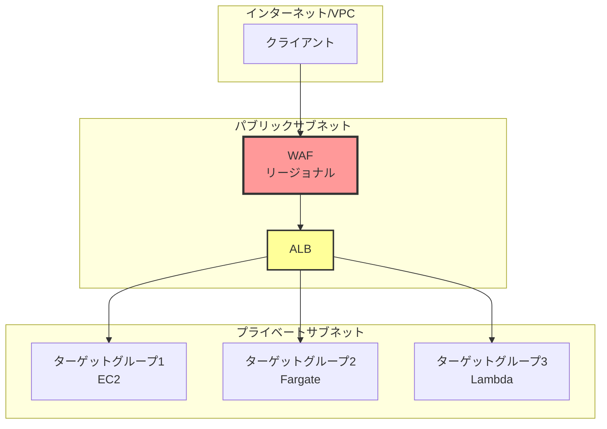
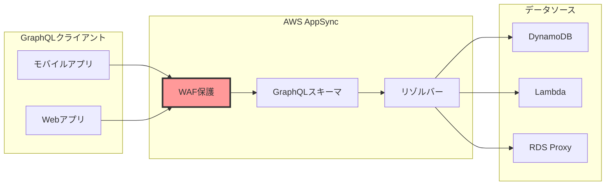
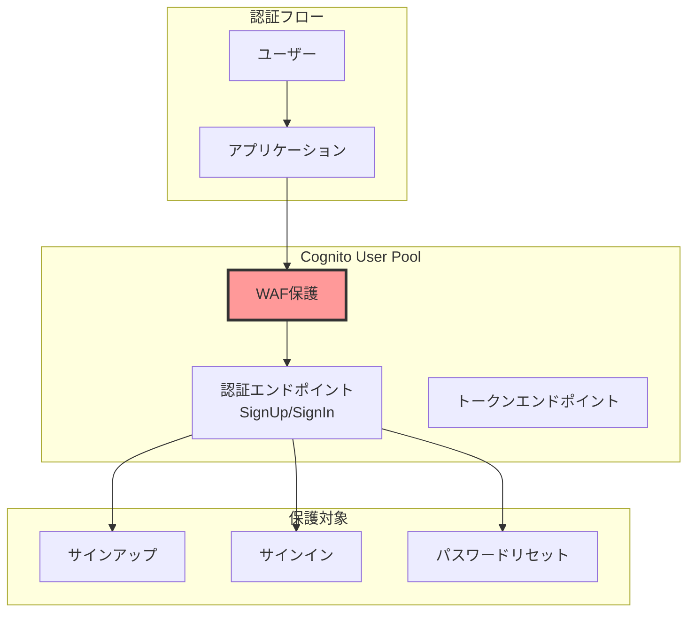
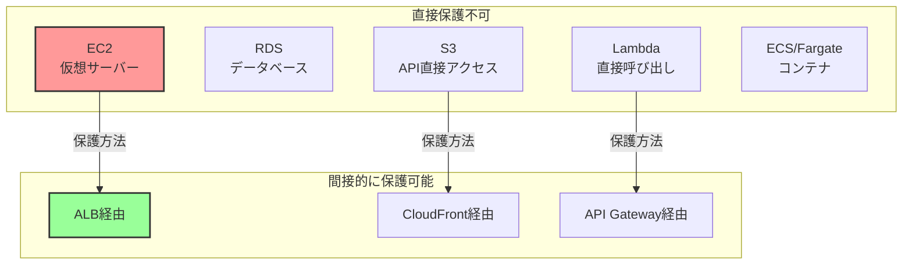
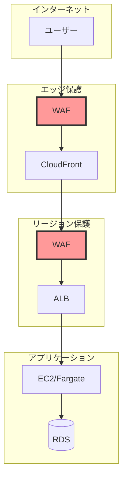
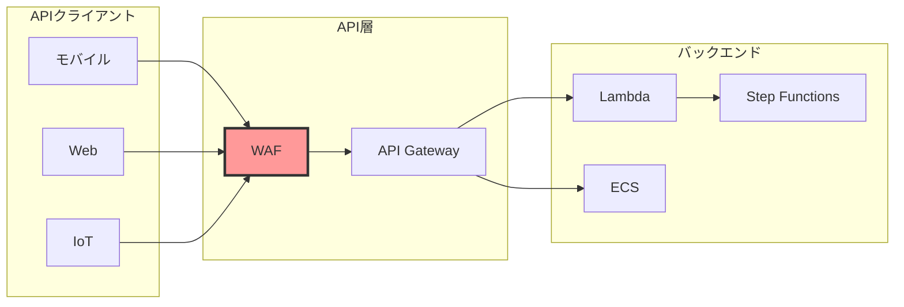
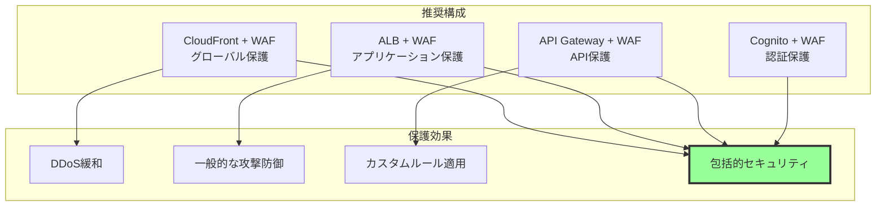

# AWS WAFが保護できるサービスとコンポーネント

## What's this file?
> [!NOTE]
> **What**
> 
> AWS WAFが保護できるサービスとコンポーネントとは何かについて記載しています。

## Conclusion (忙しいとき向け)
> [!IMPORTANT]
> **What** : AWS WAFが保護できるサービスとコンポーネントとは何か
> 
> **Answer** : CloudFront、ALB、API Gateway、AppSync、Cognito User Poolの5つのサービスに対してWebアプリケーションレベルの保護を提供。EC2やRDSなどは直接保護できないが、ALB経由でアクセスすることで間接的に保護可能

## 目次

<details>
<summary>目次を開く</summary>

- [WAF適用可能なサービス一覧](#waf適用可能なサービス一覧)
- [各サービスでの保護範囲](#各サービスでの保護範囲)
- [WAFが保護できないサービス](#wafが保護できないサービス)
- [アーキテクチャパターンと保護戦略](#アーキテクチャパターンと保護戦略)

</details>

## WAF適用可能なサービス一覧

### 対応サービスとスコープ



### サービス別の特徴

| サービス | WAFスコープ | 保護レイヤー | 主な用途 |
|---------|------------|-------------|---------|
| CloudFront | CLOUDFRONT | エッジロケーション | 静的/動的コンテンツ配信 |
| ALB | REGIONAL | アプリケーション層 | Webアプリケーション |
| API Gateway | REGIONAL | API層 | REST/HTTP API |
| AppSync | REGIONAL | GraphQL層 | GraphQL API |
| Cognito | REGIONAL | 認証層 | ユーザー認証・認可 |

## 各サービスでの保護範囲

### CloudFrontでの保護



### ALBでの保護



### API Gatewayでの保護

#### 保護可能なAPIタイプ

**REST API**
- エンドポイントタイプ: Edge/Regional/Private
- WAF統合: すべて可能
- 保護レベル: HTTPリクエスト全体

**HTTP API**
- エンドポイントタイプ: Regional
- WAF統合: 可能
- 保護レベル: HTTPリクエスト全体

**WebSocket API**
- WAF統合: 不可
- 代替策: CloudFront + WAF経由

### AppSyncでの保護



### Cognito User Poolでの保護



## WAFが保護できないサービス

### 直接保護できないサービス



### 保護できない理由と代替策

| サービス | 保護できない理由 | 推奨される代替策 |
|---------|----------------|----------------|
| EC2 | L7プロキシサービスではない | ALB + WAF経由でアクセス |
| RDS | データベースプロトコル | セキュリティグループ + VPC |
| S3（直接） | オブジェクトストレージAPI | CloudFront + WAF経由 |
| Lambda（直接） | 関数実行API | API Gateway + WAF経由 |
| ECS/Fargate | コンテナサービス | ALB + WAF経由でアクセス |

## アーキテクチャパターンと保護戦略

### パターン1: Webアプリケーション保護



### パターン2: API保護



### パターン3: 多層防御

#### 多層防御アーキテクチャ

| レイヤー | サービス | WAFタイプ | 保護内容 |
|---------|---------|----------|----------|
| **エッジ層** | CloudFront | Global WAF | DDoS, 地理的制限 |
| **アプリケーション層** | ALB | Regional WAF | SQLi, XSS, カスタムルール |
| **API層** | API Gateway | Regional WAF | レート制限, APIアビューズ |
| **認証層** | Cognito | Regional WAF | ブルートフォース, アカウント作成攻撃 |

### Terraformでの実装例

```hcl
# CloudFront + WAF
resource "aws_wafv2_web_acl" "cloudfront" {
  provider = aws.us_east_1  # CloudFront WAFは us-east-1
  name     = "cloudfront-waf"
  scope    = "CLOUDFRONT"
  
  default_action {
    allow {}
  }
}

resource "aws_cloudfront_distribution" "main" {
  web_acl_id = aws_wafv2_web_acl.cloudfront.arn
  # その他の設定
}

# ALB + WAF
resource "aws_wafv2_web_acl" "alb" {
  name  = "alb-waf"
  scope = "REGIONAL"
  
  default_action {
    allow {}
  }
}

resource "aws_wafv2_web_acl_association" "alb" {
  resource_arn = aws_lb.main.arn
  web_acl_arn  = aws_wafv2_web_acl.alb.arn
}

# API Gateway + WAF
resource "aws_wafv2_web_acl_association" "api_gateway" {
  resource_arn = aws_api_gateway_stage.prod.arn
  web_acl_arn  = aws_wafv2_web_acl.api.arn
}
```

### 保護レベルのベストプラクティス



## 関連
- [AWS WAF デベロッパーガイド](https://docs.aws.amazon.com/waf/latest/developerguide/)
- [WAF と統合可能なサービス](https://docs.aws.amazon.com/waf/latest/developerguide/waf-chapter.html)
- [CloudFront での WAF 使用](https://docs.aws.amazon.com/AmazonCloudFront/latest/DeveloperGuide/distribution-web-awswaf.html)
- [ALB での WAF 使用](https://docs.aws.amazon.com/elasticloadbalancing/latest/application/application-load-balancers.html#waf-integration)