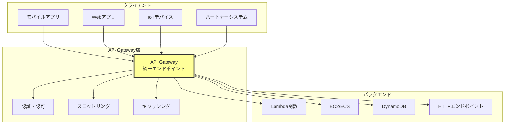
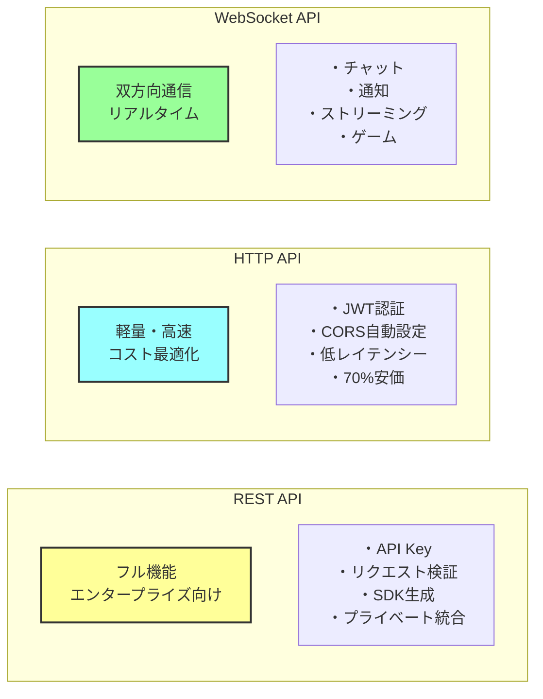
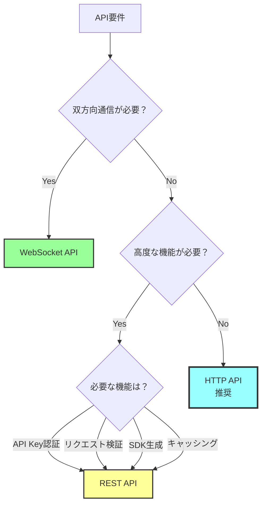
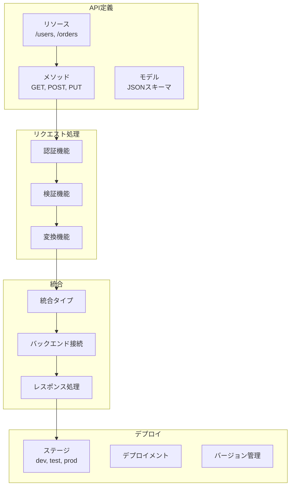
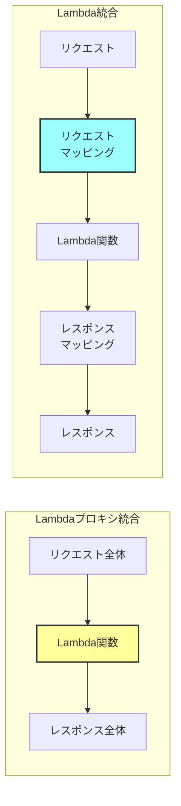
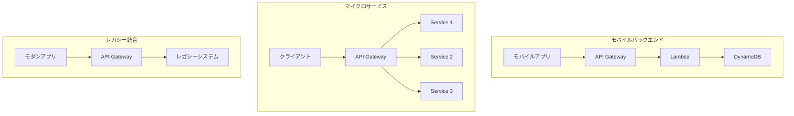

# AWS API Gatewayとは

## What's this file?
> [!NOTE]
> **What**
> 
> AWS API Gatewayとは何かについて記載しています。

## Conclusion (忙しいとき向け)
> [!IMPORTANT]
> **What** : AWS API Gatewayとは何か
> 
> **Answer** : APIの作成、公開、保守、監視、保護を行うフルマネージドサービス。REST API、HTTP API、WebSocket APIの3種類をサポートし、Lambda、EC2、その他AWSサービスやHTTPエンドポイントと統合してAPIを公開できる

## 目次

<details>
<summary>目次を開く</summary>

- [API Gatewayの基本概念](#api-gatewayの基本概念)
- [3つのAPIタイプの特徴](#3つのapiタイプの特徴)
- [主要機能とコンポーネント](#主要機能とコンポーネント)
- [統合パターンとユースケース](#統合パターンとユースケース)

</details>

## API Gatewayの基本概念

### API Gatewayの位置づけ



### API Gatewayの役割

| 役割 | 説明 | メリット |
|------|------|----------|
| APIプロキシ | クライアントとバックエンドの仲介 | 統一されたエンドポイント |
| 認証ゲートウェイ | API利用者の認証・認可 | セキュリティの一元管理 |
| トラフィック管理 | レート制限、スロットリング | バックエンド保護 |
| 変換レイヤー | リクエスト/レスポンス変換 | 柔軟な統合 |
| 監視ポイント | メトリクス、ログ収集 | 可視性向上 |

## 3つのAPIタイプの特徴

### REST API vs HTTP API vs WebSocket API



### 詳細比較

| 機能 | REST API | HTTP API | WebSocket API |
|------|----------|----------|---------------|
| プロトコル | HTTP/HTTPS | HTTP/HTTPS | WebSocket |
| 認証方法 | API Key, IAM, Cognito, Lambda | JWT, OAuth 2.0 | IAM, Lambda |
| 料金 | $3.5/100万リクエスト | $1.0/100万リクエスト | $1.0/100万メッセージ |
| レイテンシー | 〜29ms | 〜9ms | リアルタイム |
| VPC統合 | ✅ | ✅ | ✅ |
| WAF統合 | ✅ | ✅ | ❌ |
| キャッシング | ✅ | ❌ | ❌ |
| リクエスト変換 | ✅ | 限定的 | ✅ |

### APIタイプ選択フローチャート



## 主要機能とコンポーネント

### API Gatewayのコンポーネント構造



### 主要機能の詳細

#### 認証・認可機能

**APIキー認証**
- 使用量プランと連携
- クォータ制限
- スロットリング設定

**IAM認証**
- AWS署名バージョン4
- きめ細かいアクセス制御
- クロスアカウントアクセス

**Cognito認証**
- ユーザープール統合
- JWTトークン検証
- グループベース認可

**Lambdaオーソライザー**
- カスタム認証ロジック
- トークン/リクエストベース
- 認可結果キャッシュ

#### トラフィック管理

**スロットリング**
- バーストレート: 5000リクエスト/秒
- 定常レート: 10000リクエスト/秒
- メソッドレベル設定可能

**使用量プラン**
- APIキー別クォータ
- 日次/月次制限
- 段階的料金設定

**キャッシング**
- TTL設定可能
- 容量: 0.5GB〜237GB
- キャッシュキー設定

## 統合パターンとユースケース

### Lambda統合パターン



### 統合タイプ別の特徴

| 統合タイプ | 用途 | 変換 | ユースケース |
|-----------|------|------|--------------|
| Lambdaプロキシ | Lambda直接実行 | なし | サーバーレスAPI |
| HTTPプロキシ | HTTP転送 | なし | 既存API公開 |
| AWS統合 | AWSサービス呼び出し | あり | DynamoDB直接アクセス |
| Mock | テスト用 | あり | 開発・テスト |
| VPCリンク | プライベート統合 | あり | 内部サービス公開 |

### 実装パターン例

```hcl
# Terraform実装例

# REST API作成
resource "aws_api_gateway_rest_api" "main" {
  name        = "my-api"
  description = "My REST API"
  
  endpoint_configuration {
    types = ["REGIONAL"]  # EDGE, REGIONAL, PRIVATE
  }
}

# リソース定義
resource "aws_api_gateway_resource" "users" {
  rest_api_id = aws_api_gateway_rest_api.main.id
  parent_id   = aws_api_gateway_rest_api.main.root_resource_id
  path_part   = "users"
}

# メソッド定義
resource "aws_api_gateway_method" "get_users" {
  rest_api_id   = aws_api_gateway_rest_api.main.id
  resource_id   = aws_api_gateway_resource.users.id
  http_method   = "GET"
  authorization = "AWS_IAM"
  
  request_parameters = {
    "method.request.querystring.limit" = false
  }
}

# Lambda統合
resource "aws_api_gateway_integration" "lambda" {
  rest_api_id = aws_api_gateway_rest_api.main.id
  resource_id = aws_api_gateway_resource.users.id
  http_method = aws_api_gateway_method.get_users.http_method
  
  integration_http_method = "POST"
  type                    = "AWS_PROXY"
  uri                     = aws_lambda_function.get_users.invoke_arn
}

# デプロイメント
resource "aws_api_gateway_deployment" "prod" {
  rest_api_id = aws_api_gateway_rest_api.main.id
  stage_name  = "prod"
  
  depends_on = [
    aws_api_gateway_integration.lambda
  ]
}
```

### 典型的なユースケース



### ベストプラクティス

#### API設計のベストプラクティス

**セキュリティ**
- 認証方式の適切な選択
- HTTPSの必須化
- CORSの適切な設定
- WAF統合でのセキュリティ強化

**パフォーマンス**
- キャッシングの活用
- 適切なタイムアウト設定
- 非同期処理の検討
- VPCエンドポイント使用

**監視**
- CloudWatch統合
- X-Ray トレーシング
- アクセスログ有効化
- カスタムメトリクス設定

**コスト最適化**
- HTTP API優先検討
- キャッシュ活用
- 使用量プラン設定
- 不要なログの無効化

## 関連
- [API Gateway デベロッパーガイド](https://docs.aws.amazon.com/apigateway/)
- [REST API vs HTTP API 選択ガイド](https://docs.aws.amazon.com/apigateway/latest/developerguide/http-api-vs-rest.html)
- [API Gateway 料金](https://aws.amazon.com/api-gateway/pricing/)
- [サーバーレスアーキテクチャ](https://aws.amazon.com/serverless/)