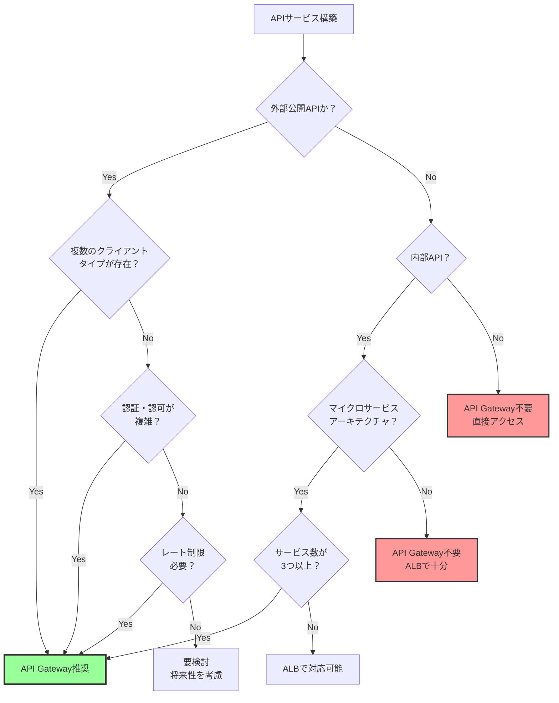
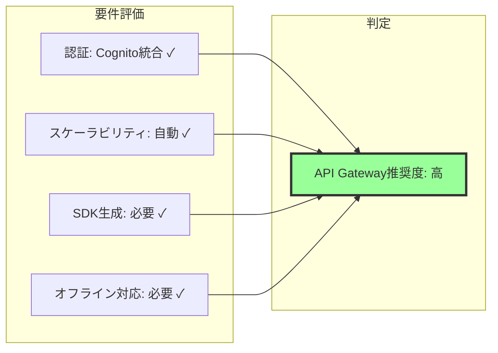
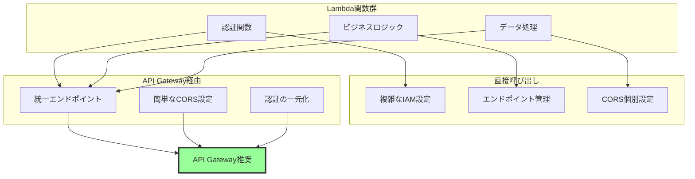
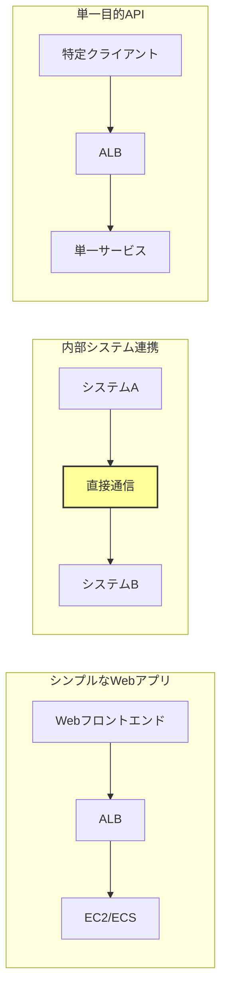
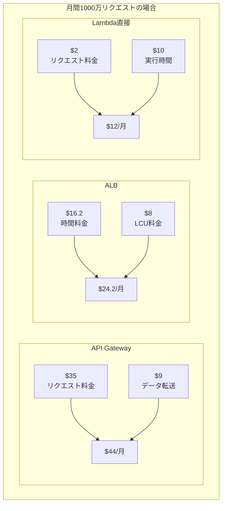
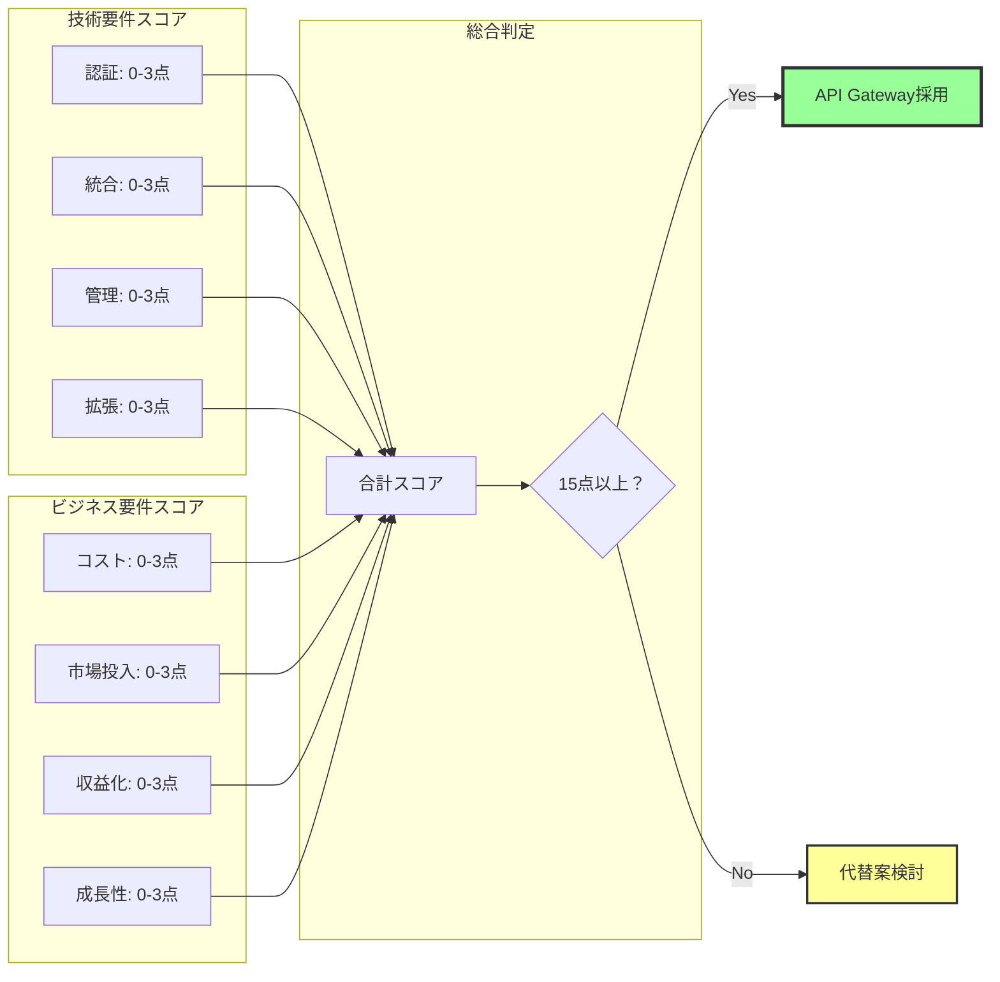

# AWS API Gatewayの必要性を判断する方法

## What's this file?
> [!NOTE]
> **How**
> 
> どのようにAWS API Gatewayの必要性を判断するかについて記載しています。

## Conclusion (忙しいとき向け)
> [!IMPORTANT]
> **How** : どのようにAWS API Gatewayの必要性を判断するか
> 
> **Answer** : API公開要件、認証・認可の複雑さ、トラフィック管理の必要性、バックエンドの多様性、開発効率の観点から評価し、これらの要件が2つ以上該当する場合はAPI Gatewayの採用を推奨

## 目次

目次を開く

- [必要性判断のフローチャート](#必要性判断のフローチャート)
- [ユースケース別の評価基準](#ユースケース別の評価基準)
- [API Gateway不要なケース](#api-gateway不要なケース)
- [コストとROIの評価方法](#コストとroiの評価方法)

## 必要性判断のフローチャート

### 判断フローチャート

### 主要な判断基準

| 判断基準 | API Gateway必要 | API Gateway不要 |
|---------|----------------|----------------|
| API公開範囲 | 外部公開、パートナー連携 | 内部利用のみ |
| クライアント多様性 | モバイル、Web、IoT混在 | 単一クライアント |
| 認証要件 | 複数認証方式、API Key管理 | シンプルな認証 |
| トラフィック管理 | レート制限、使用量管理必須 | 制限不要 |
| バックエンド | 複数サービス統合 | 単一バックエンド |

## ユースケース別の評価基準

### ケース1: モバイルアプリのバックエンド

### ケース2: マイクロサービス統合

#### 評価チェックリスト

| 評価項目 | 条件 | 点数 |
|---------|--------|------|
| **サービス数** | | |
| | 3個以上 | +2点 |
| | 2個 | +1点 |
| | 1個 | 0点 |
| **認証** | | |
| | 統一認証必要 | +2点 |
| | サービス個別認証 | +1点 |
| | 認証不要 | 0点 |
| **APIバージョニング** | | |
| | バージョン管理必要 | +2点 |
| | 単一バージョン | 0点 |
| **監視** | | |
| | 統合監視必要 | +2点 |
| | 個別監視で十分 | 0点 |

> **判定基準**: 合計6点以上でAPI Gateway推奨

### ケース3: サーバーレスアーキテクチャ

## API Gateway不要なケース

### 不要なケースの特徴

### 代替ソリューション比較

| 要件 | API Gateway | ALB | 直接アクセス | CloudFront |
|------|------------|-----|-------------|------------|
| HTTPルーティング | ✅ 高機能 | ✅ 基本機能 | ❌ | ✅ パスベース |
| 認証・認可 | ✅ 多様 | ⚠️ OIDC/Cognito | ❌ | ⚠️ 署名付きURL |
| レート制限 | ✅ 詳細設定 | ❌ | ❌ | ⚠️ WAF連携 |
| コスト | 💰💰💰 | 💰💰 | 💰 | 💰💰 |
| 管理複雑性 | 中 | 低 | 最低 | 低 |

### 判断基準マトリックス

#### 点数評価システム（10点満点）

| APIタイプ | API Gateway | ALB | 直接接続 |
|---------|------------|-----|--------|
| 外部API | 10 | 6 | 2 |
| 内部API | 6 | 8 | 10 |
| サーバーレス | 10 | 4 | 6 |
| レガシー統合 | 8 | 10 | 4 |

## コストとROIの評価方法

### コスト計算例

### ROI評価チェックリスト

#### API Gateway導入のROI評価

**開発効率**
- SDK自動生成: 開発時間20%削減
- 統合テスト環境: 構築時間50%削減
- ドキュメント自動生成: 保守コスト30%削減

**運用効率**
- 監視統合: 運用負荷40%削減
- 自動スケーリング: 管理不要
- セキュリティ統合: 設定時間60%削減

**ビジネス価値**
- API収益化: 使用量課金可能
- パートナー連携: 迅速な展開
- 開発者ポータル: エコシステム構築

### 総合判断フレームワーク

### 段階的導入アプローチ

#### フェーズ別導入計画

| フェーズ | 期間 | 対象 | 評価項目 |
|---------|------|------|----------|
| **Phase 1: PoC** | 2週間 | 1つのAPI | レイテンシー、コスト |
| **Phase 2: パイロット** | 1ヶ月 | 主要API群 | 運用性、拡張性 |
| **Phase 3: 移行** | 3ヶ月 | 全API | ROI、ビジネス価値 |

#### 判断基準

| 評価項目 | 基準値 | 判定 |
|---------|---------|------|
| レイテンシー増加 | <10ms | 継続 |
| コスト増加 | <20% | 継続 |
| 開発効率向上 | >30% | 全面採用 |

## 関連
- [API Gateway vs ALB 比較](https://aws.amazon.com/blogs/compute/choosing-between-api-gateway-and-application-load-balancer/)
- [API Gateway 料金計算ツール](https://calculator.aws/#/createCalculator/APIGateway)
- [サーバーレスアーキテクチャのベストプラクティス](https://docs.aws.amazon.com/whitepapers/latest/serverless-architectures-lambda/welcome.html)
- [API設計のベストプラクティス](https://docs.aws.amazon.com/apigateway/latest/developerguide/api-gateway-api-best-practices.html)