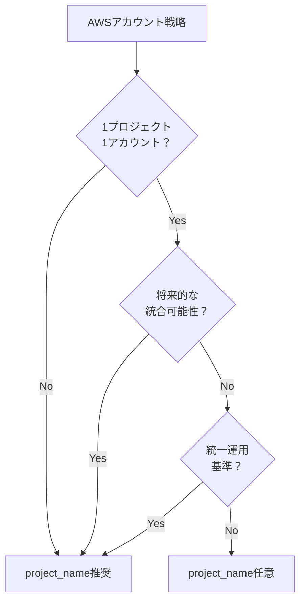

# 異なるAWSアカウントでのproject_name変数の必要性について

## What's this file?
> [!NOTE]
> **What**
> 
> **異なるAWSアカウントを使用する場合の`${var.project_name}`の必要性は何か**

## Conclusion (忙しいとき向け)
> [!IMPORTANT]
> **What** : **異なるAWSアカウントでの`${var.project_name}`の必要性**
> 
> **Answer** : 技術的には不要だが、運用・管理・移行の観点から推奨される

## 目次
<details>
<summary>目次を開く</summary>

- [技術的観点](#技術的観点)
- [運用管理の観点](#運用管理の観点)
- [実践的な判断基準](#実践的な判断基準)
- [推奨パターン](#推奨パターン)

</details>

## 技術的観点

### AWSアカウントが異なる場合

異なるAWSアカウントでは、リソースの名前空間が完全に分離されているため、**技術的には名前の衝突は発生しません**。

```hcl
# アカウントA（123456789012）
tags = {
  Name = "server-Public-A-dev"  # 衝突しない
}

# アカウントB（987654321098）
tags = {
  Name = "server-Public-A-dev"  # 同じ名前でも問題ない
}
```

## 運用管理の観点

### なぜそれでも推奨されるのか

#### 1. **統一された運用手順**
```hcl
# プロジェクト名を含めることで、どのアカウントでも同じ命名規則
tags = {
  Name = "${var.project_name}-server-Public-A-${var.environment}"
}
```

#### 2. **アカウント移行の容易性**
将来的にアカウント統合や移行が必要になった場合：
- プロジェクト名付きの場合：そのまま移行可能
- プロジェクト名なしの場合：名前衝突のリスク、変更作業が必要

#### 3. **クロスアカウント運用**
- AWS Organizations での一元管理
- CloudWatch クロスアカウントダッシュボード
- Cost Explorer での統合レポート

```bash
# 複数アカウントをまたいだ検索時に便利
aws ec2 describe-subnets \
  --filters "Name=tag:Name,Values=example-project-*" \
  --profile account-a

aws ec2 describe-subnets \
  --filters "Name=tag:Name,Values=example-project-*" \
  --profile account-b
```

#### 4. **監査とコンプライアンス**
- AWS Config ルールでの統一的な命名規則チェック
- セキュリティ監査での識別性向上

## 実践的な判断基準

### project_name が不要なケース

1. **完全に独立したアカウント戦略**
   - 1プロジェクト = 1アカウント
   - アカウント間の連携なし
   - 将来的な統合予定なし

2. **アカウント名自体がプロジェクトを表す**
   ```
   アカウント名: example-project-prod
   タグ: "server-Public-A"  # アカウント名で識別可能
   ```

### project_name が推奨されるケース

1. **マルチプロジェクトの可能性**
   - 将来的に同一アカウントで複数プロジェクト運用の可能性
   - アカウント統合の可能性

2. **統一的な運用基準**
   - 社内の全プロジェクトで同一の命名規則
   - IaCテンプレートの再利用性

3. **マルチアカウント戦略**
   - AWS Control Tower 使用
   - AWS Organizations での管理

## 推奨パターン

### ベストプラクティス

```hcl
# 推奨：一貫性のある命名規則
locals {
  name_prefix = var.use_project_name ? "${var.project_name}-" : ""
}

resource "aws_subnet" "public" {
  tags = {
    Name = "${local.name_prefix}server-Public-A-${var.environment}"
  }
}
```

### 設定可能な実装例

```hcl
variable "use_project_name" {
  description = "タグにプロジェクト名を含めるかどうか"
  type        = bool
  default     = true  # デフォルトは含める
}

variable "project_name" {
  description = "プロジェクト名"
  type        = string
  default     = "example-project"
}
```

### 判断フローチャート



## 関連
- [AWS Multi-Account Strategy](https://docs.aws.amazon.com/whitepapers/latest/organizing-your-aws-environment/organizing-your-aws-environment.html)
- [AWS Organizations Best Practices](https://docs.aws.amazon.com/organizations/latest/userguide/orgs_best-practices.html)
- [なぜTerraformのタグ名に${var.project_name}を含める必要があるのか](./2025.08.04.22.22_why_tags_name_must_include_project_name_variable.md)