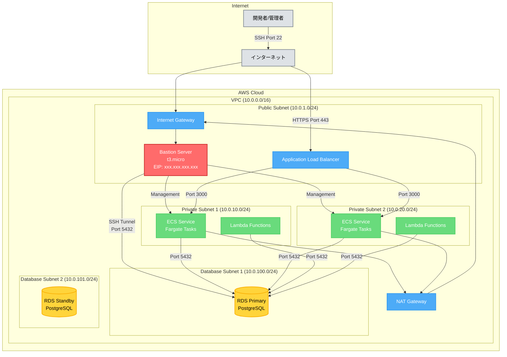
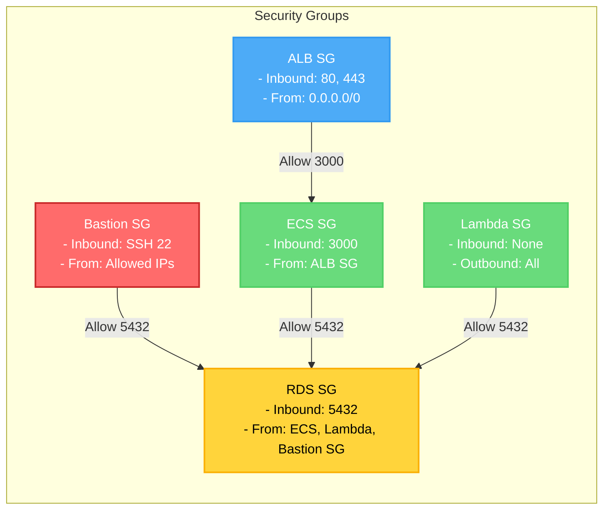

# Terraformで踏み台サーバーを設定する方法

## What's this file?
> [!NOTE]
> **How**
> 
> どのようにTerraformで踏み台サーバー（Bastion Server）を設定するかについて記載しています。

## Conclusion (忙しいとき向け)
> [!IMPORTANT]
> **How** : どのようにTerraformで踏み台サーバーを設定するか
> 
> **Answer** : EC2インスタンス、セキュリティグループ、キーペア、Elastic IPのリソースを定義し、必要な変数を設定して実装する

## 目次

<details>
<summary>目次を開く</summary>

- [アーキテクチャ図](#アーキテクチャ図)
- [セキュリティグループの関係図](#セキュリティグループの関係図)
- [前提条件](#前提条件)
- [必要なTerraformリソース](#必要なterraformリソース)
- [実装手順](#実装手順)
- [セキュリティグループの設定](#セキュリティグループの設定)
- [EC2インスタンスの定義](#ec2インスタンスの定義)
- [変数の設定](#変数の設定)
- [RDSアクセス設定](#rdsアクセス設定)
- [ベストプラクティス](#ベストプラクティス)
- [トラブルシューティング](#トラブルシューティング)

</details>

## アーキテクチャ図

踏み台サーバーを含むAWSインフラストラクチャの全体像：



## セキュリティグループの関係図



## 前提条件

踏み台サーバーをTerraformで設定する前に、以下の準備が必要です：

1. **VPC構成**
   - パブリックサブネット（踏み台サーバー配置用）
   - プライベートサブネット（保護されたリソース配置用）
   - インターネットゲートウェイ

2. **AWSアカウント権限**
   - EC2インスタンス作成権限
   - セキュリティグループ管理権限
   - Elastic IP作成権限

3. **SSH鍵の準備**
   - 公開鍵・秘密鍵のペア
   - 安全な鍵管理

## 必要なTerraformリソース

### 1. セキュリティグループ
```hcl
resource "aws_security_group" "bastion_sg" {
  name        = "${var.project_name}-BASTION-SG-${var.environment}"
  description = "Security group for bastion server"
  vpc_id      = aws_vpc.main.id

  ingress {
    description = "SSH from allowed IPs"
    from_port   = 22
    to_port     = 22
    protocol    = "tcp"
    cidr_blocks = var.allowed_ssh_ips  # 制限されたIPリスト推奨
  }

  egress {
    from_port   = 0
    to_port     = 0
    protocol    = "-1"
    cidr_blocks = ["0.0.0.0/0"]
  }

  tags = {
    Name        = "${var.project_name}-BASTION-SG-${var.environment}"
    Environment = var.environment
  }
}
```

### 2. キーペア
```hcl
resource "aws_key_pair" "bastion_key" {
  key_name   = "${var.project_name}-bastion-key-${var.environment}"
  public_key = var.bastion_public_key

  tags = {
    Name        = "${var.project_name}-bastion-key-${var.environment}"
    Environment = var.environment
  }
}
```

### 3. EC2インスタンス
```hcl
resource "aws_instance" "bastion" {
  ami                    = data.aws_ami.amazon_linux_2.id
  instance_type          = var.bastion_instance_type
  subnet_id              = aws_subnet.public_subnet.id
  vpc_security_group_ids = [aws_security_group.bastion_sg.id]
  key_name               = aws_key_pair.bastion_key.key_name

  root_block_device {
    volume_type = "gp3"
    volume_size = 8
    encrypted   = true
  }

  metadata_options {
    http_tokens = "required"  # IMDSv2を強制
  }

  tags = {
    Name        = "${var.project_name}-bastion-${var.environment}"
    Environment = var.environment
  }
}
```

### 4. Elastic IP
```hcl
resource "aws_eip" "bastion" {
  instance = aws_instance.bastion.id
  domain   = "vpc"

  tags = {
    Name        = "${var.project_name}-bastion-eip-${var.environment}"
    Environment = var.environment
  }
}
```

## 実装手順

### ステップ1: ファイル構成
```
modules/aws/server/
├── aws_ec2_instance.tf    # 新規作成
├── aws_security_group.tf  # 既存ファイルに追加
└── variables.tf          # 変数追加
```

### ステップ2: AMIデータソース定義
```hcl
data "aws_ami" "amazon_linux_2" {
  most_recent = true
  owners      = ["amazon"]

  filter {
    name   = "name"
    values = ["amzn2-ami-hvm-*-x86_64-gp2"]
  }

  filter {
    name   = "virtualization-type"
    values = ["hvm"]
  }
}
```

### ステップ3: 変数の定義
```hcl
# variables.tf に追加
variable "bastion_instance_type" {
  description = "Instance type for bastion server"
  type        = string
  default     = "t3.micro"
}

variable "bastion_public_key" {
  description = "Public key for bastion server SSH access"
  type        = string
}

variable "allowed_ssh_ips" {
  description = "List of allowed IP addresses for SSH access"
  type        = list(string)
  default     = ["0.0.0.0/0"]  # 本番環境では必ず制限する
}
```

## セキュリティグループの設定

### SSH接続の制限
```hcl
# 開発環境: 開発者のIPアドレスのみ許可
variable "allowed_ssh_ips" {
  default = ["203.0.113.0/24"]  # 例: 会社のIPレンジ
}

# 本番環境: より厳格な制限
variable "allowed_ssh_ips" {
  default = ["203.0.113.10/32", "203.0.113.20/32"]  # 特定のIP
}
```

### ポートフォワーディング用の設定
RDS等へのアクセスを踏み台経由で行う場合：
```hcl
egress {
  description = "PostgreSQL to RDS"
  from_port   = 5432
  to_port     = 5432
  protocol    = "tcp"
  cidr_blocks = [aws_subnet.private_subnet.cidr_block]
}
```

## EC2インスタンスの定義

### 最小構成
```hcl
resource "aws_instance" "bastion" {
  ami                    = data.aws_ami.amazon_linux_2.id
  instance_type          = "t3.micro"
  subnet_id              = aws_subnet.public_subnet.id
  vpc_security_group_ids = [aws_security_group.bastion_sg.id]
  key_name               = aws_key_pair.bastion_key.key_name

  tags = {
    Name = "${var.project_name}-bastion-${var.environment}"
  }
}
```

### 高可用性構成
```hcl
# Auto Scaling Groupを使用した構成
resource "aws_launch_template" "bastion" {
  name_prefix   = "${var.project_name}-bastion-"
  image_id      = data.aws_ami.amazon_linux_2.id
  instance_type = var.bastion_instance_type
  key_name      = aws_key_pair.bastion_key.key_name

  vpc_security_group_ids = [aws_security_group.bastion_sg.id]
}

resource "aws_autoscaling_group" "bastion" {
  desired_capacity    = 1
  max_size           = 1
  min_size           = 1
  vpc_zone_identifier = [aws_subnet.public_subnet.id]

  launch_template {
    id      = aws_launch_template.bastion.id
    version = "$Latest"
  }
}
```

## 変数の設定

### terraform.tfvars例
```hcl
# 開発環境
bastion_instance_type = "t3.micro"
bastion_public_key    = "ssh-rsa AAAAB3NzaC1yc2E..."
allowed_ssh_ips       = ["10.0.0.0/8"]

# 本番環境
bastion_instance_type = "t3.small"
bastion_public_key    = file("~/.ssh/bastion_prod.pub")
allowed_ssh_ips       = ["203.0.113.0/24"]
```

### 環境別設定
```hcl
# dev.tfvars
bastion_instance_type = "t3.micro"
log_retention_days    = 7

# prod.tfvars
bastion_instance_type = "t3.small"
log_retention_days    = 30
```

## RDSアクセス設定

### RDSセキュリティグループの更新
```hcl
resource "aws_security_group" "rds_sg" {
  # ... 既存の設定 ...

  ingress {
    description     = "PostgreSQL from Bastion"
    from_port       = 5432
    to_port         = 5432
    protocol        = "tcp"
    security_groups = [aws_security_group.bastion_sg.id]
  }
}
```

### SSHトンネリング例
```bash
# ローカルからRDSへの接続
ssh -L 5432:rds-endpoint.region.rds.amazonaws.com:5432 \
    -i ~/.ssh/bastion_key.pem \
    ec2-user@bastion-public-ip
```

## ベストプラクティス

### 1. セキュリティ強化
- SSH接続元IPの制限
- Session Managerの併用検討
- 定期的な鍵のローテーション
- CloudWatch Logsでの監査ログ収集

### 2. コスト最適化
- 使用時のみ起動するスケジュール設定
- Spot Instanceの活用（開発環境）
- 適切なインスタンスサイズの選択

### 3. 運用管理
```hcl
# CloudWatch Logsエージェント設定
user_data = <<-EOF
  #!/bin/bash
  yum update -y
  yum install -y amazon-cloudwatch-agent
  # エージェント設定...
EOF
```

### 4. 自動化
```hcl
# Systems Manager Session Manager有効化
resource "aws_iam_role_policy_attachment" "ssm" {
  role       = aws_iam_role.bastion.name
  policy_arn = "arn:aws:iam::aws:policy/AmazonSSMManagedInstanceCore"
}
```

## トラブルシューティング

### 接続できない場合
1. **セキュリティグループ確認**
   - インバウンドルールでSSH許可されているか
   - ソースIPが正しいか

2. **ネットワーク設定確認**
   - インターネットゲートウェイの設定
   - ルートテーブルの設定

3. **インスタンス状態確認**
   ```bash
   aws ec2 describe-instances --instance-ids i-xxxxx
   ```

### パフォーマンス問題
- インスタンスタイプの見直し
- ネットワークパフォーマンスの確認
- EBSボリュームタイプの最適化

## 関連

- [AWS EC2ベストプラクティス](https://docs.aws.amazon.com/ec2/)
- [Terraform AWS Provider Documentation](https://registry.terraform.io/providers/hashicorp/aws/latest)
- [AWS Systems Manager Session Manager](https://docs.aws.amazon.com/systems-manager/latest/userguide/session-manager.html)
- [セキュアな踏み台サーバー構築ガイド](https://aws.amazon.com/blogs/security/)