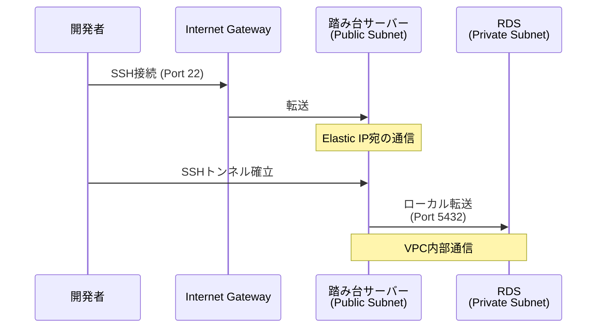
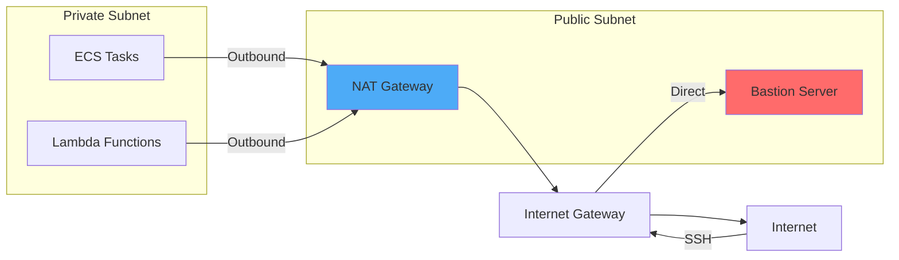
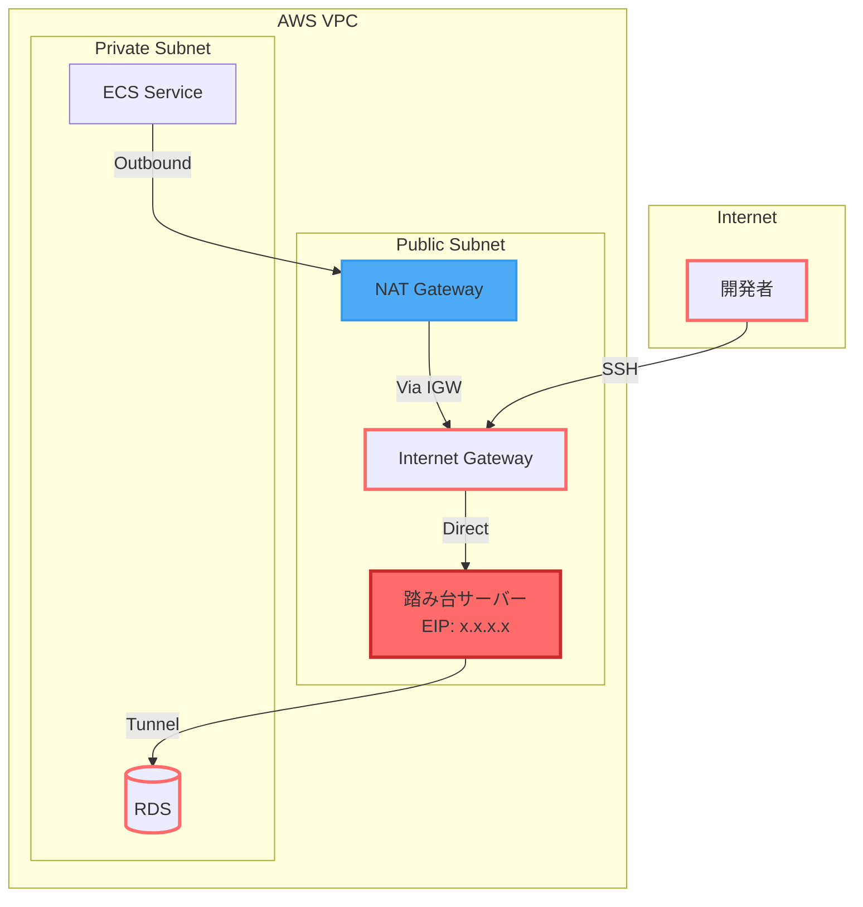

# なぜ踏み台サーバーのSSHトンネルはNATゲートウェイを経由しないのか

## What's this file?
> [!NOTE]
> **Why**
> 
> **なぜ**踏み台サーバーのSSHトンネルはNATゲートウェイを経由しないのか

## Conclusion (忙しいとき向け)
> [!IMPORTANT]
> **Why** : **なぜ**踏み台サーバーのSSHトンネルはNATゲートウェイを経由しないのか
> 
> **Answer** : 踏み台サーバーはパブリックサブネットに配置され、Elastic IPを持つため、インターネットゲートウェイを直接使用してインターネットと通信し、NATゲートウェイは不要

## 目次
<details>
<summary>目次を開く</summary>

- [NATゲートウェイとインターネットゲートウェイの違い](#natゲートウェイとインターネットゲートウェイの違い)
- [踏み台サーバーのネットワーク構成](#踏み台サーバーのネットワーク構成)
- [SSHトンネルの通信フロー](#sshトンネルの通信フロー)
- [なぜNATゲートウェイを使わないのか](#なぜnatゲートウェイを使わないのか)
- [プライベートサブネットのリソースとの違い](#プライベートサブネットのリソースとの違い)
- [ネットワーク図での説明](#ネットワーク図での説明)
- [コストと性能への影響](#コストと性能への影響)

</details>

## NATゲートウェイとインターネットゲートウェイの違い

### インターネットゲートウェイ（IGW）
- VPCとインターネット間の双方向通信を可能にする
- パブリックIPアドレスを持つリソースが直接使用
- 水平スケーリング、冗長性、高可用性を持つ管理型サービス
- 追加料金なし（データ転送料金のみ）

### NATゲートウェイ
- プライベートサブネットのリソースがインターネットにアクセスするための出口
- インバウンド接続は不可（アウトバウンドのみ）
- パブリックサブネットに配置される
- 時間単位の料金とデータ処理料金が発生

## 踏み台サーバーのネットワーク構成

### 配置場所

```text
VPC (10.0.0.0/16)
├── パブリックサブネット (10.0.1.0/24)
│   ├── インターネットゲートウェイ
│   ├── 踏み台サーバー (Elastic IP付き)
│   └── NATゲートウェイ
└── プライベートサブネット (10.0.10.0/24)
    └── RDS、ECS、Lambda等
```

### ルートテーブル設定

#### パブリックサブネットのルートテーブル

```text
Destination    Target
10.0.0.0/16    local
0.0.0.0/0      igw-xxxxx (インターネットゲートウェイ)
```

#### プライベートサブネットのルートテーブル

```text
Destination    Target
10.0.0.0/16    local
0.0.0.0/0      nat-xxxxx (NATゲートウェイ)
```

## SSHトンネルの通信フロー

### 踏み台サーバーへのSSH接続



### 通信経路の詳細

1. **インバウンド通信**
   - ユーザー → インターネット → IGW → 踏み台サーバー（Elastic IP）
   - NATゲートウェイは関与しない

2. **VPC内部通信**
   - 踏み台サーバー → RDS（同一VPC内のローカル通信）
   - ルーティングは「local」で処理

## なぜNATゲートウェイを使わないのか

### 1. パブリックIPアドレスの存在

踏み台サーバーはElastic IPを持つため：
- インターネットから直接アクセス可能
- IGWを通じて双方向通信が可能
- NATゲートウェイの「プライベートIPのみ」という制約に該当しない

### 2. ルーティングの仕組み

```hcl
# パブリックサブネットのルート
resource "aws_route" "public_internet" {
  route_table_id         = aws_route_table.public.id
  destination_cidr_block = "0.0.0.0/0"
  gateway_id             = aws_internet_gateway.main.id
}
```

- 0.0.0.0/0（インターネット）宛の通信はIGWへ
- NATゲートウェイへのルートは存在しない

### 3. NATゲートウェイの目的

NATゲートウェイは以下の場合に使用：
- プライベートサブネットのリソースがインターネットにアクセスする
- インバウンド接続を受け付けない
- パブリックIPを持たないリソース用

踏み台サーバーはこれらの条件に該当しない。

## プライベートサブネットのリソースとの違い

### ECS/Lambdaの場合



### 主な違い

| 項目 | 踏み台サーバー | ECS/Lambda |
|------|---------------|------------|
| サブネット | パブリック | プライベート |
| パブリックIP | あり（Elastic IP） | なし |
| インバウンド | 可能（SSH） | 不可 |
| アウトバウンド経路 | IGW直接 | NAT経由 |

## ネットワーク図での説明



赤い線：SSHトンネルの経路（NATを通らない）
青い線：プライベートリソースのアウトバウンド経路

## コストと性能への影響

### コスト面のメリット

1. **NATゲートウェイ料金の回避**
   - 踏み台サーバーの通信はNATゲートウェイを使用しない
   - NATゲートウェイのデータ処理料金が発生しない

2. **効率的なリソース利用**
   - IGWは無料（データ転送料金のみ）
   - 不要な中継を避けることでコスト削減

### 性能面のメリット

1. **レイテンシの削減**
   - IGWへの直接アクセスで経路が短い
   - NATゲートウェイの処理オーバーヘッドがない

2. **帯域幅の効率化**
   - NATゲートウェイの帯域を消費しない
   - プライベートリソース用の帯域を確保

## まとめ

踏み台サーバーがNATゲートウェイを経由しない理由：

1. **ネットワーク設計**：パブリックサブネットに配置され、Elastic IPを持つ
2. **ルーティング**：IGWへの直接ルートが設定されている
3. **役割の違い**：NATゲートウェイはプライベートリソース用
4. **効率性**：直接IGWを使用することでコストと性能が最適化

この設計により、セキュアで効率的な踏み台サーバーの運用が可能になります。

## 関連

- [Terraformで踏み台サーバーを設定する方法](./2025.08.04.23.45_how_terraform_bastion_server_setup.md)
- [なぜALBはパブリックサブネットに配置する必要があるのか](./2025.08.04.15.34_why_alb_must_assign_in_public_subnet.md)
- [プライベートサブネット間の接続方法](./2025.08.04.15.27_how_connect_between_private_subnets.md)
