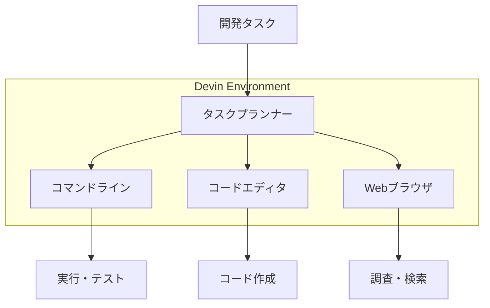

# Devin - 世界初の完全自律型AIソフトウェアエンジニア

## What's this file?
> [!NOTE]
> **What**
> 
> Devinとは何かについて記載しています。

## Conclusion (忙しいとき向け)
> [!IMPORTANT]
> **What** : Devinとは何か
> 
> **Answer** : Cognition Labs社が開発した世界初の完全自律型AIソフトウェアエンジニアで、コードの作成、デバッグ、デプロイまでを独立して実行できるAIエージェント

## 目次

<details>
<summary>目次を開く</summary>

- [概要](#概要)
- [主な特徴](#主な特徴)
- [技術的能力](#技術的能力)
- [開発環境と機能](#開発環境と機能)
- [他のAIコーディングツールとの違い](#他のaiコーディングツールとの違い)
- [実績とベンチマーク](#実績とベンチマーク)
- [利用シーン](#利用シーン)
- [制限事項と課題](#制限事項と課題)
- [今後の展望](#今後の展望)

</details>

## 概要

Devinは2024年3月にCognition Labs社によって発表された、革新的なAIソフトウェアエンジニアです。従来のAIコーディングアシスタントとは異なり、完全に自律的にソフトウェア開発タスクを遂行できる能力を持っています。

### 開発元情報
- **企業名**: Cognition Labs
- **発表時期**: 2024年3月
- **資金調達**: シリーズAで2100万ドルを調達（評価額：20億ドル）
- **投資家**: Founders Fund、Khosla Ventures等

## 主な特徴

### 1. 完全自律型エージェント
- 人間の介入なしにタスクを完遂
- 長期的な計画立案と実行
- 自己修正能力

### 2. 統合開発環境
- 独自のコマンドライン
- コードエディタ
- Webブラウザ
- 全ツールの統合的な使用

### 3. リアルタイムコラボレーション
- 人間のエンジニアとの共同作業
- Slackでのコミュニケーション
- 進捗状況の透明な共有

## 技術的能力

### コーディング能力
```
1. 複数言語対応
   - Python, JavaScript, Java, C++等
   - フレームワーク理解（React, Django, Spring等）

2. 開発タスク
   - 新規プロジェクトの構築
   - 既存コードのデバッグ
   - リファクタリング
   - テストコード作成
```

### 問題解決能力
- **エラー解析**: ログを読み、問題を特定
- **デバッグ**: 段階的にコードを修正
- **最適化**: パフォーマンス改善の提案と実装
- **調査**: ドキュメントやStackOverflowの参照

### 学習能力
- 新しいAPIやライブラリの学習
- プロジェクト固有の規約への適応
- 過去のミスからの学習

## 開発環境と機能

### 統合ツールセット


### 主要機能
1. **計画立案**
   - タスクの分解
   - 優先順位付け
   - タイムライン作成

2. **実装**
   - コード生成
   - ファイル操作
   - Git操作

3. **検証**
   - 自動テスト実行
   - デバッグ
   - 品質チェック

## 他のAIコーディングツールとの違い

### 比較表
| 特徴 | Devin | GitHub Copilot | ChatGPT/Claude |
|------|-------|----------------|----------------|
| 自律性 | 完全自律 | アシスタント型 | 対話型 |
| タスク完遂 | 可能 | 部分的 | 不可 |
| 開発環境 | 統合環境 | IDE統合 | 外部ツール |
| デバッグ | 自動実行 | 提案のみ | 提案のみ |
| 長期プロジェクト | 対応 | 非対応 | 非対応 |

### 独自の強み
1. **エンドツーエンド開発**
   - 要件定義から実装まで
   - テストとデプロイメント
   - ドキュメント作成

2. **自己完結性**
   - 外部リソースの自動取得
   - 依存関係の管理
   - 環境構築

## 実績とベンチマーク

### SWE-bench結果
- **Devin**: 13.86%の問題を解決
- **Claude 2**: 4.80%
- **GPT-4**: 1.74%

※SWE-bench: 実際のGitHubイシューを解決する能力を測定

### 実践的な成果
1. **実際のプロジェクト**
   - オープンソースへの貢献
   - バグ修正のPR作成
   - 新機能の実装

2. **フリーランス案件**
   - Upworkでの案件受注と完遂
   - 実際の報酬獲得

## 利用シーン

### 適している用途
1. **プロトタイプ開発**
   - MVP作成
   - 概念実証
   - 初期実装

2. **定型的なタスク**
   - CRUD操作の実装
   - API統合
   - データ移行スクリプト

3. **保守・運用**
   - バグ修正
   - リファクタリング
   - ドキュメント更新

### 現時点で不適な用途
1. **複雑なアーキテクチャ設計**
2. **革新的なアルゴリズム開発**
3. **高度なセキュリティ実装**
4. **大規模システムの全面改修**

## 制限事項と課題

### 技術的制限
- **複雑性の限界**: 非常に複雑なタスクでの精度低下
- **創造性**: 革新的なソリューションの限界
- **コンテキスト**: 大規模プロジェクトでの全体把握

### 実用上の課題
1. **アクセス制限**
   - 現在は限定的なアクセス
   - ウェイトリスト制

2. **コスト**
   - 価格体系が未確定
   - 計算リソースの消費

3. **信頼性**
   - 完全な自律性への依存リスク
   - 品質保証の必要性

## 今後の展望

### 短期的展望（1-2年）
1. **機能拡張**
   - より多くの言語・フレームワーク対応
   - エンタープライズ機能
   - セキュリティ強化

2. **普及**
   - 一般公開
   - 価格体系の確立
   - 企業採用の増加

### 長期的影響
1. **開発プロセスの変革**
   - エンジニアの役割変化
   - 開発速度の大幅向上
   - コスト構造の変化

2. **新しい働き方**
   - AIとの協働モデル
   - より創造的な業務へのシフト
   - スキルセットの変化

## まとめ

Devinは、AIソフトウェア開発の新しい時代を切り開く革新的なツールです。完全自律型のAIエージェントとして、従来のコーディングアシスタントを超えた能力を持ち、ソフトウェア開発の効率化と民主化を推進しています。

現時点では制限事項もありますが、今後の発展により、ソフトウェア開発の在り方を根本的に変える可能性を秘めています。

## 関連
- [GitHub Copilotとの比較](https://github.com/features/copilot)
- [SWE-benchベンチマーク](https://www.swebench.com/)
- [Cognition Labs公式サイト](https://www.cognition-labs.com/)
- [AIエージェントの進化と未来](https://www.anthropic.com/research)