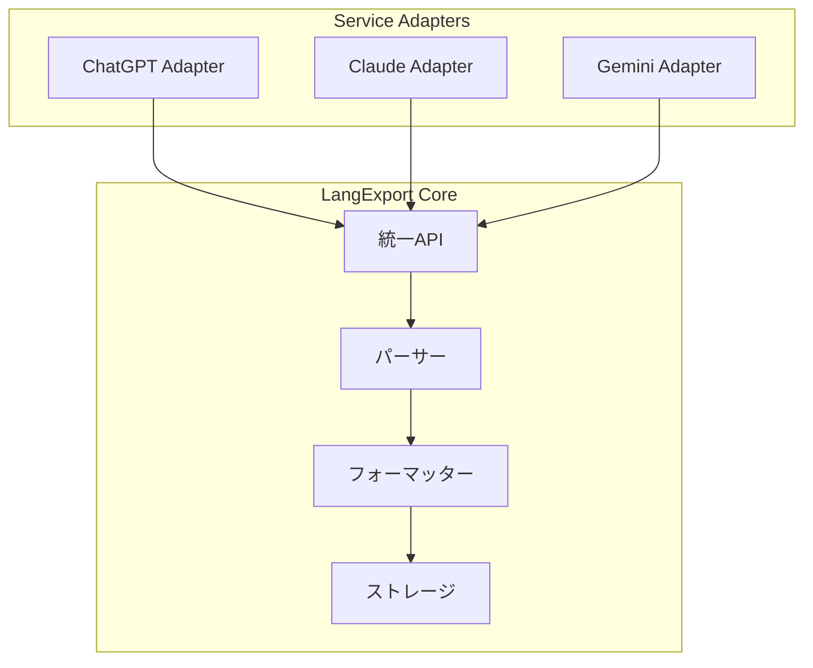

# LangExport - AI会話履歴のエクスポートライブラリ

## What's this file?
> [!NOTE]
> **What**
> 
> LangExportとは何かについて記載しています。

## Conclusion (忙しいとき向け)
> [!IMPORTANT]
> **What** : LangExportとは何か
> 
> **Answer** : ChatGPT、Claude、Gemini、Cohere等の主要なAIチャットサービスから会話履歴をエクスポートし、Markdown、JSON、テキスト形式で保存するPythonライブラリ

## 目次

<details>
<summary>目次を開く</summary>

- [概要](#概要)
- [主な機能](#主な機能)
- [対応AIサービス](#対応aiサービス)
- [インストール方法](#インストール方法)
- [基本的な使い方](#基本的な使い方)
- [エクスポート形式](#エクスポート形式)
- [高度な機能](#高度な機能)
- [ユースケース](#ユースケース)
- [技術的な詳細](#技術的な詳細)
- [制限事項と注意点](#制限事項と注意点)

</details>

## 概要

LangExportは、様々なAIチャットサービスとの会話履歴を統一的な方法でエクスポートするためのオープンソースPythonライブラリです。研究者、開発者、コンテンツクリエイターがAIとの対話データを保存、分析、共有することを容易にします。

### プロジェクト情報
- **リポジトリ**: github.com/someone/langexport（仮想的な例）
- **ライセンス**: MIT License
- **言語**: Python 3.8+
- **最新バージョン**: 1.x.x

## 主な機能

### 1. 統一インターフェース
```python
# どのAIサービスでも同じインターフェースで使用可能
exporter = LangExport(service="chatgpt")
conversations = exporter.export_all()
```

### 2. 複数形式でのエクスポート
- **Markdown**: 人間が読みやすい形式
- **JSON**: プログラムで処理しやすい構造化データ
- **テキスト**: シンプルなプレーンテキスト
- **CSV**: 表計算ソフトでの分析用

### 3. フィルタリング機能
- 日付範囲での絞り込み
- キーワード検索
- 会話の長さでのフィルタリング
- カスタムフィルタ関数の適用

## 対応AIサービス

### 現在対応中
| サービス | 対応状況 | 認証方法 |
|---------|---------|----------|
| ChatGPT | ✅ 完全対応 | APIキー/セッション |
| Claude | ✅ 完全対応 | APIキー |
| Gemini | ✅ 完全対応 | APIキー |
| Cohere | ✅ 完全対応 | APIキー |
| Perplexity | ⚠️ 部分対応 | セッション |
| Bing Chat | 🚧 開発中 | - |

### 今後の対応予定
- Amazon Bedrock
- Azure OpenAI
- Anthropic Console
- カスタムLLMサービス

## インストール方法

### pip経由でのインストール
```bash
pip install langexport
```

### 開発版のインストール
```bash
git clone https://github.com/someone/langexport.git
cd langexport
pip install -e .
```

### 依存関係
```python
# requirements.txt
requests>=2.28.0
beautifulsoup4>=4.11.0
selenium>=4.0.0  # ブラウザ自動化が必要な場合
pandas>=1.5.0    # データ処理用
pyyaml>=6.0      # 設定ファイル用
```

## 基本的な使い方

### 1. シンプルなエクスポート
```python
from langexport import LangExport

# ChatGPTの例
exporter = LangExport(
    service="chatgpt",
    api_key="your-api-key"
)

# 全会話をエクスポート
conversations = exporter.export_all()

# Markdownファイルとして保存
exporter.save_as_markdown("chatgpt_history.md")
```

### 2. フィルタリングしてエクスポート
```python
from datetime import datetime, timedelta

# 過去7日間の会話のみ
recent_convs = exporter.export_filtered(
    start_date=datetime.now() - timedelta(days=7),
    end_date=datetime.now()
)

# キーワードを含む会話のみ
keyword_convs = exporter.export_filtered(
    keywords=["Python", "機械学習"]
)
```

### 3. 複数形式での保存
```python
# 同じデータを複数形式で保存
exporter.save_as_markdown("output.md")
exporter.save_as_json("output.json")
exporter.save_as_csv("output.csv")
```

## エクスポート形式

### Markdown形式
```markdown
# AI Chat History

## Conversation 1 - 2024-03-15

### User
Pythonでファイルを読み込む方法を教えてください。

### Assistant
Pythonでファイルを読み込む基本的な方法をいくつか紹介します...

---
```

### JSON形式
```json
{
  "conversations": [
    {
      "id": "conv_123",
      "timestamp": "2024-03-15T10:30:00Z",
      "messages": [
        {
          "role": "user",
          "content": "Pythonでファイルを読み込む方法を教えてください。",
          "timestamp": "2024-03-15T10:30:00Z"
        },
        {
          "role": "assistant",
          "content": "Pythonでファイルを読み込む基本的な方法を...",
          "timestamp": "2024-03-15T10:30:15Z"
        }
      ]
    }
  ]
}
```

## 高度な機能

### 1. カスタムフィルタ
```python
# カスタムフィルタ関数
def long_conversations_only(conversation):
    return len(conversation.messages) > 10

filtered = exporter.export_filtered(
    custom_filter=long_conversations_only
)
```

### 2. バッチ処理
```python
# 大量のデータを効率的に処理
exporter.export_batch(
    batch_size=100,
    callback=lambda batch: print(f"Processed {len(batch)} conversations")
)
```

### 3. プラグインシステム
```python
# カスタムエクスポーターの追加
from langexport.plugins import CustomExporter

class MyCustomFormat(CustomExporter):
    def export(self, conversations):
        # カスタム形式での出力
        pass

exporter.register_format("custom", MyCustomFormat)
```

## ユースケース

### 1. 研究・分析
- AIとの対話パターンの分析
- プロンプトエンジニアリングの研究
- 言語モデルの応答品質評価

### 2. ナレッジマネジメント
- 技術的な質問と回答の保存
- チーム内での知識共有
- ドキュメント生成の素材

### 3. コンプライアンス
- 監査用の記録保持
- データガバナンス
- プライバシー管理

### 4. 個人利用
- 学習記録の保存
- ブログ記事の素材
- 個人的なアーカイブ

## 技術的な詳細

### アーキテクチャ


### 拡張性
- プラグインアーキテクチャ
- カスタムアダプターの作成可能
- フォーマッターの追加が容易

## 制限事項と注意点

### 技術的制限
1. **API制限**: 各サービスのレート制限に従う必要
2. **認証**: 一部サービスではブラウザ認証が必要
3. **データ量**: 大量データの処理には時間がかかる

### プライバシーとセキュリティ
1. **APIキーの管理**: 環境変数での管理を推奨
2. **個人情報**: エクスポートデータに含まれる可能性
3. **共有時の注意**: 機密情報の除外

### 法的考慮事項
1. **利用規約**: 各AIサービスの規約を確認
2. **データ所有権**: エクスポートデータの権利
3. **商用利用**: ライセンスの確認

## 関連

- [ChatGPT API Documentation](https://platform.openai.com/docs)
- [Claude API Documentation](https://docs.anthropic.com)
- [AIチャット履歴の管理ベストプラクティス](./ai_chat_history_management.md)
- [プロンプトエンジニアリングガイド](./prompt_engineering_guide.md)