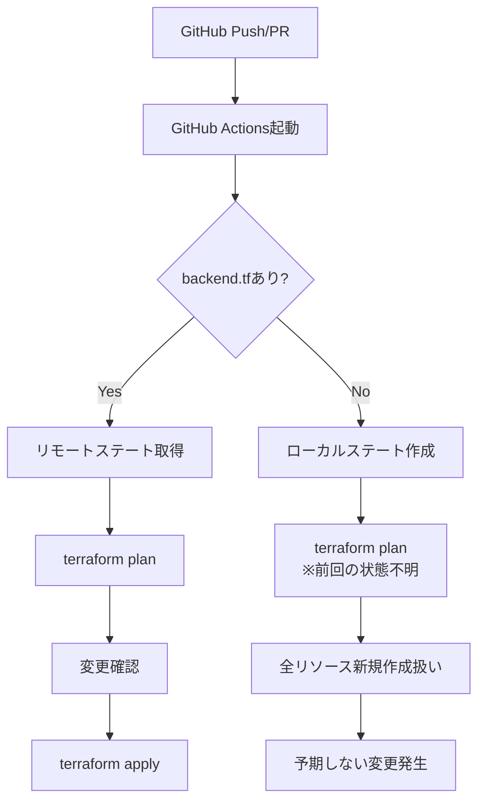
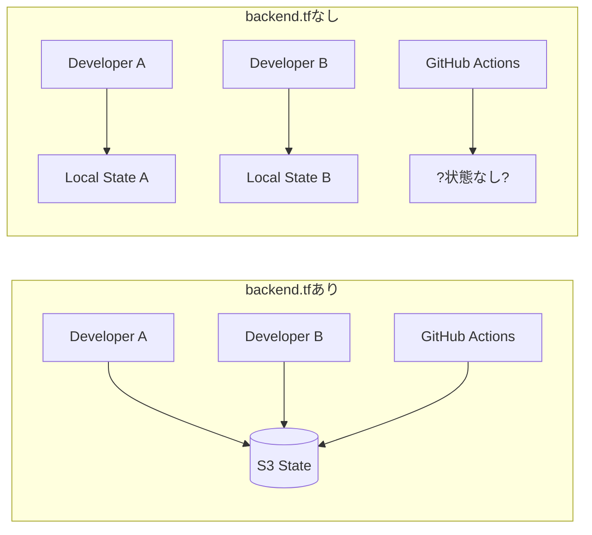
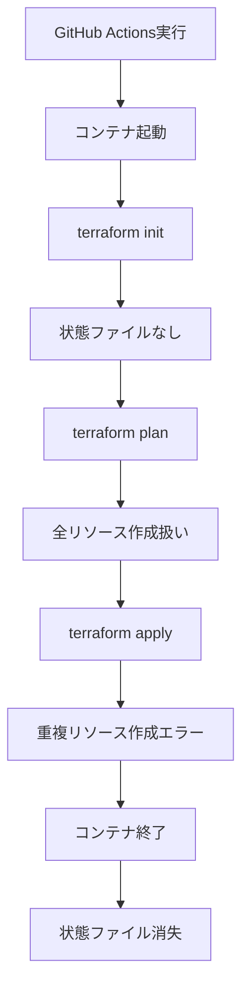
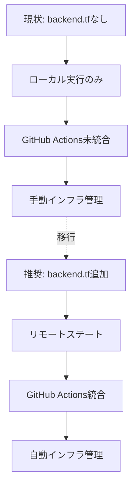

# GitHub Actions連携時のbackend.tfの必要性

## What's this file?
> [!NOTE]
> **What**
> 
> GitHub Actionsと連携する際のbackend.tfの必要性とは何かについて記載しています。

## Conclusion (忙しいとき向け)
> [!IMPORTANT]
> **What** : GitHub Actions連携時のbackend.tfの必要性とは何か
> 
> **Answer** : GitHub ActionsでTerraformを実行する場合、**backend.tfは必須**。チーム開発や自動化において、状態ファイルの一元管理が不可欠となるため。

## 目次

<details>
<summary>目次を開く</summary>

- [GitHub ActionsとTerraformの基本構成](#github-actionsとterraformの基本構成)
- [backend.tfが必要な理由](#backendtfが必要な理由)
- [backend.tfなしでの問題点](#backendtfなしでの問題点)
- [実装パターン](#実装パターン)
- [RCDEプロジェクトの現状](#rcdeプロジェクトの現状)

</details>

## GitHub ActionsとTerraformの基本構成

### CI/CDパイプラインでのTerraform実行フロー



## backend.tfが必要な理由

### 1. **状態の一元管理**



### 2. **状態ロックによる安全性**

```hcl
# backend.tf の例
terraform {
  backend "s3" {
    bucket         = "terraform-state-bucket"
    key            = "project/terraform.tfstate"
    region         = "ap-northeast-1"
    dynamodb_table = "terraform-state-lock"  # 同時実行防止
    encrypt        = true
  }
}
```

### 3. **GitHub Actions実行時の必要性**

| 項目 | backend.tfあり | backend.tfなし |
|------|---------------|---------------|
| 状態の永続性 | ✅ S3に保存 | ❌ 実行後に消失 |
| 履歴の追跡 | ✅ バージョニング可能 | ❌ 不可能 |
| 並行実行制御 | ✅ DynamoDBでロック | ❌ 制御不可 |
| 権限管理 | ✅ IAMで制御 | ❌ ローカルファイル |

## backend.tfなしでの問題点

### 1. **状態ファイルの消失**



### 2. **実際のエラー例**

```bash
# backend.tfなしでGitHub Actionsで実行した場合
Error: Error creating S3 bucket: BucketAlreadyExists: The requested bucket name is not available
Error: Error creating RDS instance: DBInstanceAlreadyExists
```

### 3. **デバッグの困難さ**

- 前回の実行状態が不明
- リソースのドリフト検出不可
- ロールバックが困難

## 実装パターン

### パターン1: S3 + DynamoDB（推奨）

```yaml
# .github/workflows/terraform.yml
name: Terraform CI/CD

on:
  push:
    branches: [main]

jobs:
  terraform:
    runs-on: ubuntu-latest
    steps:
      - uses: actions/checkout@v3
      
      - name: Configure AWS credentials
        uses: aws-actions/configure-aws-credentials@v2
        with:
          aws-access-key-id: ${{ secrets.AWS_ACCESS_KEY_ID }}
          aws-secret-access-key: ${{ secrets.AWS_SECRET_ACCESS_KEY }}
          aws-region: ap-northeast-1
      
      - name: Terraform Init
        run: terraform init
        
      - name: Terraform Plan
        run: terraform plan
        
      - name: Terraform Apply
        if: github.ref == 'refs/heads/main'
        run: terraform apply -auto-approve
```

### パターン2: Terraform Cloud

```hcl
# backend.tf
terraform {
  cloud {
    organization = "your-org"
    workspaces {
      name = "your-workspace"
    }
  }
}
```

### パターン3: GitLab Managed Terraform State（GitLab使用時）

```hcl
# backend.tf
terraform {
  backend "http" {
    address = "https://gitlab.com/api/v4/projects/PROJECT_ID/terraform/state/production"
    lock_address = "https://gitlab.com/api/v4/projects/PROJECT_ID/terraform/state/production/lock"
    unlock_address = "https://gitlab.com/api/v4/projects/PROJECT_ID/terraform/state/production/lock"
  }
}
```

## RCDEプロジェクトの現状

### 現在の構成分析



### 移行ステップ

1. **S3バケットとDynamoDBテーブルの作成**
   ```bash
   # 状態管理用のリソースを手動作成
   aws s3 mb s3://rcde-terraform-state --region ap-northeast-1
   aws dynamodb create-table \
     --table-name terraform-state-lock \
     --attribute-definitions AttributeName=LockID,AttributeType=S \
     --key-schema AttributeName=LockID,KeyType=HASH \
     --billing-mode PAY_PER_REQUEST
   ```

2. **backend.tfの作成**
   ```hcl
   # infra/terraform/backend.tf
   terraform {
     backend "s3" {
       bucket         = "my-terraform-state"
       key            = "terraform.tfstate"
       region         = "ap-northeast-1"
       dynamodb_table = "terraform-state-lock"
       encrypt        = true
     }
   }
   ```

3. **状態の移行**
   ```bash
   terraform init -migrate-state
   ```

4. **GitHub Actionsワークフローの作成**

## 関連

### 参考ドキュメント
- [Terraform Backend Configuration](https://www.terraform.io/docs/language/settings/backends/s3.html)
- [GitHub Actions for Terraform](https://learn.hashicorp.com/tutorials/terraform/github-actions)
- [Terraform State Management Best Practices](https://www.terraform.io/docs/language/state/index.html)

### 関連ファイル
- `/infra/terraform/main.tf` - 現在のTerraform設定
- `/.github/workflows/` - GitHub Actionsワークフロー
- `/infra/why_2025.08.07.05.59_backend_tf_not_exist.md` - backend.tfが存在しない理由

### セキュリティ考慮事項
- AWS認証情報はGitHub Secretsで管理
- 状態ファイルの暗号化を有効化
- 最小権限の原則に基づくIAMロール設定
- terraform.tfvarsのGit管理からの除外