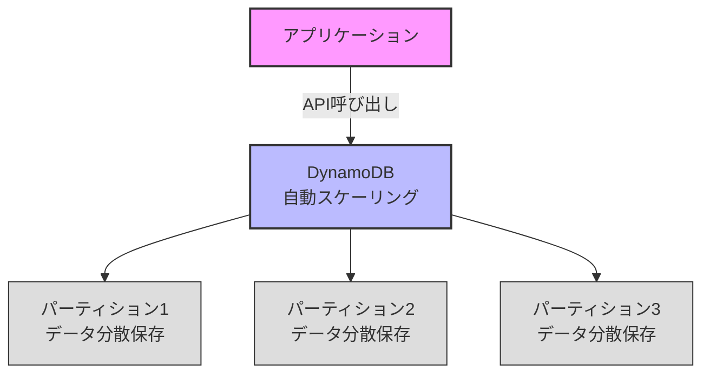
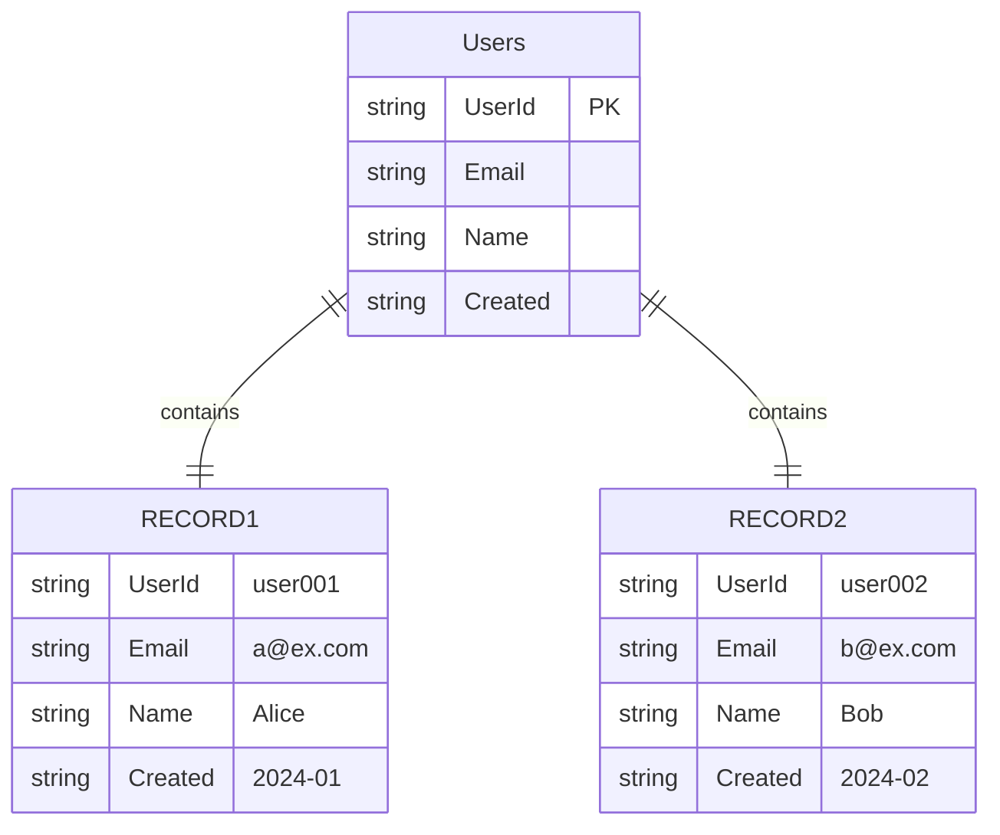

# Amazon DynamoDB

## What's this file?
> [!NOTE]
> **What**
> 
> Amazon DynamoDBとは何かについて記載しています。

## Conclusion (忙しいとき向け)
> [!IMPORTANT]
> **What** : Amazon DynamoDBとは何か
> 
> **Answer** : AWSが提供するフルマネージドのNoSQLデータベースサービスで、高速かつ柔軟なキーバリュー型・ドキュメント型データベース

## 目次

<details>
<summary>目次を開く</summary>

- [DynamoDBの基本概念](#dynamodbの基本概念)
- [主な特徴](#主な特徴)
- [データモデル](#データモデル)
- [ユースケース](#ユースケース)
- [料金体系](#料金体系)
- [RDBとの比較](#rdbとの比較)

</details>

## DynamoDBの基本概念

### NoSQLデータベースとは
DynamoDBは**NoSQL（Not Only SQL）**データベースの一種で、従来のリレーショナルデータベース（RDB）とは異なるアプローチでデータを管理します。

### 基本的な仕組み



## 主な特徴

### 1. フルマネージドサービス
- **インフラ管理不要**: サーバーのプロビジョニング、パッチ適用、バックアップなどをAWSが管理
- **自動スケーリング**: トラフィックに応じて自動的に容量を調整
- **高可用性**: マルチAZに自動レプリケーション

### 2. パフォーマンス
| 特性 | 説明 |
|------|------|
| レイテンシ | 一桁ミリ秒の一貫した応答時間 |
| スループット | 無制限にスケール可能 |
| 同時実行性 | 高い並行処理能力 |

### 3. 柔軟なデータモデル
```json
// キーバリュー型の例
{
  "UserId": "12345",        // パーティションキー
  "Name": "田中太郎",
  "Email": "tanaka@example.com"
}

// ドキュメント型の例
{
  "OrderId": "ORD-789",     // パーティションキー
  "Timestamp": 1234567890,  // ソートキー
  "Items": [
    {"ProductId": "P1", "Quantity": 2},
    {"ProductId": "P2", "Quantity": 1}
  ],
  "Customer": {
    "Name": "山田花子",
    "Address": "東京都..."
  }
}
```

## データモデル

### テーブル構造



### キーの種類

1. **パーティションキー（PK）**
   - テーブル内でアイテムを一意に識別
   - データの物理的な保存場所を決定

2. **ソートキー（SK）**（オプション）
   - パーティションキーと組み合わせて複合主キーを形成
   - 同一パーティション内でのソート順を決定

### インデックス

- **GSI（Global Secondary Index）**: 異なるキーでテーブル全体を検索
- **LSI（Local Secondary Index）**: 同一パーティション内で異なるソート

## ユースケース

### 適している用途

1. **セッション管理**
   ```python
   # Terraformのステートロック例
   {
     "LockID": "example-project-terraform-state/terraform.tfstate",
     "Info": "terraform apply実行中",
     "Who": "user@example.com",
     "Version": "1.0.0",
     "Created": "2024-01-01T00:00:00Z"
   }
   ```

2. **リアルタイムアプリケーション**
   - ゲームのリーダーボード
   - IoTデバイスのデータ収集
   - チャットアプリケーション

3. **メタデータ管理**
   - コンテンツ管理システム
   - 商品カタログ
   - ユーザープロファイル

### 適していない用途
- 複雑なリレーションが必要なデータ
- トランザクション処理が多いシステム
- 分析クエリが中心のワークロード

## 料金体系

### 課金モデル

1. **オンデマンド**
   - リクエスト単位の課金
   - 予測不能なトラフィックに最適

2. **プロビジョンド**
   - 読み取り/書き込み容量を事前に設定
   - 予測可能なトラフィックでコスト最適化

### 料金例（東京リージョン）
| 項目 | オンデマンド | プロビジョンド |
|------|------------|---------------|
| 書き込み | $1.25/100万リクエスト | $0.00065/WCU/時間 |
| 読み込み | $0.25/100万リクエスト | $0.00013/RCU/時間 |
| ストレージ | $0.25/GB/月 | $0.25/GB/月 |

## RDBとの比較

### 主な違い

| 特性 | DynamoDB | RDB（MySQL等） |
|------|----------|----------------|
| データモデル | NoSQL（キーバリュー/ドキュメント） | リレーショナル |
| スキーマ | スキーマレス | 固定スキーマ |
| クエリ | 主キーベースの高速アクセス | SQL（複雑なクエリ可能） |
| スケーリング | 水平スケール（自動） | 垂直スケール中心 |
| トランザクション | 限定的なACIDサポート | 完全なACIDサポート |
| 結合（JOIN） | サポートなし | フルサポート |

### 使い分けの指針

**DynamoDBを選ぶ場合:**
- 高速な読み書きが必要
- スケールが予測困難
- シンプルなクエリパターン
- スキーマの頻繁な変更

**RDBを選ぶ場合:**
- 複雑なリレーション
- ACID準拠が必須
- 複雑な分析クエリ
- 既存のSQLスキル活用

## 関連
- [Amazon DynamoDB 公式ドキュメント](https://docs.aws.amazon.com/ja_jp/dynamodb/)
- [DynamoDB ベストプラクティス](https://docs.aws.amazon.com/ja_jp/amazondynamodb/latest/developerguide/best-practices.html)
- [DynamoDB 料金](https://aws.amazon.com/jp/dynamodb/pricing/)