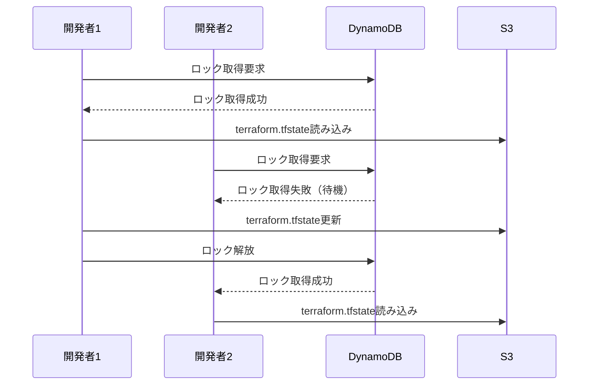
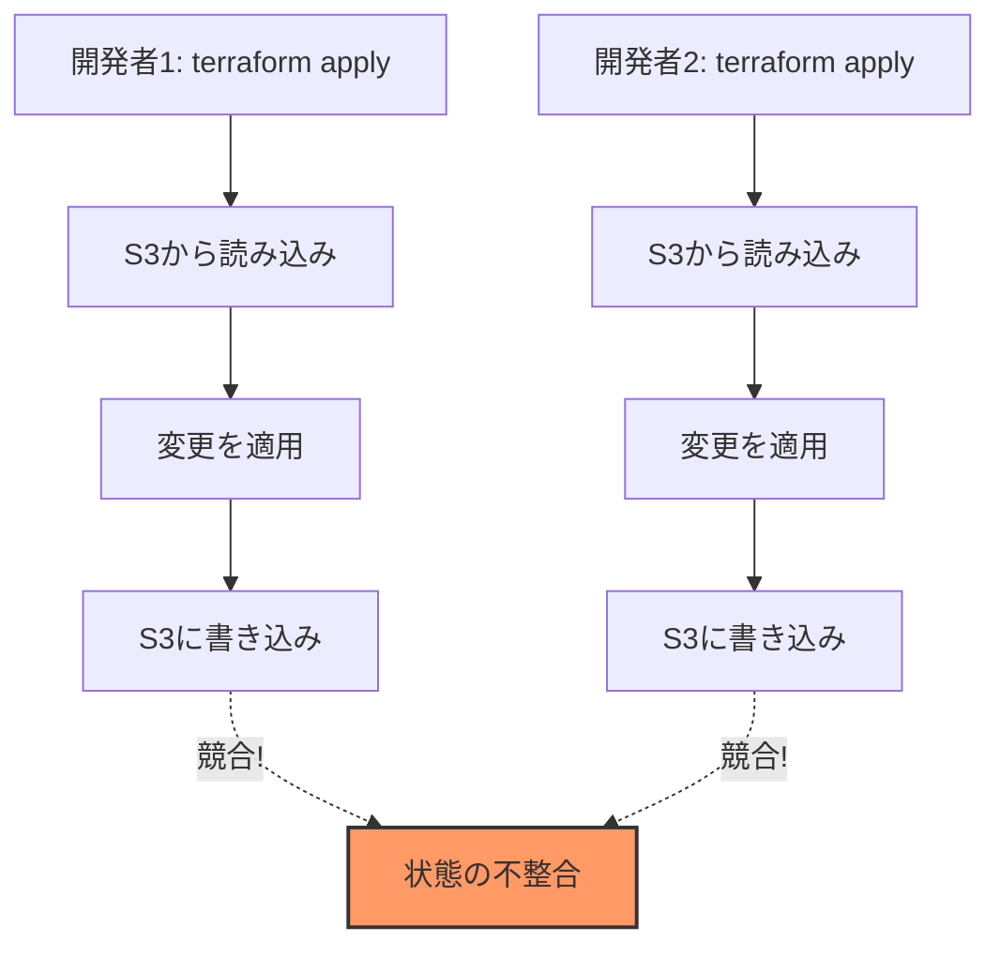
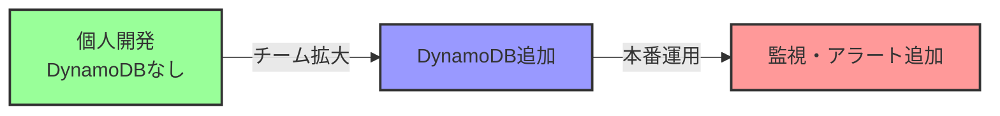

# なぜbackend.tf設定でDynamoDBが必須ではないのか

## What's this file?
> [!NOTE]
> **Why**
> 
> **なぜ**Terraform S3 Backend設定でDynamoDBが必須ではないのか

## Conclusion (忙しいとき向け)
> [!IMPORTANT]
> **Why** : **なぜ**backend.tf設定でDynamoDBが必須ではないのか
> 
> **Answer** : DynamoDBはステートロック機能を提供するオプション機能であり、単一開発者やロックが不要な環境では省略可能なため

## 目次
<details>
<summary>目次を開く</summary>

- [DynamoDBの役割](#dynamodbの役割)
- [DynamoDBなしでの動作](#dynamodbなしでの動作)
- [DynamoDBが不要なケース](#dynamodbが不要なケース)
- [DynamoDBが必要なケース](#dynamodbが必要なケース)
- [設定パターン比較](#設定パターン比較)

</details>

## DynamoDBの役割

### Terraformにおけるステートロック



### ロックの仕組み

DynamoDBは以下の情報を保存してロックを管理：

```json
{
  "LockID": "s3-bucket/path/to/terraform.tfstate",
  "Info": "{\"ID\":\"abc123\",\"Operation\":\"apply\",\"Who\":\"user@example\",\"Version\":\"1.0.0\",\"Created\":\"2024-01-01T00:00:00Z\"}",
  "TTL": 1234567890
}
```

## DynamoDBなしでの動作

### 基本的な動作

```hcl
# DynamoDBなしのbackend.tf
terraform {
  backend "s3" {
    bucket = "my-terraform-state"
    key    = "terraform.tfstate"
    region = "ap-northeast-1"
    # dynamodb_table は指定しない
  }
}
```

**動作内容：**
- S3への読み書きは正常に機能
- ステートファイルの保存・取得は可能
- **ただし、ロック機能は無効**

### リスクと制限



## DynamoDBが不要なケース

### 1. 個人開発環境

```bash
# 単一開発者での運用
terraform plan   # 問題なし
terraform apply  # 問題なし
```

**理由：**
- 同時実行のリスクがない
- ロックのオーバーヘッドが不要
- コスト削減（DynamoDB利用料金なし）

### 2. 読み取り専用操作

```bash
# planやshowは書き込みを行わない
terraform plan
terraform show
terraform output
```

**理由：**
- 状態ファイルの更新なし
- 競合の可能性なし

### 3. CI/CDの順次実行

```yaml
# GitHub Actions例
jobs:
  deploy:
    runs-on: ubuntu-latest
    concurrency: terraform-prod  # 同時実行を防ぐ
    steps:
      - run: terraform apply
```

**理由：**
- CI/CD側で同時実行を制御
- 外部ロック機構で代替

### 4. 一時的な検証環境

```hcl
# 短期間の実験用環境
terraform {
  backend "s3" {
    bucket = "temp-terraform-state"
    key    = "experiment/terraform.tfstate"
    region = "ap-northeast-1"
  }
}
```

**理由：**
- 長期運用を前提としない
- 破棄前提の環境

## DynamoDBが必要なケース

### 1. チーム開発

**シナリオ：**
- 複数人が同じインフラを管理
- 同時にterraform applyの可能性

**必要な理由：**
```
開発者A: RDSインスタンスタイプ変更
開発者B: セキュリティグループルール追加
→ 同時実行で状態ファイルが壊れる可能性
```

### 2. 自動化された環境

**シナリオ：**
- 複数のCI/CDパイプライン
- 定期実行ジョブ
- Webhook経由の自動デプロイ

### 3. 本番環境

**シナリオ：**
- ミッションクリティカルなインフラ
- 状態の整合性が最重要

**必要な理由：**
```
本番環境の不整合 = サービス停止リスク
```

## 設定パターン比較

### パターン1: 最小構成（DynamoDBなし）

```hcl
terraform {
  backend "s3" {
    bucket = "my-terraform-state"
    key    = "terraform.tfstate"
    region = "ap-northeast-1"
  }
}
```

**メリット：**
- シンプル
- 追加リソース不要
- コスト最小

**デメリット：**
- ロック機能なし
- チーム開発に不向き

### パターン2: 推奨構成（DynamoDBあり）

```hcl
terraform {
  backend "s3" {
    bucket         = "my-terraform-state"
    key            = "terraform.tfstate"
    region         = "ap-northeast-1"
    dynamodb_table = "terraform-state-lock"
  }
}
```

**メリット：**
- 安全な同時実行制御
- エンタープライズレベルの信頼性
- 状態の整合性保証

**デメリット：**
- DynamoDBの追加コスト
- 初期設定の手間

### 移行戦略



**段階的アプローチ：**
1. 最初はDynamoDBなしでスタート
2. チーム開発時にDynamoDB追加
3. 本番環境では必須として運用

## 関連
- [Terraform S3 Backend Configuration](https://www.terraform.io/docs/language/settings/backends/s3.html)
- [State Locking](https://www.terraform.io/docs/language/state/locking.html)
- [DynamoDB Pricing](https://aws.amazon.com/jp/dynamodb/pricing/)