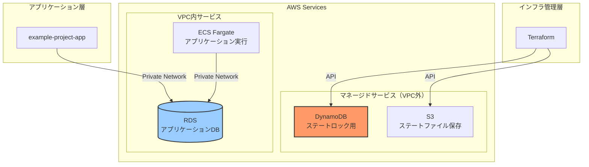
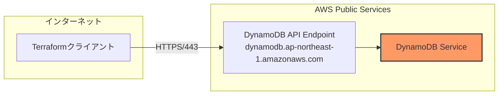
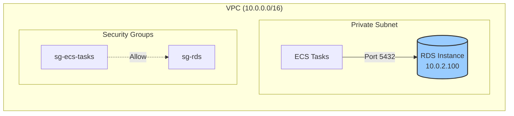
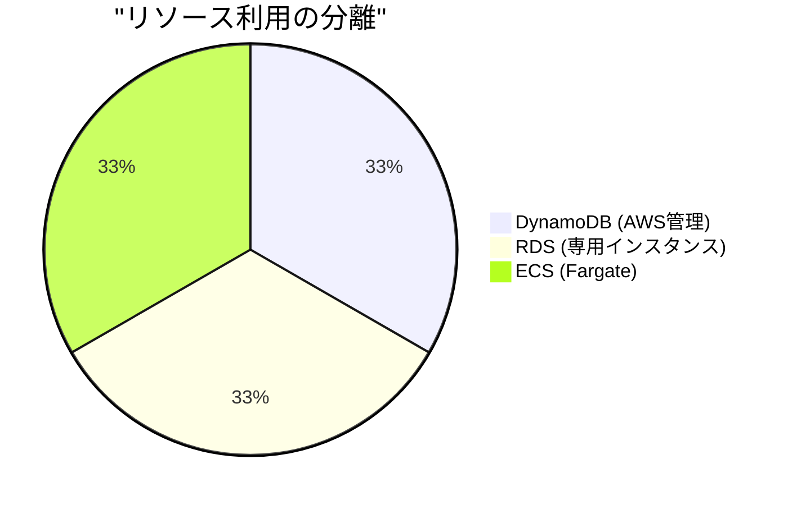
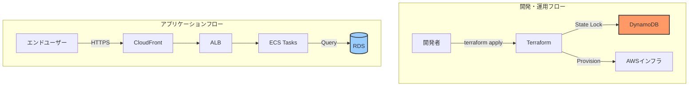
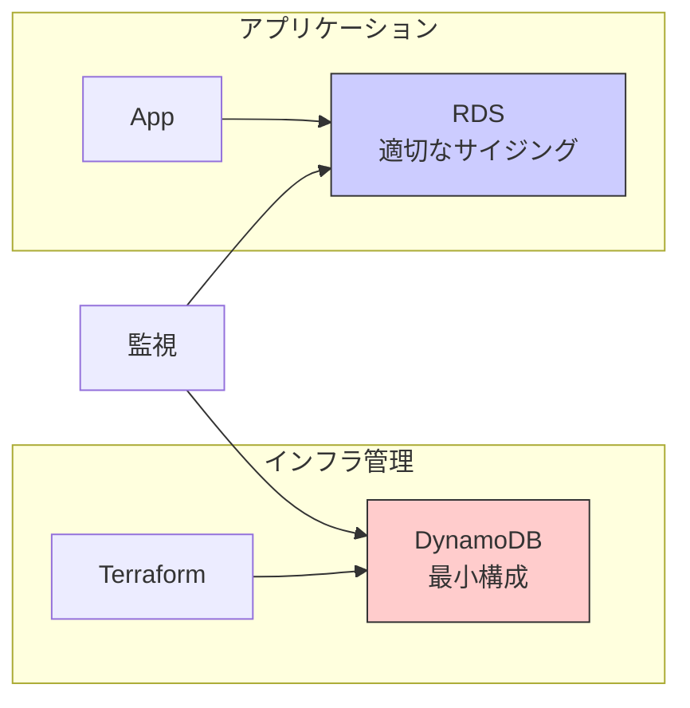

# なぜDynamoDBとRDSは干渉しないのか

## What's this file?
> [!NOTE]
> **Why**
> 
> **なぜ**DynamoDBとRDS（Amazon Relational Database Service）は干渉しないのか

## Conclusion (忙しいとき向け)
> [!IMPORTANT]
> **Why** : **なぜ**DynamoDBとRDSは干渉しないのか
> 
> **Answer** : 異なるサービスレイヤー、独立したネットワーク構成、別々の用途とアクセスパターンを持つため、技術的にもリソース的にも完全に分離されているから

## 目次
<details>
<summary>目次を開く</summary>

- [アーキテクチャレベルでの分離](#アーキテクチャレベルでの分離)
- [ネットワークレベルでの独立性](#ネットワークレベルでの独立性)
- [リソースの競合がない理由](#リソースの競合がない理由)
- [用途の明確な違い](#用途の明確な違い)
- [実際のプロジェクトでの共存例](#実際のプロジェクトでの共存例)

</details>

## アーキテクチャレベルでの分離

### サービス階層の違い



### 管理レベルの違い

| 特性 | DynamoDB | RDS |
|------|----------|-----|
| 管理レベル | フルマネージド | マネージド |
| インフラ管理 | AWS完全管理 | 一部ユーザー設定可能 |
| スケーリング | 自動 | 手動/自動（Aurora） |
| パッチ適用 | 自動（透過的） | メンテナンスウィンドウ |

## ネットワークレベルでの独立性

### DynamoDBのネットワーク構成



### RDSのネットワーク構成



### ネットワーク分離の要点

1. **DynamoDB**: インターネット経由のAPI呼び出し
2. **RDS**: VPC内のプライベート通信
3. **接点なし**: 物理的にも論理的にも交差しない

## リソースの競合がない理由

### コンピューティングリソース



**分離のポイント：**
- DynamoDB: AWSの共有インフラで実行
- RDS: 専用のEC2インスタンス上で実行
- リソースプールが完全に別

### ストレージの独立性

| 項目 | DynamoDB | RDS |
|------|----------|-----|
| ストレージタイプ | SSD（自動管理） | EBS（gp3/io1） |
| 容量管理 | 無制限（自動） | 事前割り当て |
| IOPS | 自動調整 | 設定値固定 |
| バックアップ | 別システム | スナップショット |

### メモリ・CPU利用

```yaml
# RDSの例（terraform設定）
instance_class = "db.t3.medium"  # 2 vCPU, 4 GiB RAM

# DynamoDBの例
# CPUやメモリの指定なし（AWS管理）
read_capacity_units = 5
write_capacity_units = 5
```

## 用途の明確な違い

### DynamoDBの用途（一般的なプロジェクト）

```hcl
# backend.tf での利用
terraform {
  backend "s3" {
    dynamodb_table = "terraform-state-lock"  # ロック管理のみ
  }
}
```

**特徴：**
- Terraformステートのロック管理専用
- アプリケーションからはアクセスなし
- 一時的なロック情報のみ保存

### RDSの用途（一般的なプロジェクト）

```sql
-- アプリケーションデータの保存
CREATE TABLE projects (
    id SERIAL PRIMARY KEY,
    name VARCHAR(255),
    created_at TIMESTAMP
);

CREATE TABLE measurements (
    id SERIAL PRIMARY KEY,
    project_id INTEGER REFERENCES projects(id),
    data JSONB,
    measured_at TIMESTAMP
);
```

**特徴：**
- ビジネスデータの永続化
- トランザクション処理
- 複雑なクエリとリレーション

## 実際のプロジェクトでの共存例

### example-projectプロジェクトの構成



### 干渉が起きない理由のまとめ

1. **タイミングの違い**
   - DynamoDB: インフラ構築時のみ
   - RDS: アプリケーション実行時

2. **アクセス元の違い**
   - DynamoDB: Terraformクライアント
   - RDS: ECSタスク（アプリケーション）

3. **ライフサイクルの違い**
   - DynamoDB: 数秒間のロック
   - RDS: 永続的なデータ保存

4. **スケーリング特性の違い**
   - DynamoDB: 自動（影響なし）
   - RDS: 計画的（メンテナンス）

### 共存のベストプラクティス



**ポイント：**
- 各サービスを独立して監視
- リソース使用率を個別に最適化
- 障害時の影響範囲が限定的

## 関連
- [AWS DynamoDB と RDS の使い分け](https://aws.amazon.com/jp/nosql/vs-rds/)
- [Terraform Backend Best Practices](https://www.terraform.io/docs/language/settings/backends/configuration.html)
- [AWS Well-Architected Framework](https://aws.amazon.com/jp/architecture/well-architected/)