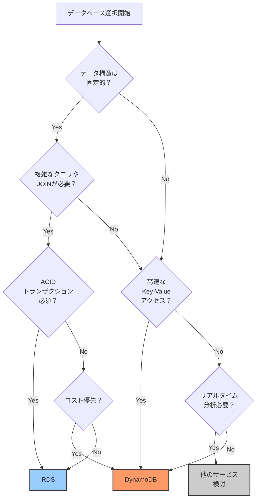
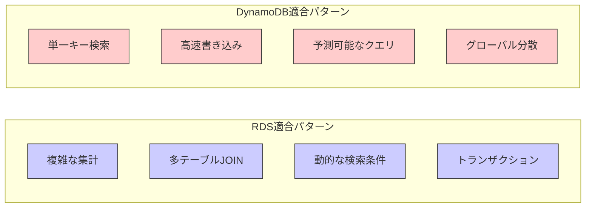
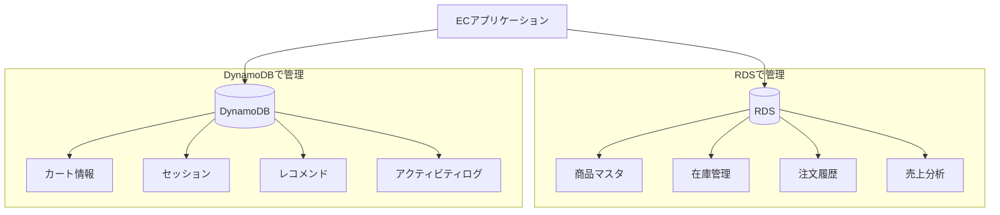
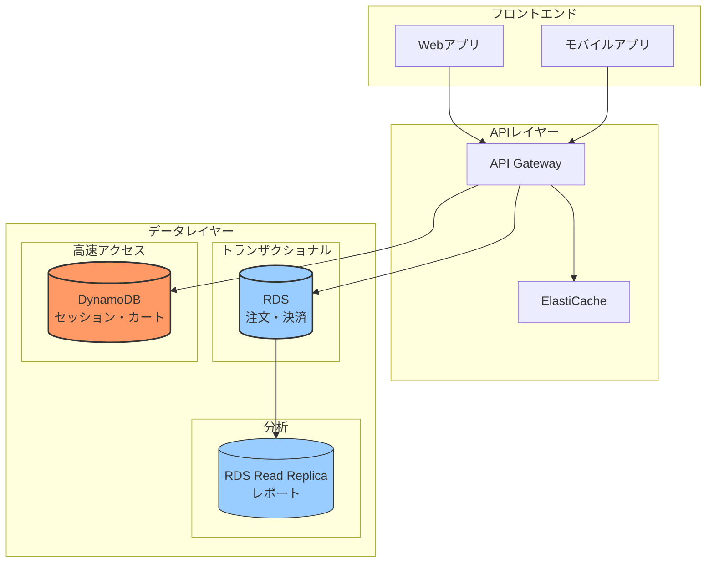
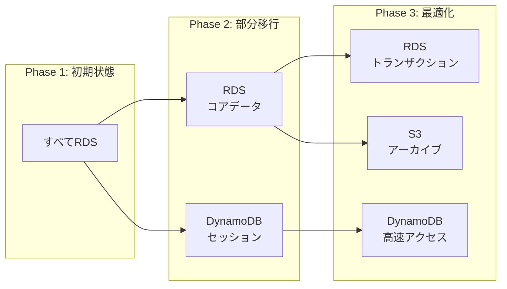

# RDSとDynamoDBの使い分け方法

## What's this file?
> [!NOTE]
> **How**
> 
> どのようにRDSとDynamoDBを使い分けるかについて記載しています。

## Conclusion (忙しいとき向け)
> [!IMPORTANT]
> **How** : どのようにRDSとDynamoDBを使い分けるか
> 
> **Answer** : データの性質（構造化/非構造化）、アクセスパターン（複雑なクエリ/単純なキー検索）、一貫性要件（ACID/結果整合性）に基づいて選択する

## 目次

<details>
<summary>目次を開く</summary>

- [使い分けの決定フローチャート](#使い分けの決定フローチャート)
- [データ特性による選択基準](#データ特性による選択基準)
- [アクセスパターンによる判断](#アクセスパターンによる判断)
- [具体的なユースケース例](#具体的なユースケース例)
- [ハイブリッドアーキテクチャ](#ハイブリッドアーキテクチャ)

</details>

## 使い分けの決定フローチャート

### 選択フローチャート



## データ特性による選択基準

### 構造化データ vs 非構造化データ

| データ特性 | RDS向き | DynamoDB向き |
|-----------|---------|--------------|
| スキーマ | 固定スキーマ | スキーマレス |
| リレーション | 正規化されたテーブル | 非正規化/埋め込み |
| データ型 | 厳密な型定義 | 柔軟な型 |
| 例 | 注文・顧客・商品 | ログ・セッション・設定 |

### 実装例の比較

**RDS（構造化データ）**
```sql
-- 正規化されたテーブル構造
CREATE TABLE users (
    id SERIAL PRIMARY KEY,
    email VARCHAR(255) UNIQUE,
    created_at TIMESTAMP
);

CREATE TABLE orders (
    id SERIAL PRIMARY KEY,
    user_id INT REFERENCES users(id),
    total_amount DECIMAL(10,2),
    order_date TIMESTAMP
);

-- 複雑なクエリ例
SELECT u.email, COUNT(o.id) as order_count, SUM(o.total_amount)
FROM users u
LEFT JOIN orders o ON u.id = o.user_id
WHERE o.order_date > '2024-01-01'
GROUP BY u.email;
```

**DynamoDB（非構造化データ）**
```json
// 非正規化されたドキュメント
{
  "PK": "USER#123",
  "SK": "PROFILE",
  "email": "user@example.com",
  "orders": [
    {
      "orderId": "ORDER#456",
      "totalAmount": 10000,
      "orderDate": "2024-01-15"
    }
  ],
  "preferences": {
    "notifications": true,
    "theme": "dark"
  }
}
```

## アクセスパターンによる判断

### アクセスパターン分析表



### パフォーマンス要件による選択

| 要件 | RDS | DynamoDB |
|------|-----|----------|
| レイテンシ | 10-100ms | 1-10ms |
| スループット | 数千TPS | 数百万TPS |
| スケーラビリティ | 垂直スケール中心 | 水平スケール |
| 可用性 | 99.95% | 99.99% |

## 具体的なユースケース例

### ECサイトの実装例



### 使い分けの実装コード

**商品検索（RDS）**
```python
# 複雑な検索条件に対応
def search_products(category=None, price_range=None, keywords=None):
    query = """
        SELECT p.*, c.name as category_name
        FROM products p
        JOIN categories c ON p.category_id = c.id
        WHERE 1=1
    """
    
    if category:
        query += " AND c.name = %s"
    if price_range:
        query += " AND p.price BETWEEN %s AND %s"
    if keywords:
        query += " AND p.name ILIKE %s"
    
    return db.execute(query, params)
```

**カート管理（DynamoDB）**
```python
# 高速なKey-Valueアクセス
def update_cart(user_id, items):
    table.put_item(
        Item={
            'PK': f'USER#{user_id}',
            'SK': 'CART',
            'items': items,
            'updated_at': datetime.now().isoformat(),
            'ttl': int(time.time()) + 86400  # 24時間後に自動削除
        }
    )
```

## ハイブリッドアーキテクチャ

### 両方を組み合わせた設計



### マイグレーション戦略



### 選択チェックリスト

**RDSを選ぶべき場合：**
- [ ] 複数テーブル間のJOINが必要
- [ ] ACID準拠のトランザクションが必須
- [ ] SQLの豊富な機能を活用したい
- [ ] 既存のRDBMSからの移行
- [ ] 複雑なレポート・分析クエリ

**DynamoDBを選ぶべき場合：**
- [ ] ミリ秒単位のレスポンスが必要
- [ ] 予測不能なスケールへの対応
- [ ] グローバルでの低レイテンシ
- [ ] シンプルなKey-Valueアクセス
- [ ] スキーマの頻繁な変更

**両方使う場合：**
- [ ] 異なる特性のワークロードが混在
- [ ] コアデータとキャッシュの分離
- [ ] 段階的なモダナイゼーション

## 関連
- [AWS Database Selection Guide](https://aws.amazon.com/jp/startups/start-building/how-to-choose-a-database/)
- [DynamoDB Design Patterns](https://docs.aws.amazon.com/amazondynamodb/latest/developerguide/best-practices.html)
- [RDS Best Practices](https://docs.aws.amazon.com/AmazonRDS/latest/UserGuide/CHAP_BestPractices.html)