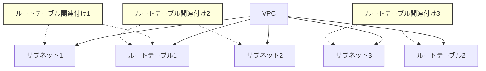
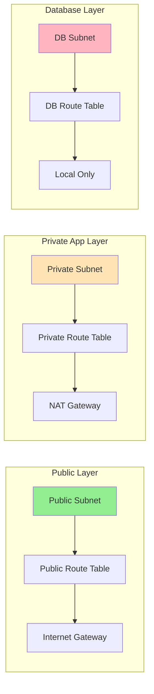
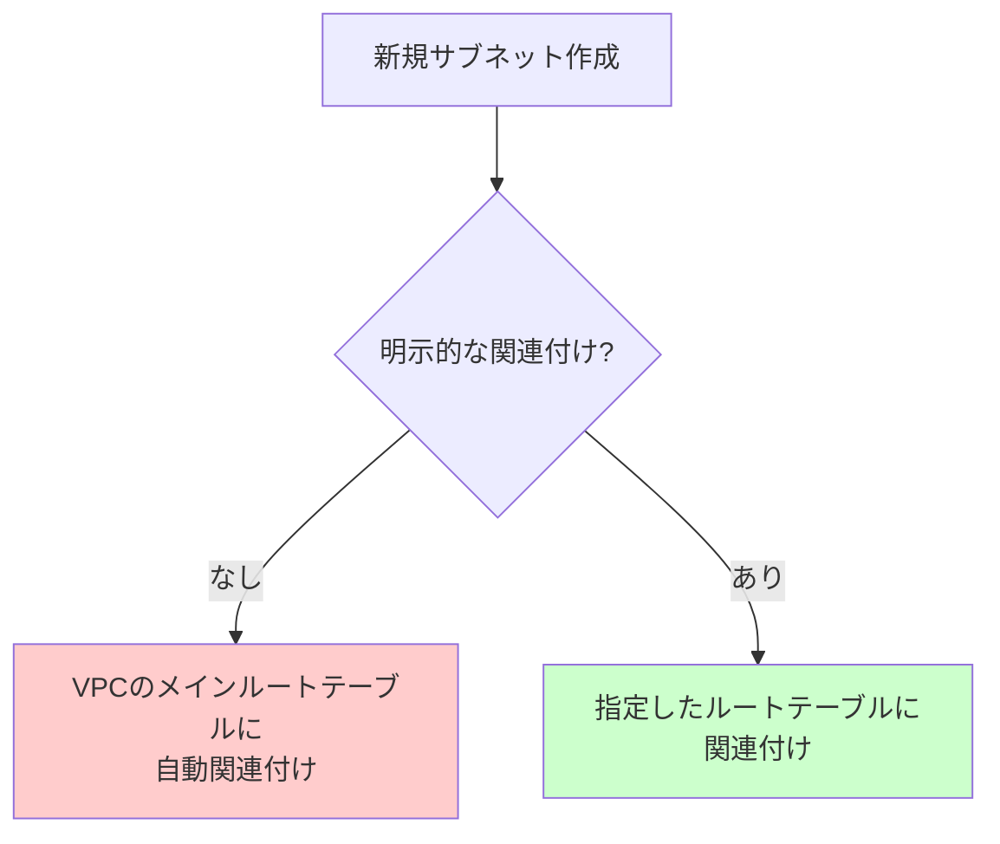
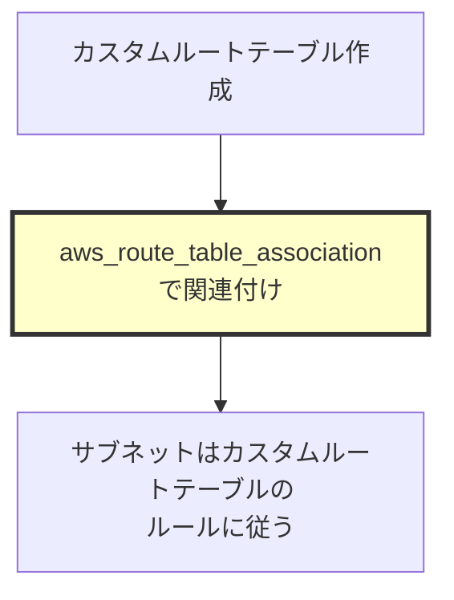

# ルートテーブル関連付け設定とは

## What's this file?
> [!NOTE]
> **What**
> 
> ルートテーブル関連付け（Route Table Association）設定とは何かについて記載しています。

## Conclusion (忙しいとき向け)
> [!IMPORTANT]
> **What** : ルートテーブル関連付けとは何か
> 
> **Answer** : サブネットとルートテーブルを紐付けるTerraformリソースで、各サブネットからのトラフィックがどのルーティングルールに従って転送されるかを決定する設定

## 目次

<details>
<summary>目次を開く</summary>

- [ルートテーブル関連付けの概要](#ルートテーブル関連付けの概要)
- [なぜ関連付けが必要か](#なぜ関連付けが必要か)
- [関連付けの仕組み](#関連付けの仕組み)
- [プロジェクトでの実装例](#プロジェクトでの実装例)
- [関連付けパターンの種類](#関連付けパターンの種類)
- [ベストプラクティス](#ベストプラクティス)
- [よくある誤解と注意点](#よくある誤解と注意点)
- [トラブルシューティング](#トラブルシューティング)

</details>

## ルートテーブル関連付けの概要

AWS VPCでは、サブネットとルートテーブルを関連付けることで、そのサブネット内のリソースからのトラフィックのルーティングを制御します。

### 基本的な概念

```hcl
resource "aws_route_table_association" "example" {
  subnet_id      = aws_subnet.example.id      # どのサブネットを
  route_table_id = aws_route_table.example.id # どのルートテーブルに紐付けるか
}
```

### VPCネットワークの構成要素



## なぜ関連付けが必要か

### 1. トラフィック制御の分離



### 2. セキュリティの実現

- **パブリックサブネット**: インターネットへの直接アクセスを許可
- **プライベートサブネット**: NAT経由のみアウトバウンド許可
- **データベースサブネット**: VPC内部通信のみ許可

### 3. 明示的な設定の重要性

関連付けを行わない場合、サブネットはVPCのメインルートテーブルに自動的に関連付けられます。これは予期しないトラフィック許可につながる可能性があります。

## 関連付けの仕組み

### デフォルトの動作



### 明示的な関連付け



### 重要な制約

- **1対1の関係**: 1つのサブネットは1つのルートテーブルにのみ関連付け可能
- **複数サブネット対応**: 1つのルートテーブルは複数のサブネットに関連付け可能

## プロジェクトでの実装例

### パブリックサブネットの関連付け

```hcl
# Public subnet association
resource "aws_route_table_association" "public_a" {
  subnet_id      = aws_subnet.public_a      # エラー：.idが必要
  route_table_id = aws_route_table.public.id
}
```

**注意**: 上記のコードには誤りがあります。正しくは：

```hcl
resource "aws_route_table_association" "public_a" {
  subnet_id      = aws_subnet.public_a.id   # .idを追加
  route_table_id = aws_route_table.public.id
}
```

### プライベートアプリサブネットの関連付け

```hcl
# Private App subnet associations
resource "aws_route_table_association" "private_app_a" {
  subnet_id      = aws_subnet.private_app_a  # エラー：.idが必要
  route_table_id = aws_route_table.private_app.id
}
```

### プライベートDBサブネットの関連付け

```hcl
# Private DB subnet associations
resource "aws_route_table_association" "private_db_a" {
  subnet_id      = aws_subnet.private_db_a.id
  route_table_id = aws_route_table.private_db.id
}

resource "aws_route_table_association" "private_db_b" {
  subnet_id      = aws_subnet.private_db_b.id
  route_table_id = aws_route_table.private_db.id
}
```

## 関連付けパターンの種類

### 1. 用途別パターン

```hcl
# パブリックサブネット用
resource "aws_route_table" "public" {
  vpc_id = aws_vpc.main.id
  # → Internet Gatewayへのルート含む
}

# プライベートアプリ用
resource "aws_route_table" "private_app" {
  vpc_id = aws_vpc.main.id
  # → NAT Gatewayへのルート含む
}

# プライベートDB用
resource "aws_route_table" "private_db" {
  vpc_id = aws_vpc.main.id
  # → ローカルルートのみ
}
```

### 2. AZ別パターン

```hcl
# AZ-aのサブネット群
resource "aws_route_table_association" "az_a_public" {
  subnet_id      = aws_subnet.public_a.id
  route_table_id = aws_route_table.public_az_a.id
}

# AZ-cのサブネット群
resource "aws_route_table_association" "az_c_public" {
  subnet_id      = aws_subnet.public_c.id
  route_table_id = aws_route_table.public_az_c.id
}
```

### 3. 環境別パターン

```hcl
# 本番環境
resource "aws_route_table_association" "prod_private" {
  count          = length(var.prod_private_subnets)
  subnet_id      = var.prod_private_subnets[count.index]
  route_table_id = aws_route_table.prod_private.id
}

# 開発環境
resource "aws_route_table_association" "dev_private" {
  count          = length(var.dev_private_subnets)
  subnet_id      = var.dev_private_subnets[count.index]
  route_table_id = aws_route_table.dev_private.id
}
```

## ベストプラクティス

### 1. 命名規則の統一

```hcl
resource "aws_route_table_association" "naming_pattern" {
  # リソース名: {subnet_type}_{az}
  # 例: public_a, private_app_a, private_db_b
}
```

### 2. 用途別ルートテーブルの作成

```hcl
# ❌ 悪い例：全サブネットで同じルートテーブル
resource "aws_route_table_association" "all" {
  count          = length(var.all_subnets)
  subnet_id      = var.all_subnets[count.index]
  route_table_id = aws_route_table.shared.id
}

# ✅ 良い例：用途別に分離
resource "aws_route_table_association" "public" {
  # パブリック用
}

resource "aws_route_table_association" "private_app" {
  # プライベートアプリ用
}

resource "aws_route_table_association" "private_db" {
  # プライベートDB用
}
```

### 3. モジュール化

```hcl
# modules/network/main.tf
resource "aws_route_table_association" "this" {
  for_each = var.subnet_associations

  subnet_id      = each.value.subnet_id
  route_table_id = each.value.route_table_id
}

# variables.tf
variable "subnet_associations" {
  type = map(object({
    subnet_id      = string
    route_table_id = string
  }))
}
```

### 4. タグによる管理

ルートテーブル関連付けリソース自体にはタグを付けられませんが、関連するルートテーブルとサブネットには必ずタグを付けます：

```hcl
resource "aws_route_table" "public" {
  vpc_id = aws_vpc.main.id

  tags = {
    Name        = "${var.project_name}-public-rt-${var.environment}"
    Type        = "public"
    Environment = var.environment
  }
}

resource "aws_subnet" "public" {
  vpc_id = aws_vpc.main.id

  tags = {
    Name        = "${var.project_name}-public-subnet-${var.environment}"
    Type        = "public"
    RouteTable  = "public"  # どのルートテーブルに関連付けるか明示
  }
}
```

## よくある誤解と注意点

### 1. .idの付け忘れ

```hcl
# ❌ エラーになる
resource "aws_route_table_association" "wrong" {
  subnet_id      = aws_subnet.example      # .idが必要
  route_table_id = aws_route_table.example # .idが必要
}

# ✅ 正しい
resource "aws_route_table_association" "correct" {
  subnet_id      = aws_subnet.example.id
  route_table_id = aws_route_table.example.id
}
```

### 2. 重複した関連付け

```hcl
# ❌ エラー：同じサブネットを2つのルートテーブルに関連付け
resource "aws_route_table_association" "duplicate1" {
  subnet_id      = aws_subnet.example.id
  route_table_id = aws_route_table.route1.id
}

resource "aws_route_table_association" "duplicate2" {
  subnet_id      = aws_subnet.example.id  # 同じサブネット
  route_table_id = aws_route_table.route2.id
}
```

### 3. 削除時の挙動

- ルートテーブル関連付けを削除すると、サブネットは自動的にVPCのメインルートテーブルに関連付けられます
- これにより意図しないトラフィックが許可される可能性があります

### 4. 循環参照

```hcl
# ルートテーブル、サブネット、関連付けの間で循環参照に注意
# Terraformは依存関係を自動解決しますが、明示的な depends_on が必要な場合もあります
```

## トラブルシューティング

### 1. 関連付けの確認

```bash
# 現在の関連付けを確認
aws ec2 describe-route-tables \
  --filters "Name=vpc-id,Values=vpc-xxx" \
  --query 'RouteTables[*].[RouteTableId,Associations[*].SubnetId]'
```

### 2. よくあるエラーと対処

#### InvalidSubnetID.NotFound

```
Error: creating Route Table Association: InvalidSubnetID.NotFound
```

**原因**: サブネットIDが正しくない、または.idを付け忘れ

**対処**:
```hcl
# subnet_id = aws_subnet.example → subnet_id = aws_subnet.example.id
```

#### Resource.AlreadyAssociated

```
Error: Resource.AlreadyAssociated: the specified subnet is already associated
```

**原因**: サブネットが既に別のルートテーブルに関連付けられている

**対処**:
1. 既存の関連付けを確認
2. 必要に応じて既存の関連付けを削除
3. 新しい関連付けを作成

### 3. 接続性の問題

```bash
# ルートテーブルの内容を確認
aws ec2 describe-route-tables \
  --route-table-ids rtb-xxx \
  --query 'RouteTables[0].Routes'

# 実際の通信テスト
aws ec2 describe-vpc-endpoint-connections
```

### 4. Terraform state の問題

```bash
# 関連付けのインポート
terraform import aws_route_table_association.example subnet-xxx/rtb-xxx

# state の確認
terraform state show aws_route_table_association.example
```

## 関連

- [AWS VPC Route Tables](https://docs.aws.amazon.com/vpc/latest/userguide/VPC_Route_Tables.html)
- [Terraform aws_route_table_association](https://registry.terraform.io/providers/hashicorp/aws/latest/docs/resources/route_table_association)
- [VPCのルーティング設計パターン](https://docs.aws.amazon.com/whitepapers/latest/aws-vpc-connectivity-options/network-to-amazon-vpc-connectivity-options.html)
- サブネット設計のベストプラクティス