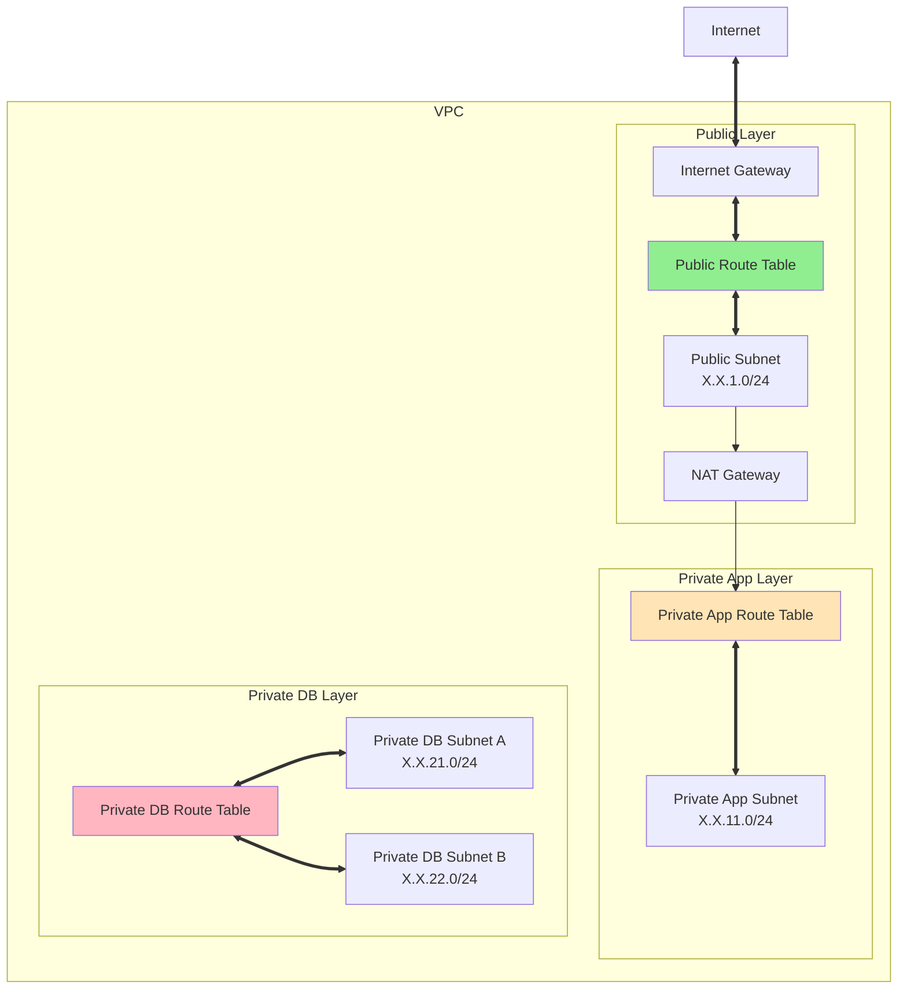
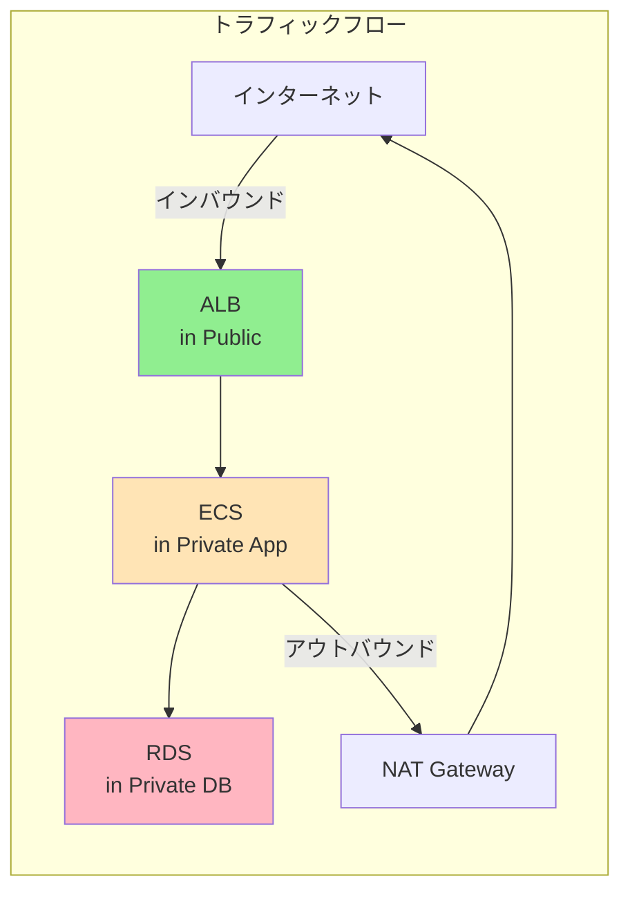
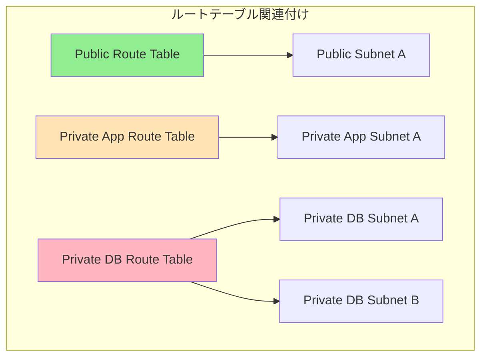
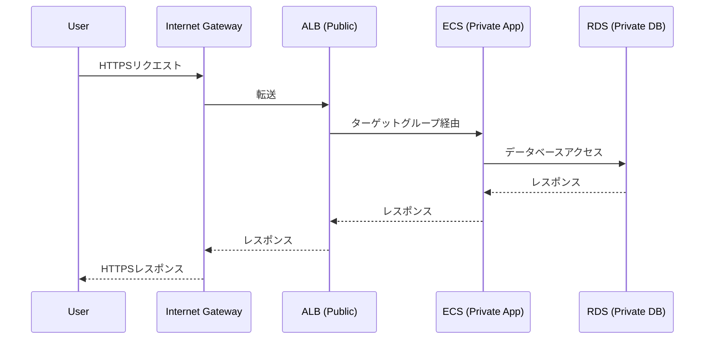
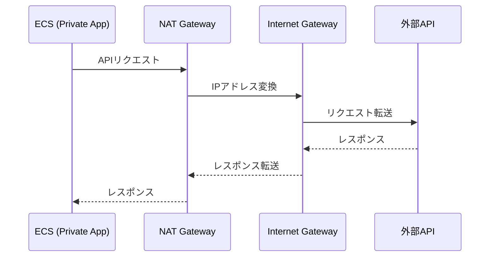

# AWSルートテーブルのTerraform実装パターン

## What's this file?
> [!NOTE]
> **How**
> 
> どのようにTerraformでAWSルートテーブルを実装するかについて記載しています。

## Conclusion (忙しいとき向け)
> [!IMPORTANT]
> **How** : どのようにAWSルートテーブルを実装するか
> 
> **Answer** : パブリック・プライベートApp・プライベートDBの3層構造でルートテーブルを分離し、各層に適切なルーティングルールを設定するセキュアなネットワークアーキテクチャパターン

## 目次

<details>
<summary>目次を開く</summary>

- [プロジェクトのルートテーブル構成](#プロジェクトのルートテーブル構成)
- [3層アーキテクチャの実装](#3層アーキテクチャの実装)
- [ルートテーブルの定義方法](#ルートテーブルの定義方法)
- [ルーティングルールの設定](#ルーティングルールの設定)
- [NAT GatewayとInternet Gatewayの設定](#nat-gatewayとinternet-gatewayの設定)
- [サブネットとの関連付け](#サブネットとの関連付け)
- [ネットワークフローの制御](#ネットワークフローの制御)
- [実装上の工夫とベストプラクティス](#実装上の工夫とベストプラクティス)

</details>

## プロジェクトのルートテーブル構成

### 全体構成図



### 一般的なルートテーブル構成

| ルートテーブル | 用途 | 命名例 |
|---|---|---|
| Public Route Table | パブリックサブネット用 | `<project-name>-public-rt-<environment>` |
| Private App Route Table | プライベートAppサブネット用 | `<project-name>-private-app-rt-<environment>` |
| Private DB Route Table | プライベートDBサブネット用 | `<project-name>-private-db-rt-<environment>` |

## 3層アーキテクチャの実装

### 設計思想

セキュリティを重視した3層アーキテクチャは、以下のように構成されます：

1. **パブリック層**: インターネットからの直接アクセスが必要なリソース
2. **プライベートApp層**: アプリケーションサーバー（アウトバウンド通信は可能）
3. **プライベートDB層**: データベース（完全に隔離）

### 各層の特徴



## ルートテーブルの定義方法

### パブリックルートテーブル

```hcl
# パブリックルートテーブルの定義例
resource "aws_route_table" "public" {
  vpc_id = aws_vpc.main.id

  tags = {
    Name = "${var.project_name}-public-rt-${var.environment}"
  }
}
```

### プライベートAppルートテーブル

```hcl
# プライベートAppルートテーブルの定義例
resource "aws_route_table" "private_app" {
  vpc_id = aws_vpc.main.id

  tags = {
    Name = "${var.project_name}-private-app-rt-${var.environment}"
  }
}
```

### プライベートDBルートテーブル

```hcl
# プライベートDBルートテーブルの定義例
resource "aws_route_table" "private_db" {
  vpc_id = aws_vpc.main.id

  tags = {
    Name = "${var.project_name}-private-db-rt-${var.environment}"
  }
}
```

## ルーティングルールの設定

### パブリックルートテーブルのルート

```hcl
# パブリックサブネットからインターネットへのルート
resource "aws_route" "public_internet_gateway" {
  route_table_id         = aws_route_table.public.id
  destination_cidr_block = "0.0.0.0/0"
  gateway_id             = aws_internet_gateway.main.id
}
```

**特徴**:
- すべてのトラフィック（0.0.0.0/0）をInternet Gatewayへ転送
- 双方向通信が可能（インバウンド・アウトバウンド）

### プライベートAppルートテーブルのルート

```hcl
# プライベートアプリサブネットからインターネットへのルート（NAT経由）
resource "aws_route" "private_nat_gateway" {
  route_table_id         = aws_route_table.private_app.id
  destination_cidr_block = "0.0.0.0/0"
  nat_gateway_id         = aws_nat_gateway.main.id
}
```

**特徴**:
- アウトバウンド通信のみ可能
- NAT Gateway経由でインターネットアクセス
- 外部からの直接アクセスは不可

### プライベートDBルートテーブルのルート

```hcl
# 明示的な外部ルートなし
# VPCローカルルートのみ（暗黙的に設定）
```

**特徴**:
- VPC内部通信のみ可能
- インターネットへのルートなし
- 最高レベルのセキュリティ

## NAT GatewayとInternet Gatewayの設定

### Internet Gateway

```hcl
# Internet Gatewayの定義例
resource "aws_internet_gateway" "main" {
  vpc_id = aws_vpc.main.id

  tags = {
    Name = "${var.project_name}-igw-${var.environment}"
  }
}
```

### NAT Gateway

```hcl
# NAT Gatewayの定義例
# Elastic IPの割り当て
resource "aws_eip" "nat" {
  domain = "vpc"

  tags = {
    Name = "${var.project_name}-nat-eip-${var.environment}"
  }
}

# NAT Gatewayの作成
resource "aws_nat_gateway" "main" {
  allocation_id = aws_eip.nat.id
  subnet_id     = aws_subnet.public.id  # パブリックサブネットに配置

  tags = {
    Name = "${var.project_name}-nat-${var.environment}"
  }

  depends_on = [aws_internet_gateway.main]
}
```

### 設定のポイント

1. **NAT Gatewayの配置**
   - 必ずパブリックサブネットに配置
   - 専用のElastic IPが必要

2. **依存関係の明示**
   - `depends_on`でInternet Gateway作成後に作成
   - 順序を守ることで作成エラーを防止

## サブネットとの関連付け

### 関連付けの実装

```hcl
# ルートテーブルとサブネットの関連付け例
# パブリックサブネット
resource "aws_route_table_association" "public" {
  subnet_id      = aws_subnet.public.id
  route_table_id = aws_route_table.public.id
}

# プライベートAppサブネット
resource "aws_route_table_association" "private_app" {
  subnet_id      = aws_subnet.private_app.id
  route_table_id = aws_route_table.private_app.id
}

# プライベートDBサブネット（複数AZ）
resource "aws_route_table_association" "private_db_a" {
  subnet_id      = aws_subnet.private_db_a.id
  route_table_id = aws_route_table.private_db.id
}

resource "aws_route_table_association" "private_db_b" {
  subnet_id      = aws_subnet.private_db_b.id
  route_table_id = aws_route_table.private_db.id
}
```

### 関連付けパターン



## ネットワークフローの制御

### インバウンドトラフィック



### アウトバウンドトラフィック



## 実装上の工夫とベストプラクティス

### 1. タグ命名規則の統一

```hcl
tags = {
  Name = "${var.project_name}-${resource_type}-${var.environment}"
}
```

**メリット**:
- リソースの識別が容易
- 環境別の管理が明確
- 自動化ツールとの連携が簡単

### 2. 明示的な依存関係の定義

```hcl
resource "aws_nat_gateway" "main" {
  # ...
  depends_on = [aws_internet_gateway.main]
}
```

**理由**:
- リソース作成順序の保証
- エラーの防止
- Terraform実行の安定性向上

### 3. セキュリティの階層化

```
インターネットアクセス:
- Public: 完全許可（双方向）
- Private App: アウトバウンドのみ（NAT経由）
- Private DB: 不可（VPC内部のみ）
```

### 4. 高可用性の考慮

```hcl
# DBサブネットを複数AZに配置する例
resource "aws_subnet" "private_db_a" {
  availability_zone = data.aws_availability_zones.available.names[0]
  # ...
}

resource "aws_subnet" "private_db_b" {
  availability_zone = data.aws_availability_zones.available.names[1]
  # ...
}
```

### 5. コスト最適化の考慮事項

環境や要件に応じた構成を選択できます：

```hcl
# 高可用性が必要な場合：複数AZにNAT Gatewayを配置
resource "aws_nat_gateway" "multi_az" {
  for_each = toset(data.aws_availability_zones.available.names)
  
  allocation_id = aws_eip.nat[each.key].id
  subnet_id     = aws_subnet.public[each.key].id
}

# コスト優先の場合：単一NAT Gatewayを使用
```

### 6. トラブルシューティングの容易性

```bash
# ルートテーブルの確認コマンド
aws ec2 describe-route-tables \
  --filters "Name=tag:Name,Values=*<project-name>*" \
  --query 'RouteTables[*].[Tags[?Key==`Name`].Value,Routes[*].DestinationCidrBlock]'

# 特定サブネットのルーティング確認
aws ec2 describe-route-tables \
  --filters "Name=association.subnet-id,Values=<subnet-id>"
```

## 関連

- [AWS VPC ルーティング](https://docs.aws.amazon.com/vpc/latest/userguide/VPC_Route_Tables.html)
- [Terraform AWS Provider - Route Table](https://registry.terraform.io/providers/hashicorp/aws/latest/docs/resources/route_table)
- [AWS Network Architecture Best Practices](https://docs.aws.amazon.com/whitepapers/latest/aws-vpc-connectivity-options/)
- [Terraform AWS VPC Module](https://registry.terraform.io/modules/terraform-aws-modules/vpc/aws/latest)