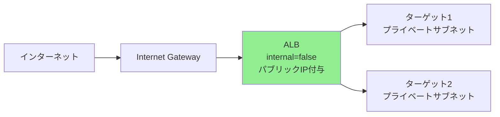
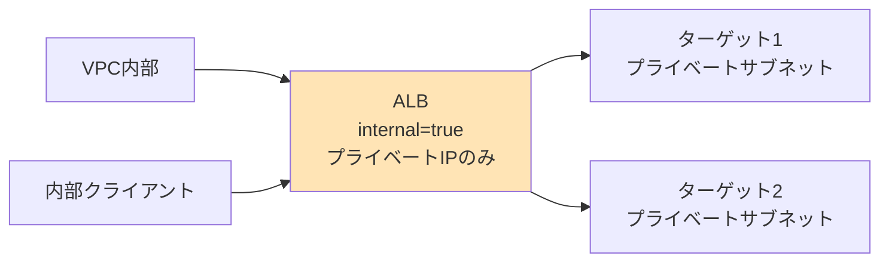
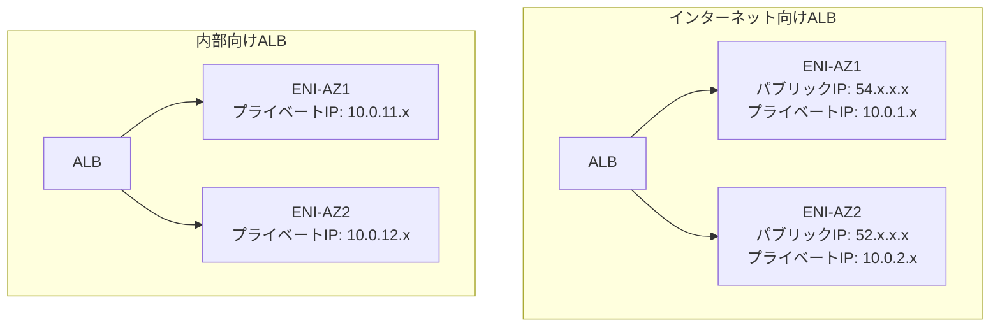
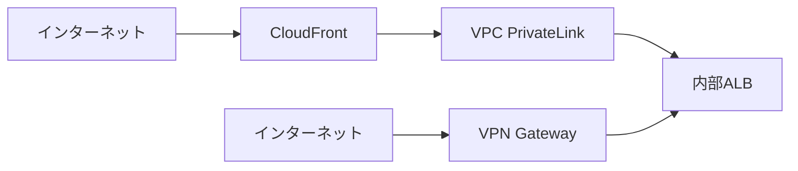

# AWS ALBのinternal設定とは

## What's this file?
> [!NOTE]
> **What**
> 
> AWS Application Load Balancer (ALB)のinternal設定項目とは何かについて記載しています。

## Conclusion (忙しいとき向け)
> [!IMPORTANT]
> **What** : ALBのinternal設定とは何か
> 
> **Answer** : ロードバランサーをインターネット向け（false）にするか、VPC内部向け（true）にするかを決定する設定で、アクセス可能性とセキュリティの境界を定義する重要なパラメータ

## 目次

<details>
<summary>目次を開く</summary>

- [internal設定の概要](#internal設定の概要)
- [2つのALBタイプの違い](#2つのalbタイプの違い)
- [ネットワーク配置の違い](#ネットワーク配置の違い)
- [DNSとIPアドレスの挙動](#dnsとipアドレスの挙動)
- [利用シナリオと選択基準](#利用シナリオと選択基準)
- [プロジェクトでの設定例](#プロジェクトでの設定例)
- [セキュリティ考慮事項](#セキュリティ考慮事項)
- [よくある誤解と注意点](#よくある誤解と注意点)

</details>

## internal設定の概要

AWS Application Load Balancer (ALB)の`internal`設定は、ロードバランサーのアクセシビリティを決定する基本的な設定項目です。

### 基本的な定義

```hcl
resource "aws_lb" "example" {
  name               = "my-alb"
  internal           = false  # または true
  load_balancer_type = "application"
}
```

### 設定値の意味

| 設定値 | 意味 | スキーム |
|--------|------|----------|
| `false` | インターネット向けALB | internet-facing |
| `true` | 内部向けALB | internal |

## 2つのALBタイプの違い

### インターネット向けALB（internal = false）



**特徴**:
- パブリックIPアドレスを持つ
- インターネットからアクセス可能
- パブリックサブネットに配置が必要
- 外部ユーザー向けのサービスに使用

### 内部向けALB（internal = true）



**特徴**:
- プライベートIPアドレスのみ
- VPC内部からのみアクセス可能
- プライベートサブネットに配置可能
- マイクロサービス間通信に使用

## ネットワーク配置の違い

### サブネット要件

```hcl
# インターネット向けALB
resource "aws_lb" "internet_facing" {
  internal = false
  subnets  = [
    aws_subnet.public_a.id,  # パブリックサブネット必須
    aws_subnet.public_c.id   # 複数AZ推奨
  ]
}

# 内部向けALB
resource "aws_lb" "internal" {
  internal = true
  subnets  = [
    aws_subnet.private_a.id,  # プライベートサブネットでOK
    aws_subnet.private_c.id
  ]
}
```

### ルーティング要件

| ALBタイプ | 必要なルート | Internet Gateway |
|-----------|--------------|------------------|
| インターネット向け | 0.0.0.0/0 → IGW | 必須 |
| 内部向け | ローカルルートのみ | 不要 |

## DNSとIPアドレスの挙動

### DNS名の形式

両タイプとも同じ形式のDNS名が付与されます：
```
{name}-{id}.{region}.elb.amazonaws.com
```

### IPアドレスの割り当て



### DNS解決の違い

```bash
# インターネット向けALB
$ nslookup my-alb-123456.ap-northeast-1.elb.amazonaws.com
# → パブリックIPアドレスが返される（54.x.x.x, 52.x.x.x）

# 内部向けALB（VPC内から）
$ nslookup my-internal-alb-789012.ap-northeast-1.elb.amazonaws.com
# → プライベートIPアドレスが返される（10.0.11.x, 10.0.12.x）
```

## 利用シナリオと選択基準

### インターネット向けALB（internal = false）を選ぶケース

1. **Webアプリケーション**
   ```
   ユーザー → インターネット → ALB → ECS/EC2
   ```

2. **API Gateway**
   ```
   モバイルアプリ → ALB → APIサーバー
   ```

3. **静的コンテンツ配信**
   ```
   ブラウザ → ALB → 静的ファイルサーバー
   ```

### 内部向けALB（internal = true）を選ぶケース

1. **マイクロサービス間通信**
   ```
   フロントエンドサービス → 内部ALB → バックエンドサービス群
   ```

2. **社内システム**
   ```
   社内ネットワーク → VPN → 内部ALB → 業務システム
   ```

3. **多層アーキテクチャ**
   ```
   外部ALB → Webサーバー → 内部ALB → APIサーバー → DB
   ```

## プロジェクトでの設定例

### 現在の設定（example-project）

```hcl
resource "aws_lb" "example_project" {
  name               = "${var.project_name}-alb-${var.environment}"
  internal           = false  # インターネット向け
  load_balancer_type = "application"
  security_groups    = [aws_security_group.example_alb.id]
  subnets            = [aws_subnet.public_a.id]  # パブリックサブネット

  enable_deletion_protection = var.enable_deletion_protection
  enable_http2               = true
}
```

**この設定の理由**:
- ユーザーがインターネット経由でアクセスする必要がある
- 監視ダッシュボードは外部公開される
- CloudFrontを経由しない直接アクセスも可能

### もし内部向けにする場合

```hcl
resource "aws_lb" "example_project_internal" {
  name               = "${var.project_name}-internal-alb-${var.environment}"
  internal           = true  # 内部向けに変更
  load_balancer_type = "application"
  security_groups    = [aws_security_group.example_internal_alb.id]
  subnets            = [
    aws_subnet.private_app_a.id,  # プライベートサブネットに変更
    aws_subnet.private_app_c.id
  ]
}
```

## セキュリティ考慮事項

### インターネット向けALBのセキュリティ

```hcl
resource "aws_security_group" "alb_internet_facing" {
  name = "alb-internet-sg"
  
  # 必要最小限のポートのみ開放
  ingress {
    from_port   = 443
    to_port     = 443
    protocol    = "tcp"
    cidr_blocks = ["0.0.0.0/0"]  # インターネット全体
  }
  
  # HTTP→HTTPSリダイレクト用
  ingress {
    from_port   = 80
    to_port     = 80
    protocol    = "tcp"
    cidr_blocks = ["0.0.0.0/0"]
  }
}
```

### 内部向けALBのセキュリティ

```hcl
resource "aws_security_group" "alb_internal" {
  name = "alb-internal-sg"
  
  ingress {
    from_port   = 443
    to_port     = 443
    protocol    = "tcp"
    cidr_blocks = [var.vpc_cidr]  # VPC内部のみ
  }
  
  # または特定のセキュリティグループから
  ingress {
    from_port       = 443
    to_port         = 443
    protocol        = "tcp"
    security_groups = [aws_security_group.app_servers.id]
  }
}
```

### 追加のセキュリティ対策

1. **WAFの適用**（インターネット向けのみ）
   ```hcl
   resource "aws_wafv2_web_acl_association" "alb" {
     resource_arn = aws_lb.internet_facing.arn
     web_acl_arn  = aws_wafv2_web_acl.main.arn
   }
   ```

2. **アクセスログの有効化**
   ```hcl
   access_logs {
     bucket  = aws_s3_bucket.alb_logs.bucket
     enabled = true
     prefix  = "alb-${var.internal ? "internal" : "internet"}"
   }
   ```

## よくある誤解と注意点

### 1. 内部ALBでもインターネットアクセスは可能



内部ALBでも以下の方法で外部公開可能：
- CloudFront + VPCエンドポイント
- API Gateway + VPCリンク
- VPN経由のアクセス

### 2. パブリックサブネットの誤解

❌ **誤解**: 内部ALBはプライベートサブネットにしか配置できない

✅ **事実**: 内部ALBもパブリックサブネットに配置可能（ただしパブリックIPは付与されない）

### 3. セキュリティグループの設定

```hcl
# ❌ 間違い：internal=trueだから全開放でも安全
resource "aws_security_group_rule" "bad_internal" {
  security_group_id = aws_security_group.internal_alb.id
  type              = "ingress"
  from_port         = 0
  to_port           = 65535
  protocol          = "-1"
  cidr_blocks       = ["0.0.0.0/0"]  # 危険！
}

# ✅ 正解：内部でも必要最小限のアクセス制御
resource "aws_security_group_rule" "good_internal" {
  security_group_id = aws_security_group.internal_alb.id
  type              = "ingress"
  from_port         = 443
  to_port           = 443
  protocol          = "tcp"
  source_security_group_id = aws_security_group.app.id
}
```

### 4. 変更時の注意

**重要**: `internal`設定は作成後に変更できません。変更する場合はALBの再作成が必要です。

```bash
# 変更しようとすると...
Error: aws_lb.example: cannot update internal attribute
```

### 5. コストの違い

| 項目 | インターネット向け | 内部向け |
|------|-------------------|----------|
| 時間料金 | 同じ | 同じ |
| LCU料金 | 同じ | 同じ |
| データ転送（アウト） | インターネット向け料金 | VPC内は無料 |

## 関連

- [AWS ALB Documentation](https://docs.aws.amazon.com/elasticloadbalancing/latest/application/introduction.html)
- [Terraform aws_lb Resource](https://registry.terraform.io/providers/hashicorp/aws/latest/docs/resources/lb)
- プロジェクトのネットワーク設計書
- セキュリティグループ設定ガイド